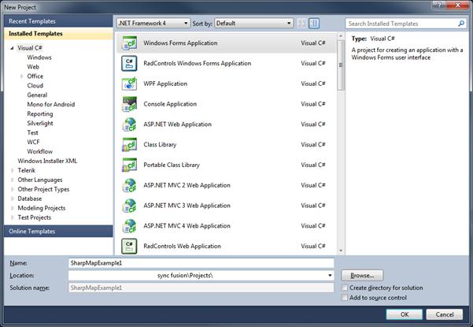
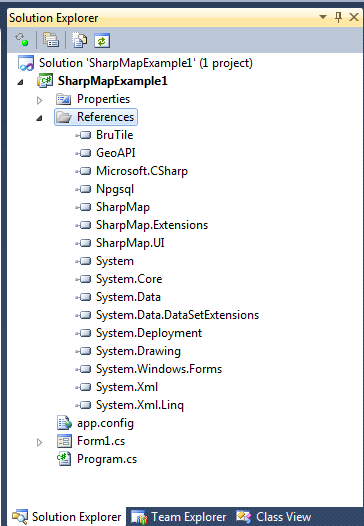
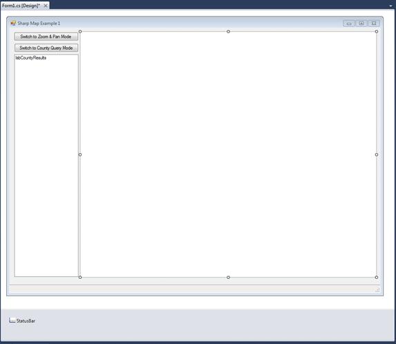
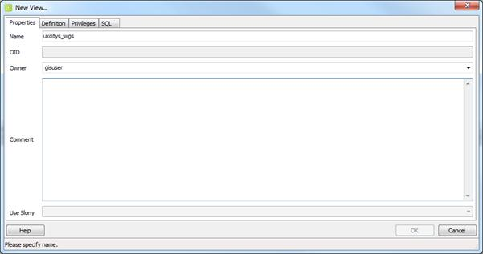
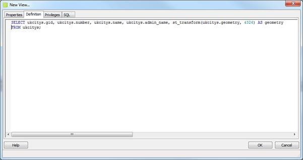
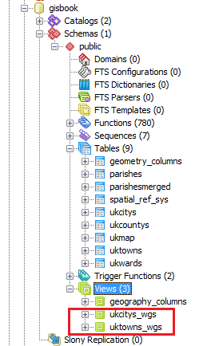
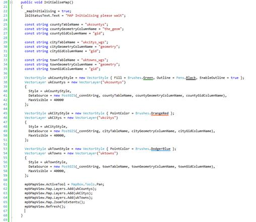
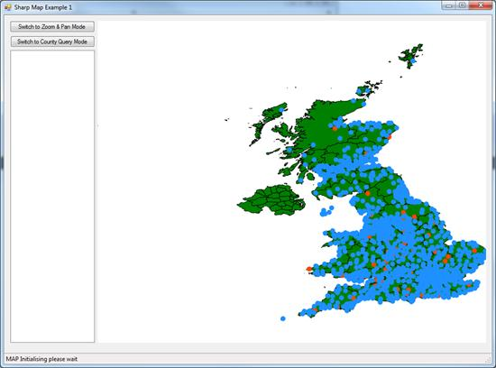
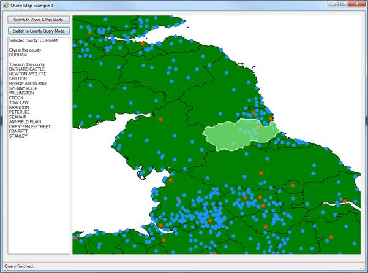

# 五、在 .NET 中创建地理信息系统应用

所以最后我们来到了你们大多数人一直在等待的部分:在. NET 中创建一个支持 GIS 的小型桌面应用

在这一章中，我使用 Visual Studio 2010 Ultimate 进行任何截图，我的代码是用 C#编写的。

对于任何使用过微软。NET 语言和编辑器，对您来说，将我在这里展示的内容适应您正在工作的环境应该不成问题。

## 下载夏普地图

在我们做任何事情之前，我们需要下载 SharpMap 这是我们将使用的地理信息系统框架。由于夏普地图目前正在经历许多变化和一般的重构，从 SVN 下载源文件并编译自己的版本比使用预编译的下载更好。

在浏览器中，导航至[http://sharpmap.codeplex.com/](http://sharpmap.codeplex.com/)并点击**源代码**选项卡。单击**下载**以 zip 文件的形式获取最新的变更集—大约 180 MB。或者，您可以单击**连接**获取地址，使用常规客户端连接到 TFS 或 SVN 存储库。

将信号源同步或解压到硬盘后，启动 Visual Studio，打开**行李箱**文件夹，打开**夏普地图. sln** 解决方案。

加载完所有内容后，**解决方案资源管理器**应该会出现，如下图所示:


图 68:夏普地图解决方案

如果一切加载正常，你应该可以点击**构建解决方案**获取当前二进制文件。我一般会构建所有的配置，所以我选择**发布**然后**构建**、**调试**然后**构建**等等。你选择建造什么取决于你自己。

一旦一切构建成功，您就可以关闭这个项目，开始自己的工作了。

## 创建我们自己的夏普地图解决方案

运行 Visual Studio 的一个实例或重用您仍然打开的实例，并创建一个新的 Windows 窗体应用。



图 69:启动新的 Windows 窗体应用

确保你正在使用。NET 4。SharpMap 的当前版本针对的是。NET 4 及以上版本。

首先需要做的是双击**解决方案浏览器**中的**属性**，将选中的**目标框架**从**更改。NET Framework 4 客户端配置文件**到完整的**。NET Framework 4** 。

|  |  |  |
| 图 70:改变目标框架 |

现在我们需要将夏普地图用户界面组件添加到我们的工具箱中。双击**解决方案资源管理器**中的**表单 1.cs** 加载工具栏选项板。在**通用**下方的空白区域点击右键，选择**添加标签**。给标签起一个名字。在我的应用中，我调用了选项卡夏普地图。

创建调色板后，将其展开并右键单击**调色板**区域。从出现的菜单中选择**选择项目**。将出现**选择工具箱项目**对话框。


图 71:选择工具箱项

点击**浏览**按钮，导航到您打开夏普地图工具包的位置。导航至**清晰地图。UI** > **bin** > **调试**，然后选择**SharpMap.UI.dll**。


图 72:向工具箱添加夏普映射

单击**打开**，然后导航回 Visual Studio 主屏幕。工具箱中应该会出现以下内容:


图 73:工具箱中的夏普地图和工具

你可能还会发现**锐度图**和**锐度图。用户界面**已自动添加到您的项目参考中。如果您启动了一个新项目，并且已经将工具加载到工具箱中，那么您需要手动添加对项目的引用。为此，右键单击项目中的**参考**，然后浏览到添加 SharpMap.UI.dll 的相同位置。添加**SharpMap.dll**和**夏普地图。UI** 参考文献。添加这些 dll 后，重新加载**引用**对话框。

我们需要在解决方案中添加一些位于其他文件夹中的 dll。

浏览至**夏普地图。扩展**项目文件夹，并进入 **Bin** > **调试**或**根据需要释放**。选择并添加以下动态链接库:

*   brutile . dll
*   GeoAPI.dll
*   Npgsql.dll
*   SharpMap.Extensions.dll

您的项目参考应该如下图所示:



图 74:添加的引用

现在我们准备好将我们的图形用户界面放在一起。

将表单大小设置为 1000 × 800 左右，将**开始位置**属性更改为**中心屏幕**，将标题文本更改为**清晰地图示例 1** 。

我通常会将我的表单重命名为类似 **formMainForm** 的名称，但是选择什么名称完全取决于您。如果您给表单起了不同的名字，那么当我们开始编码时，您需要相应地调整源代码。

现在我们需要在设计器中将五个组件拖到表单上。它们是:

*   夏普地图工具中的地图框。
*   公共控件中的两个按钮控件和一个列表框。
*   状态从菜单和工具栏中选择。

将两个按钮重命名为**btnzomandpan**和**btnzerycounty**。将它们上面的显示文本分别更改为**切换到缩放&平移模式**和**切换到县查询模式**，然后将它们放在表单的左上角。根据需要调整它们的大小以适合文本。

选择您的**状态跳转**控件并将其重命名为**状态工具栏**。然后点击**物品-(收藏)**属性，启动**物品收藏编辑器**。点击状态栏左侧的下拉菜单，添加**状态标签**。将新标签重命名为 **lblStatusText** ，并删除 **Text** 属性中的文本。

将列表框控件的宽度设置为与按钮控件的宽度相同，并将其置于按钮控件下方。将其高度拉伸到底部状态栏的正上方。将列表框的名称设置为**LSB countryresults**，然后点击其**锚点**属性并将其设置为**顶部、左侧、底部**。

最后，将表单上的剩余空间用于地图框。将其底部与列表框对齐，并将其**背景色**属性设置为**白色**。更名为 **mpbMapView** ，将**锚**改为**顶、底、左、右**。

您完成的用户界面应该如下所示:



图 75:完整的夏普地图用户界面

## 添加代码

现在我们有了一个好看的 UI，是时候开始给我们的应用增加功能了。

使用 MapBox 控件非常容易。其概念是简单地创建层，然后将这些层添加到控件中，然后控件将呈现和显示它们。

每个图层可以有不同的空间参考和坐标系，地图控件可以动态地重新投影和转换坐标。对于这个例子，我们将让 Postgres 为我们做所有的工作。

加载并运行 pgAdmin，然后登录到包含我们之前加载的数据的数据库。展开对象树，直到可以看到所有的表和其他对象。


图 76:pgAdmin 中的对象树

如图所示，**表格**节点下是一个名为**视图**的绿色小图标。您可能以前在其他数据库中使用过这些。总的想法是，它们将其他表中的数据投影到不同的模式中，但在客户端应用看来，它们就像一个实际的表。

一个典型的用法是从通过外键链接的不同表中获取行，并呈现组合数据的简单平面视图，其中所有呈现的项形成一行而不是层次结构。

对于我们的演示，我们将把我们的城镇点重新投影为 WGS84 (SRID 4326)，以匹配英国县图层的坐标。我们将从右键单击**视图**并创建一个新视图开始。



图 77:创建新视图

给视图起一个名字——我把它命名为 mine ukcity s _ WGS——并为您的数据库登录设置正确的用户。

切换到**定义**选项卡，输入以下 SQL:

```sql
    SELECT ukcitys.gid, ukcitys.number, ukcitys.name, ukcitys.admin_name, st_transform(ukcitys.geometry, 4326) AS geometry FROM ukcitys;

```



图 78:设置数据库登录

正如您在我们的 SQL 和图 78 中看到的，我们正在使用`ST_Transform`将我们的点从 OSGB36 (SRID 27700)转换为 WGS84 (SRID 4326)。结果是，当执行来自 ukcitys_wgs 的`SELECT`时，表格布局将与 uk city 相同，但几何图形将在新的坐标系中。

在地理信息系统中，视图解决了许多类似的问题，您会发现地理信息系统数据库对它们的使用非常广泛。

重复这些步骤，并使用以下 SQL 创建 **uktowns_wgs** :

```sql
    SELECT uktowns.gid, uktowns.number, uktowns.name, uktowns.admin_name, st_transform(uktowns.geometry, 4326) AS geometry FROM uktowns;

```

### 一个小问题...

对于所有这些视图，当以这种方式使用它们时，它们确实有一个小问题:空间元数据。

如果你还记得这本书的开头，我们讨论了**几何 _ 列**表及其在地理信息系统数据库中的重要性。当我们在常规表空间中创建表时，我们通常使用空间函数`AddGeometryColumn`来添加将包含实际几何对象的列。当您使用 GeoKettle 添加县数据时，您应该已经看到了这种情况——为创建表而生成的 SQL 应该包含`AddGeometryColumn`空间函数。这不仅会根据需要添加列和修改表，还会将字段注册到所需的元数据表中，并设置一些触发器来强制执行正确的数据类型和 SRIDs。

问题是因为视图是从现有的柱构建的，所以无法在视图上创建实际的几何柱。这意味着我们必须手动添加它。幸运的是，这不是一个特别困难的过程；它只涉及一个插件。

打开一个 SQL 编辑器窗口，输入以下 SQL:

```sql
    INSERT INTO geometry_columns(f_table_catalog,f_table_schema,f_table_name,f_geometry_column,coord_dimension,srid,type) VALUES('','public','uktowns_wgs','geometry',2,4326,'MULTIPOINT')

```

如果您检查已经在 **geometry_columns** 中的行，您会注意到正在插入的数据与 **uktowns** 的行相同；唯一不同的是 SRID。

要完成此任务，请执行以下操作来更新城市视图:

```sql
    INSERT INTO geometry_columns(f_table_catalog,f_table_schema,f_table_name,f_geometry_column,coord_dimension,srid,type) VALUES('','public','ukcitys_wgs','geometry',2,4326,'MULTIPOINT')

```

完成后，您应该具备以下条件:



图 79:添加新视图


图 80:带有新视图的表格

像任何符合 OGC 标准的地理信息系统数据库客户端的像样的实现一样，夏普地图将检查**几何 _ 列**表，找出我们添加的任何图层的细节。如果我们添加一个在 geometry_columns 表中找不到的视图，它将取消并产生一个异常。一旦我们手动添加了数据，我们就可以将这些视图加载到我们的应用中。

### 回到代码...

现在我们有了自己的用户界面、数据和一些视图来投影数据，是时候添加一些 C#来将它们缝合在一起了。

我们首先需要的是 Postgres 数据库的连接字符串和地图初始化的布尔标志。在第一个表单的构造函数前添加以下代码，并根据需要为自己的连接替换服务器名、密码和用户名:

```sql
    private const string _connString = "Server=<server>;Port=5432;User Id=<user>;Password=<password>;Database=gisbook;CommandTimeout=300";
    private bool _mapInitializing;

```

请注意，我将命令超时设置为五分钟。如果你要做很多基于服务器的、长时间运行的几何图形处理工作，那么这是一件明智的事情。默认命令超时为 20 秒。当你开始用这些东西做更大的工作时，你最终会得到千兆字节的数据和一些冗长的运行时间。

按照我们的构造函数，我们需要一个用于初始化我们的映射的函数来调用它。您的代码现在应该是这样的:

```sql
    using System.Windows.Forms;

    namespace SharpMapExample1
    {
      public partial class formMainForm : Form
      {
        private const string _connString = "Server    ;Port=5432;User Id=   ;Password=   ;Database=gisbook;CommandTimeout=300";
        private bool _mapInitializing;

        public formMainForm()
        {
          InitializeComponent();
        }

        public void InitializeMap()
        {

        }

      }

    }

```

### 初始化地图

我们在地图初始化功能中需要做的第一件事是设置和加载我们的图层。我们从县一级开始。矢量图层的数据源需要几何列的名称和主键(在地理空间术语中也称为 OID 或 GID)以及包含图层的表的名称。

初始化和加载县图层，给它一个绿色填充，并设置黑色边框样式的代码如下:

```sql
    const string countyTableName = "ukcountys";
    const string countyGeometryColumnName = "the_geom";
    const string countyGidColumnName = "gid";
    VectorStyle ukCountyStyle = new VectorStyle { Fill = Brushes.Green, Outline =
      Pens.Black, EnableOutline = true };
    VectorLayer ukCountys = new VectorLayer("ukcountys")
    {
      Style = ukCountyStyle,
      DataSource = new PostGIS(_connString, countyTableName,  
        countyGeometryColumnName,countyGidColumnName),
      MaxVisible = 40000
    };

```

我们再次重复这个模式两次，为我们的城镇加载数据:

```sql
    const string cityTableName = "ukcitys_wgs";
    const string cityGeometryColumnName = "geometry";
    const string cityGidColumnName = "gid";

    const string townTableName = "uktowns_wgs";
    const string townGeometryColumnName = "geometry";
    const string townGidColumnName = "gid";

    VectorStyle ukCountyStyle = new VectorStyle { Fill = Brushes.Green, Outline =
      Pens.Black, EnableOutline = true };

    VectorStyle ukCityStyle = new VectorStyle { PointColor = Brushes.OrangeRed };
    VectorLayer ukCitys = new VectorLayer("ukcitys")
    {
      Style = ukCityStyle,
      DataSource = new PostGIS(_connString, cityTableName, cityGeometryColumnName,
        cityGidColumnName),
      MaxVisible = 40000
    };

    VectorStyle ukTownStyle = new VectorStyle { PointColor = Brushes.DodgerBlue };
    VectorLayer ukTowns = new VectorLayer("uktowns")
    {
      Style = ukTownStyle,
      DataSource = new PostGIS(_connString, townTableName, townGeometryColumnName,  
        townGidColumnName),
      MaxVisible = 40000
    };

```

这里唯一的区别是，我们设置的是点颜色，而不是填充和线条颜色，就像我们对多边形图层所做的那样。我们将图层的`Style`属性设置为我们的`VectorStyle`对象，以赋予图层视觉外观。接下来，我们使用之前定义的常量和连接字符串将`DataSource`属性设置为到 Postgres 服务器的连接。`MaxVisible`是在我们的地图查看器中对象可见的最大缩放级别。如果我们放大到超过我们指定的值，屏幕上将不会绘制任何内容。

定义了图层及其样式和连接后，我们只需将这些图层添加到表单上的地图控件中。

```sql
    mpbMapView.Map.Layers.Add(ukCountys);
    mpbMapView.Map.Layers.Add(ukCitys);
    mpbMapView.Map.Layers.Add(ukTowns);

```

然后我们设置我们的默认工具，缩放到地图的最大范围，并渲染它。

```sql
    mpbMapView.ActiveTool = MapBox.Tools.Pan;
    mpbMapView.Map.ZoomToExtents();
    mpbMapView.Refresh();

```

最后，我们将插入以下代码作为函数的前两行；这将在地图初始化时向状态栏添加一条状态消息:

```sql
    _mapInitializing = true;
    lblStatusText.Text = "MAP Initializing please wait";

```

您的代码现在应该类似于下图:



图 81:几乎完成的代码

最后，在对`InitializeComponent()`的调用下面添加对表单构造函数`InitializeMap()`的调用，这就是初始化函数所需的全部内容。

如果此时运行您的应用，并且所有设置都正确，您应该会看到您的地图图层出现在屏幕上。您应该能够通过在地图表面拖动指针来平移它们，并使用鼠标滚轮进行缩放。

应该是这样的:



图 82:完整的地图

### 固定状态标签

您会注意到状态栏中的**地图初始化**消息从未改变。我们会解决的。当地图完成渲染后，它会触发一个名为**的事件，并刷新**。


图 83:地图事件

我们在代码中挂钩这个事件，并向其中添加一些代码来更改标签。然而，我们也需要使用布尔变量来控制它，因为我们不希望每次刷新地图时都调用它(这种情况会经常发生)。

用以下代码挂钩事件:

```sql
    private void MapBox1MapRefreshed(object sender, EventArgs e)
    {
      if(_mapInitializing)
      {
        _mapInitializing = false;
        lblStatusText.Text = "MAP Initialized";
      }
    }

```

如果您现在运行它，当地图完成渲染时，状态栏应该会更新。

### 连接工具按钮

现在，我们将为允许您切换工具的两个按钮添加代码。

SharpMap 有许多不同的工具模式，从缩放和平移到在加载的地图顶部绘制线条和多边形。

我们将在这个应用中使用的两个工具是默认的缩放和平移工具，以及查询工具。

更改工具就像给表单上的`MapBox`控件的`ActiveTool`属性赋予一个新值一样简单。要分配的值是来自`MapBox.Tools`类型枚举的任何值。

依次双击每个按钮，并在每个点击处理程序中添加以下代码，如下所示:

```sql
    private void BtnZoomAndPanClick(object sender, System.EventArgs e)
    {
      mpbMapView.ActiveTool = MapBox.Tools.Pan;
    }

    private void BtnQueryCountyClick(object sender, System.EventArgs e)
    {
      mpbMapView.ActiveTool = MapBox.Tools.Query;
    }

```

如果您现在运行该应用，您应该能够使用表单左上角的两个按钮来更改模式。缩放和平移是自动处理的。对于查询，我们必须响应地图框上的点击事件，并添加一些代码来获得我们需要的结果。

### 添加我县信息查询码

我们需要做的第一件事是确保我们正在使用`Query`工具，如果我们没有，就不要再往前走了。

从设计器中，在地图控件上找到`Click`事件，并在代码中将以下行添加到事件处理程序中:

```sql
    if (mapBox1.ActiveTool != MapBox.Tools.Query) return;

```

为什么要这样做？这是一个非常好的问题，特别是考虑到查询工具实际上有自己的事件处理程序，当单击地图时会触发该事件处理程序。

在写这本书的时候，我最初使用了专用的处理器，但是发现很难缩小它的范围和我选择的项目。我通常接收的不是一个多边形，而是看起来像是一半的数据库，并且很难筛选交给事件处理程序的数据量。

经过一番研究，似乎大多数避免这个问题的例子和推荐方法都涉及到捕捉`MouseUp`和`MouseDown`事件，或者`Click`事件。为了简单起见，我选择了`Click`事件。

一旦我们知道我们使用了正确的工具，我们就可以看到我们在地图上的位置。我们必须做的第一件事是以像素为单位获取实际的鼠标位置。然后，我们使用 SharpMap 工具包中的`ImageToWorld`将鼠标位置的 *x* 和 *y* 值转换为 WGS84 经纬度。

接下来，我们需要使用该位置来查询我们的县图层，并收集包含我们单击的位置中存在的任何多边形的`FeatureDataSet`。

```sql
    FeatureDataSet selectedGeometry = new FeatureDataSet();
    VectorLayer theLayer =  
      (VectorLayer)mapBox1.Map.FindLayer("ukcountys").FirstOrDefault();

    if (theLayer != null)
    {
      if (!theLayer.DataSource.IsOpen)
      {
        theLayer.DataSource.Open();
      }

      Envelope boundingBox = new Envelope(wgs84Location.CoordinateValue);
      if (Math.Abs(boundingBox.Area - 0.0) < 0.01)
      {
        boundingBox.ExpandBy(0.01);
      }

      theLayer.DataSource.ExecuteIntersectionQuery(boundingBox, selectedGeometry);
      theLayer.DataSource.Close();
    }

```

这将导致我们的`FeatureDataSet`集合被填充在那个位置找到的任何几何图形，在我们的例子中应该是我们点击的县。

接下来，我们需要检查`FeatureDataSet`中是否有数据。如果我们这样做了，抓住被点击的县的名字。

`FeatureDataSet`中的每一行都与普通数据集中的一行几乎相同，因此我们可以在 Postgres 中寻找与基础表中的一列同名的列。如果没有找到行，最好返回。

```sql
    if (selectedGeometry.Tables[0].Count <= 0) return;
    string countyName = selectedGeometry.Tables[0].Rows[0]["name2"].ToString();

```

一旦我们从英国县图层中获得了一个县的名称，我们就想要获得我们县的城镇列表。我们通过以下两种方法来实现:

```sql
    List<string> cityList = GetCitysForCounty(countyName);
    List<string> townList = GetTownsForCounty(countyName);

```

现在我们有了数据，我们想给用户提供一些视觉反馈。首先，我们将突出显示我们点击的县。

```sql
    VectorLayer highlightLayer = (VectorLayer)
      mpbMapView.Map.FindLayer("highlight").FirstOrDefault();

    if (highlightLayer == null)
    {
      Color myColor = Color.FromArgb(64,144,238,144);
      Brush fillBrush = new SolidBrush(myColor);

      highlightLayer = new VectorLayer("highlight");
      VectorStyle highlightStyle = new VectorStyle
        {Fill = fillBrush, Outline = Pens.White, EnableOutline = true};

      highlightLayer.Style = highlightStyle;
    }

```

为此，我们首先检查地图上是否已经有高亮图层。如果一个不存在，创建一个新的。在高光层设置样式需要注意的一点是我们设置颜色的方式。我们使用全 ARGB 颜色调用，这样我们就可以为我们的图层指定一个透明度级别——函数中的第一个值，`64`——这样我们就可以看到它下面的现有地图元素。

接下来，我们采用之前获得的`FeatureDataSet`并将其指定为高光图层的数据源，以便所选的县多边形以我们定义的半透明样式显示。请注意，如果在地图上选择多个多边形，这将突出显示多个多边形。以前选择的县将被清除。

```sql
    highlightLayer.DataSource = new GeometryProvider(selectedGeometry.Tables[0]);
    mpbMapView.Map.Layers.Add(highlightLayer);
    mpbMapView.Refresh();

```

一旦我们添加了高亮图层并刷新了地图，我们选择的县应该是可见的。

对于我们的国家查询功能，最后要做的是将我们的县信息添加到我们的用户界面左侧的列表框中，并在方法的开头和结尾添加一些代码，以显示我们的状态栏中正在发生的事情。

```sql
    lsbCountyResults.Items.Clear();
    lsbCountyResults.Items.Add("Selected county: " + countyName.ToUpper());
    lsbCountyResults.Items.Add("");

    if (cityList.Count > 0)
    {
      lsbCountyResults.Items.Add("Citys in this county");
      foreach (string city in cityList)
      {
        lsbCountyResults.Items.Add(city);
      }
      lsbCountyResults.Items.Add("");
    }

    if (townList.Count > 0)
    {
      lsbCountyResults.Items.Add("Towns in this county");
      foreach (string town in townList)
      {
        lsbCountyResults.Items.Add(town);
      }
      lsbCountyResults.Items.Add("");
    }

```

接下来，我们在第一个`if`语句之后添加状态栏消息。

```sql
    lblStatusText.Text = "Querying Map... please wait for results.";
    Application.DoEvents();

```

我们在右大括号前添加完整的消息。

```sql
    lblStatusText.Text = "Query finished.";

```

在我们继续之前，你们中的一些人会说，“哇，多长的方法啊”，并想知道为什么我要使用`Application.DoEvents`来确保标签在事件处理程序中得到更新。请记住，这只是示例代码；它不应该是一个完美的例子，或者简单地复制并逐字粘贴来制作生产质量的应用。它的目的纯粹是向您展示如何使用夏普地图创建一个简单的地理信息系统应用。

### 结论

我们需要做的最后一件事是创建两种方法来从我们的地理信息系统数据库中检索我们的城市和城镇列表。

SharpMap 完全能够获取我们之前找到的多边形轮廓，并查询地图中的其他图层，以告诉我们哪些点属于哪个区域。然而，由于这本书主要是关于使用地理信息系统数据库的，我想在结束时让波斯特格雷再次为我们承担重任。

这两种方法非常相似，所以我将它们都复制了出来，并将其描述为一种方法。

```sql
    private static List<string> GetTownsForCounty(string countyName)
    {
      string sql =
        string.Format(
          "SELECT t.Name FROM ukcountys c, uktowns t WHERE name2 = :county AND
           ST_Within(t.geometry,ST_Transform(c.the_geom,27700))");

      List<string> results = new List<string>();

      using (NpgsqlConnection conn = new NpgsqlConnection(_connString))
      {
        conn.Open();
        using (NpgsqlCommand command = new NpgsqlCommand(sql, conn))
        {
          command.Parameters.Add(new NpgsqlParameter("county", NpgsqlDbType.Varchar));
          command.Parameters[0].Value = countyName;

          using (NpgsqlDataReader dr = command.ExecuteReader())
          {
            while (dr.Read())
            {
              results.Add(dr.GetString(0));
            }
          }
        }
      }

      return results;
    }

    private static List<string> GetCitysForCounty(string countyName)
    {
      string sql =
        string.Format(
          "SELECT t.Name FROM ukcountys c, ukcitys t WHERE name2 = :county AND    
           ST_Within(t.geometry,ST_Transform(c.the_geom,27700))");

      List<string> results = new List<string>();

      using (NpgsqlConnection conn = new NpgsqlConnection(_connString))
      {
        conn.Open();
        using (NpgsqlCommand command = new NpgsqlCommand(sql, conn))
        {
          command.Parameters.Add(new NpgsqlParameter("county", NpgsqlDbType.Varchar));
          command.Parameters[0].Value = countyName;

          using (NpgsqlDataReader dr = command.ExecuteReader())
          {
            while (dr.Read())
            {
              results.Add(dr.GetString(0));
            }
          }
        }
      }

      return results;
    }

```

任何做过任何原始 done 编程的人都应该立即意识到我们在这里做什么，甚至可以相当合理地问为什么我们没有使用 LINQ 来编写 SQL，或者实体框架，或者……这个列表还在继续。

首先，原始 Postgres 数据提供程序不提供实体框架或 LINQ-SQL 数据模型提供程序。其次，因为我们使用的是空间函数，所以在 ADO.NET 这样做要比在一个模型中更好，在这个模型中，SQL 级别的语法被隐藏得很深。

我们要做的第一件事是为我们希望在数据库中运行的 SQL 创建一个常量字符串，我希望您特别注意查询字符串中的`:county`。这是 Postgres 数据提供程序不同于常规 ADO.NET 向查询字符串提供参数的地方之一。

在常规 ADO.NET 码中，参数通常以`@`为前缀，例如`@county`。在 Postgres 中，参数的前缀是`:`。但是，在代码中，添加参数的方式是相同的。

其余的就不言自明了。我们使用之前定义的连接字符串打开一个连接，打开数据库，添加参数，然后运行我们的 SQL，最后得到一个数据读取器对象，将我们的结果读入一个通用字符串列表。

我们在嵌套的`using`语句中完成了所有这些，这意味着一切都是`IDisposable`，一旦完成，就应该被正确释放，只需将结果的字符串列表返回给调用方法。

如果一切按计划进行，在点击**运行**时，您应该会看到一个应用，该应用可以缩放和平移数据库中定义的地图，还可以切换到`County Query Mode`并检索选定县的城镇列表。您完成的应用应该如下所示:



图 84:完整的地图应用

我们找到了。希望我已经激起了你的食欲，并向你展示了地理信息系统在日常生活中可以帮助你的许多事情中的一些。

请记住，有可能买到足够大功率的手机来小规模地做这种事情，并且有数据库系统来支持它们，比如 SQL Compact。夏普地图允许你做任何事情，从矢量到光栅地图和更远。一旦你开始进一步观察，你会发现一些系统具有读取全球定位系统设备的内置能力，使你能够将实时位置信息拉入你的应用。走出去，探索现实世界和数字世界。这是一次刚刚开始的冒险。