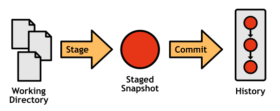

# 一、概述

每个 Git 存储库包含 4 个组件:

*   工作目录
*   集结地
*   承诺的历史
*   发展部门

从记录提交到分布式协作，一切都围绕着这些核心对象。

## 工作目录

工作目录是您实际编辑文件、编译代码和开发项目的地方。实际上，您可以将工作目录视为普通文件夹。除此之外，您现在可以访问各种可以记录、更改和传输该文件夹内容的命令。

图 2:工作目录

## 集结地

临时区域是工作目录和项目历史记录之间的中介。Git 不是强迫你一次提交所有的变更，而是让你将它们分组到相关的变更集中。阶段性变更尚不是项目历史的一部分。

图 3:工作目录和临时区域

## 承诺的历史

一旦您在临时区域中配置了您的更改，您就可以将其提交到项目历史记录中，在那里它将保持为“安全”版本。提交是“安全的”，因为 Git 永远不会自己更改它们，尽管*你*可以手动重写项目历史。

图 4:工作目录、暂存快照和提交历史记录

## 发育分支

到目前为止，我们仍然只能创建一个*线性*项目历史，在另一个之上添加一个提交。分支使得通过分叉项目历史并行开发多个不相关的特性成为可能。

图 5:带有分支历史的完整 Git 工作流

Git 分支不像集中式版本控制系统的分支。它们制造成本低，合并简单，易于共享，所以基于 Git 的开发人员使用分支来处理一切事情——从有几个贡献者的长期运行的特性到 5 分钟的修复。很多开发者*只*在专门的主题分支工作，把主要的历史分支留给公开发布。