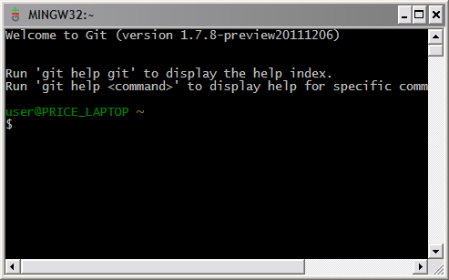

# 二、入门

## 安装

Git 在所有主要平台上都可用。以下说明将引导您完成在 Windows 上的安装，但最好总是咨询官方 [Git 网站](http://git-scm.com/)以获取最新信息。

Windows git 可通过 [MsysGit](http://code.google.com/p/msysgit/downloads/list) 包获得。

1.  下载并执行最新版本的安装程序。
2.  在标题为“调整您的路径环境”的设置屏幕中，选择“仅使用 Git Bash”选项
3.  在标题为“选择 SSH 可执行文件”的设置屏幕中，选择“使用 OpenSSH”
4.  最后，选择“签出窗口样式，提交 Unix 样式的行尾”，然后按“下一步”开始安装。

这将安装一个名为“Git Bash”的新程序，这是您在使用 Git 时应该使用的命令提示符。



图 Git Bash 的截图

## 配置

Git 附带了一长串配置选项，涵盖了从您的名字到您最喜欢的合并工具的所有内容。您可以使用`git config`命令设置选项，或者在主目录中手动编辑名为`.gitconfig`的文件。下面是一些最常见的选项。

### 用户信息

对于任何新的 Git 安装，您首先要做的是自我介绍。Git 用您的提交记录这些信息，像 GitHub 这样的第三方服务使用它来识别您。

```
    git config --global user.name "John Smith"
    git config --global user.email john@example.com

```

`--global`标志记录`~/.gitconfig`中的选项，使其成为所有新存储库的默认值。省略它可以让您在每个存储库的基础上指定选项。

### 编者ˌ编辑

Git 的命令行实现依赖文本编辑器进行大部分输入。您可以通过`core.editor`选项让 Git 使用您选择的编辑器:

全球核心。编辑 gvim

### 别名

默认情况下，Git 没有任何快捷方式，但是您可以通过别名命令来添加自己的快捷方式。如果你来自 SVN，你会喜欢下面的绑定:

```
    git config --global alias.st status
    git config --global alias.ci commit
    git config --global alias.co checkout
    git config --global alias.br branch

```

通过在 Git Bash 提示符下运行`git help config`了解更多信息。

## 初始化存储库

Git 被设计成尽可能不引人注目。Git 存储库和普通项目文件夹之间的唯一区别是在项目根目录中有一个额外的`.git`目录(而不是像 SVN 那样在*的每个*子文件夹中)。要将一个普通的项目文件夹变成一个完整的 Git 存储库，运行`git init`命令:

```
    git init <path>

```

`<path>`参数应该是存储库的路径(留空将使用当前工作目录)。现在，您可以使用 Git 所有出色的版本控制功能。

## 克隆存储库

作为`git init`的替代，您可以使用以下命令克隆现有的 Git 存储库:

```
    git clone ssh://<user>@<host>/path/to/repo.git

```

使用 SSH 登录`<host>`机器，下载`repo.git`项目。这是一个*完整的*副本，而不仅仅是一个到服务器存储库的链接。您有自己的历史记录、工作目录、临时区域和分支结构，在您将它们推回到公共存储库之前，没有人会看到您所做的任何更改。