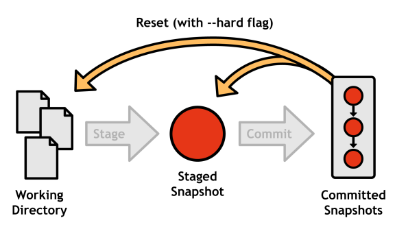
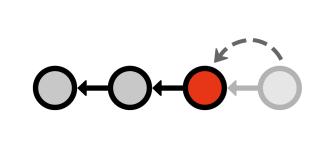
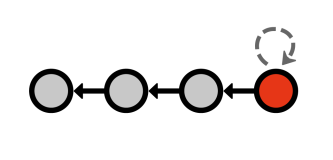

# 四、撤销变更

维护一个软件项目的“安全”副本的全部意义在于让你安心:如果你的项目突然中断，你会知道你很容易获得一个功能版本，并且你能够准确地指出问题是从哪里引入的。为此，如果没有撤消更改的能力，记录提交是没有用的。然而，由于 Git 有如此多的组件，“撤销”可以有许多不同的含义。例如，您可以:

*   撤消工作目录中的更改
*   撤消临时区域中的更改
*   撤消整个提交

更复杂的是，有多种方法可以撤销提交。您可以:

1.  只需从项目历史记录中删除提交即可。
2.  保持提交不变，使用新的提交来撤销第一次提交引入的更改。

Git 有一个专门的工具来处理这些情况。让我们从工作目录开始。

## 在工作目录中撤销

保存项目的安全副本后的一段时间是一个伟大的创新。你可以在不破坏代码库的情况下自由地做任何你想做的事情，你可以尽情地尝试。然而，这种无忧无虑的实验经常会出现错误，导致工作目录中有一堆离题的代码。当您到达这一点时，您可能想要运行以下命令:

```
    git reset --hard HEAD
    git clean –f

```

`git reset`的这种配置使得工作目录和阶段与最近一次提交(也称为`HEAD`)中的文件相匹配，有效地清除了*跟踪的*文件中所有未提交的更改。要处理*未跟踪的*文件，您必须使用`git clean`命令。Git 在删除代码时非常小心，所以您还必须提供`-f`选项来强制删除这些文件。



图 12:重置所有未提交的更改

### 单个文件

也可以针对单个文件。以下命令将使工作目录中的单个文件与最近提交的版本相匹配。

```
    git checkout HEAD <file>

```

该命令根本不会改变项目历史，因此您可以安全地用提交标识、分支或标签替换`HEAD`，以使文件与该提交中的版本相匹配。但是，*不要*用`git reset`试试这个，因为它*会*改变你的历史(解释在 [*撤销承诺*](#heading_id_32) )。


图 13:用`git checkout`恢复文件

## 在中转区撤销

在配置下一次提交的过程中，您偶尔会向阶段添加一个额外的文件。`git reset`的以下调用将解除它:

```
    git reset HEAD <file>

```

省略`--hard`标志会告诉 Git 不要管工作目录(与`git reset –-hard HEAD`相反，后者会重置工作目录和阶段中的每个文件)。文件的暂存版本与`HEAD`匹配，工作目录保留修改后的版本。正如您所料，这将导致您的`git status`输出中出现未声明的修改。


图 14:用`git reset`拆文件

## 撤销提交

有两种方法可以使用 Git 撤销提交:您可以通过简单地将其从项目历史中移除来**重置**,或者您可以通过生成一个*新的*提交来**恢复**提交，该提交消除了原始提交中引入的更改。通过引入另一个提交来撤销可能看起来有些过分，但是通过完全移除提交来重写历史可能会在多用户工作流中产生可怕的后果(更多内容请参见 [*【远程存储库】*](6.html#heading_id_54) )。

### 重复定位

万能的`git reset`也可以用来*移动*到`HEAD`参考。

```
    git reset HEAD~1

```

`HEAD~1`语法参数指定紧接在`HEAD`之前发生的提交(同样，`HEAD~2`指的是在`HEAD`之前的第二次提交)。通过向后移动`HEAD`引用，您可以有效地从项目历史中删除最近的提交。



图 15:用`git reset`将`HEAD`移动到`HEAD~1`

这是一个简单的方法来删除一些偏离主题的提交，但是它带来了一个严重的协作问题。如果其他开发人员已经在我们移除的提交之上开始构建，他们将如何与我们的存储库同步？他们必须向我们询问替换提交的 ID，在您的存储库中手动跟踪它，将他们的所有更改移动到该提交，解决合并冲突，然后再次与所有人共享他们的“新”更改*。想象一下，在一个有数百个贡献者的开源项目中会发生什么…*

 *重点是， ***不要重置公共提交*** ，但是可以随意删除你没有与任何人共享的私有提交。我们将在 [*【远程存储库】*](6.html#heading_id_54) 中重温这个概念。

### 恢复

为了解决重置公共提交带来的问题，Git 开发人员设计了另一种撤销提交的方法:恢复。恢复不是改变现有的提交，而是添加一个*新的*提交，以撤销问题提交:

```
    git revert <commit-id>

```

这将接受指定提交中的更改，找出如何撤消这些更改，并使用生成的变更集创建新的提交。对 Git 和其他用户来说，恢复提交看起来和行为都像任何其他提交——只是碰巧撤销了之前提交引入的更改。


图 16:用恢复提交撤销提交

这是撤销已经提交给公共存储库的更改的理想方式。

### 修改

除了完全撤销提交之外，您还可以像往常一样通过转移更改来修改最近的提交，然后运行:

```
    git commit --amend

```

这个*代替了*之前的提交，而不是创建一个新的提交，如果你忘记添加一两个文件，这是非常有用的。为了方便起见，提交编辑器中植入了旧提交的消息。同样，使用`--amend`旗帜时，你必须小心*，因为它像`git reset`一样改写了历史。*

 *

图 17:修改最近的提交**