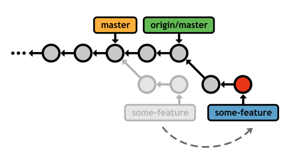
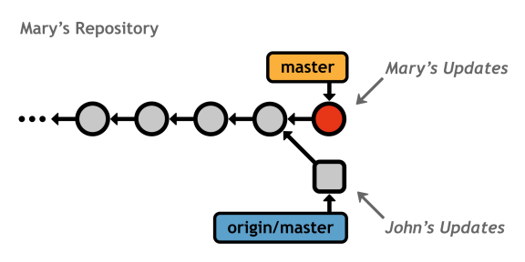
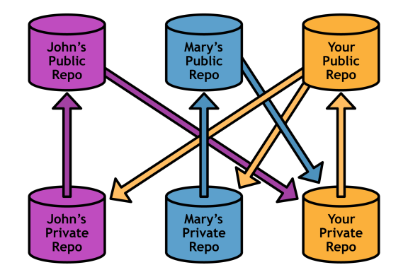

# 第 6 章远程存储库

简单地说，远程存储库不是你自己的。它可能在一个中央服务器上，另一个开发者的个人电脑上，甚至是你的文件系统上。只要你能从某种网络协议中访问它，Git 就能非常容易地与其他存储库共享贡献。

远程存储库的主要作用是在您自己的存储库中代表其他开发人员。另一方面，分支机构应该只处理项目开发。也就是说，不要试图给每个开发人员他或她自己的分支来工作——给每个人一个完整的存储库，并为开发特性保留分支。

本章首先介绍远程机制，然后介绍两种最常见的基于 Git 的协作工作流:集中式工作流和集成式工作流。

## 操纵遥控器

与`git branch`类似，`git remote`命令用于管理与其他存储库的连接。遥控器只不过是其他存储库的书签——它们不需要输入完整的路径，而是让你用一个用户友好的名称来引用它。我们将在 *[远程工作流](#heading_id_65)* 中学习如何在 Git 中使用这些书签。

### 正在列出遥控器

您可以在没有参数的情况下调用`git remote`命令来查看您现有的遥控器:

```
    git remote

```

如果没有遥控器，这个命令不会输出任何信息。如果您使用`git clone`获取您的存储库，您将看到一个`origin`遥控器。Git 会自动添加这个连接，假设您可能会想要在以后与它进行交互。

您可以使用`-v`标志请求更多关于遥控器的信息:

```
    git remote –v

```

这将显示存储库的完整路径。下一节将讨论指定远程路径。

### 创建遥控器

`git remote add`命令创建到远程存储库的新连接。

```
    git remote add <name> <path-to-repo>

```

运行此命令后，您可以使用`<name>`到达`<path-to-repo>`处的 Git 存储库。同样，这只是一个方便的长路径名称书签——它并不*而不是*创建到其他人的存储库的直接链接。

Git 接受许多用于指定远程存储库位置的网络协议，包括`file://`、`ssh://`、`http://`及其自定义`git://`协议。例如:

```
    git remote add some-user ssh://git@github.com/some-user/some-repo.git

```

运行此命令后，您可以仅使用`some-user`在`github.com/some-user/some-repo.git`访问存储库。由于我们使用了`ssh://`作为协议，在允许您对该帐户进行任何操作之前，您可能会被提示输入 SSH 密码。这使得 SSH 成为向开发人员授予写访问权限的好选择，而 HTTP 路径通常用于授予只读访问权限。我们很快就会发现，这是为分布式环境设计的一项安全功能。

### 删除遥控器

最后，您可以使用以下命令删除远程连接:

git remote rm<remote-name></remote-name>

## 远程分支

提交可能是基于 Git 的版本控制的原子单元，但是*分支*是远程存储库进行通信的媒介。**远程分支**的行为就像我们到目前为止已经介绍过的本地分支一样，只是它们代表了别人存储库中的一个分支。


图 34:从远程存储库中访问功能分支

一旦下载了远程分支，就可以像其他分支一样检查、合并和扩展它。如果您了解如何在本地使用分支，这将使学习曲线非常短。

### 正在获取远程分支

从另一个存储库中下载分支的行为称为**获取**。要获取远程分支，您可以指定存储库和要查找的分支:

```
    git fetch <remote> <branch>

```

或者，如果想在`<remote>`中下载*每个*分支，只需省略分支名称即可。取数后，将`-r`选项传递给`git branch`，可以看到下载的分支:

```
    git branch –r

```

这为您提供了一个分支列表，类似于:

```
    origin/master
    origin/some-feature
    origin/another-feature

```

远程分支总是以远程名称(`origin/`)作为前缀，以区别于本地分支。

请记住，Git 使用远程存储库作为*书签*—而不是与其他存储库的实时连接。远程分支是另一个存储库的本地分支的*副本*。在实际获取之外，存储库是完全隔离的开发环境。这也意味着 Git 永远不会自动获取分支来访问更新的信息——您必须手动这样做。

但是，这是一件好事，因为这意味着你不必在工作时不断担心其他人在做什么。这只有在 Git 分支支持非线性工作流的情况下才有可能。

### 检查远程分支机构

实际上，远程分支的行为类似于只读分支。您可以通过`git checkout`安全地检查它们的历史并查看它们的提交，但是在将它们集成到您的本地存储库之前，您不能继续开发它们。当您考虑到远程分支是其他用户提交的*副本*这一事实时，这是有意义的。

`..`语法对于过滤日志历史非常有用。例如，以下命令显示不在本地`master`分支中的来自`origin/master`的任何新更新。在合并变更之前运行这个通常是一个好主意，这样您就可以确切地知道您要集成什么:

```
    git log master..origin/master

```

如果这输出了任何提交，这意味着你在官方项目的后面，你可能应该更新你的存储库。这将在下一节中介绍。

可以结账远程分支，但会让你处于超脱`HEAD`状态。这对于在集成其他用户的更改之前查看它们是安全的，但是您添加的任何更改都将丢失，除非您创建新的本地分支提示来引用它们。

### 合并/重定基础

当然，获取的全部意义是将最终的远程分支集成到您的本地项目中。假设你是一个开源项目的贡献者，你一直在开发一个名为`some-feature`的功能。随着“官方”项目(通常由`origin`指向)的推进，您可能希望将其新的提交合并到您的存储库中。这将确保您的功能仍然可以与最前沿的开发一起工作。

幸运的是，您可以使用完全相同的`git merge`命令将`origin/master`中的更改合并到您的特征分支中:

```
    git checkout some-feature
    git fetch origin
    git merge origin/master

```

由于你的历史已经偏离，这导致了一个 3 路合并，之后你的`some-feature`分支可以访问官方项目的最新版本。


图 35:将官方`master`合并为特征分支

然而，仅仅为了引入更新而频繁地与`origin/master`合并最终会导致历史上充斥着无意义的合并提交。根据您的特性需要跟踪代码库其余部分的紧密程度，重定基础可能是集成更改的更好方法:

```
    git checkout some-feature
    git fetch origin
    git rebase origin/master

```

与本地重定基础一样，这创建了一个完美的线性历史，没有多余的合并提交:



图 36:将特征分支重新放入官方`master`

重新调整/合并远程分支机构具有与本地分支机构一章中讨论的完全相同的权衡。

### 拉

由于提取/合并序列在分布式开发中非常常见，Git 提供了一个`pull`命令作为方便的快捷方式:

```
    git pull origin/master

```

这将获取原点的主分支，然后一步将其合并到当前分支中。也可以通过`--rebase`选项使用`git rebase`代替`git merge`。

### 推

为了补充`git fetch`命令，Git 还提供了一个`push`命令。推送几乎是*取数的对立面，取数导入分支，而推送导出分支到另一个存储库。*

```
    git push <remote> <branch>

```

上述命令将本地`<branch>`发送到指定的远程存储库。除此之外，`git push`创建了一个*本地*分支，而不是*远程*分支。例如，从 Mary 的角度来看，在您的本地存储库中执行`git push mary my-feature`将如下所示(您的存储库将不受推送的影响)。


图 37:将一个特性分支从你的存储库中推入玛丽的存储库中

请注意`my-feature`是玛丽仓库中的一个*本地*分支，而如果她自己取的话，它将是一个*远程*分支。

这使得推送成为一项危险的操作。想象一下，你正在自己的本地存储库中开发，突然，一个新的本地分支不知从哪里冒出来。但是，存储库应该作为完全隔离的开发环境，那么`git push`为什么还要存在呢？我们很快就会发现，推送是维护公共 Git 存储库的必要工具。

## 远程工作流

现在我们已经对 Git 如何与其他存储库交互有了基本的了解，我们可以讨论这些命令支持的真实工作流。最常见的两种协作模型是:集中式工作流和集成式工作流。SVN 和 CVS 用户应该对 Git 的集中开发风格感到非常满意，但是使用 Git 意味着您还能够利用其高效的合并功能。集成器工作流是典型的分布式协作模型，在纯粹的集中式系统中是不可能的。

当您阅读这些工作流时，请记住 Git 平等地对待所有存储库。根据 Git 的说法，没有像 SVN 或 CVS 那样的“主”存储库。“官方”代码库仅仅是一个项目惯例——它成为官方存储库的唯一原因是因为那是每个人的`origin`远程点。

### 公共(裸)存储库

每个协作模型至少包含一个*公共*存储库，作为多个开发人员的入口点。公共存储库有一个独特的限制，那就是它们必须没有工作目录。这可以防止开发人员意外地用`git push`覆盖彼此的工作。您可以通过将`--bare`选项传递给`git init`来创建一个裸库:

```
    git init --bare <path>

```

公共存储库应该只作为*存储设施*运行，而不是开发环境。这是通过向存储库的文件路径添加一个`.git`扩展名来实现的，因为内部存储库数据库驻留在项目根目录中，而不是`.git`子目录中。因此，完整的示例可能如下所示:

```
    git init --bare some-repo.git

```

除了缺少一个工作目录之外，一个空的存储库没有什么特别的。您可以以通常的方式添加远程连接、向其推送和从中拉出。

### 集中式工作流

集中式工作流最适合小型团队，在这些团队中，每个开发人员都对存储库具有写访问权限。它允许通过使用单个中央存储库进行协作，很像 SVN 或 CVS 工作流。在这个模型中，*所有的*变更必须通过中央存储库共享，该存储库通常存储在服务器上，以实现基于互联网的协作。


图 38:有许多开发人员的集中式工作流

开发人员单独在他们自己的本地存储库中工作，该存储库与其他所有人完全隔离。一旦他们完成了一个特性并准备好共享他们的代码，他们就会清理它，将其集成到他们的本地`master`中，并将其推送到中央存储库(例如`origin`)。这也意味着每个开发人员都需要 SSH 访问中央存储库。


图 39:玛丽将她的更新推送到中央存储库

然后，其他人都可以获取新的提交，并将它们合并到他们的本地项目中。同样，这可以通过合并或重基础来完成，这取决于您团队的约定。

这是集中式工作流背后的核心过程，但当多个用户试图同时更新中央存储库时，它遇到了阻碍。想象一个场景，两个开发人员完成一个特性，将其合并到他们的本地`master`中，并试图同时发布它(或接近它)。

无论谁先到达服务器，都可以像往常一样推进他们的提交，但是第二个开发人员陷入了不同的历史，Git 不能执行快进合并。例如，如果一个名为 John 的开发人员在 Mary 之前推进他的变更，我们会在 Mary 的存储库中看到一个冲突:



图 40:推送过程中的冲突更新

使`origin`的主人(由约翰更新)匹配玛丽的`master`的唯一方法是*覆盖*约翰的承诺。显然，这将非常糟糕，因此 Git 中止推送并输出一条错误消息:

```
    ! [rejected] master -> master (non-fast-forward)
    error: failed to push some refs to 'some-repo.git'

```

为了补救这种情况，Mary 需要与中央存储库同步。然后，她将能够以通常的方式推动她的变化。

```
    git fetch origin master
    git rebase origin/master
    git push origin master

```

除此之外，集中式工作流相对简单。每个开发人员都呆在他或她自己的本地存储库中，定期拉/推中央存储库，以保持一切都是最新的。这是一个设置起来很方便的工作流程，因为只需要一台服务器，而且它利用了现有的 SSH 功能。

### 集成器工作流

集成器工作流是一种分布式开发模型，其中所有用户除了他们的私有存储库之外，还维护他们自己的*公共*存储库。它作为集中式工作流固有的安全性和可伸缩性问题的解决方案而存在。

集中式工作流的主要缺点是*每个*开发人员都需要对整个项目进行推送访问。如果你和一小群值得信任的开发人员一起工作，这没问题，但是想象一下这样一个场景:你正在开发一个开源软件项目，一个陌生人发现了一个 bug，并修复了它，并且想要将更新合并到主项目中。您可能不想让他或她推送对中央存储库的访问，因为他或她可能会开始推送各种随机提交，而您实际上会失去对项目的控制。

但是，您可以做的是告诉贡献者将更改推送到他或她自己的公共存储库。然后，您可以将他的 bug 修复引入您的私有存储库，以确保它不包含任何未声明的代码。如果您批准了他的贡献，您所要做的就是将它们合并到一个本地分支中，并像往常一样将其推送到主存储库。除了一个普通的开发者，你已经成为了一个*集成商*:


图 41:集成来自约翰公共存储库的变更

在这个工作流中，每个开发人员只需要推送访问他或她自己的公共存储库。贡献者使用 SSH 推送到他或她的公共存储库，但是集成者可以通过 HTTP(一种只读协议)获取更改。这为每个人提供了更安全的环境，即使您添加了更多协作者:



图 42:许多开发人员的集成工作流

请注意，团队仍然必须就一个“官方”存储库达成一致，否则更改会无序应用，每个人都会很快失去同步。在上图中，“你的公开回购”是官方项目。

作为一个集成人员，您必须跟踪比集中式工作流中更多的远程位置，但是这给了您自由和安全来合并来自任何开发人员的更改，而不会威胁到项目的稳定性。

此外，集成器工作流没有单一的访问点作为协作的瓶颈。在集中式工作流中，每个人在发布更改之前都必须完全是最新的，但在分布式工作流中却不是这样。同样，这是 Git 的分支实现所支持的非线性开发风格的直接结果。

这些都是大型开源项目的巨大优势。如果没有分布式协作的安全性和可扩展性，组织数百名开发人员在一个项目上工作是不可能的。*