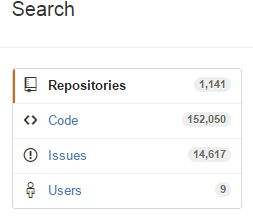
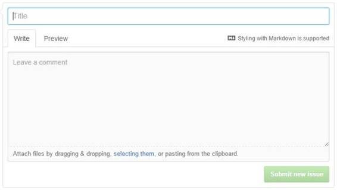

# 六、其它搜索

虽然到目前为止，我们一直专注于存储库搜索，但是您也可以在 GitHub 中搜索其他信息。当 GitHub 搜索时，它也同时搜索代码、库和用户。当我用 C#语言搜索 Excel 时，我发现超过 1100 个存储库和超过 150000 行包含“Excel”一词的代码此外，还有超过 14，000 个问题(错误报告、增强请求等)。)和 9 个用户名中带有“Excel”的用户。

图 24:搜索选项

无论您在搜索什么，GitHub 都会向您显示其他类别的计数和结果。某些排序选项会因您所查看的类别而异。但是，前面描述的搜索选项仍然可以应用。

代码搜索允许您搜索存储库中的所有代码来查找字符串。您可以应用类似的规则，只搜索特定的日期、语言等。搜索将查看存储库默认分支中所有匹配的代码。

|  | 注意:GitHub 不允许您在搜索代码时使用通配符或正则表达式。如果你搜索多个单词，你可能会得到比预期更多的点击。 |

代码搜索屏幕返回在包含您搜索的关键字的存储库默认分支中找到的每个文件。当文件名显示在搜索结果中时，匹配的文本将突出显示。

图 25:代码搜索

|  | 提示:对于您自己的存储库，需要注意一个警告:如果您的代码使用任何类型的应用编程接口密钥，并且您将它直接编码到您的 JavaScript 中，那么搜索 GitHub 的人可能会很容易发现您的密钥并开始使用它。 |

除了高级搜索中包含的选项之外，还有一些代码搜索选项。

您可以搜索文件内容(文件)、路径名(路径)或两者(用逗号分隔)。您也可以使用关键字扩展名:将搜索限制在特定的文件扩展名。例如，旧语言 Clipper 曾经有一个名为 TBROWSE 的特性。

tbrowse in:路径，文件扩展名:prg

这个搜索会找到所有。使用 TBROWSE 函数的 PRG (Clipper 文件扩展名)文件。

您可以使用 language:关键字将搜索限制为仅搜索用特定编程语言编写的代码。例如，要使用谷歌地图查找所有 JavaScript 文件，您可以使用:

GoogleMap.js 语言:JavaScript

这个搜索会找到所有包含谷歌地图(GoogleMap.js)的 JavaScript 代码模块，这表明代码正在使用谷歌地图(Google Maps)API 调用。

您可以使用 file name:关键字搜索文件名，也可以使用扩展名:关键字搜索文件扩展名。例如，下面将使用类库找到所有 Clipper 源文件:

扩展:prg 经典

|  | 注意:类(y)是一个第三方库，它向 Clipper 开发人员引入了面向对象的类。 |

代码搜索的结果可以按照最佳匹配(默认)或代码最后一次被索引的日期进行排序(GitHub 索引存储库中的所有代码，就像谷歌索引网站一样)。

问题包括建议、错误报告、文档更新等。人们写的关于某个特定存储库的文章。GitHub 具有非常强大的代码跟踪和比较能力，因为 GitHub 的很大一部分都在合作更新项目。有许多关键词可以让你搜索这些问题，也许在你可能有经验帮助的有趣的存储库中找到一些。

问题条目非常简单，很容易提供问题和描述(并且可以附加文件)。新问题屏幕如下所示:

图 26:新问题屏幕

在提交新问题之前，您应该检查类似的问题是否已经提出。

您可以将 in:关键字与标题、正文或注释(或三者的任意组合)一起使用。如果不指定，则只搜索标题和正文。例如，假设您正在使用 C#电子表格库，却得到了损坏的电子表格。以下语法将在 C#存储库中找到损坏的电子表格的所有问题。

标题、身体语言:c#中的电子表格损坏

问题可以是问题或拉请求(将建议的代码合并回存储库的请求)。您可以使用类型:关键字:

*   类型:公共关系–仅搜索拉取请求
*   类型:问题–仅搜索问题

如果不指定类型，将搜索问题和请求。

有许多用户与问题相关联:原始作者、被指派修复问题的人、评论者等。您可以使用各种关键词来搜索以各种方式涉及该问题的人员:

*   作者–创建问题的人
*   受让人–负责修复问题的用户
*   提及–可能在问题正文或评论中提及的特定用户
*   评论者–对某个问题发表评论的人

搜索时，您可以组合以上列表的任意组合。例如，下面的搜索带来了一个由 English Extra 创建并由 Doug Crockford 评论的老问题:

作者:englishextra 评论者:douglascrockford

请注意，问题和相应的注释有时会有点不耐烦(例如，从这个搜索中阅读问题)。

如果您想查找与某个问题相关联的用户，但不确定他们担任过哪个角色，您可以使用 invision:关键字，它基本上只是所有四种类型用户的 OR。

**状态:**关键字可用于查找未决问题和已决问题。例如，要查找德里克·努蒂尔(字体-令人敬畏的名声)与 CSS 相关的未决问题:

状态:open 涉及:dereknutile 语言:css

您可以使用 created:关键字或 updated:关键字在创建或更新问题时进行搜索。两者都使用 yyyy-mm-dd 格式的日期。例如:

font-awesome 创建时间:2015-12-01..语言:css

这个搜索找到了 2015 年 12 月更新的所有令人敬畏的字体问题。Font Awesome 是一个图标库，经常有人要求开发特定的图标。例如，该用户最近建议在字体 Awesome 中添加一个 MS-DOS 和终端图标:

图 27:字体超赞请求

您可以使用 comments:关键字根据附加到问题的注释数量进行搜索。搜索注释计数时，可以使用标准的数字比较运算符。

您可以通过多种方式对发现的问题列表进行排序。默认的最佳匹配会尝试查找与您的大多数搜索条件相匹配的问题。您也可以按以下方式排序:

*   评论最多或最少
*   最新的还是最老的
*   最近更新或最近更新最少

在 GitHub 中搜索用户或组织会增加一些关键词来帮助找到存储库。您可以组合这些关键词来找到您正在搜索的用户或公司。

#### 类型:

type:关键字可以是组织或用户，用于查找组织或用户帐户。如果未指定，GitHub 将同时搜索两者。例如，您可能喜欢埃里克·穆勒在 IBM Watson 程序上的工作，因此您可以使用以下语法搜索埃里克:

埃里克·穆勒类型:用户

要找到 Syncfusion，您可以使用以下搜索:

syncfusion 类型:组织

用户窗口将显示:

图 28:同步融合组织

#### in:关键字

您可以使用 in:关键字查看用户或组织帐户中的以下字段:

*   电子邮件–搜索文本出现在电子邮件地址中
*   登录–搜索用户登录名中的文本
*   全名–查找用户的真实姓名

在全名字段中搜索时，会考虑空格(而在其他搜索中，由空格分隔的单词被视为单独的单词)。所以下面的搜索会在 GitHub 用户中找到我自己:

乔·布斯:全名

这对于命名搜索很有意义，因为有 300 多个用户的全名中有“布斯”这个词，但只有我们两个有“乔·布斯”

|  | 提示:另一个需要注意的注意事项:在搜索电子邮件时，搜索不考虑域名部分((@gmail.com)，因此查找所有拥有 Gmail 帐户的 GitHub 用户将不起作用 |

#### 数字搜索

对于用户，可以使用数值运算符()等。)上的以下关键词:

*   回购–用户拥有的存储库数量
*   关注者–关注此用户的人数

#### 位置

您也可以使用 location:关键字搜索用户的位置。例如:

地点:蒙大拿州语言:css

这个搜索会找到蒙大拿州所有的 GitHub 用户，他们的存储库中都有 CSS 代码。

地点:苏格兰转发:> 75 语言:javascript

这个搜索将找到所有来自苏格兰的用户，他们有超过 75 个使用 JavaScript 的存储库。

#### 日期搜索

搜索用户时，可以使用创建的关键字:来查找用户何时加入 GitHub。日期使用 ISO 8601 格式(yyyy-mm-dd)，可以是>或

创建日期:2008-01-01..2008-03-31 地点:美国

如果您想看到第一批 GitHub 用户(GitHub 于 2007 年 10 月启动)，您可以运行以下搜索:

创建日期:2007 年 10 月 20 日

GitHub 通过它在您的搜索文本中找到的关键词来确定您使用的搜索类型。它会将关键字应用到所有适用的组(存储库、问题、代码、用户)。例如，created:关键字适用于存储库和用户，因此 GitHub 将返回在该日期创建的存储库和在该日期加入的用户。

下表显示了各种关键字及其适用的搜索:

表 1: GitHub 搜索关键词

| 关键字 | 回购 | 密码 | 问题 | 用户 |
| --- | --- | --- | --- | --- |
| 代理人 |  |  | X |  |
| 作者 |  |  | X |  |
| 批评家 |  |  | X |  |
| 评论 |  |  | X |  |
| 创造 | X |  | X | X |
| 延长 |  | X |  |  |
| 文件名 |  | X |  |  |
| 追随者 |  |  |  | X |
| 叉 | X |  |  |  |
| in:正文 |  |  | X |  |
| in:注释 |  |  | X |  |
| in:描述 | X |  |  |  |
| in:电子邮件 |  |  |  | X |
| 在:文件中 |  | X |  |  |
| in:全名 |  |  |  | X |
| 登录 |  |  |  | X |
| in:名称 | X |  |  |  |
| in:路径 |  | X |  |  |
| 在:自述文件中 | X |  |  |  |
| 标题中 |  |  | X |  |
| 标签 |  |  |  |  |
| 语言 | X | X | X | X |
| 位置 |  |  |  | X |
| 提及 |  |  | X |  |
| 推 | X |  |  |  |
| 回购 |  |  |  | X |
| 大小 | X | X |  | X |
| 明星 | X |  |  |  |
| 状态 |  |  | 打开，关闭 |  |
| 类型 |  |  | 公关，问题 | 组织，用户 |
| 更新 |  |  | X |  |