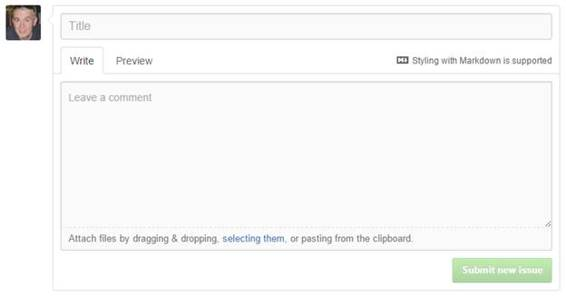
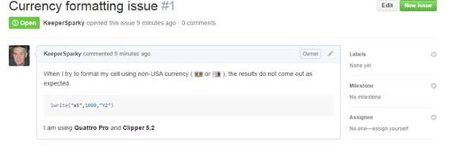
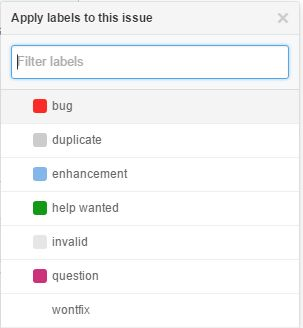
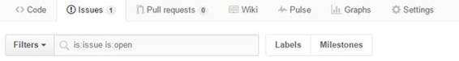
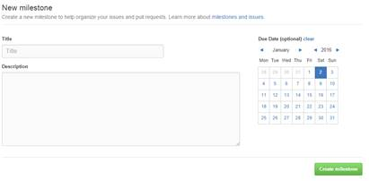
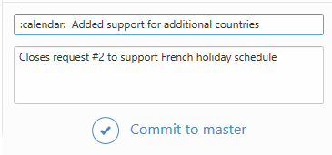

# 八、工单的详细信息

工单是 GitHub 的协作部分，人们在这里交流项目活动。虽然 Git 和 GitHub 是强大的版本控制工具，但是通过工单和拉取请求提供的协作支持鼓励人们一起工作来产生伟大的软件项目。

在项目详细信息页面，您可以点击**工单**选项卡，并点击**新工单**按钮。

图 34:工单选项卡

当您单击“新建工单”按钮时，将出现以下屏幕，让您输入工单详细信息。您可以使用标记语法(参见附录 1)来设置文本的样式。

图 35:写一个工单

您可以在正文中同时使用 Markdown 和[表情符号](http://www.emoji-cheat-sheet.com/)来格式化工单描述。“预览”选项卡向您显示工单的样子。

图 36:工单预览

您还可以将文件附加到工单上，以帮助存储库作者清楚地理解工单。任何查看存储库的人现在都会收到一封包含工单内容的电子邮件。

|  | 提示:请记住 GitHub 是国际性的——一定要尽可能清楚地表达你的工单，因为来自世界各地的人可能正在审查这个工单。 |

除了标记之外，您还可以使用@userName 语法来引用 GitHub 用户，使用#Issue 语法来引用另一个工单或拉请求。这允许工单被交叉引用并与其他用户和工单链接。

当您键入工单时，GitHub 会识别@、#、和:字符，并搜索匹配项以使其更容易。例如，键入#会在存储库中调出其他工单的列表:

图 37:编辑窗口中的工单列表

:(冒号)将显示一个支持表情符号的列表，而@符号将显示一个与存储库和工单相关的用户列表。

当存储库所有者看到工单时，他们将能够开始处理该工单。这允许他们对工单进行分类，将其分配给某个人，将其标记为已关闭，并对工单进行评论。

图 38:所有者视图

通常，审查工单的人会首先给它分配一个标签，例如 bug 或增强。

图 39:标记工单

图 39 中显示的七个项目是 GitHub 提供的默认标签。点击**标签**按钮，可以从工单列表中添加新标签。

图 40:工单列表

这将显示一个屏幕，允许您编辑标签，删除您不想要的标签，并添加任何新标签。当您添加新标签时，GitHub 会询问标签名称，并有一个颜色选择器让您选择用于此工单的颜色。

图 41:新工单

添加新标签后，您可以将该标签用于所有新工单和现有工单。

如果您有许多工单，您可能希望将它们分组为里程碑。里程碑可以是您想要的任何东西，例如:

*   冲刺——未来两周要解决的工单
*   测试版–为下一个主要版本而努力
*   特定客户–特定客户的工单

您可以像创建标签一样创建里程碑。里程碑还将允许您选择一个到期日来帮助跟踪。

图 42:里程碑屏幕

“受理人”按钮允许您指定一个人来处理此工单。它应该是所有者或任何合作者。当您(所有者)查看存储库时，可以从“设置”菜单添加合作者。

图 43:合作者

合作者可以分配任务给他们。您可以查看协作者列表，并通过查找用户名、电子邮件地址或全名来添加新的协作者。您可以使用 X 按钮从项目中移除合作者。合作者也可以对你的项目进行推送。

当您处理工单时，添加标签、受托人等。，GitHub 将显示工单列表中的所有信息

图 44:工单列表

您可以使用顶部的各种选项(作者、标签、里程碑和受理人)来过滤工单列表。您也可以使用搜索时使用的相同选项对列表进行排序。GitHub 使跟踪工单变得既简单又强大。

当您向存储库提交时，您可以通过提交消息关闭工单。GitHub 认为以下单词表示工单正在解决。您应该在关键字后加上#工单编号。

*   关闭
*   关
*   关闭的
*   固定
*   修理
*   固定的；不变的
*   解决
*   解决
*   断然的

当 GitHub 看到提交消息中的模式时，它将自动关闭该工单。您也可以在一条提交消息中关闭多个工单。例如，以下提交消息将自动关闭工单#2。

图 45:在提交消息中关闭一个工单

GitHub 的工单跟踪和协作特性使其作为跟踪开发进度和工作的工具非常有用。这是一个简单而强大的学习系统，对于多人、多里程碑的项目管理非常有用。