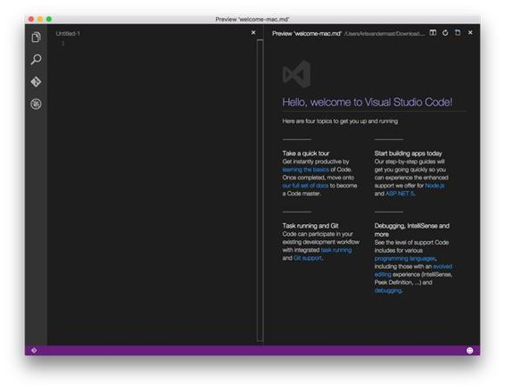
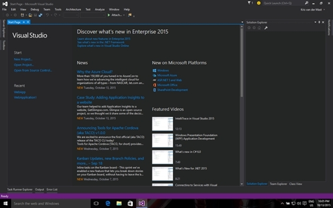
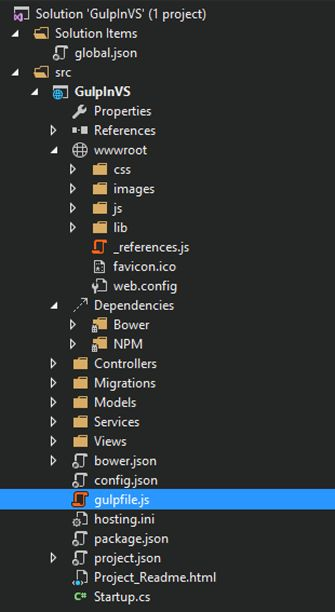
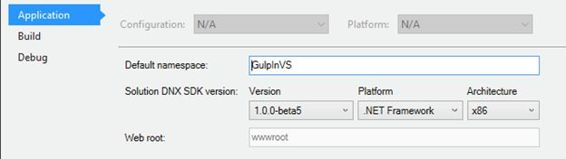
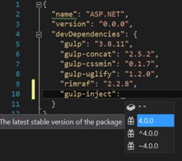

Visual Studio 2015 最近发布了；这是微软多年来一系列成功的集成开发环境的巨大升级。很高兴看到 ASP.NET 背后的团队也选择了“狼吞虎咽”作为他们的首选。

在 ASP.NET 的早期版本中，我们被介绍给了这个系统。性能命名空间，有助于缩小和捆绑 CSS 和 JavaScript 文件。这样做的好处是通过缩小使文件的大小变小。通过将文件捆绑到一个文件中，也减少了要下载的并发文件的数量。这是一个好消息，因为浏览器同时只允许少量的这些。我一直觉得[这篇文章](http://www.asp.net/mvc/overview/performance/bundling-and-minification)是对这个特定学科的很好的介绍。读完这本书后，花点时间读一读。

ASP.NET 5 将是微软第一个跨平台运行的版本，这意味着你的代码也可以在 Mac 或基于 Linux 的发行版上运行。这是一件相当大的事情，与过去完全不同。在写这本书的时候，ASP.NET 5 还在测试阶段，所以也许有些事情还是会改变。当 ASP.NET 5 发布时，一定要留意它的发行说明，看看盒子里有什么，什么没有，或者如何利用东西。本章的其余部分基于它如何与 ASP.NET 5 测试版 8 一起工作。

当第一批测试版模板发货时，他们带来了 Grunt。Grunt 也是一个基于 JavaScript 的任务运行器，就像大口一样。然而，它更老，它使用插件的速度比大口的慢一点。主要原因是它没有像大口那样利用管道流。相反，Grunt 会在每个插件“步骤”后保存到磁盘 Grunt 仍然非常受欢迎，所以你可能会在你将要被分配的项目中遇到它。

下面的代码清单显示了一个可能的 Grunt 文件；它直接取自文档页面。

代码清单 57

```js
  module.exports
  = function (grunt) {

  grunt.initConfig({

   pkg: grunt.file.readJSON('package.json'),

  concat: {

  options: {

  separator: ';'

  },

  dist: {

  src: ['src/**/*.js'],

  dest: 'dist/<%=
  pkg.name %>.js'

  }

    },

  uglify: {

  options: {

  banner: '/*! <%=
  pkg.name %> <%= grunt.template.today("dd-mm-yyyy") %>
  */\n'

  },

  dist: {

  files: {

  'dist/<%= pkg.name
  %>.min.js': ['<%= concat.dist.dest %>']

  }

  }

  },

  qunit: {

  files: ['test/**/*.html']

  },

  jshint: {

  files: ['Gruntfile.js', 'src/**/*.js', 'test/**/*.js'],

  options: {

  // options here to
  override JSHint defaults

  globals: {

  jQuery: true,

  console: true,

  module: true,

  document: true

  }

  }

  },

      watch: {

  files: ['<%=
  jshint.files %>'],

  tasks: ['jshint', 'qunit']

  }

  });

  grunt.loadNpmTasks('grunt-contrib-uglify');

  grunt.loadNpmTasks('grunt-contrib-jshint');

  grunt.loadNpmTasks('grunt-contrib-qunit');

  grunt.loadNpmTasks('grunt-contrib-watch');

  grunt.loadNpmTasks('grunt-contrib-concat');

  grunt.registerTask('test', ['jshint', 'qunit']);

  grunt.registerTask('default', ['jshint', 'qunit', 'concat', 'uglify']);

  };

```

如您所见，由于各种配置设置，与大口文件相比，咕噜文件可能会很快变大。

在 asked 的开发过程中，社区要求微软用大口代替咕噜。这是出于各种原因:这是一种更快、更好、即将到来的技术，每天都有更多的追随者，并且有一个健康的插件生态系统。在过去的几年里，微软，尤其是 ASP.NET 背后的团队，已经接受了开源方法，并积极听取其用户群的意见。

#### 咕噜代码与大口代码

Grunt 讲的都是配置而不是编码，而 glaugh 讲的都是通过代码进行配置。下一个示例将显示要运行的相同任务，但两者都以各自的风格编写。

代码清单 58

```js
  module.exports
  = function (grunt) {

  grunt.initConfig({

  less: {

  development: {

  files: {

  "wwwroot/css/app.css": "Assets/*.less"

  }

  }

  },

  autoprefixer: {

  options: {

  browsers: ['last 2
  version']

  },

  single_file: { 

  src: 'wwwroot/css/app.css', 

  dest: 'wwwroot/css/single_file.css' 

  }, 

  }

  });

  grunt.loadNpmTasks('grunt-contrib-less');

  grunt.loadNpmTasks('grunt-autoprefixer');

  grunt.registerTask('css:less', ['less', 'autoprefixer']);
  };

```

代码清单 59:gulpfii . js/gulpfii . js

```js
  var gulp = require('gulp'),

  less = require('gulp-less'),

  prefix = require('gulp-autoprefixer')

  gulp.task('css:less', function () {

  gulp.src('./Assets/*.less')

  .pipe(less())

  .pipe(prefix({ browsers: ['last 2 versions'], cascade: true }))

  .pipe(gulp.dest('./wwwroot/css/'));
  });

```

您可以看到 Grunt 文件会变得非常快，并且可能需要一些相当大的配置步骤。write 速度快，容易写，用较少的语法就容易理解。除此之外，大口几乎每天都看到新插件的增加，这使它成为你随身携带的一个很好的工具。

微软最著名的编辑器是 Visual Studio，目前品牌为 Visual Studio 2015。有一个免费的社区版本，对于繁重的企业开发和架构，您可能想选择使用完整的旗舰版本: [Visual Studio 2015 企业版](https://www.visualstudio.com/?Wt.mc_id=DX_38656)。

稍不为人知的是免费提供的 Visual Studio 代码版。这不仅仅是一个精简版的 Visual Studio 2015，而是一个独立的编辑器。最棒的是，三个主要的操作系统平台都有一个版本:Windows、Mac OS X 和 Linux。



图 32:Mac OS X 上的 Visual Studio 代码

这一次，我们要转移到一台安装了 Windows 和 [Visual Studio 2015](https://www.visualstudio.com/?Wt.mc_id=DX_38656) 的机器上。有不同的口味可供选择，比如企业版的免费社区版。

启动 Visual Studio 2015(图 33)后，或者利用菜单选择**文件** > **新项目**，或者在打开 Visual Studio 2015 后看到的第一页中点击**启动**下的**新项目**。



图 33: Visual Studio 2015 开始屏幕

从接下来出现的模态窗口中(图 34)，选择**ASP.NET 网络应用程序**。给它一个有意义的名称，并在您的机器上选择一个路径。确保选择了选项**为解决方案**创建目录。


图 34:选择 ASP.NET 网络应用程序

点击**确定**按钮后，你会看到一个如图 35 所示的窗口。从 ASP.NET 5 预览模板中选择第三个选项，**网络应用程序**。点击**确定**。


图 35:选择一个 ASP.NET 模板开始

Visual Studio 2015 现在将基于所选模板创建一个新的解决方案。在 Visual Studio 2015 中打开解决方案资源管理器时，您将看到类似以下内容的内容:



图 36:新创建的解决方案

在项目的根**gulf invs**中，可以看到文件 gulpfile.js 也被添加到解决方案中。为了您的方便，它已经设置了一些初始代码。我们接下来会看到。

创建新的 ASP.NET 5 web 应用程序后，解决方案中已经有一个包含以下内容的 gulpfile.js:

代码清单 60:新创建的 ASP.NET 5 应用程序的内容

```js
  ///
  <binding Clean='clean' />

  var gulp = require("gulp"),

  rimraf = require("rimraf"),

  concat = require("gulp-concat"),
      cssmin
  = require("gulp-cssmin"),

  uglify = require("gulp-uglify"),

  project = require("./project.json");

  var paths = {

  webroot: "./" + project.webroot + "/"
  };

  paths.js
  = paths.webroot + "js/**/*.js";
  paths.minJs
  = paths.webroot + "js/**/*.min.js";
  paths.css
  = paths.webroot + "css/**/*.css";
  paths.minCss
  = paths.webroot + "css/**/*.min.css";
  paths.concatJsDest
  = paths.webroot + "js/site.min.js";
  paths.concatCssDest
  = paths.webroot + "css/site.min.css";

  gulp.task("clean:js", function (cb) {
      rimraf(paths.concatJsDest,
  cb);
  });

  gulp.task("clean:css", function (cb) {

  rimraf(paths.concatCssDest, cb);
  });

  gulp.task("clean", ["clean:js", "clean:css"]);

  gulp.task("min:js", function () {

  gulp.src([paths.js, "!" + paths.minJs], { base: "." })

  .pipe(concat(paths.concatJsDest))

  .pipe(uglify())

  .pipe(gulp.dest("."));
  });

  gulp.task("min:css", function () {

  gulp.src([paths.css, "!" + paths.minCss])

  .pipe(concat(paths.concatCssDest))

  .pipe(cssmin())

  .pipe(gulp.dest("."));
  });

  gulp.task("min", ["min:js", "min:css"]);

```

快速浏览一下之前的 Gaugh 文件，我们会发现，在开始的时候，Gaugh 和不同插件的定义都在制定中(rimraf、concat、cssmin 和 uglify)。我们也看到一些奇怪的东西:

project = require("。/project . JSON ")；

自从 node.js v0.5.2 发布以来，加载和缓存成为可能。json 文件通过 require 转换成一个变量。这样做的好处是，配置可以放在另一个文件中。在这种情况下，是 project.json。

大口文件中的下一件事是路径声明，以便在需要时在一个方便的地方更改大口文件的其余部分。请注意 project.webroot 的用法。webroot 是我们之前加载的 project.json 文件的参数。

我们看到的前三个任务涉及清理文件夹，一个用于 CSS，一个用于 JavaScript。请注意，两者都有一个传入的回调变量 cb，用于通知调用任务它们的作业在运行后已经完成。

接下来和最后三个任务都是关于 JavaScript 和 CSS 文件的连接和缩小。请注意，它没有使用 globbing，而是专门处理一个文件。特别是 site.js 和 site.css。

project.webroot 来自 project.json 文件，该文件是通过 require 语句加载的。在该文件中，定义如下:“web root”:“wwwroot”。这是 ASP.NET 5 中的一个新的子文件夹，其中放置了所有静态项目，这些项目在发布到服务器或云时需要公开。这个特殊的设置有一定的意义，因为它也显示在另一个窗口中。您可以通过在解决方案资源管理器中右键单击网络项目并选择**属性**来查看它。这将打开如图 37 所示的窗口:



图 37:网络根参数

奇怪的是，人们不能在这个屏幕上更改它，只能在 project.json 文件中更改它。

###  中与大口一起工作

多年来，Visual Studio 一直被认为是一个伟大的集成开发环境。原因之一是 Visual Studio 中的“可视化”一词:开发人员可以利用菜单或专用窗口或窗格来完成任务。到目前为止，在本书中，我们已经从控制台窗口运行了大口。这与开发人员习惯于在 Visual Studio 中工作的方式并不完全一致。

对于大口，在 Visual Studio 中有一个专用窗格，可以通过几种方式访问:

*   通过菜单:首先在解决方案资源管理器中选择**gulf file . js**文件，然后转到**工具** > **任务运行器资源管理器**。
*   右键单击解决方案资源管理器中的**按钮，并从上下文菜单中选择**任务运行器资源管理器**。**


图 38:打开任务运行器浏览器

一旦使用了这些方法中的任何一种来打开任务运行器资源管理器，我们可以看到已经有了一个用于清理操作的绑定:


图 39:任务运行器浏览器

在左侧，我们可以看到带有大口图标的 Gulpfile.js，以及下面我们在代码清单 59 中看到的六个不同的任务。在右边，我们可以看到一些绑定。这与我们到目前为止习惯的有些不同，在 Visual Studio 中很典型。

我们现在看到的唯一一个绑定是 Clean 绑定，一旦执行，它将运行 Gulp clean 任务。为此，使用菜单并选择**构建** > **清洁解决方案**。


图 40:大口清洁任务已经运行。

运行同一任务的另一种方法是右键单击左窗格中的任务，然后选择**运行**。


图 41:直接运行吞咽清洁任务

当您再次查看代码清单 60 时，您会在文件的顶部看到下面一行:

///

这看起来很熟悉，是的，这一行弥补了能够在 Visual Studio 的任务运行器资源管理器中将任务绑定到绑定的工具。在这种特定情况下，它将大口清洁任务绑定到清洁绑定。您可以通过取出 gulpfile.js 文件中的行，保存它，然后再次打开 Task Runner Explorer 来轻松测试这一点。束缚将会消失。通过将它放回 gulpfile.js 文件并保存，绑定将被恢复。

您可以通过更改 gulpfile.js 文件来添加新的绑定，或者右键单击任务运行器资源管理器中的一个 Gulp 任务，然后从上下文菜单中选择**绑定** >，并选择以下四种可能性之一:

表 Visual Studio 任务运行器资源管理器中的绑定

| 粘合剂 |
| --- |
| 构建前 | 在构建过程开始之前运行一个大口任务 |
| 构建后 | 构建过程完成后运行一个大口任务 |
| 干净的 | 执行干净解决方案后运行吞咽任务 |
| 项目打开 | 当项目由 Visual Studio 打开时，运行一个大口任务 |


图 42:在任务运行器资源管理器中向大口任务添加绑定

我们在上一段看到的可以用来回答我在【2015 年欧洲网络会议上提出的一个问题，当时是关于大口:*在使用 Visual Studio 时，当文件和任务发生变化时，你是如何观看文件和运行任务的？*

按照一些简单的步骤就可以看出答案。我们将使用大口-萨斯把萨斯文件翻译成相应的 CSS 文件。为此，在 **wwwroot/css/下创建两个 Sass 文件。**

代码清单 61:另一个

```js
  @mixin border-radius($radius) {
    -webkit-border-radius: $radius;

  -moz-border-radius: $radius;

  -ms-border-radius: $radius;

  border-radius: $radius;
  }

  .box { @include border-radius(10px);
  }

```

代码清单 62

```js
  @import "AnotherOne.scss";

  a.CoolLink {

  color: greenyellow;

  &:hover {

  text-decoration: underline;

  }

  &:visited {

  color: green;

  }
  }

```

代码清单 63

```js
  ///
  <binding Clean='clean' ProjectOpened='watch' />

  var gulp = require("gulp"),

  sass = require('gulp-sass'),

  project = require("./project.json");

  var paths = {

  webroot: "./" + project.webroot + "/"
  };

  paths.js
  = paths.webroot + "js/**/*.js";
  paths.sass
  = paths.webroot + "css/**/*.scss";
  paths.sassToCss
  = paths.webroot + "css";

  gulp.task("css:sass", function () {

  gulp.src(paths.sass)

  .pipe(sass())

  .pipe(gulp.dest(paths.sassToCss));
  });

  gulp.task('watch', function () {

  gulp.watch(paths.sass, ['css:sass']);
  });

```

为了展示完成任务的方法，gulpfile.js 文件做了大量的删减。做出所需的 require 语句并设置路径。创建了两个任务:一个 css:sass 来完成翻译。scss 文件。css 文件和监视任务。每当它看到一个。wwwroot/css 文件夹下的 scss 文件。

这并不是什么新鲜事，因为我们已经在第 3 章中讨论过类似的方法。新的部分是 Visual Studio 的反应方式。在 gulpfile.js 文件的顶部，您可以看到下面一行:

///

正如我们在前面的例子中看到的，第一部分是熟悉的。使用前面讨论的工具，监视任务已经耦合到任务运行器资源管理器中的项目打开绑定，如图 43 所示。


图 43:耦合到项目打开绑定的大口任务观察器

您现在可以手动启动监视任务或关闭 Visual Studio。再次打开 Visual Studio，然后重新打开项目。打开项目后，直接查看任务运行器资源管理器。您将看到监视任务已经运行。现在每当你改变一个。wwwroot/css 文件夹下的 scss 文件，当您保存更改的文件时，将运行 css:sass 任务。图 44 显示了任务运行器资源管理器窗格中的输出。


图 44:打开项目时，在每次保存一个。更改 scss 文件时。

现在我们已经达到了使用简单控制台窗口时的效果，就像在第 3 章中一样。这使得我们在 Visual Studio 中的开发工作更容易编写代码。

经过一些更改后，Styles.css 的结果可能如下所示:

代码清单 64

```js
  .box {
    -webkit-border-radius: 10px;
    -moz-border-radius: 10px;
    -ms-border-radius: 10px;
    border-radius: 10px;
  }

  a.CoolLink {
    color: lawngreen; }
    a.CoolLink:hover {

  text-decoration: underline; }
    a.CoolLink:visited {

  color: green; }

```

到目前为止，我们主要看到了如何利用大口来捆绑、缩小和翻译脚本和 CSS。这些都是很棒的特性，并且它从开发人员那里带走了很多手工工作。我们将这些结果直接包含到我们的 HTML 文件中，并将其发送到浏览器以执行他们的工作。

开发时，您实际上会编写代码。在创建下一个伟大应用程序的过程中，您可能会不断构建、捆绑或缩小代码。进行这些更新最终会产生新的文件，我们希望将这些文件包含在我们的页面中。然而，浏览器试图缓存尽可能多的静态内容。这是您的应用程序在生产周期中所需要的，因为您会看到到达服务器的请求越来越少，从而节省了服务器上的资源。在开发或升级生产中部署的应用程序期间，您可能希望通知浏览器，他们需要忽略他们拥有的缓存版本并获取最新版本。

有几种技术，最常见的是要么在文件名中放一个版本号，要么在它后面添加一个唯一的 querystring，使它整体上是唯一的。

因为这是经常被请求的，所以有不同的大口插件试图解决这个常见的问题。

在插件的帮助下，我们可以完成我们的任务。在我们之前使用的 ASP.NET MVC 应用程序中(或者一个新的)，我们可以通过将以下内容放入 Razor 页面的<头>部分来调整 **_Layout.cshtml** 文件。

代码清单 65: _Layout.cshtml 头部

```js
  <head>

  <meta charset="utf-8" />

  <meta name="viewport" content="width=device-width, initial-scale=1.0" />

  <title>@ViewData["Title"] - GulpInVSWatch</title>

  <!-- inject:css
  -->

  <!-- endinject
  -->

  </head>

```

为了让它工作，我们需要像下面的代码片段一样构建我们的 gulpfile.js 文件:

代码清单 66

```js
  var gulp = require("gulp"),

  inject = require('gulp-inject');

  gulp.task("inject", function () {

  var target = gulp.src('./Views/Shared/_layout.cshtml');

  var sources = gulp.src('./wwwroot/css/**/*.css');

  return target

  .pipe(inject(sources))

  .pipe(gulp.dest('./Views/Shared/'));
  });

```

这一小块大口代码在注入任务中发挥了它的魔力。它抓取目标文件，在我们的例子中是 _Layout.cshtml。我们可以在 wwwroot/css 子文件夹中找到 css 文件，这些文件将被放置在 _Layout.cshtml 文件头部的特殊注释行之间。

接下来的几行获取目标文件，注入源文件，并将修改后的 _Layout.cshtml 文件写回到视图/共享/下的原始位置。

这个操作的结果可以在下面的代码清单中看到。在样品溶液中，我有三种不同的。css 文件，这些文件都被注入了:

代码清单 67:注入三个之后的结果。带有大口注入的 css 文件

```js
  <head>

  <meta charset="utf-8" />

  <meta name="viewport" content="width=device-width, initial-scale=1.0" />

  <title>@ViewData["Title"] - GulpInVSWatch</title>

  <!-- inject:css
  -->

  <link rel="stylesheet" href="/wwwroot/css/AnotherOne.css">

  <link rel="stylesheet" href="/wwwroot/css/site.css">

  <link rel="stylesheet" href="/wwwroot/css/Styles.css">

  <!-- endinject
  -->

  </head>

```

这是很好的工作，但这不是我们所希望的完整体验。还记得我们在前面提到的版本条件吗？嗯，也是时候解决这个问题了。幸运的是，不需要另一个大口插件。大口注射插件有相当多的选项，我们可以利用和操纵正在注射的东西。

在终端窗口的 DOS 框中，我们现在将执行一个 npm 安装吞咽-注入-保存-开发命令来从 npm 获取包，这样我们就可以使用它。在 Visual Studio 中，这有点不同。

打开 **package.json** 文件进行编辑。Visual Studio 的伟大之处在于它提供了 IntelliSense，在编辑 package.json 文件时也是如此。在 devDependencies 部分，添加一个新的大口注入行。在解决方案资源管理器中，右键单击 **npm** 节点，并选择**恢复包**。

打开 **package.json** 文件，如图 45 所示。您可以为大口注入添加一个额外的行，并为包名和版本获取智能感知。这很方便，不是吗？



*图 45:编辑 package.json 时的智能感知*

很可能您已经获得了自动加载 npm 包的 Visual Studio 更新。如果没有，那么您可以采取下一个简单的步骤，如图 46 所示:


*图 46:在 Visual Studio 中恢复包*

相应地将 gulpfile.js 文件更改为:

代码清单 68:转换注入的文件并添加查询字符串

```js
  var gulp = require("gulp"),

  inject = require('gulp-inject');

  gulp.task("inject", function () {

  var target = gulp.src('./Views/Shared/_layout.cshtml');

  var sources = gulp.src('./wwwroot/css/**/*.css');

  var ticks = new Date().getTime();

  return target

  .pipe(inject(sources, {

  transform: function (filepath) {

  arguments[0] = filepath + '?v=' +
  ticks;

  return
  inject.transform.apply(inject.transform, arguments);

  }

  }))

  .pipe(gulp.dest('./Views/Shared/'));
  });

```

这里我们添加了一个额外的选项来转换文件路径。它的后缀是？v=转换前我们用当前日期的刻度数填充的刻度数。注射后，最终结果将与之前略有不同:

代码清单 69:注入三个之后的结果。带有大口注入和附加查询的 css 文件

```js
  <head>

  <meta charset="utf-8" />

  <meta name="viewport" content="width=device-width, initial-scale=1.0" />

  <title>@ViewData["Title"] - GulpInVSWatch</title>

  <!-- inject:css
  -->

  <link rel="stylesheet" href="/wwwroot/css/AnotherOne.css?v=1448220822909">

  <link rel="stylesheet" href="/wwwroot/css/site.css?v=1448220822909">

  <link rel="stylesheet" href="/wwwroot/css/Styles.css?v=1448220822909">

  <!-- endinject
  -->

  </head>

```

这导致了我们从一开始就想要的。由于大口注入插件的转换选项，操纵注入文件名的结果变得非常容易。现在，将这一点与 Visual Studio 的任务运行器资源管理器中的“构建后”绑定结合起来，您就有了坚实的开发经验。

本章很好地概述了在 Visual Studio(新的任务运行器资源管理器)中使用大口的可能性，以及如何将大口任务与绑定相结合，以执行开发时遇到的繁重的手动任务。我们还看到了开发人员在使用 Visual Studio 时遇到的常见问题的两个专用解决方案。这些解决方案的灵感来自于我在米兰 2015 年欧洲网络会议上介绍完大口后得到的问题。