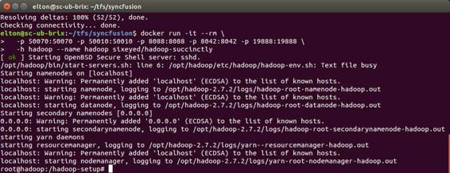

Hadoop 是一个 Java 平台，这意味着在单个节点上安装它是一个简单的过程，包括设置先决条件、下载最新版本、解包以及运行启动服务器的命令。像 Hadoop 生态系统中的其他工具一样，它可以以三种模式运行:本地、伪分布式和分布式。

对于开发和探索来说，伪分布式选项是最好的——它在独立的 Java 进程中运行不同的 Hadoop 服务器，这意味着在单台机器上运行时，您可以获得与完整集群相同的运行时架构。

Apache 文档涵盖了设置单节点集群和更复杂的[全集群设置](https://hadoop.apache.org/docs/stable/hadoop-project-dist/hadoop-common/ClusterSetup.html)。

如果你读过我的其他 Syncfusion 电子书([*【HBase 简洁地】*](https://www.syncfusion.com/resources/techportal/details/ebooks/hbase) 和 [*Hive 简洁地*](https://www.syncfusion.com/resources/techportal/details/ebooks/Hive-Succinctly) )，你知道我喜欢在我的演示环境中使用 Docker，这本书有一个 Docker 映像，这意味着你可以使用我使用的完全相同的环境，而不必在你的机器上设置 Hadoop。

你需要[安装 Docker](https://docs.docker.com/engine/installation/) ，它运行在 Windows、Mac 和 Linux 上。然后，您可以通过运行代码清单 1 中的命令来启动 Hadoop 的伪分布式实例。

 1:在 Docker 中运行 Hadoop

```java
   docker run -it --rm \
    -p 50070:50070 -p 50010:50010 -p
  8088:8088 -p 8042:8042 -p 19888:19888 \
    -h hadoop --name hadoop
  sixeyed/hadoop-succinctly:2.7.2

```

|  | 提示:用-h 标志设置容器的主机名使得使用 Hadoop 网络用户界面变得更加容易。您可以在 hosts 文件中添加一个条目，将 Docker 机器的 IP 地址与容器的主机名相关联，这意味着您可以浏览到 http://hadoop:8088 来检查作业状态。这样，Hadoop 生成的链接都可以正常工作。 |

代码第一次运行时，会从公共存储库中简洁地下载[*Hadoop*Docker 映像](https://hub.docker.com/r/sixeyed/hadoop-succinctly/)。这需要一段时间，但是 Docker 会在本地缓存图像，这意味着下次运行命令时，容器将在几秒钟内启动。

该命令使用`-it`标志交互式地启动您的容器，这样您就可以在命令行上开始使用 Hadoop，并且它将在您使用完`--rm`标志后立即移除容器。您所做的任何更改都将被丢弃，并且您运行的下一个容器将返回到基本映像状态。

启动容器的输出将如图 4 所示，一些日志条目告诉您 Hadoop 服务正在启动，一个命令提示符为您准备好使用 Hadoop。



 4:正在运行的码头工人集装箱

Hadoop 包附带了示例 MapReduce 作业，您可以使用这些作业来检查您的安装是否正常工作。稍后我们将更详细地查看`hadoop`命令行，但是为了验证您的环境，您可以运行代码清单 2 中的命令。

 2:验证您的 Hadoop 安装

```java
  hadoop fs -mkdir -p
  /user/root/input
  hadoop fs -put
  $HADOOP_HOME/etc/hadoop input
  hadoop jar $HADOOP_HOME/share/hadoop/mapreduce/hadoop-mapreduce-examples-2.7.2.jar
  grep input output 'dfs[a-z.]+'

```

第一个命令在 Hadoop 文件系统中为根用户的主目录创建一个名为`input`的目录，第二个命令将`etc/hadoop`目录中的所有文件复制到`input`目录。

第三个命令向 Hadoop 提交一个作业，以便运行我们刚刚存储的数据。作业打包在一个 Java JAR 文件中，这是 Hadoop 提供的一个示例，我们用参数`grep input output 'dfs[a-z.]+'`将其发送给 Hadoop。这将运行一个搜索输入目录中所有文件的作业，并查找以“dfs”开头的单词，然后计算所有匹配项。

随着作业的运行，它会产生许多输出，告诉您当前的进度。当它完成时，您可以使用代码清单 3 中的命令查看最终结果。

 3:示例作业的输出

```java
  # hadoop fs -cat output/*
  6     dfs.audit.logger
  4     dfs.class
  3     dfs.server.namenode.
  2     dfs.period
  2     dfs.audit.log.maxfilesize
  2     dfs.audit.log.maxbackupindex
  1     dfsmetrics.log
  1     dfsadmin
  1     dfs.servers
  1     dfs.replication
  1     dfs.file

```

您应该会看到一个类似的以“dfs”开头的单词列表，以及每个单词的出现次数。如果您的程序没有按预期运行，您将需要检查您的安装步骤或者简单地使用 Docker 容器。

在本章的剩余部分，我们将构建自己版本的字数统计程序，作为对 MapReduce 编程的简单介绍。

MapReduce 程序有三个部分:

*   **驱动程序**，配置程序在 Hadoop 中如何运行。
*   **映射器**，从 Hadoop 输入数据并产生中间输出。
*   **减速器**，从映射器输入中间输出并产生最终输出。

映射器并行运行—每个输入文件(或者，对于大型输入文件，每个文件块)都有一个将在其中一个数据节点上运行的专用映射器任务。每个映射器只获得总输入数据的一小部分，它的工作是读取输入并将其转换为中间输出。

每个映射器只产生总输出的一部分，而缩减器的工作是构建最终结果，将映射器的许多中间输出聚合成一个结果。简单的工作只有一个减速器任务。图 5 显示了 MapReduce 作业中的数据流。


5:MapReduce 中的数据流

在我们的字数统计示例中，映射器将获得一个文件的内容，一次一行。MapReduce 框架通过读取文件并将行发送到映射器来选择文件，这意味着我们需要编写代码来转换我们接收的数据。在这种情况下，我们将把输入行拆分成单词，并查找任何以“dfs”开头的单词。当我们找到匹配时，我们将把单词写到输出中。

Hadoop 在所有映射器完成时收集它们的输出，对中间输出进行排序和合并，然后将该输出发送给 reducer。缩减器将接收所有 Hadoop 映射器的中间输出，作为一个 Java `Iterable`集合。我们需要编写代码来计算每个单词的计数，然后将最终的计数作为输出。

这解释了为什么只有一个减速器是常见的做法。减压器的工作是整理中间结果，所以我们通常把所有的结果交给一个实例。如果缩减器需要聚合来自映射器的输出，它将拥有这样做所需的所有可用数据。我们可以用多个减速器运行一个作业，这提高了性能，但这意味着每个减速器只聚合了部分中间输出，我们的最终结果将在多个减速器输出之间进行分割。

当数据在映射器和缩减器之间移动时，它可能会穿过网络，因此所有的值都必须是可序列化的。为了存储数据，MapReduce 框架提供了自己的一组类，这些类是为高效序列化而构建的(例如，您将使用`Text`类，而不是普通的 Java `String`)。此外，为了在作业开始之前验证作业是否正确配置，必须明确告知 Hadoop 您的类的数据类型。

驱动程序执行此配置，指定要使用的映射器和缩减器以及输入和输出的类型。输入和输出总是键值对，这意味着您可以在驱动程序中指定键的类型和值的类型。

MapReduce 程序中有几个移动部分需要正确连接，但是代码非常简单。

我们需要编写三个类来实现一个 MapReduce 程序:一个映射器、一个 Reduce 和一个驱动程序。完整的代码在这本电子书附带的 GitHub 存储库中:六眼/Hadoop-简洁地说/java 。我使用了新的 [Visual Studio Code](https://code.visualstudio.com/) 工具作为 IDE，但是 Java 项目是用 Maven 构建的。构建 JAR 的信息在项目的自述文件中。

我们的映射器和缩减器类将从 Hadoop 客户端库中的基类继承，这意味着项目需要引用 Apache 包。依赖项的 Maven 配置在代码清单 4 中，目标是库的 2.7.2 版本，这是编写时 Hadoop 的当前版本，与`hadoop-succinctly`容器中的 Hadoop 安装相匹配。

4:MapReduce 的 Maven 依赖关系

```java
  <dependency>
      <groupId>org.apache.hadoop</groupId>
        <artifactId>hadoop-client</artifactId>
        <version>2.7.2</version>
  </dependency>

```

从映射器开始，我们扩展基类`org.apache.hadoop.mapreduce.Mapper`并指定输入和输出键值对的类型。在代码清单 5 中，前两个类型参数是预期的输入键和值类型，后两个类型是映射器将发出的键和值类型。

 5:扩展基础映射器

```java
  public static class Map 
                extends
  Mapper<LongWritable, Text, Text, IntWritable>

```

对于文件中的每一行，Hadoop 都会调用`map()`方法，向其传递一个键值对。在我们的驱动程序配置中，我们将设置输入格式，以便用一个键调用地图，该键是一个包含文件中行位置的`LongWritable`对象和一个包含实际文本行的`Text`对象。

代码清单 6 显示了映射方法的定义，其中输入键和值类型与映射器类的类型声明相匹配。map 方法还被传递了一个`Context`对象，它可以用这个对象写出值。

 6:地图方法签名

```java
  public void map(LongWritable key,
  Text value, Context context)

```

当调用`map()`时，映射器不需要做任何事情，但是它们可以通过将键值对写入`Context`对象来发出零个或多个键值对。任何写入的值都由 Hadoop 收集，并将被排序、合并并发送到减速器。

`map()`方法的代码很简单——我们将字符串标记为单个单词，如果单词包含“dfs”，我们将它发送到上下文。我们发出的键值对使用一个`Text`对象作为键，这是我们找到匹配的完整单词，该值是一个`IntWritable`对象。稍后我们将使用整数值来对计数进行求和，但是我们不在映射器中进行任何计数——我们总是发出值 1。代码清单 7 显示了完整的`map()`实现。

 7:映射方法

```java
  public void map(LongWritable key,
  Text value, Context context) 
                  throws IOException,
  InterruptedException {
           String line =
  value.toString();
           StringTokenizer tokenizer
  = new StringTokenizer(line);
           while
  (tokenizer.hasMoreTokens()) {
              String next =
  tokenizer.nextToken();
              if
  (next.contains("dfs")){
                  word.set(next);
                  context.write(word,
  one);  // 'one' is IntWritable(1)
              }
           }
        }

```

当我们找到一个匹配的单词时，我们总是发出 1 作为计数，因为映射器的工作不是做任何聚合工作(比如对值进行计数)。您可能认为映射器将计数保持在本地状态会更有效，使用单词字典，在读取行时增加计数，并将计数作为批处理发出，但是这种方法有问题。

映射器应该能够适用于任何文件大小。映射器可能会为 1 MB 文件运行任务，但如果给定了 1 GB 文件，同一映射器也必须正常工作。Hadoop 流过输入文件，以最小化所需的内存量，但是如果您的映射器将状态保存在字典中，那么它的内存占用量是不可知的，对于大型文件，这可能会导致内存不足异常。

映射器应该是轻量级组件，用单个输入调用，用零个或多个输出响应。您可以通过在映射器内部进行微匹配来获得性能提升，但是这样做会将映射器限制为只处理小的输入。但是，如果映射器的行为正确，您的整个作业可以扩展到任何大小，这是一个更好的性能选项。

聚合工作属于缩减器，尽管您可以使用组合器执行一些后映射器聚合，该组合器的工作方式类似于一个小型缩减器，在每个映射器的输出上运行。

与映射器一样，reducer 从 Hadoop 基类扩展而来，并指定输入和输出键和值类型。对于缩减器，输入类型需要匹配映射器的输出类型，但是如果需要，缩减器可以发出不同的输出类型。

在我们的例子中，缩减器接收包含匹配单词的`Text`键，以及初始化为 1 的单词计数的`IntWritable`值。缩减器发出相同的类型——带有类型参数的类定义如代码清单 8 所示。

 8:延伸基础减速器

```java
  public static class Reduce 
                extends
  Reducer<Text, IntWritable, Text, IntWritable>

```

在映射阶段之后，将用一个键和一组值调用减速器上的`reduce()`方法。Hadoop 对来自映射器的键进行排序和合并，你可以在你的减速器中依赖它。您知道您将只看到每个键一次(该值是该键的所有映射器值的集合)，并且您知道下一个键将具有比当前键更高的值(按字典顺序)。

`reduce()`方法定义了键和值集合类型，以及一个`Context`对象，该对象用于以与映射器相同的方式写入输出。代码清单 9 完整地展示了`reduce()`方法。

 9:简化方法

```java
  public void reduce(Text key,
  Iterable<IntWritable> values, Context context) 
                     throws
  IOException, InterruptedException {
           int sum = 0;
           for (IntWritable val :
  values) {
              sum += val.get();
           }
           context.write(key, new
  IntWritable(sum));
        }

```

对于字数，将使用包含匹配“dfs”的字符串和一组`IntWritable`对象的文本值调用`reduce()`。当 Hadoop 合并映射器的输出时，它会对所有键进行排序，并将一个键的所有值组合成一个集合。然后为每个键调用 reducer，在`reduce()`方法中接收该键的值集合。

值集合将至少有一个元素，因为映射器将始终为每个键发出一个值。集合中可能包含任意数量的元素，Hadoop 会在映射器发出元素时将它们呈现给 reducer。在缩减器中，我们将映射器的中间输出聚合到最终输出中——在这种情况下，我们只需将所有值相加，即可得出每个键的总数。

当我们编写来自缩减器的输出时，我们以与映射器中相同的方式进行，通过调用`Context`类上的`write()`，向其传递键值对。密钥是包含匹配的单词，我们只需编写与方法调用中收到的密钥相同的密钥。

该值是来自映射器的所有 1 个值的总和，我们将其写成`IntWritable`。在方法体中，我们使用一个整数来对值求和，但是我们需要使用 Hadoop 的一个可序列化类型来写入上下文，因此我们从该整数创建一个`IntWritable`。

驱动程序是 MapReduce 程序的入口点，它只需要配置其余的组件。驱动程序不必从基类扩展或实现接口，但它们确实需要被配置为 JAR 的入口点——在示例代码中，这是在 Maven 设置中通过指定`mainClass`元素完成的，如代码清单 10 所示。

 10:指定主类

```java
      <archive>
        <manifest>

  <addClasspath>true</addClasspath>

  <mainClass>com.sixeyed.hadoopsuccinctly.WordCount</mainClass>
        </manifest>
      </archive>

```

`WordCount`类有一个带有`String`数组的标准`main()`方法来接收命令行参数。通常设置您的驱动程序，以便从参数中读取每个环境或程序的不同运行将改变的任何值。对于字数，我们将使用参数来指定输入文件的来源和输出文件的目标。

配置一个`Job`对象，即定义工作将做什么，是驱动程序的主要工作。`Job` 对象依赖于`Configuration`对象，但是对于我们的简单示例，我们可以使用默认配置值。代码清单 11 显示了`Job`对象的创建。

 11:设置作业配置

```java
    Configuration conf = new
  Configuration();
    Job job = new Job(conf,
  "wordcount");

```

在这里，我们为作业指定一个名称“字数”，它将显示在 Hadoop 状态用户界面中。

为了执行作业，Hadoop 要求明确指定所有涉及的类型。首先，我们指定包含我们自己的类型、输出键和值类型以及映射器和缩减器类型的 JAR。`Job`类上有各种集合方法来声明这些类型。在代码清单 12 中，我们将 JAR 配置为包含`WordCount`类、`Text`类作为输出键、`IntWritable`作为输出值以及`Map`和`Reduce`类的档案。

 12:指定作业类型

```java

  job.setJarByClass(WordCount.class);

  job.setOutputKeyClass(Text.class);
        job.setOutputValueClass(IntWritable.class); 

  job.setMapperClass(Map.class);

  job.setReducerClass(Reduce.class);

```

请注意，我们没有指定输入键和值的类型，尽管 Hadoop 也需要这些信息。然而，MapReduce 程序工作在较低的级别，映射器代码与预期的数据格式紧密耦合。

Hadoop 支持大数据解决方案中常见的多种文件格式——纯文本文件、GZipped 文本文件，以及更高效的格式，如 Avro 和 Parquet。在工作中，我们配置我们期望的文件格式，这将隐式地设置输入键和值类型。

在代码清单 13 中，指定`TextInputFormat`类为我们提供了映射器所期望的`LongWritable`键和`Text`值输入类型。

 13:指定输入和输出格式

```java

  job.setInputFormatClass(TextInputFormat.class);

  job.setOutputFormatClass(TextOutputFormat.class);

```

驱动程序的最终职责是告诉 Hadoop 在哪里可以找到源文件，以及输出将被写入哪里。这是通过`FileInputFormat`和`FileOutputFormat`类完成的，将我们设置的`Job`对象和主方法参数的目录路径传递给它们。我们还可以告诉 Hadoop，客户端应该等待这个作业完成，而不是一提交就返回。

 14:最终作业配置

```java

  FileInputFormat.addInputPath(job, new Path(args[0]));

  FileOutputFormat.setOutputPath(job, new Path(args[1]));
        job.waitForCompletion(true);

```

为了运行一个 MapReduce 程序，我们可以使用命令行将其提交给 Hadoop。`hadoop`命令允许我们同时使用 Hadoop 文件系统和作业调度器，而`jar`操作提交一个新的作业。完整的命令在代码清单 15 中。

 15:提交作业

```java
    hadoop jar
  /packages/wordcount-1.0-SNAPSHOT.jar input output2

```

我们将`jar`命令传递到包含驱动程序、映射器和减速器的 JAR 文件的路径，以及驱动程序期望的任何参数。在这种情况下，我已经将 JAR 文件复制到了系统根目录下的 packages 文件夹中，并将`input`作为映射器将读取的源目录，将`output2`作为缩减器将写入的目标目录。

作业完成后，减速器的输出将被写入输出目录中的文件。每个减速器都有自己的输出文件，使用`hadoop fs cat`命令，我们可以看到所有减速器的组合输出(无论是一个还是多个)。代码清单 16 显示了 MapReduce 字数统计的缩写输出。

 16:查看作业输出

```java
  # hadoop fs -cat output2/*
  "dfs" 3
  *.sink.ganglia.tagsForPrefix.dfs=   1
  dfs.class=org.apache.hadoop.metrics.file.FileContext  1
  dfs.fileName=/tmp/dfsmetrics.log    1
  dfs.period=10     1

```

请注意，当我们验证 Hadoop 安装时，输出与运行示例 MapReduce 程序时不同，因为新程序使用不同的映射器和减速器逻辑。

在这一章中，我们从 Hadoop 开始，快速介绍了 MapReduce，这是 Hadoop 中用于编写可以在大规模并行级别上运行的作业的编程方法。

Hadoop 可以直接安装在单个节点上进行开发和测试，但是您可以通过使用本电子书附带的 Docker 映像来避免在本地安装它。无论您如何运行它，Hadoop 发行版都附带了一些示例程序，您可以使用它们来验证安装是否正常工作。

我们使用其中的一个示例作为基础，创建了我们自己的用于字数统计的 MapReduce 程序——字数统计是大数据编程的“Hello World”。我们看到映射器中的定制逻辑是为输入源文件中的每一行调用的，它的作用是产生中间输出。许多映射器可以并发运行，每个映射器处理总输入的一小部分，同时生成 Hadoop 存储的中间输出。

当所有的映射器都完成时，缩减器在排序、合并的中间输出上运行，并产生最终输出。

为了配置作业的各个部分，您需要一个驱动程序来指定要使用的映射器和缩减器，以及它们期望的输入和输出键值对的类型。包含驱动程序、映射程序和缩减程序的 MapReduce 程序被构建到一个 JAR 文件中，您使用 Hadoop 命令提交一个作业，提供 JAR 文件的路径和驱动程序期望的任何参数。

现在我们已经有了一个实际操作的介绍，我们将更仔细地看一下 Hadoop 平台，从 Hadoop 文件系统开始。