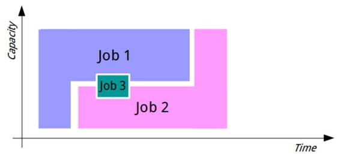
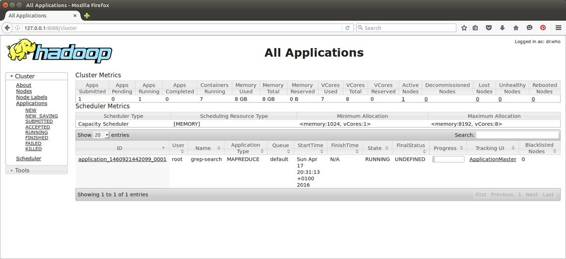
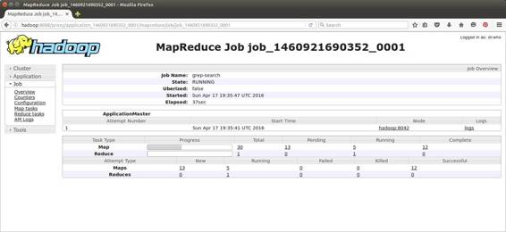

到目前为止，我一直将 Hadoop 的计算部分称为作业调度器，但更准确地说，它应该被称为作业调度器、资源管理器和任务监视器的组合。

计算平台为 Hadoop 版本 2(2013 年发布)进行了重写，资源管理部分从 MapReduce 中抽象出来，这意味着 Hadoop 集群可以运行不同类型的作业，而不仅仅是 MapReduce 程序。新的资源管理器是纱，以 YAML(又一种标记语言)和雅司(又一种网络服务器)的风格命名。

我们将研究纱如何调度和管理作业，因为了解这一点将有助于我们检查长期运行的作业的状态，并致力于优化集群。但是从编程的角度来看，纱是 Hadoop 程序的一个黑盒——您将您的 MapReduce 作业及其配置提交给集群，然后让纱完成剩下的工作。

我们已经看到，在 MapReduce 中，我们需要构建一个定制的映射器、减速器和驱动程序，但是我们不需要构建任何其他东西。我们不需要告诉 Hadoop 如何分解作业或者在哪里运行任务。这一切都是由 MapReduce 框架和纱完成的。

纱线是一个抽象的作业调度器，Hadoop 生态系统已经扩展到充分利用它。在典型的 Hadoop 集群中，Spark 可能会调度标准的 MapReduce 作业，使用 Tez 引擎运行 Hive 查询，并运行 Spark——所有这些都在同一组计算资源上。

正如 HDFS 在存储层提供弹性和可扩展性一样，纱在计算层也提供同样的弹性和可扩展性。一旦一个作业被提交给纱，它可以预期在某一点完成，即使在作业的生命周期内有重复的硬件故障。

纱提供了资源管理器和作业监视器之间的角色逻辑分离，资源管理器决定任务应该在哪里运行，作业监视器报告任务进度。这种分离是 Hadoop 2 中新架构的核心驱动力，因为它允许作业管理任务分布在集群中，这意味着平台可以在更高的规模上运行。

资源管理器是集中式主组件，它通常运行在 Hadoop 集群中与 HDFS 名称节点相同的节点上。资源管理器作为一个服务运行，当它启动一个新的作业时，它会创建一个应用程序主模块——一个负责确保作业(可以是一个 MapReduce 程序或一个交互式 Spark 会话)成功运行的软件组件。

当应用程序主节点有工作要做时，它们会与资源管理器一起请求资源(例如 MapReduce 中的地图任务)，它们还会与节点管理器一起工作，节点管理器是 Hadoop 集群中每个数据节点上的计算服务，以便监控任务。图 9 显示了作业的组件如何在集群中分布。

 9:纱线中的分布式作业组件

任务在数据节点的容器中执行。容器是独立的计算单元，具有固定的 CPU 和内存分配。

|  | 注意:纱容器在逻辑上类似于 Docker 容器，但是到目前为止 Docker 还没有与纱集成，这意味着任务不能被调度为作为 Docker 容器实例运行。 |

当任务容器运行时，它们与应用程序主服务器通信进度，应用程序主服务器与提交作业的客户端通信整体进度。纱线允许容器使用自己的协议进行通信，这允许纱线在不知道框架内部工作的情况下运行不同类型的作业。然而，应用程序主机必须使用纱协议与资源管理器通信。

当所有任务容器都完成时，应用程序主机将向客户端和资源管理器标记整个作业为完成，以便应用程序主机使用的资源可以被释放并用于其他工作。

纱的一个关键特征是，应用程序主机本身运行在一个容器中，该容器可以托管在集群中的任何节点管理器上，这样大型集群的容量就不会受到资源管理器容量的限制(因为应用程序主机分布在集群的工作节点周围)。

## 【MapReduce 如何在纱中工作

我们已经用`hadoop jar`命令行向纱提交了一些 MapReduce 作业。使用该命令，我们所做的就是指定包含我们想要运行的应用程序和我们自己的代码所期望的参数的 JAR 文件。这会将作业提交给运行在名称节点上的资源管理器，资源管理器会检查集群中的容量，并在其中一个数据节点上分配一个容器来运行作业的应用程序主机。

应用程序主机可以在任何数据节点上启动，因此注册过程会返回到资源管理器，然后资源管理器会通知客户端应用程序主机正在哪里运行。从那时起，客户端直接与运行在数据节点上的应用程序主机通信。

应用程序主机启动作业，作业使用自己的框架来确定要执行的计算任务。在我们的字数统计中，MapReduce 框架将生成多个地图任务——每个输入文件一个，一个 Reduce 任务一个。当任务运行时，应用程序主机向资源管理器请求新的容器分配。请求可以具体说明其要求，请求所需的内存和 CPU 数量，甚至是首选节点名或机架名。

如果有可用的容量，资源管理器会识别应用程序应该使用哪个节点管理器，应用程序主节点会直接与该节点通信，以创建容器并启动任务。当任务正在运行时，应用程序主机监视它们，当有更多任务排队等待调度时，应用程序主机继续运行。

如果任何任务失败，应用程序主机将决定如何处理失败。这可能意味着通过对资源管理器的另一次调用来重新安排任务，或者，在多次失败的情况下，这可能意味着将整个作业标记为失败并退出应用程序。在应用程序主机和资源管理器之间的通信失败的情况下，如在数据节点失败的情况下，资源管理器本身可以终止应用程序。

无论应用程序主机如何结束，资源管理器的工作都是整理应用程序的容器分配，以便计算资源可以用于其他容器，例如新的应用程序主机或由另一个应用程序启动的任务容器。

资源管理器是根据需要分配计算资源的核心组件。计算资源是有限的，这意味着可能会有一个时间点无法满足资源请求，而纱有一个可插拔的框架，允许不同的方法来满足请求。这是调度器组件，它是在整个集群级别配置的，目前有三种实现与 Hadoop 捆绑在一起。

最简单的实现是先进先出调度器，它纯粹根据哪个应用程序先请求来分配资源。如果您使用先进先出调度器向 Hadoop 集群提交大型作业，该作业将使用所有可用资源，直到它完成或达到不再需要所有资源的程度。

当应用程序停止请求资源并释放现有资源时，队列中的下一个应用程序将启动。图 10 显示了两个大型作业和一个小型作业如何使用先进先出调度器运行。

 10:使用先进先出调度器的作业处理

使用先进先出调度器，大型作业都按顺序运行，每个作业消耗可用资源，直到完成。然后下一个作业开始并消耗所有可用的资源。如果作业需要的可用计算量少于总计算量，则作业只能并发运行，这实际上只发生在非常小的作业或非常大的集群中。

先进先出调度器很粗糙，但它适用于作业不需要并发运行的情况——例如，具有批处理的小型企业最终必须全部运行，但单个作业没有自己的服务级别协议(SLA)。

其他调度器更复杂，使用显式队列配置来允许多个作业并发运行，并且更可预测地共享集群资源。使用容量调度器，我们可以定义多个队列，并为每个队列分配固定的计算容量。例如，我们可以有一个集群，它有三个顶级队列，分别用于营销、研究和开发，分成 50:30:20。调度程序将确保群集的全部容量都按分配的方式使用，这样，如果一个队列为空，它的计算份额就不会被重新分配，群集也不会得到充分利用。

当队列有未完成的工作时，在队列中使用先进先出策略。通过这种方式，每个部门(或者无论顶层拆分是如何组织的)都有其分配的份额，但是在部门的队列中，大型作业仍然会阻塞集群，并导致较小作业的延迟。图 11 显示了相同的两个大型作业和一个小型作业如何使用容量调度器运行。

 11:使用容量调度程序处理作业

在 Apache Hadoop 中，容量调度器是默认的，但是一些发行版改变了这一点，使用了最后一个选项——公平调度器。公平调度程序试图在所有正在运行的作业之间公平分配集群资源。当单个作业使用公平调度程序运行时，它将获得 100%的集群容量。随着提交的作业越来越多，每个作业都会从原始作业中释放出一部分资源，这样，当第一个作业的任务完成时，它的资源就可以分配给第二个作业，而第一个作业的下一个任务必须等待。

有了公平调度器，我们可以解决确保小作业不会在等待大作业时卡住的问题，同时确保大作业不会因为资源被小作业耗尽而占用过多的运行时间。图 12 显示了两个大型作业和一个小型作业如何在公平调度器下运行。

 12:使用公平调度器的作业处理

公平调度程序还可以按照其公平策略配置分层队列，在队列内和队列之间运行作业。为了支持复杂的共享需求，我们还可以为队列定义固定的分配，在一般的公平策略中有效地赋予它们更高的优先级。

因为纱是一种独立于框架的技术，它不会强制执行任何关于资源看起来像什么或者应该如何使用的概念。在 MapReduce 中，容器是运行特定任务所需的资源。可以分配一个容器，用于在单个文件分割上运行映射程序。通常，我们的目标是让每个映射器在短时间内完成工作并释放资源，一分钟是一个很好的目标。

将它与 Spark 进行比较，在 Spark 中，容器可以用于长时间运行的客户端进程(例如来自 Jupyter 笔记本的用户连接)。在这种情况下，Spark 可以请求一个具有多个内核和几千兆字节内存的资源，并且该单个容器可能会运行几个小时。

在 MapReduce 的情况下，容器运行一个 Java 虚拟机的实例，默认情况下，请求的资源是一个 CPU 内核和 1 GB 的内存。这些都是可配置的，但是请注意，当我们编写映射器和缩减器代码时，它将在一个受限的环境中运行，在这个环境中，每个单独的任务分配给它的资源相对较少。

像 HDFS 一样，各种纱服务包括嵌入式网络服务器，您可以使用它来检查集群上的工作状态。

该用户界面运行在端口 8088 上，因此如果您在 Linux 中使用`hadoop-succinctly` Docker 映像，您可以浏览到`http://127.0.0.1:8088`(或者，如果您已经将 Docker 机器 IP 地址添加到您的`hosts`文件中，您可以浏览到`http://hadoop:8088`)并看到资源管理器用户界面，如图 13 所示。

 13:纱线资源管理器界面

资源管理器的默认视图是显示所有正在运行的作业，并链接到它们各自的应用程序主用户界面。请记住，作业的应用程序主节点作为容器在集群中的工作节点上运行，但是应用程序主节点将进度反馈给资源管理器。当您打开应用程序链接时，您将看到图 14 中的用户界面。

 14:应用主界面

图 14 显示了应用程序运行的工作分解。在这种情况下，是第 2 章的`grep` MapReduce 作业，UI 显示地图数量，按状态减少任务。您可以通过跟踪链接并获得所有任务的列表，然后查看特定任务的日志，来深入了解更多细节，如图 15 所示。

 15:在纱线界面查看任务日志

容器日志是从运行在托管容器的节点上的节点管理器 web 服务器上查看的，这意味着在与资源管理器不同的集群中。在我们的伪分布式 Docker 运行时中，节点管理器运行在同一台机器上，但是它使用标准端口 8042 而不是 8088 作为资源管理器。

有了资源管理器和节点管理器 web 服务器，您还将获得很多关于机器和 Hadoop 设置的细节。您可以查看节点的硬件分配，查看 Hadoop 服务日志，以及从网络用户界面查看指标和配置，这些都值得深入了解。

在这一章中，我们看了 Hadoop 的计算部分，了解了 part 是如何工作的，以及 Hadoop 中资源协商的关键部分。纱线是一个通用的作业调度器，支持不同的应用程序框架——主要是 MapReduce，但也支持较新的应用程序类型，如 Spark 和 Tez。纱允许应用程序请求资源，它将满足基于集群的容量，它让应用程序决定他们需要哪些资源。

纱的灵活性和可扩展性来自于主/从框架和关注点的分离。在主节点上，资源管理器的角色是接受来自客户端的作业请求，通过分配应用程序主节点来启动作业，以及响应来自正在运行的应用程序的资源请求。

应用程序主控在资源容器中运行(不是 Docker 容器！)放在数据节点上，这样，纱中的管理开销就分布在整个集群中。当请求资源时，可以将纱配置为使用各种调度策略，这意味着您可以将集群设置为使用基本的先进先出策略、固定容量策略或公平策略，在活动作业之间尽可能公平地共享计算。

我们还简要地注意到，纱资源管理器和节点管理器服务嵌入了网络服务器。网络用户界面告诉我们许多关于集群中节点的信息以及它们所做的工作，这意味着它们对管理和故障排除很有用。

现在我们对 Hadoop 的工作原理有了更好的理解，接下来我们将看看 MapReduce 的替代编程选项。