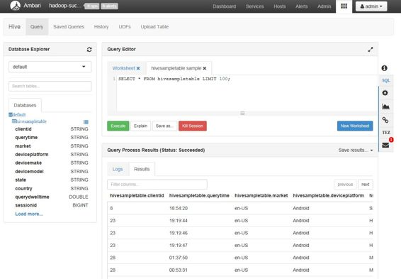

我们不能完全讨论 Hadoop 而不提到生态系统。因为 Hadoop 是一个开源平台，具有很大的潜力和相对较少的缺点，所以围绕它发展了一个庞大的社区，扩展了 Hadoop 的范围和功能。生态系统包含不同领域的各种技术，在本电子书的最后一章中，我们将了解一些主要的技术。

生态系统中的大多数技术都包含核心 Hadoop 平台，堵塞漏洞或提供替代工作方式，但其中少数技术使用 Hadoop 的核心功能来支持完全不同的方法。我们将看到的所有工具都是开源的，通常有大量的社区追随者，加上企业的大量投资。

虽然 Hadoop 是一个强大而灵活的平台，但很少单独使用。使用生态系统中的工具增强 Hadoop 为基本主张增加了价值，使您的集群及其工作负载更易于管理，或者让您更快、更轻松地访问数据。

虽然从头开始安装 Hadoop 并不是一项令人生畏的任务，但建立多节点集群要复杂得多，而且它为扩展提供了更大的表面积。如果您决定将 Hive 或 Spark 添加到您的集群中，那么当您有 10 个数据节点要部署并保持同步时，这并不是小事。Ambari 是解决这个问题的管理控制台，还有更多。

Ambari 是一个网络应用程序，旨在为您的 Hadoop 集群提供单一访问点。它有一个可扩展的体系结构，具有不断增长的组件库，提供管理、监控和使用集群的功能。除了提供 web 视图，它还公开了一个 REST API，用于自动访问您的集群。

在管理领域，安巴里负责所有主要任务:

*   Hadoop 配置:无需接触服务器上的 XML 文件，即可查看和编辑配置设置。
*   集群设置:您可以在集群中添加和删除节点，停止和启动服务，以及进入维护模式。
*   组件部署:您可以添加和删除打包的组件，如 Hive。
*   组件配置:您可以使用与 Hadoop 配置相同的方式查看和编辑已安装组件的设置。

图 22 显示了 Ambari 中的添加服务向导，您可以轻松地将生态系统中的其他组件添加到集群中。


 22:使用 Ambari 添加服务

为了进行监控，Ambari 从集群中的所有节点和所有已运行的作业中收集统计信息。您可以查看和深入查看显示 CPU、内存、磁盘和网络使用情况以及所有已知 HDFS 和纱节点的计数及其状态的图表。

图 23 显示了 Ambari 主屏幕，其中总结了集群的运行状况和状态。


 23:安巴里主屏幕

在使用方面，安巴里拥有与生态系统其他部分相集成的视图。Pig 和 Hive 是 Hadoop 中查询数据的两种替代方式，Ambari 为每种方式都提供了视图，允许您提交查询并查看结果，还提供了保存您已经运行的查询的视图，以便您以后可以再次加载它们。

图 24 显示了 Hive 视图，其中有一个模式导航器、一个用于编写查询的输入窗格和一个显示查询结果和日志的输出窗格。



 24:安巴里的蜂巢景观

随着 Hadoop 越来越受欢迎，越来越多的用户接触到 MapReduce，并开始感受到编写多个 Java 类来访问他们的数据的痛苦，即使对于简单的用例也是如此。

尽管 MapReduce 功能强大，但它是一项复杂的技术，需要多个学科的合作——分析师定义期望的结果，工程师构建程序，测试人员验证代码，等等。

Java MapReduce 应用编程接口的最早替代品是 Pig，这是一种用于构建 MapReduce 查询的简化领域特定语言(DSL)。尽管 Pig DSL(称为 Pig 拉丁语)是一种新的语言，但它是一种最小的语言，来自不同学科的新用户可以在几个小时内使用它进行生产。代码清单 37 显示了一个示例 Pig 查询。

 37:猪拉丁文的匹配行数

```java
  lines = LOAD 'input ' USING
  PigStorage() AS (line);
  matching = FILTER lines BY line
  MATCHES '.*dfs.*'; 
  match_groups = GROUP matching BY
  line;
  word_count = FOREACH match_groups
  GENERATE matching as line, COUNT(matching);  
  STORE word_count INTO 'output5';

```

这个查询非常类似于第 2 章中的自定义 MapReduce 作业——使用`LOAD`语句读取一组输入文件，使用`FILTER`查找包含字符串“dfs”的行，然后使用`GROUP`和`GENERATE COUNT`语句计算出现的次数。`STORE`语句指定了结果应该写在哪里。

Pig 脚本包含更少的代码，更容易阅读，并且不需要 Java IDE 来处理、构建或打包查询。您可以交互运行 Pig，逐行构建查询，或者提交整个脚本进行批处理执行。

您可以使用 Pig 命令行(或使用 Ambari Pig 视图)执行 Pig 查询，Pig 引擎将根据您的查询构建一个 Java MapReduce 程序，并将其提交给集群。就纱和 HDFS 而言，这是一个标准的 MapReduce 作业，它以与普通 Java 作业相同的方式运行。

Pig 通常是新 Hadoop 用户拿起的第一个工具——它很好地理解了 MapReduce 的结构，而没有 Java API 的复杂性。Pig 的范围是有限的，这意味着您可能需要为复杂的作业构建定制的 MapReduce 程序。但是对于简单的工作，Pig 显著降低了进入门槛。

Pig 的下一步是 Hadoop 上的 SQL 框架，它允许您使用类似 SQL 的语言在 Hadoop 中查询数据。Hadoop 的开放特性确实导致了一个缺点——竞争技术出现在同一个空间，很难在它们之间进行选择。Hadoop 上的 SQL 空间是一个很好的例子，因为有几个成熟且功能完善的替代方案，包括 Impala(来自 Cloudera)、HAWQ(来自 Pivotal)和 Apache Hive。

我将在这里重点介绍 Hive，因为它拥有大量用户，正在持续开发中，并且是 Spark 支持的类似 SQL 的语言。

Hadoop 中的数据差异很大，但多组数据往往具有相似的特征。包含 web 服务器日志的文件夹可能有不同内容的文件，但它们可能都是以制表符分隔的文本文件，每个文件中都有许多关键字段。使用 Hive，通过以类似于关系数据库的方式定义表，您可以在您的 Hadoop 数据上强加一种结构。

Hive 表定义指定了 Hadoop 中数据的来源、文件包含的列名和数据类型以及映射配置，这样 Hive 就知道如何将原始数据转换为行。为了在 Hive 中运行我们的 MapReduce 查询，我们首先需要创建一个表来表示输入文件夹中的文件。代码清单 38 显示了一个例子。

 38:创建表格的 HiveQL

```java
  CREATE EXTERNAL TABLE input(line
  STRING)
  STORED AS TEXTFILE
  LOCATION '/user/root/input'

```

接下来，我们可以用 HiveQL 查询该表，这是一种类似 SQL 的语言，非常接近 SQL-92 的兼容性。为了计数包含字符串匹配的行，我们可以使用类似代码清单 39 的查询。

 39:查询表的 HiveQL

```java
  SELECT COUNT(*) FROM input WHERE
  line LIKE '%dfs%'

```

与 Pig 类似，Hive 包含一个编译器，它从 HiveQL 构建一个 MapReduce 程序，这样集群实际上执行一个正常的 MapReduce 作业。Hive 非常适合在数据领域的主要领域建立数据仓库，它还有很多值得研究的地方。

Syncfusion 曾简洁地发表过[*Hive*](https://www.syncfusion.com/resources/techportal/details/ebooks/Hive-Succinctly)(也是我写的)，其中对技术的涵盖更为详细。

HBase 不同于我们已经介绍过的其他工具，因为它没有扩展 Hadoop——它是一种替代的大数据技术，以 Hadoop 为基础。HBase 是一个实时大数据存储，它使用 HDFS 存储数据，因此无需从头开始构建即可获得存储层的所有可扩展性和可靠性。

我们像使用 NoSQL 数据库一样使用数据库。有表格和行，但行内的单元格不属于固定列。相反，每个表都有一个或多个列族，列族就像一个哈希表——一行可能有一个包含 1，000 列的列族，而同一表中的另一行只有一列。

HBase 具有巨大的可扩展性。它能够存储具有数十亿行和数百万列的表。它可以提供实时访问，因为每一行都有一个唯一的键，并且 HBase 使用高效的索引存储格式来快速按键查找行。HBase 也采用主/从架构，但不使用纱。

HDFS 使用名称和数据节点以正常方式运行，但 HBase 有自己的服务流程。因为 HBase 的要求和访问模式不同，所以它通常有一个专用集群，节点不用于批处理。

生态系统的其他部分与 HBase 集成，因此我们可以在 Hive 中映射 HBase 表，并使用 HiveQL 查询它们，这意味着我们可以使用 Ambari Hive 视图来查询 HBase 表。HBase 还使用另一项核心 Apache 技术—Zookeeper—作为节点之间的集中配置和警报系统。

Syncfusion 在 HBase 上也有一个专门的标题——同样是我写的——[*HBase 简洁地*](https://www.syncfusion.com/resources/techportal/details/ebooks/hbase) 。

Spark 是大数据领域的新大事件。它是一系列技术的集合，让您能够以新的方式处理大数据——有一个 SQL 引擎、一个机器学习组件、一个流接口和一个专用的图形组件。Spark 使用称为弹性分布式数据集(RDDs)的显式数据单元。通常，在 RDD 上建立一个工作链，可能包括转换或经典的 MapReduce 模式，然后在需要结果时执行 RDD。

与 MapReduce 更复杂的作业拆分方法相反，在 MapReduce 中，工作被封装为有向无环图(DAG)，RDD 执行使用多个可以并发执行的部分。Spark 在执行任务时将数据移动到内存中，常用的数据可以显式缓存在内存中——这意味着 Spark 速度很快。

执行速度和功能广度正在推动 Spark 成为大数据的首选工具包，但 Spark 仍然植根于 Hadoop。Spark 可以部署在一个共享的 Hadoop 集群上，Spark 查询 HDFS 的数据，Spark 作业可以在 YARN 上执行，这使得我们可以在同一个集群中运行 MapReduce 和 Spark 作业，并使用调度器对工作进行优先排序。

Spark 被采用的一个关键因素是，它支持通过 Jupyter 等笔记本进行交互式查询。这允许对数据集进行快速、探索性的分析，这样您就可以在一个小的、缓存的数据集上快速迭代查询，直到得到您想要的结果，然后您可以将整个数据集的作业提交给纱。

Syncfusion 的库中也覆盖了 Spark，其中有 Marko valjek 编写的 [*Spark 简洁地*](https://www.syncfusion.com/resources/techportal/details/ebooks/spark) 。

对 Hadoop 生态系统的快速浏览结束了这本电子书。我们研究了一些扩展 Hadoop 或将其用作核心平台的关键技术，大多数大数据之旅都将包含一个或多个这些工具。

如果你即将开始你的旅程，你想知道你应该看哪些工具，这里有一个建议的路线图。从`hadoop-succinctly` Docker 容器和一些简单的 MapReduce 程序开始，以便很好地感受集群在实践中是如何运行的，并了解如何监控集群正在做什么。

接下来，转到使用 Ambari 的新安装，它可以是单个节点，这样您就可以轻松地添加组件，并查看集群服务是如何在 Ambari 中出现的。如果你有变化很大的数据，Pig 是 MapReduce 的一个有用的替代品，如果你想提供一个分析师可以使用的数据仓库，Hive 是一个很好的技术(对于非工程师来说，掌握 HiveQL 比学习 Java 容易得多)。

查看 Spark 的一个很好的时机是，您可以从不同的引擎运行查询，监控作业进度和集群的运行状况，并可能扩展集群以添加新节点。尽管您可能会发现自己长期以来只使用 Spark，但从对 Hadoop 的扎实理解开始肯定会有所帮助。