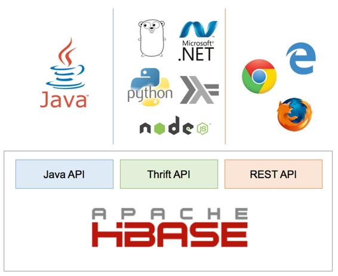
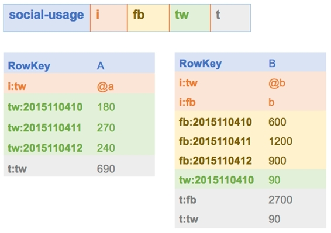

HBase 是一个 NoSQL 数据库，可以在单台机器上运行，也可以在一组服务器上运行，以提高性能和容错能力。它是为扩展而构建的—HBase 表可以存储数十亿行和数百万列—但与其他面向批处理的大数据技术不同，HBase 提供实时数据访问。

有几个关键概念使 HBase 不同于其他数据库，在本书中，我们将了解所有关于行键结构、列族和区域的知识。但是 HBase 使用了与其他数据库设计相同的基本概念，所以很容易理解。

HBase 是来自 Apache 基金会的免费开源软件。这是一项跨平台技术，因此您可以在 Windows、Linux 或 OS/X 机器上运行它，并且云中有来自亚马逊网络服务和微软 Azure 的托管 HBase 解决方案。在本书中，我们将使用最简单的选项——在 Docker 容器中运行 HBase。

您可以使用许多客户端选项连接到 HBase，如图 1 所示。Java 应用编程接口是一流的公民，但是有了节俭和休息应用编程接口，你几乎可以连接任何语言和平台。我们将在本书中介绍所有三个 API，以及随 HBase 附带的命令行界面。



 1:糖化血红蛋白应用编程接口和客户端平台

HBase 是一个非常灵活和强大的数据库，它集成了广泛的技术，并支持许多不同的用例。HBase 利用 Hadoop 分布式文件系统在存储层实现高可用性，但提供了实时界面，因此它对事务系统和大数据问题都很有用。

在生产系统中，HBase 比许多数据库有更复杂的基础架构要求—有三个服务器角色(Zookeeper、Master 和 Region Servers)，为了可靠性和性能，每个角色都需要多个节点。有了设计良好的数据库，您只需添加更多的服务器就可以扩展 HBase，并且永远不需要归档旧数据。

HBase 是一个 Java 系统，可以在开发和测试环境中以简化的模式运行，因此您的非生产环境可以是适度的。您可以将数据库容器化，这有助于在构建过程中进行简单的端到端测试，并为代码提供高水平的质量保证。

HBase 的灵感来自谷歌的 Big Table，这是一种用于网络索引的存储技术。该体系结构满足了对特定项目的实时随机访问需求，在数据库中有万亿字节甚至千兆字节的数据。在具有数亿行的 HBase 表中，您仍然可以预期对单个行的亚秒级访问。

HBase 中的表是部分结构化的；它们不像 SQL 数据库那样有一个严格的模式，其中每一列都有一个数据类型，但是它们有一个松散的模式，其中定义了数据的一般结构。在 HBase 中，您可以根据列族定义一个表，该表可以包含许多列。

在 HBase 中，表是相似数据的集合，表包含行。每一行都有一个唯一的标识符(行键)以及为表定义的列族中的零个或多个列。列族是动态的，因此包含数据的实际列可能因行而异。

表 2 显示了一个名为 social-usage 的 HBase 表的模式，该表记录了人们花在社交网络上的时间。结构非常简单，只包含一个表名和一个列族名列表，这是所有 HBase 需要的:

表 1:糖化血红蛋白酶的表结构

| 表名 | 社交用法 |
| 柱族 | 我 |
|  | 消防队（firebrigade） |
|  | tw |
|  | t |

该表将为每个用户记录一行，列族具有神秘的名称。列名是与每一行一起存储和传输的数据的一部分，因此它们通常保持很短。

这是柱族的用途:

i =标识符，不同社交网络的用户标识

fb =脸书，记录用户的脸书活动

tw = Twitter，记录用户的 Twitter 活动

t =总计，用户活动的总和

图 2 显示了该表的两个示例行，适用于具有非常不同的使用配置文件的用户:



 2:糖化血红蛋白样本行

我们可以从这两行中看到 HBase 的威力，这两行从一个非常简单的表模式中告诉我们一个巨大的数量。左边一行的用户 A 有一个推特账号，经常使用，但不在脸书。右边一行的用户 B 拥有这两个网络的帐户，但在脸书花费的时间要多得多。

列族就像哈希表或字典。对于每一行，列族可以包含许多值(称为单元格)，这些值按名称(称为列限定符)进行键控。表中可用的列族是固定的，但是您可以动态地向行中的列族添加或删除单元格。

这意味着列限定符可以用作数据存储，也可以用作单元格值。在示例中的 fb 列族中，一行有一个限定符为 fb:2015110410 且值为 600 的单元格。HBase 并不限制如何命名限定词，因此在本例中，我使用的是日期周期—格式为*年*、*月*、*日*、*小时*—单元格值以秒为单位记录该小时内的总使用量。

对于用户 B 来说，脸书使用列系列告诉我们，他们在 2015 年 11 月 4 日<sup class="calibre21">10:00 到 11:00 之间在脸书花费了 10 分钟(单元格值为 600 秒)，在 11:00 到 12:00 之间花费了 20 分钟。没有限定符为 fb:2015110409 的单元格，它告诉我们用户在 09:00 到 10:00 之间不在脸书。</sup>

HBase 非常灵活，但访问数据的主要方式是通过行键，因此表的设计对解决方案的性能至关重要。在社交使用表中，我们为每个用户存储一行，对于每个报告期，我们将向列族添加更多单元格。

这被称为**宽表**设计——我们有(相对)少量的行，但是行可能有很多列。如果我们记录每小时的使用情况，那么对于活跃用户，我们可以每周添加 98 个单元格(一周的每个小时一个单元格)。几年后，我们将为该用户的行提供数万个单元格，这对于 HBase 来说不是存储问题，但对于我们来说可能很难有效使用。

如果我们想要对用户在某个特定月份的活动进行求和，我们需要读取该行，并通过按列限定符名称过滤结果来仅包括该月的单元格。对于 HBase 来说，基于列的过滤比基于行的过滤要贵得多，因此一种替代设计是使用**高的表格**设计。

高表格的行数较多，而每一个表格的列数较少。我们可以为每个用户的每个期间设置一行，而不是为每个用户设置一行，这将为我们提供图 3 中的数据:


 3:高桌设计

现在，该行包含一个用户名和一个句点，这是数据的日期。列名要短得多，因为我们只在列名中捕获小时，并且行中的所有数据都是同一日期的。对于活跃用户，我们每行只有几十列，几百行可以记录一整年的数据。

这个设计使用了一个复合行键，格式为{*userID*} | {*period*}，所以如果我们想对一个用户一段时间的使用情况进行求和，我们可以通过行扫描来完成，这是一个比列过滤器便宜得多的操作，这两个我们稍后会看到。

注意:您需要设计 HBase 表来支持您期望的数据访问模式，但是通常高表比宽表更可取。

代码清单 1 显示了创建社交使用表的数据定义语言语句。它包含您需要的最小数量—表名，后跟列族名:

代码清单 1:创建 DDL 语句

```java
          create 'social-usage', 'i', 'fb', 'tw', 't'

```

HBase 中的模式定义故意模糊。没有指定行键和列限定符的格式，也没有数据类型。

使用表的约定在模式中并不明确，事实上我们可以对宽表(仅使用用户标识作为行键)或高表(使用用户标识和句点作为行键)使用完全相同的模式。

HBase 中没有数据类型；所有数据都存储为字节数组—单元格值、列限定符和行键。一些 HBase 客户端在它们的界面中实现了这一点；其他人将细节抽象化，并将所有数据公开为字符串(因此客户端库对来自 HBase 的字节数组进行编码和解码)。

代码清单 2 显示了当您通过将字节数组解码为字符串的 HBase Shell 访问社交使用表中的一行时，它是什么样子的。代码清单 3 通过 REST API 显示了同一行，它将原始字节数组公开为 Base64 编码的字符串:

代码清单 2:用糖化血红蛋白外壳读取数据

```java
          hbase(main):006:0> get 'social-usage', 'A|20151104'
          COLUMN                CELL                                                     
           tw:10                timestamp=1447622316218, value=180                       
          1 row(s) in 0.0380 seconds

```

代码清单 3:用 REST API 读取数据

```java
          $ curl -H Accept:application/json http://127.0.0.1:8080/social-usage/A%7C20151104
          {"Row":[{"key":"QXwyMDE1MTEwNA==","Cell":[{"column":"dHc6MTA=","timestamp":1447622316218,"$":"MTgw"}]}]}

```

请注意，行键必须在 REST 调用中进行 URL 编码，并且 JSON 响应中的所有数据字段都是 Base64 字符串。

如果您只使用一个客户端，那么您可以以平台的本机格式存储数据。代码清单 4 显示了如何将 Java 中的一个十进制值(1.1)保存到 HBase 中的一个单元格中:

 4:将类型化数据存储在数据库中

```java
          Put newLog = new Put(rowKey);
          newLog.addColumn(family, qualifier, Bytes.toBytes(1.1));
          access_logs.put(newLog); 

```

如果您使用许多客户端，这可能会导致问题，因为不同平台的本机类型编码不同。如果您使用. NET 客户端读取该单元格，并尝试将字节数组解码为. NET 十进制值，它可能与您在 Java 中保存的值不同。

提示:如果您在跨平台解决方案中工作，最好将所有值编码为 UTF-8 字符串，以便任何客户端都可以从 HBase 解码字节数组并获得相同的结果。

我们将在本介绍中介绍的 HBase 的最后一个特性是，单元格值可以进行版本控制—每个值都存储有一个记录上次更新时间的 UNIX 时间戳。一个单元格可以有多个版本，具有相同的行关键字和列限定符，不同的时间戳记录该版本数据的当前时间。

HBase 客户端可以获取最新的单元版本，或最近的 X 版本，或特定日期的最新版本。当您更新单元格值时，您可以指定一个时间戳或让 HBase 使用当前服务器时间。

单元格版本的数量是在列族级别指定的，因此不同表中的不同族可以有不同的设置。在最近版本的 HBase 中，默认版本号是 1，所以如果需要数据版本控制，需要在 DDL 中明确指定。

对于单一版本的列族，对单元格的任何更新都会覆盖现有数据。在多个版本中，单元格值像后进先出堆栈一样存储。当您读取单元格值时，您将获得最新版本，如果您更新的单元格已经具有最大版本数，则最旧的版本将被删除。

在这一章中，我们概述了什么是 HBase，它如何逻辑地存储数据，以及它提供的功能。在下一章中，我们将看到如何启动并运行一个本地的 HBase 实例和 HBase Shell。