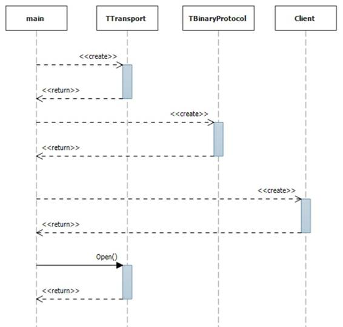

HBase 非常适合跨平台的解决方案，而节俭 API 是 Java API 的替代。节俭是 Apache 的通用 API 接口，支持从不同语言到 Java 服务器的客户端连接。我们将在本章中使用 Python，但是您可以使用任何带有节俭绑定的语言(包括 Go、C#、Haskell 和 Node)。

节俭应用编程接口是一个外部接口，所以它需要一个额外的 JVM 来运行。您可以用 HBase 守护程序脚本 hbase-daemon 启动它。它可以独立于其他 HBase 集群托管，也可以在区域服务器上运行。节俭没有本机负载平衡器，但传输是 TCP，所以您可以使用外部负载平衡器(如 HAProxy)。

默认情况下，节俭服务器监听端口 9090，并且它已经在简洁的 Docker 映像上运行。

节俭比 REST 更轻量级，因此它可以提供更好的性能，但它并不那么用户友好。要使用节俭应用编程接口，在大多数情况下，您需要从源构建节俭，从公共生成到应用编程接口的绑定。描述接口的节俭文件，然后为您的客户端应用导入节俭传输和绑定。

注意:节俭原料药记录在。节俭档案。该文件没有附带 HBase 二进制文件，因此您需要从源代码中获取正确的版本。对于版本 1.1.2，文件在 GitHub [这里](https://github.com/apache/hbase/blob/cc2b70cf03e3378800661ec5cab11eb43fafe0fc/hbase-thrift/src/main/resources/org/apache/hadoop/hbase/thrift2/hbase.thrift)上。

从生成的代码。节俭定义文件包含以相对较低的级别使用节俭服务器的类。图 4 显示了连接到服务器的顺序:



 4:节俭连接到糖化血红蛋白

首先，您需要创建一个 TTransport 实例，然后使用传输创建一个 TBinaryProtocol 实例。然后，您可以使用该协议创建一个 HBase 客户端，并打开传输来启动连接。节俭提供了许多功能，并受益于广泛的平台覆盖范围，但在使用中，客户端可能会很麻烦，并且需要大量代码来完成简单的任务。

用你想用的语言为节俭寻找一个社区包装是值得的。在这一章中，我将使用 Python 的 HappyBase 库，这是一个处理绑定生成和导入的节俭包装器，并且还公开了一个比原始节俭版本友好得多的客户端应用编程接口。

您需要在您的环境中安装 HappyBase。它在 Python 包索引上公开可用，因此假设您已经有了 Python 和 Pip(Python 包管理器)，您可以使用代码清单 35 中的命令安装它:

 35:安装 HappyBase Python 包

```java
          $ pip install happybase

```

现在，您可以启动 Python，并通过使用 import happybase 导入 HappyBase 包来设置所有依赖项。HappyBase 旨在以类似 Python 的方式公开 HBase 特性，因此在代码清单 36 中，我们创建了一个连接对象，它将自动连接到本地运行的 HBase 节俭服务器:

 36:使用 HappyBase 连接到 HBase

```java
          >>> connection = happybase.Connection('127.0.0.1')

```

连接对象是节俭连接的起点。从连接对象中，您可以访问用于 DDL 和 DML 语句的表对象，并获得用于批处理数据更新的批处理对象。

HappyBase 让 HBase 交互变得非常简单。在连接上使用 table()方法获取 Table 对象，并且可以在表上使用 row 方法读取单个单元格、列族或整行。结果在字典中返回；代码清单 37 显示了为行、列族和单元格返回的值:

 37:用 HappyBase 读取行

```java
          >>> table = connection.table('access-logs')
          >>> print table.row('elton|jericho|201511')
          {'t:1106': '120', 't:1107': '650'}
          >>> print table.row('elton|jericho|201511', ['t'])
          {'t:1106': '120', 't:1107': '650'}
          >>> print table.row('elton|jericho|201511', ['t:1106'])
          {'t:1106': '120'}

```

还可以通过向 rows()方法提供一个键列表来读取多行，该方法返回一个包含每行元组的列表。元组包含行关键字和列值字典，如代码清单 38 所示，其中返回两行:

 38:用 HappyBase 读取多行

```java
          >>> print table.rows(['elton|jericho|201511', 'elton|jericho|201510'])

          [('elton|jericho|201511', {'t:1106': '120', 't:1107': '650'}), ('elton|jericho|201510', {'t:2908': '80'})]

```

键列表是一组明确的键，而不是范围的起点和终点(为此，您需要一个扫描仪，我们将在下一节中使用)。如果您请求的密钥不存在，那么它不会在响应中返回。如果您请求的密钥都不存在，那么您将得到一个空列表。

rows()方法还允许按列族或列进行筛选；如果您为行关键字列表中的某一行请求不存在的列，则该行不会在响应中返回。在代码清单 39 中，请求来自两行的 t:1106 列，但是只有一行有该列，所以没有返回另一行:

 39:从多行中筛选出具有 HappyBase 的列

```java
          >>> print table.rows(['elton|jericho|201511', 'elton|jericho|201510'], ['t:1106'])
          [('elton|jericho|201511', {'t:1106': '120'})]

```

row()和 row()方法可以包含一个选项来返回响应中每个单元格的时间戳，但是如果一个表在一个列族中有多个版本，这些方法只返回最新的版本。

要从一列中读取多个版本，HappyBase 有 cells()方法，该方法使用一个行键和列名，以及要返回的版本数(也可以选择数据的时间戳)，如代码清单 40 所示:

 40:用 HappyBase 读取多个单元格版本

```java
          >>> versionedTable = connection.table('with-custom-config')
          >>> print versionedTable.cells('rk1', 'cf1:data', 3)
          ['v2', 'v1', 'v0']

          >>> print versionedTable.cells('rk1', 'cf1:data', 3, include_timestamp=True)
          [('v2', 1447399969699), ('v1', 1447399962115), ('v0', 1447399948404)]

```

cells()方法按时间戳降序返回单元格版本。

对于具有计数器列的行，数据将在 row()和 cells()方法中返回，但采用不友好的十六进制格式。HappyBase 还包括一个 counter_get 方法，用于将计数器列的当前值作为长整数读取。

代码清单 41 显示了读取计数器列的不同结果:

 41:用 HappyBase 读取计数器列

```java
          >>> counterTable = connection.table('counters')
          >>> print counterTable.row('rk1')
          {'c:1': '\x00\x00\x00\x00\x00\x00\x00\x01'}

          >>> print counterTable.counter_get('rk1', 'c:1')
          1

```

Table 对象有一个 scan()方法，用于在区域服务器上创建一个扫描器，您可以在客户端上迭代该扫描器。您可以用与 HBase Shell 相同的方式使用扫描，传递开始和停止行来定义边界，如代码清单 42 所示:

 42:用 HappyBase 扫描行

```java
          >>> access_logs = connection.table('access-logs')
          >>> scanner = access_logs.scan('elton|jericho|201510', 'elton|jericho|x')
          >>> for key, data in scanner:
          ...     print key, data
          ...
          elton|jericho|201510 {'t:2908': '80'}
          elton|jericho|201511 {'t:1106': '120', 't:1107': '650'}

```

scan()方法有一些友好的补充。您可以传递一个行键前缀，而不是开始行和结束行，HappyBase 为您设置边界；您还可以传递列族名或列名的列表来限制响应中的数据，如代码清单 43 所示:

 43:通过前缀 HappyBase 扫描行

```java
          >>> scanner = access_logs.scan(row_prefix='elton|jericho|', columns=['t:1106'])
          >>> for key, data in scanner:
          ...     print key, data
          ...
          elton|jericho|201511 {'t:1106': '120'}

```

Scan 返回一个可迭代对象，您可以将其作为单个结果集循环，尽管 HappyBase 实际上会从节俭中成批读取结果。您可以指定一个 batch_size 参数来调整扫描仪的读数；这默认为 1，000，这是一个合理的假设，有利于大批量而不是多次读取。

如果您使用的是宽表或大单元格，则可能需要减小批处理大小以提高整体性能。如果从多行中读取小单元格值，则较大的批量可能更好。

节俭支持在区域服务器上运行的带有过滤器的扫描仪。扫描器从提供的行键边界有效地读取行，过滤器只提取您想要返回的行或列。

HappyBase 允许您在 scan()方法中从客户端创建过滤的扫描仪。这是 HappyBase 不抽象复杂性的一个领域，您必须将过滤器构造为字符串，这与节俭应用编程接口过滤器语言一致。

筛选器字符串的一般格式是{筛选器名称}({参数})。代码清单 44 显示了一个过滤器，它只返回扫描中值以前缀“11”开头的行:

 44:扫描和过滤带有 HappyBase 的行

```java
          >>> access_logs = connection.table('access-logs')
          >>> scanner = access_logs.scan('elton|jericho|201510', 'elton|jericho|x', filter="ColumnPrefixFilter('11')")
          >>> for key, data in scanner:
          ...     print key, data
          ...
          elton|jericho|201511 {'t:1106': '120', 't:1107': '650'}

```

提示:节俭应用编程接口在 HBase 在线文档中有很好的记录，您需要提供的可用过滤器和参数在这里有所介绍。

HappyBase 表对象上的 put()方法的工作方式很像 HBase Shell 中的 put 命令，它获取行键、列名和值。使用 HappyBase，您可以用一条语句更新和插入多个单元格值，传递一个*键:值*对的字典，如代码清单 45 所示:

 45:用 HappyBase 更新数据

```java
          >>> access_logs.put('elton|jericho|201511', {'t:1309':'400', 't:1310':'200'})
          >>> print access_logs.row('elton|jericho|201511', ['t:1309', 't:1310'])
          {'t:1310': '200', 't:1309': '400'}

```

put()方法仅限于单个行，但是 HappyBase 为批处理更新提供了一个有用的机制。这是 HBase 客户端的一个常见要求，尤其是在事件流应用中，您每秒可能会收到数百甚至数千个要在处理器中缓冲的事件。

HappyBase 中的 Batch 类允许您这样做，而无需编写定制代码来维护挂起更新的缓冲区。您可以从表中创建批处理对象，并在上下文管理器块中使用它。当块结束时，在批处理上调用 send()方法，该方法将所有更新发送到节俭服务器，如代码清单 46 所示:

 46:用 HappyBase 批量更新数据

```java
          >>> with access_logs.batch() as batch:
          ...     batch.put('elton|jericho|201512', {'t:0110':'200'})
          ...     batch.put('elton|jericho|201512', {'t:0210':'120', 't:0211':'360'})
          ...
          >>> print access_logs.row('elton|jericho|201512')
          {'t:0211': '360', 't:0210': '120', 't:0110': '200'}

```

批处理类上的 put 方法与 Table 类上的 put 方法具有相同的签名，因此每次 put 都可以对一行进行一次或多次更新。

注意:批处理由节俭 API 支持，因此当发送一批更新(在本机节俭 API 中称为突变)时，这是在对节俭连接的单次调用中完成的。

节俭还支持递增计数器列，这可以在 HappyBase 中用 counter_inc 方法实现，可选地提供一个增量，如代码清单 47 所示:

 47:用 HappyBase 递增计数器

```java
          >>> counterTable.counter_get('rk1', 'c:1')
          1
          >>> counterTable.counter_inc('rk1', 'c:1')
          2
          >>> counterTable.counter_inc('rk1', 'c:1', 100)
          102

```

请注意，counter_inc 方法在应用增量后返回单元格值，这与 put()方法不同，后者没有返回值。

在本章中，我们看了 HBase 的主要外部应用编程接口，即节俭服务器。节俭可以在区域服务器上运行，并为 Java 应用编程接口提供了一个功能齐全的替代方案。您用自己喜欢的语言生成一个节俭客户端，然后在本地使用这些类。

节俭客户端应用编程接口在较低的级别上运行，在许多语言中有社区包装器，使通用的节俭类更容易使用，并在平台中给它们一种更本地的感觉。我们使用了 HappyBase 库，它是 Python 客户端的包装器。

节俭提供了读取、扫描和写入数据所需的所有关键功能——所有这些都整齐地包装在 HappyBase 中，以提供直观的界面。您可以按键提取行，选择要返回的列，还可以使用服务器上应用的更复杂的筛选器扫描一组行。

您可以单独或批量写入单元格值，对于多行更新，节俭支持批处理接口，允许从单个服务器调用进行多次更新。节俭还支持计数器列，所以你可以用 HappyBase 读取和增加计数器。

节俭最大的缺点是开始使用节俭客户端，并为 HBase 生成语言绑定。如果您的首选语言中没有友好的包装器，那么安装工作将会非常繁重。

在下一章中，我们将看看 HBase 的另一个外部应用编程接口 REST 应用编程接口——星际之门。这提供了通过 HTTP 访问 HBase 数据，因此它提供了更简单的跨平台体验，尽管没有节俭提供的所有功能。