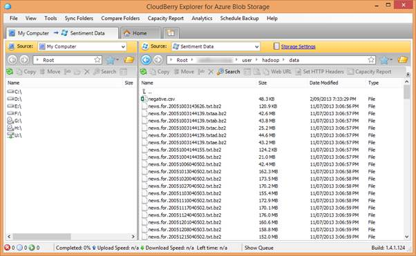

# 五、HDInsight 和 Windows Azure 存储 Blob

## 将数据加载到天青 Blob 存储中

Hadoop 的 HDInsight 实现可以参考 Windows Azure 存储 Blob(wamb)，它在 Azure Blob 存储上提供了功能齐全的 Hadoop 分布式文件系统(HDFS)。[<sup>【6】</sup>](12.html#_ftn6)这将数据与计算节点分开。这与 Hadoop 的一般原则相冲突，即为了减少网络流量而将数据移动到计算中，这通常是一个性能瓶颈。WASB 避免了这一瓶颈，因为它通过快速 Azure 平面网络存储(也称为“Quantum 10”(Q10)网络架构)从 Azure Blob Storage 流式传输数据，从而确保了高性能。[<sup>【7】</sup>](12.html#_ftn7)

这允许您将数据存储在便宜的 Azure Storage 上，而不是将其维护在明显更贵的 HDInsight 群集计算节点的存储上。它还允许在启动集群之前上传数据的过程相对较慢，并允许在关闭集群后保持输出。这使得计算组件真正具有过渡性，并将与计算相关的成本与存储相关的成本分开。

然后，任何 Hadoop 进程都可以引用 WASB 上的数据，默认情况下，HDInsight 将其用于所有存储，包括临时文件。使用 WAMS 的能力不仅适用于基本的 Hadoop 函数，还扩展到更高级别的语言，如 Pig 和 Hive。

将数据加载到 Azure Blob 存储中可以通过许多工具来实现。其中一些列举如下:

| 名字 | 图像使用者界面 | 自由的 | 来源 |
| AzCopy | 不 | 是 | [http://blogs . msdn . com/b/windowsazurestage/archive/2012/12/03/az copy-upload-download-files-for-windows-azure-blobs . aspx](http://blogs.msdn.com/b/windowsazurestorage/archive/2012/12/03/azcopy-uploading-downloading-files-for-windows-azure-blobs.aspx) |
| Azure 存储资源管理器 | 是 | 是 | [http://azurestorageexplorer.codeplex.com/](http://azurestorageexplorer.codeplex.com/) |
| 蔚蓝存储云莓浏览器 | 是 | 是 | [http://www . cloudberrylab . com/free-Microsoft-azure-explorer . aspx](http://www.cloudberrylab.com/free-microsoft-azure-explorer.aspx) |
| CloudXplorer | 是 | 不 | [http://clumsyleaf.com/products/cloudxplorer](http://clumsyleaf.com/products/cloudxplorer) |
| 的 Windows 和 SQL Azure 工具。NET 专业人员 | 是 | 不 | [http://www.red-gate.com/products/azure-development/](http://www.red-gate.com/products/azure-development/) |

下面是连接到此示例中使用的 Azure 存储的 CloudBerry Explorer 的屏幕截图:



图 3:连接到 Azure 存储的 CloudBerry 浏览器

正如您所看到的，它非常像一个文件资源管理器，您期望从这样一个实用程序中获得的大部分功能都是可用的。

根据可用带宽的不同，上载大量数据进行处理可能是一个耗时的过程，因此建议您在设置集群之前上载数据，因为这些任务可以独立执行。当您等待数据可供处理时，这将阻止您支付计算时间。

## 引用 Azure Blob 存储中的数据

引用保存在 ISUM 中的数据的方法取决于 HDInsight 实例的配置。

使用快速创建选项在管理门户中创建 HDInsight 群集时，您需要指定一个现有的存储帐户。创建集群还会导致在该帐户中创建新的容器。使用自定义创建，您可以在存储帐户中指定容器。

正常的 Hadoop 文件引用如下所示:

```cs
      hdfs://[name node path]/directory level 1/directory level 2/filename

      eg:

      hdfs://localhost/user/data/big_data.txt

```

除了需要引用 Azure 存储容器而不是引用名称节点路径之外，was 引用是相似的:

```cs
      wasb[s]://[<container>@]<accountname>.blob.core.windows.net/<path>

      eg:

      wasb://datacontainer@storageaccount.blob.core.windows.net/user/data/big_data.txt

```

对于默认容器，可以删除显式帐户/容器信息，例如:

```cs
      hadoop fs -ls wasb://user/data/big_data.txt

```

甚至可以删除 was://引用:

```cs
      hadoop fs –ls user/data/big_data.txt

```

请注意完整参考中的以下选项:

*被拒绝:允许通过 SSL 进行安全连接

*默认容器的容器是可选的

第二点之所以突出显示，是因为每个群集都可能有多个存储帐户。如果使用自定义创建选项，您最多可以指定七个附加存储帐户。

如果您需要在群集创建后添加存储帐户，则需要更新配置文件 core-site.xml，添加该帐户的存储密钥，以便群集有权使用以下 xml 片段读取该帐户:

```cs
      <property> <name>fs.azure.account.key.[accountname].blob.core.windows.net</name>
      <value>[accountkey]</value> </property>

```

完整的文档可以在 Windows Azure 网站上找到。[<sup>【8】</sup>](12.html#_ftn8)

最后需要说明的是，was://符号在高级语言(例如 Hive 和 Pig)中的使用方式与基本 Hadoop 函数完全相同。