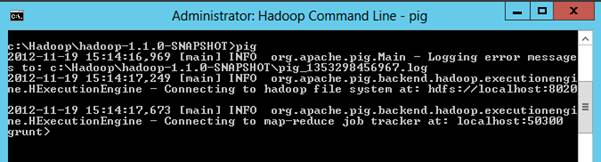

# 八、使用 Pig 处理和丰富数据

根据官方[阿帕奇猪项目页面](http://pig.apache.org/):

[](http://pig.apache.org/)

**Apache Pig** 是一个分析大型数据集的平台，由一种用于表达数据分析程序的高级语言，以及用于评估这些程序的基础设施组成。Pig 程序的显著特性是它们的结构可以进行大量的并行化，这反过来又使它们能够处理非常大的数据集。

实际上，Pig 是一种语言，它允许您描述存储为原始文件(如分隔文本)的数据集，并随后对那些 SQL 开发人员熟悉的数据集执行一系列操作(如向单个行添加计算或将集合连接和聚合在一起)。它的架构允许使用 MapReduce 范式对作业进行大规模并行化，因为 Pig 命令被转换为 MapReduce 作业来执行。这不是直接暴露给小猪程序员的。

## 用猪

在撰写本文时，没有可用于 Pig 的 GUI。所有命令都是通过头节点上的命令行或客户端桌面上的 PowerShell cmdlets 执行的。[<sup>【19】</sup>](12.html#_ftn19)在这种情况下，我们将使用命令行，当使用 HDInsight 平台时，通过 Hadoop 命令外壳(桌面上的链接)访问该命令行:


图 Hadoop 命令行快捷方式

在命令行中，键入“pig”，然后按 enter 键。这将进入 Pig 命令外壳，当命令提示符变为“咕噜”时，可以清楚地识别:



图 5:调用 Pig 命令外壳

从这里，您可以输入 Pig 命令，如文档中所述。[<sup>【20】</sup>](12.html#_ftn20)

## 引用关系中的已处理数据

我们的第一步是引用 C# 映射器和情感关键词列表输出的数据。注意我故意不说*加载*。此时，不会处理任何数据，也不会对源数据进行验证。Pig 仅接收要使用的文件的描述:

```cs
      data_raw = LOAD 'wasb://<container>@<storageaccount>.blob.core.windows.net/user/hadoop/output/Sentiment/part-*' USING PigStorage('|') AS (filename:chararray,message_id:chararray,author_id:chararray,word:chararray);

```

在这里，我们使用 LOAD 命令来描述我们想要引用为关系“data_raw”的文件，使用 Hadoop Globbing 支持的通配符。[<sup>【21】</sup>](12.html#_ftn21)同样值得注意的是，不需要向 Pig 提供指令告诉其原始数据被压缩。它可以本地处理压缩，并根据数据文件扩展名确定使用哪个解压缩编解码器。

根据文档，关系是元组包，而元组又是一组有序的字段。这是关系数据库世界的一种不同的结构方法，因此下面的标注解释了这些概念(尽管建议进一步阅读):

```cs
      Relations, bags, tuples, and fields
      Starting from the bottom up, a Field is very much like a simplified column in the relational database world. It has a name, a data type, and a value, and can be referenced using a zero-based ordinal position within the tuple.
      A Tuple is similar to a row in a relational database in that it is an ordered collection of fields.
      A Bag is a collection of tuples. However, this starts deviating from the relational model in that there are two types of bags: the inner and outer.
      Inner Bags are a collection of tuples within tuples, for example: Tuple 1 ({Tuple 2},{Tuple 3})
      Outer Bags are the overall collection of the tuples otherwise known as a Relation.

```

参考数据后，我们可以测试我们的初始数据结构，以确保它是可靠的:

```cs
      temp = LIMIT data_raw 10;
      DUMP temp;

```

在这里，我们使用 DUMP 命令从 Pig 生成一些输出，并看看它是如何解释数据的。首先，我们创建一个名为“temp”的关系，该关系使用 LIMIT 命令引用我们的起始关系“data_raw”，该命令只选择它找到的前 10 个元组。请注意，作业之间可能不一致。然后，通过发出命令转储它，它向控制台生成如下输出:


图 6:清管器命令外壳的转储输出

从这一点，我们可以看到我们的单词有一个标签附加在末尾，如元组周围的右括号的偶数排列所示。

为了解决这个问题，我们使用一个简单的操作符来修剪最后一个单词。我们还需要从文件名中提取相关的日期信息(这本来可以在 Mapper 中更有效地完成，但这纯粹是为了展示 Pig 的能力):

```cs
      data_clean = FOREACH data_raw GENERATE SUBSTRING(filename,48,52) AS year, SUBSTRING(filename,52,54) AS month, SUBSTRING(filename,54,56) AS day, message_id, author_id, TRIM(word) AS word;

```

FOREACH 运算符处理数据列以生成输出。在这种情况下:

*   提取年、月和日值的文件名的子字符串
*   “单词”字段的修改值，从字符串的开头和结尾去除空白(包括制表符)

## 加入数据

首先，我们需要加载我们的情感数据单词列表。使用的名单来自伊利诺伊大学的刘冰和胡铭清的工作。[<sup>【22】</sup>](12.html#_ftn22)[<sup>【23】</sup>](12.html#_ftn23)列表直接加载到 Pig 中，无需预处理(除了在文本编辑器中剥离文件头)，使用以下 LOAD 命令:

```cs
      positive_words = LOAD 'wasb://<container>@<storageaccount>.blob.core.windows.net/user/hadoop/data/positive.csv' USING PigStorage('|') AS (positive:chararray);
      negative_words = LOAD 'wasb://<container>@<storageaccount>.blob.core.windows.net/user/hadoop/data/negative.csv' USING PigStorage('|') AS (negative:chararray);

```

为了给情感添加一个值用于下游处理，我们给每个列表添加一个情感值，使用 FOREACH / GENERATE 操作给正词赋值 1，给负词赋值-1:

```cs
      positive = FOREACH positive_words GENERATE positive AS sentiment_word, 1 AS sentiment_value;
      negative = FOREACH negative_words GENERATE negative AS sentiment_word, -1 AS sentiment_value;

```

最后，我们只需要在下游处理中对一组情感词进行操作，我们使用 UNION 语句将这两种关系结合在一起:

```cs
      sentiment = UNION positive, negative;

```

接下来，我们加入我们的解构信息和我们的情感词表。我们将执行类似于 T-SQL 内部连接的连接，因为输出结果集将只包含匹配的记录。这将减小输出的大小:

```cs
      messages_joined = JOIN data_clean BY word, sentiment BY sentiment_word;

```

在这里，我们已经使用 BY 关键字后面指定的字段连接了关系数据 _clean 和正数 _ words。因为我们没有用任何额外的关键字(如 LEFT 或 OUTER)修改 JOIN，所以它执行一个 INNER join，丢弃所有不匹配的行。

同样，此时还没有处理任何数据。

## 汇总数据

下一步是汇总数据，统计积极情感。在 Pig 中，分组是执行聚合函数(如 MIN、AVG 或 COUNT)的单独操作，因此首先我们必须对数据进行分组:

```cs
      messages_grouped = GROUP messages_joined BY (year, month, day, message_id, author_id);

```

这将在 messages _ grouped 关系中为每年、每月、每天和消息 id 生成一组元组。使用 description 关键字，我们可以在 Pig 数据结构中看到这种情况:

```cs
      DESCRIBE messages_grouped;

```

这在 messages _ grouped 关系中产生元组的以下描述:

```cs
      messages_grouped: {group: (data_clean::year: chararray, data_clean::month: chararray, data_clean::day: chararray, data_clean::message_id: chararray, data_clean::author_id: chararray), messages_joined: {(data_clean::year: chararray, data_clean::month: chararray, data_clean::day: chararray, data_clean::message_id: chararray, data_clean::author_id: chararray, data_clean::word: chararray, sentiment::sentiment_word:chararray, sentiment::sentiment_value: int)}}

```

然而，这有点难以理解，因此，出于说明的目的，我们将在下面重申它，缩短源关系名称(分别从 data_clean 到 dc，messages _ joined 到 mj，情感到 s)，并剥离数据类型:

```cs
      messages_grouped: {
      group: (dc::year, dc::month, dc::day, dc::message_id, dc::author_id),
      mj: {(dc::year, dc::month, dc::day, dc::message_id, dc::author_id, dc::word, s::sentiment_word, s::sentiment_value)}
      }

```

这将创建两个字段，一个称为“组”(突出显示为绿色)，它是一个元组，保存关系分组所依据的所有字段。第二个字段(突出显示为蓝色)是一个采用原始关系名称的包(在本例中为 message_joined)。

第二个字段将包含与第一个“组”字段中的唯一键集相关联的所有记录。有关这方面的简单示例，请参见文档。[<sup>【24】</sup>](12.html#_ftn24)

现在我们有了分组记录，我们需要对它们进行计数:

```cs
      message_sum_sentiment = FOREACH messages_grouped GENERATE group AS message_details, SUM(messages_joined.sentiment_value) AS sentiment;

```

这将使用 FOREACH 构造，使用由 group 操作创建的“组”生成新记录，并对该组中的包执行操作。在这种情况下，要执行求和操作。

最后，为了获得一组可以导出到关系引擎进行进一步处理的数据，我们需要将记录转换为关系结构可以识别的平面数据结构:

```cs
      message_sentiment_flat = FOREACH message_sum_sentiment GENERATE FLATTEN(message_details), (int)sentiment;

```

在这里，我们使用扁平化命令来取消嵌套在 GROUP 和 COUNT 操作中创建的元组。

## 导出结果

最后，我们到达处理发生的阶段:

```cs
      STORE message_sentiment_flat INTO 'wasb://<container>@<storageaccount>.blob.core.windows.net/user/hadoop/pig_out/messages' USING PigStorage('|');

```

STORE 命令将关系的内容发送到文件系统。在这里，我们使用 PigStorage 函数将扁平化关系“消息 _ 情感 _ 平面”的内容放入 Azure Blob 存储中，指定一个管道作为分隔符。

如果您选择这样做，此时可以压缩输出。[<sup>【25】</sup>](12.html#_ftn25)

这将导致链中的所有关系都被处理，并填充关系“message _ 情操 _flat”进行输出，因此，在命令外壳中，可以看到 MapReduce 作业的启动如下:


图 7: Pig 命令启动 MapReduce 作业

这一步完成了我们对 Azure Blob 存储的分析输出。

## 字数的附加分析

除了消息级别的分析，还对情感负载词进行了一些汇总分析。这将在不太详细的地方讨论，但将在后续的 Hive 部分中引用。

首先，我们按单词对 data_clean 关系进行分组，这样我们就可以计算单词频率:

```cs
      words_group = GROUP data_clean BY (word);
      words_count = FOREACH words_group GENERATE group AS words, COUNT (data_clean) AS count;

```

接下来，我们需要将数据展平并添加情感。请注意，在情感连接中，使用了左连接，因此保留了完整的单词列表(减去映射器过程中删除的单词):

```cs
      words_count_flat = FOREACH words_count GENERATE FLATTEN(words), (int)count;
      words_count_sentiment = JOIN words_count_flat BY words LEFT, sentiment BY sentiment_word;

```

然后我们需要按单词对记录进行分组，然后使用 SUM 聚合情感，并使用 count 函数计算单词频率:

```cs
      words_count_sentiment_group = GROUP words_count_sentiment BY (words);
      words_sum_sentiment = FOREACH words_count_sentiment_group GENERATE group AS words, SUM(words_count_sentiment.count) AS count, SUM(words_count_sentiment.sentiment_value) AS sentiment;

```

最后，我们需要将数据存储到 Azure Blob Storage 进行进一步分析:

```cs
      STORE words_sum_sentiment INTO 'wasb://<container>@<storageaccount>.blob.core.windows.net/user/hadoop/pig_out/words' USING PigStorage('|');

```