# 第 10 章使用微软商业智能套件可视化结果

在 Hadoop 上处理数据是故事的重要部分。然而，为了让用户从中获取价值，他们需要能够操纵和可视化它。微软商业智能套件——通过数据建模工具 PowerPivot 和数据可视化工具 power view——通过熟悉的 Excel 界面实现了这一点。

## 配置单元 ODBC 驱动程序和 PowerPivot

微软大数据用户可用的工具集的一部分是 Hive ODBC 驱动程序。这允许与 Hive 数据库的 ODBC 连接将结果直接提取到 Excel 中，或者作为 PowerPivot 模型中的数据源。在本例中，我们将使用之前步骤的结果输出作为 PowerPivot 模型的数据源。

### 安装配置单元 ODBC 驱动程序

需要在客户机上安装 Hive 驱动程序。最新版本的驱动程序可从微软下载中心获得，最新驱动程序的位置可在 HDInsight 文档中找到。[<sup>【26】</sup>](12.html#_ftn26)

只需为客户端机器下载并安装适当的驱动程序。

### 为蜂巢建立一个 DSN

连接到 Hive 的先决条件是设置 Excel 可以引用的 64 位系统数据源名称(DSN)。搜索 ODBC 会出现两个应用:

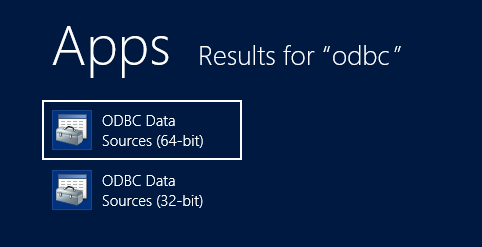

图 8: ODBC 应用

从这里，这将启动 ODBC 数据源管理员。在系统 DSN 下，选择“添加”。选择“创建新数据源”时，配置单元驱动程序被列为可用选项:

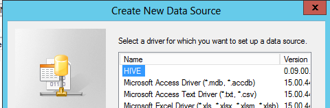

图 9:使用 Hive ODBC 驱动程序创建一个新的系统 DSN

选择它并选择确定会将您带到配置单元数据源配置，该配置需要更新以匹配特定的系统设置:

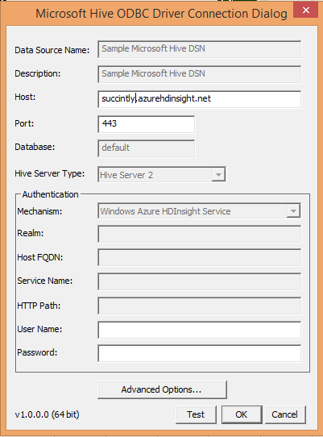

图 10:配置配置单元 DSN

一旦这一步完成，我们就可以将数据带入 Excel。

### 将数据导入 Excel

从 Excel 内部开始，在 PowerPivot 选项卡上，选择管理数据模型:

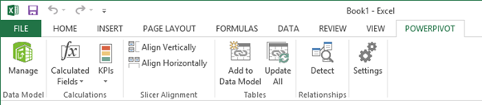

图 11:电子表格功能区选项卡

这将为您提供获取外部数据的选项(在本例中为“从其他来源”):

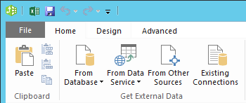

图 12:管理数据模型功能区

这将打开表导入向导。在“关系数据库”部分下，选择“其他(OLEDB/ODBC)”，然后单击下一步:


图 13: Excel PowerPivot 表导入向导-数据源类型选择

这将提示您输入连接字符串。选择构建选项，并在“提供程序”选项卡上选择“用于 ODBC 驱动程序的 Microsoft OLE DB 提供程序”:

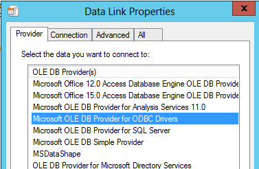

图 14: Excel PowerPivot 表导入向导-数据链接类型选择

单击“下一步”将进入“连接”选项卡；然后可以选择之前创建的 DSN。从那里，单击下一步，直到显示要导入的表列表:


图 15: Excel PowerPivot 表导入向导-选择配置单元表

选择所有相关表格，然后选择“完成”。Hive 中的数据现在可以在 PowerPivot 中作为普通数据模型的一部分进行建模和分析:

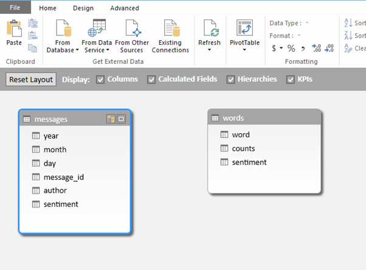

图 16: Excel PowerPivot 数据模型图视图

## 在 PowerPivot 中添加上下文

PowerPivot 的部分优势在于，它能够利用来自其他来源的额外信息(也称为“混合”)，并通过添加额外的计算和分析方法来丰富您的数据。下面将展示其中的一些。

### 从 Windows Azure 数据市场导入日期表

这些数据几乎没有为额外的人口统计或用户数据提供空间，因为它们已经被匿名化了。但是，可以通过添加具有适当层次结构的日期表来增加对时间的一些见解。

Windows Azure 数据市场上有一个以商业智能为重点的日期表。要使用此功能，请在使用“获取外部数据”选项时，选择“来自数据服务”和“来自 Windows Azure 市场”:


图 17:从数据服务导入数据

这将我们带到 Windows Azure 市场浏览器。对“日期流”集的搜索将我们带到伯颜·佩涅夫的日期集，它是专门为 PowerPivot 使用而设计的:

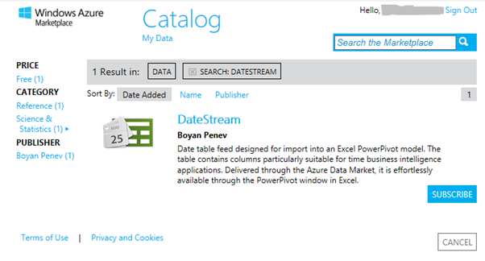

图 18: Excel Windows Azure 市场浏览器

选择订阅(需要 Windows Live 帐户，但数据集本身是免费的)。完成各种步骤，直到到达选择查询屏幕:

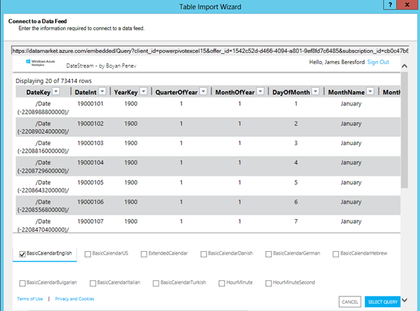

图 19: Excel Windows Azure 市场数据馈送选项

在这里，取消除“基本语言”之外的所有选项，以便我们将检索的内容限制在与我们的分析相关的内容。

完成流程中剩余的步骤，保留所有内容为默认值。“基本语言”表现在将被添加到数据模型中。

### 创建日期层次结构

为了增加用户友好性，我们将在日期表上创建一个可浏览的日历层次结构。在数据模型管理器中，右键单击“基本语言”表中的“年份”列，然后选择“创建层次结构”:

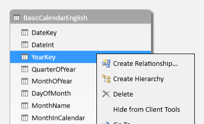

图 20: Excel PowerPivot 数据模型——创建层次结构

给它起名叫日历。然后，通过右键单击并选择“添加到层次结构”并选择“日历”，将月份名称和日期月份列添加到层次结构中:


图 21: Excel PowerPivot 数据模型-向层次结构添加级别

已创建日历层次结构。PowerPivot 足够智能，无需任何用户干预即可确定级别和树。

### 链接到情感数据

最后一步是将日期表连接到模型中对日期敏感的数据。为此，我们需要在数据上创建一个与日期表中的键相匹配的键。在这个场景中，我们将使用“日期”列，它是一个格式为 YYYYMMDD 的整数。

根据我们的数据，我们有三列:年、月和日。首先，我们需要创建一个计算列，以匹配的格式保存数据。这可以通过一个相当简单的数据分析表达式(DAX)计算列来完成，该列根据需要在月和日之间填充一个额外的零，如下所示:

```cs
      DateKey = ([year]*10000)+([month]*100)+[day]

```

回到图视图中，将“日期”列从“基本日历”表拖到“消息”表中会创建两个表之间的关系，并允许使用日历层次结构查看消息数据。

### 增加分析措施

为了检查数据的各个方面，例如帖子的数量，我们需要向数据模型可以快速评估的数据中添加度量。[<sup>【27】</sup>](12.html#_ftn27)

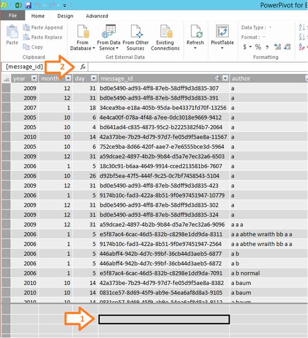

图 22:向数据模型添加度量

这是在数据视图中完成的。单击数据下方区域的单元格(箭头 1)，我们可以在公式栏中输入公式(箭头 2)。

由此，我们可以使用 DAX 表达式语言输入一个简单的计数度量:

```cs
      Message Count:=COUNTA([message_id])

```

这使用 COUNTA 函数来计数所有非空的单元格——我们知道在这种情况下，所有 message _ ids 都是非空的，因此这可以用来计数所有消息。[<sup>【28】</sup>](12.html#_ftn28)

这些度量是上下文感知的，因此在使用切片器时，它们将根据所使用的切片器给出正确的值(例如，如果您查看用户的消息计数，它将给出适合该用户的计数)。

可以引入更复杂的度量，例如计算每条消息平均情感的度量:

```cs
      Sentiment per Message:=sum([sentiment])/COUNTA([message_id])

```

这使用一个简单的情绪求和函数，然后除以消息计数，得到每条消息的平均情绪。这是上下文感知的，因此它可以用来确定每个用户的平均情绪或一段时间内的情绪趋势。

## 在 PowerView 中可视化

然后，在 Excel 中，我们可以使用 PowerView 分析工具根据我们创建的数据模型来可视化数据。

在 Excel 2013 中，在功能区的“插入”选项卡下，我们可以启动“PowerView”:

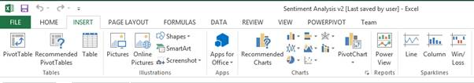

图 23:在 Excel 中启动 PowerView

这使我们能够从我们创建的数据模型中构建报告，从模型中的字段中进行选择:


图 24: PowerView 字段浏览

通过简单的拖放操作，创建具有丰富交互性的数据可视化变得很容易。下面是一些例子。

第一个例子是通过作者姓名的第一个字母来看作者姓名(不包括“未知数”)的分布。这凸显了以字母“o”开头的作者姓名比例很高——这是一个值得进一步调查的异常现象。

它有一个条形图，显示了作者姓名首字母的文章数量，还有一个表格，列出了最多的作者:


图 25: PowerView 示例报告“作者姓名分布”

下一份报告关注与帖子数量相关的情绪，显示为散点图。由于数据点的数量，会出现一个警告，指示仅显示代表性样本。

该报告似乎表明，职位长度和职位的整体情绪之间没有强有力的关系:


图 26: PowerView 示例报告“按帖子长度列出的情绪”

最后一个例子显示了“作者随时间的情绪”。这可以通过作者使用左边的条形图进行过滤，显示作者的文章数量:


图 27: PowerView 示例报告“作者对时间的看法”

## PowerQuery 和 HDInsight

在 HDInsight 上访问数据的第二个选项是使用最近发布的 Excel 外接程序 PowerQuery。[<sup>【29】</sup>](12.html#_ftn29)这使得能够从 HDInsight 集群或严格来说与该集群相关联的 Azure Blob Storage 中直接提取文本文件。[<sup>【30】</sup>](12.html#_ftn30)根据 HDInsight 的架构，计算与存储是分开的，要访问 HDInsight 作业的输出，计算集群不必启动并运行。

目前这种数据访问能力还没有扩展到 PowerPivot，所以在 Excel 中带入大量数据进行分析的能力有限。