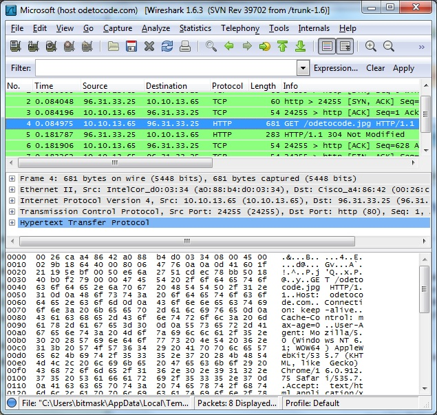

# 第三章联系

在[第 2 章](2.html#heading_id_20)中，我们查看了 HTTP 消息，并看到了在 HTTP 事务中从客户端流向服务器并返回的文本命令和代码的示例。但是，这些消息中的信息是如何在网络中传播的呢？网络连接何时打开？连接什么时候关闭？当我们从一个低层次的角度看待 HTTP 时，这些是本文将要回答的一些问题。但是首先，我们需要理解 HTTP 下面的一些抽象。

## 网络旋风之旅

为了理解 HTTP 连接，我们必须稍微了解一下在 HTTP 下面的层中发生了什么。像许多应用程序一样，网络通信由层组成。**通信栈**中的每一层负责特定且有限数量的职责。

例如，HTTP 就是我们所说的应用层协议，因为它允许两个应用程序通过网络进行通信。通常，其中一个应用程序是网络浏览器，另一个应用程序是像 IIS 或 Apache 这样的网络服务器。我们看到了 HTTP 消息如何允许浏览器向服务器请求资源。但是，HTTP 规范没有说明消息实际上是如何通过网络到达服务器的——这是低层协议的工作。来自 web 浏览器的消息必须向下传播一系列层，当它到达 web 服务器时，它向上传播一系列层以到达 web 服务过程。


图 4:协议层

HTTP 下面的层是**传输层协议**。几乎所有的 HTTP 流量都通过 **TCP** (传输控制协议的缩写)传输，尽管这不是 HTTP 所要求的。当用户在浏览器中键入网址时，浏览器首先从网址中提取主机名(和端口号，如果有的话)，并通过指定服务器地址(从主机名导出)和端口(默认为 80)打开一个 **TCP 套接字**。

一旦应用程序有了一个开放的套接字，它就可以开始将数据写入套接字。浏览器唯一需要担心的是将格式正确的 HTTP 请求消息写入套接字。TCP 层接受数据，并确保消息传递到服务器时不会丢失或复制。TCP 会自动重新发送任何可能在传输过程中丢失的信息，这就是为什么 TCP 被称为*可靠协议*的原因。除了错误检测，TCP 还提供流量控制。TCP 中的流量控制算法将确保发送方发送数据的速度不会太快，以至于接收方无法处理数据。在这个网络和设备繁多的世界里，流量控制非常重要。

简而言之，TCP 提供了对成功传递 HTTP 消息至关重要的服务，但它是以透明的方式提供的，因此大多数应用程序不需要担心 TCP。如上图所示，TCP 只是 HTTP 下面的第一层。传输层的 TCP 之后是作为网络层协议的 IP。

**IP** 是**互联网协议**的简称。TCP 负责错误检测、流量控制和整体可靠性，而 IP 负责获取信息，并通过各种交换机、路由器、网关、中继器和其他设备将信息从一个网络移动到下一个网络以及世界各地。IP 尽力在目的地传递数据(但它不能保证传递——这是 TCP 的工作)。IP 要求计算机有一个地址(著名的 IP 地址，例如 208.192.32.40)。IP 还负责将数据分解成数据包(通常称为数据报)，有时还会对这些数据包进行分段和重组，以便针对特定网段进行优化。

到目前为止，我们所谈论的一切都发生在计算机内部，但最终这些 IP 数据包必须通过一根电线、一根光缆、一个无线网络或一条卫星链路传输。这是**数据链路层**的职责。此时常见的技术选择是**以太网**。在这个层次上，数据包变成了帧，像以太网这样的低级协议集中在 1、0 和电信号上。

最终，信号到达服务器，并通过网卡进入服务器，这个过程是相反的。数据链路层将数据包传递到 IP 层，IP 层将数据移交给 TCP，TCP 可以将数据重组为客户端发送的原始 HTTP 消息，并推送到 web 服务器进程中。这是一件设计精美的作品，完全可以用标准来衡量。

## 带套接字和 C#的快速 HTTP 请求

如果您想知道编写一个发出 HTTP 请求的应用程序是什么样子的，那么下面的 C#代码就是一个简单的例子，说明代码可能是什么样子的。这段代码没有任何错误处理，并试图向控制台窗口写入任何服务器响应(因此您需要请求一个文本资源)，但它适用于简单的请求。以下代码示例的副本可从[https://bitbucket.org/syncfusiontech/http-succinctly](https://bitbucket.org/syncfusiontech/http-succinctly/)获得。示例名称是 sockets-sample。

```cs
  using System;
  using System.Net;
  using System.Net.Sockets;
  using System.Text;

  public class GetSocket
  {
      public static void Main(string[] args)
      {
          var host = "www.wikipedia.org";
          var resource = "/";

          Console.WriteLine("Connecting to {0}", host);

          if(args.GetLength(0) >= 2)
          {
              host = args[0];
              resource = args[1];
          }

          var result = GetResource(host, resource);
          Console.WriteLine(result);
      }

      private static string GetResource(string host, string resource)
      {
          var hostEntry = Dns.GetHostEntry(host);
          var socket = CreateSocket(hostEntry);
          SendRequest(socket, host, resource);
          return GetResponse(socket);
      }

      private static Socket CreateSocket(IPHostEntry hostEntry)
      {
          const int httpPort = 80;
          foreach (var address in hostEntry.AddressList)
          {
              var endPoint = new IPEndPoint(address, httpPort);
              var socket = new Socket(
                             endPoint.AddressFamily,
                             SocketType.Stream,
                             ProtocolType.Tcp);
              socket.Connect(endPoint);
              if (socket.Connected)
              {
                  return socket;
              }
          }
          return null;
      }

      private static void SendRequest(Socket socket, string host,
                                      string resource)
      {               
          var requestMessage = String.Format(
              "GET {0} HTTP/1.1\r\n" +
              "Host: {1}\r\n" +
              "\r\n",
              resource, host
          );

          var requestBytes = Encoding.ASCII.GetBytes(requestMessage);
          socket.Send(requestBytes);
      }   

      private static string GetResponse(Socket socket)
      {
          int bytes = 0;
          byte[] buffer = new byte[256];
          var result = new StringBuilder();

          do
          {
              bytes = socket.Receive(buffer);
              result.Append(Encoding.ASCII.GetString(buffer, 0, bytes));
          } while (bytes > 0);

          return result.ToString();
      }
  }

```

请注意程序需要如何查找服务器地址(使用`Dns.GetHostEntry`)，并使用`GET`运算符和`Host`头来制定适当的 HTTP 消息。实际的网络部分相当容易，因为套接字实现和 TCP 处理了大部分工作。例如，TCP 知道如何管理到同一服务器的多个连接(它们都会在本地接收不同的端口号)。因此，对同一个服务器的两个未完成的请求不会被混淆，并接收打算给另一个服务器的数据。

## 网络和 Wireshark

如果你想对 TCP 和 IP 有所了解，你可以安装一个免费的程序，比如 Wireshark(OSX 和 Windows 可以从[wireshark.org](http://www.wireshark.org/)获得)。Wireshark 是一款网络分析仪，可以向您展示流经网络接口的每一点信息。使用 Wireshark，您可以观察到 TCP 握手，这是在实际的 HTTP 消息开始流动之前在客户端和服务器之间建立连接所需的 TCP 消息。您还可以在每条消息上看到 TCP 和 IP 报头(每条 20 字节)。下图显示了握手的最后两个步骤，接下来是`GET`请求和`304`重定向。



图 5:使用 Wireshark

使用 Wireshark，您可以看到 HTTP 连接何时建立和关闭。要从这一切中吸取的重要部分不是握手和 TCP 在最底层是如何工作的，而是 HTTP 几乎完全依赖于 TCP 来处理所有的繁重工作，并且 TCP 涉及一些开销，比如握手。因此，HTTP 的性能特性也依赖于 TCP 的性能特性，这是下一节的主题。

## HTTP、TCP 和网络的进化

在网络的旧时代，大多数资源都是文本的。你可以向网络服务器请求一个文档，离开并阅读五分钟，然后请求另一个文档。世界很简单。

对于今天的网络，大多数网页需要不止一个资源来完全呈现。web 应用程序中的每个页面都有一个或多个图像、一个或多个 JavaScript 文件以及一个或多个 CSS 文件。对主页的初始请求产生 30 或 50 个额外的请求来检索与页面相关的所有其他资源并不罕见。

在过去，浏览器与服务器建立连接、发送请求、接收响应并关闭连接也很简单。如果今天的网络浏览器一次打开一个连接，并等待每个资源完全下载后再开始下一次下载，网络会感觉非常慢。互联网充满了延迟。信号必须传输很长的距离，并通过不同的硬件。建立 TCP 连接也有一些开销。正如我们在 Wireshark 截图中看到的，在 HTTP 事务开始之前，需要完成三步握手。

从简单文档到复杂页面的演变需要在 HTTP 的实际使用中有一些独创性。

## 并联连接

大多数用户代理(也称为网络浏览器)不会以一个接一个的方式发出请求。取而代之的是，他们打开到服务器的多个**并行连接**。例如，当下载页面的 HTML 时，浏览器可能会在页面中看到两个``标签，因此浏览器将打开两个并行连接来同时下载这两个图像。并行连接数取决于用户代理和代理的配置。

很长一段时间，我们认为两个是浏览器可以创建的最大并行连接数。我们认为两个是最大值，因为多年来最流行的浏览器——互联网浏览器(IE)6——只允许同时连接到一台主机。IE 只是遵守了 HTTP 1.1 规范中规定的规则，该规范指出:

单用户客户端与任何服务器或代理的连接不应超过 2 个。

为了增加并行下载的数量，许多网站使用了一些技巧。例如，两个连接的限制是每台主机*，这意味着像 IE 6 这样的浏览器很乐意与 www.odetocode.com、*和*进行两个并行连接，与 images.odetocode.com 进行两个并行连接。通过在不同的服务器上托管图像，网站可以增加并行下载的数量，并使其页面加载更快(即使 DNS 记录被设置为将所有四个请求指向同一服务器，因为两个连接的限制是每个主机名*，而不是 IP 地址*)。*

今天情况不同了。大多数用户代理在决定建立多少个并行连接时会使用不同的启发式方法。例如，Internet Explorer 8 现在将最多打开六个并发连接。

真正要问的问题是:有多少联系太多了？平行连接将遵循收益递减规律。过多的连接可能会使网络饱和和拥塞，尤其是当涉及到移动设备或不可靠的网络时。因此，过多的连接会影响性能。此外，服务器只能接受有限数量的连接，因此，如果 100，000 个浏览器同时创建 100 个到单个 web 服务器的连接，将会发生糟糕的事情。尽管如此，每个代理使用多个连接比以串行方式下载所有内容要好。

幸运的是，并行连接不是唯一的性能优化。

## 持久连接

在网络的早期，用户代理会为发送到服务器的每个请求打开和关闭一个连接。这个实现符合 HTTP 作为一个完全无状态的协议的想法。随着每页请求数量的增长，由 TCP 握手产生的开销以及建立每个 TCP 套接字所需的内存数据结构也在增长。为了减少这种开销并提高性能，HTTP 1.1 规范建议客户端和服务器应该实现**持久连接**，并将持久连接作为默认的连接类型。

在一个请求-响应事务完成后，持久连接保持打开状态。这种行为给用户代理留下了一个已经打开的套接字，它可以使用该套接字继续向服务器发出请求，而无需打开新套接字的开销。持久连接还避免了慢速启动策略，这是 TCP 拥塞控制的一部分，使持久连接随着时间的推移表现更好。简而言之，持久连接减少了内存使用，减少了 CPU 使用，减少了网络拥塞，减少了延迟，并且总体上改善了页面的响应时间。但是，就像生活中的一切一样，也有不好的一面。

如前所述，服务器只能支持有限数量的传入连接。确切的数字取决于可用的内存量、服务器软件的配置、应用程序的性能以及许多其他变量。很难给出一个确切的数字，但是一般来说，如果您谈论支持数千个并发连接，您将不得不开始测试，看看服务器是否支持负载。事实上，许多服务器被配置为将并发连接数限制在远远低于服务器崩溃的程度。该配置是一种安全措施，有助于防止拒绝服务攻击。对于某人来说，创建一个程序来打开到服务器的数千个持久连接并阻止服务器响应真正的客户端是相对容易的。持久连接是一种性能优化，但也是一个漏洞。

按照漏洞的思路来思考，我们也不得不思考保持持久连接的开放时间。在一个无限可扩展性的世界中，只要用户代理程序在运行，连接就可以保持开放。但是，因为服务器支持有限数量的连接，所以大多数服务器被配置为在空闲一段时间(例如，在 Apache 中为 5 秒)后关闭持久连接。用户代理也可以在一段空闲时间后关闭连接。对关闭的连接的唯一可见性是通过像 Wireshark 这样的网络分析器。

除了积极关闭持久连接之外，大多数 web 服务器软件都可以配置为禁用持久连接。这在共享服务器中很常见。共享服务器牺牲性能以允许尽可能多的连接。因为持久连接是 HTTP 1.1 的默认连接方式，不允许持久连接的服务器必须在每个 HTTP 响应中包含一个`Connection`头。下面的代码是一个例子。

```cs
  HTTP/1.1 200 OK
  Content-Type: text/html; charset=utf-8
  Server: Microsoft-IIS/7.0
  X-AspNet-Version: 2.0.50727
  X-Powered-By: ASP.NET
  Connection: close
  Content-Length: 17149

```

`Connection: close`头是给用户代理的信号，表示连接不会持久，应该尽快关闭。代理不允许在同一连接上进行第二次请求。

## 流水线连接

并行连接和持久连接都被客户端和服务器广泛使用和支持。HTTP 规范还允许**流水线连接**，这种连接并没有得到服务器或客户端的广泛支持。在流水线连接中，在等待第一个响应之前，用户代理可以在一个连接上发送多个 HTTP 请求。流水线允许更有效地将请求打包成包，并且可以减少延迟，但是它没有并行和持久连接那么广泛。

## 我们在哪里？

在这一章中，我们研究了 HTTP 连接，并讨论了 HTTP 规范可能带来的一些性能优化。现在我们已经深入研究了 HTTP 消息，甚至检查了协议下面的连接和 TCP 支持，我们将后退一步，从更广泛的角度来看待互联网。