# 二、多场景应用

前一章介绍了 iOS 应用程序开发的基本工作流程，但我们在单视图应用程序的范围内工作。然而，大多数现实世界的应用程序需要多个场景来分层呈现数据。虽然管理多场景应用程序有多种类型的组织模式，但本章将介绍一种最常见的模式:主-细节应用程序。

最小的主-细节应用程序由一个“主”场景和一个“细节”场景组成，其中“主”场景提供了可供选择的数据项列表，而“细节”场景则在用户从主场景中选择项目时显示项目的细节。在你的 iPhone 上打开 Mail 应用程序，你会发现一个主细节应用程序的好例子。收件箱列出您的邮件，使其成为主场景，当您选择其中一个时，详细场景用于显示邮件内容、发件人、任何附件等。

在大多数情况下，多场景应用程序使用上一章中讨论的相同工作流。我们仍将通过界面构建器添加用户界面组件来创建布局，并使用动作、出口和委托将它们连接到我们的代码。然而，拥有多个场景意味着我们将拥有多个视图控制器，因此我们需要使用新的`UINavigationController`类来组织它们的交互。我们还将学习如何使用 segues 配置场景转换。

## 创建主-细节项目

本章的示例项目将是一个简单的联系人列表，它允许用户管理他们的朋友列表以及他们各自的联系信息。要创建示例项目，请选择**文件** *>* **新建** *>* **项目**，并选择**主-详细应用程序**。这将使我们有机会探索新的导航组件和组织结构，以及如何处理从一个场景到另一个场景的过渡。


图 31:创建主-细节应用程序模板

在**产品名称**字段中使用*友好列表*，在**组织名称**中使用您喜欢的任何名称，在**公司标识符**中使用*自我教育*。和之前的 app 一样，确保选择 **iPhone** 是选择**设备**和**使用故事板**和**使用自动参考计数**:

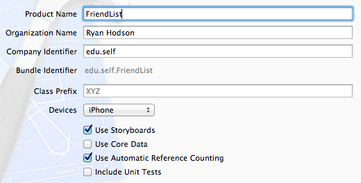

图 32:配置项目

你可以在任何你喜欢的地方保存这个项目。

## 模板概述

我们将在模板的现有代码上构建，所以让我们快速查看一下默认应用程序。点击 Xcode 左上角的**运行**按钮或按 Cmd+R 编译应用程序，在 iOS 模拟器中启动。您应该会在导航栏中看到一个名为**大师**的空列表，其中有一个**编辑**按钮和一个**添加**按钮(加号)。点击**添加**按钮将在列表中插入一个新项目，选择该项目将过渡到细节场景。两个场景如下图所示。

| 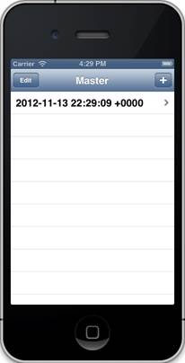 | 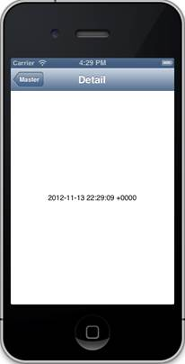 |

图 33:模板的默认主场景和细节场景

模板使用的默认数据项是日期，但我们将更改主场景以显示名称列表，并更改详细场景以显示其联系信息。

我们将在构建示例项目时讨论每个源文件背后的细节，但是在开始编辑默认类之前，对它们有一个基本的概述会有所帮助。

### 申请代表

与前一章一样，`AppDelegate`类允许您对应用程序生命周期中的重要事件做出反应。我们的朋友列表应用程序不需要任何自定义的启动行为，所以我们根本不会编辑这个类。

### 视图控制器

这个模板不是单一的`ViewController`，而是有两个视图控制器类:一个`MasterViewController`和一个`DetailViewController`。这些管理主场景和细节场景，它们的`viewDidLoad`方法是进入各自场景的入口。`MasterViewController`的`viewDidLoad`方法应该如下所示:

```objc
    - (void)viewDidLoad {
        [super viewDidLoad];
        self.navigationItem.leftBarButtonItem = self.editButtonItem;

        UIBarButtonItem *addButton = [[UIBarButtonItem alloc]                      
            initWithBarButtonSystemItem:UIBarButtonSystemItemAdd
                                 target:self                                
                                 action:@selector(insertNewObject:)];
        self.navigationItem.rightBarButtonItem = addButton;
    }

```

这将创建您在主场景顶部看到的**编辑**和**添加**按钮，并将`insertNewObject:`方法设置为后者的动作。`insertNewObject:`方法将新的`NSDate`实例添加到私有的`_objects`变量中，该变量是一个包含数据项主列表的可变数组，并且`#pragma mark - Table View`指令之后的所有方法控制该列表在场景中的显示方式。在过渡到细节场景之前调用`prepareForSegue:sender:`方法，这是将必要的信息从主场景转移到细节场景的地方。

`DetailViewController`类稍微简单一点。它只是声明一个`detailItem`属性来存储所选项目，并通过`detailDescriptionLabel`出口显示它。我们将更改这个默认实现来显示一个人的联系信息。

### 故事板

故事板可能是前一个例子中最剧烈的变化。如果打开**maintoryboard .故事板**，应该会看到以下内容:


图 34:模板的默认故事板

界面构建器现在管理三个控制器，而不是单一的视图控制器。考虑到我们的应用程序只有*两个*场景，这可能看起来很奇怪，但是`MasterViewController`和`DetailViewController`都嵌入在一个`UINavigationController`实例中。这个导航控制器就是为什么我们会在应用程序的顶部看到一个导航栏，它让我们在主场景和细节场景之间来回导航。我们将在本章中讨论更多关于配置导航控制器的内容。

这个模板还应该阐明为什么**maintoryboard .故事板**文件被称为“故事板”——它不仅可视化场景本身，而且可视化这些场景之间的流动。与前一章一样，指向导航控制器的箭头表明它是根控制器。但是，我们也看到了从导航控制器到`MasterViewController`和从`MasterViewController`到`DetailViewController`的另一个箭头。这些箭头定义了应用程序中所有视图控制器之间的关系和转换。

## 模型数据

与前一章不同，这个应用程序将使用一个专用的类来表示它的模型数据。我们将使用`Person`类来存储每个朋友的联系信息。在 Xcode 中创建新文件，选择**目标-C 类**，在**类**字段输入*人*，如下图:

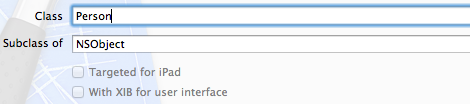

图 35:创建人员类

接下来，我们需要声明一些属性来记录每个联系人的姓名、组织和电话号码。打开 **Person.h** ，更改如下:

```objc
    #import <Foundation/Foundation.h>

    @interface Person : NSObject

    @property (copy, nonatomic) NSString *firstName;
    @property (copy, nonatomic) NSString *lastName;
    @property (copy, nonatomic) NSString *organization;
    @property (copy, nonatomic) NSString *phoneNumber;

    @end

```

当然，我们还需要在 **Person.m** 中综合这些属性:

```objc
    #import "Person.h"

    @implementation Person

    @synthesize firstName = _firstName;
    @synthesize lastName = _lastName;
    @synthesize organization = _organization;
    @synthesize phoneNumber = _phoneNumber;

    @end

```

这就是我们表示应用程序背后的数据所需的全部内容。该类的实例将在`MasterViewController`和`DetailViewController`场景之间传递，这将使用各种用户界面组件显示它们。

## 主场景

接下来，我们将配置主场景以显示`Person`对象的列表。定义场景的行为需要底层视图控制器的源代码和界面构建器中的可视化表示之间的谨慎交互。在我们进行任何编码之前，让我们仔细看看故事板中模板的主场景。

### 关系

在我们的故事板中，**关系**定义了导航控制器和另一个场景之间的连接。界面构建器将关系可视化为从导航控制器到另一个场景的箭头，并在其顶部显示链接图标。选择此图标将突出显示导航控制器，如下图所示:


图 36:根导航控制器和主视图控制器之间的关系

模板为我们建立了这种关系，但是能够自己配置它是很重要的。因此，通过选择导航控制器并按下删除来删除它。要重新创建关系，选择主视图控制器中的黄色**视图控制器**图标，然后导航到 Xcode 菜单栏中的**编辑器**，选择**嵌入** *>* **导航控制器**。一个新的导航控制器应该出现，你应该回到你开始的地方。

理解关系箭头*而不是*表示导航控制器和主控制器之间的转换很重要。相反，以这种方式将我们的主场景嵌入导航控制器会创建一个视图控制器*层次结构。*表示主场景*属于导航控制器*。这使得使用导航控制器的内置过渡和导航按钮在场景之间切换成为可能。例如，出现在细节场景顶部的**主**按钮由导航控制器自动添加:


图 37:导航控制器提供的内置导航按钮

场景之间切换的内置功能使导航控制器成为配置复杂应用程序流的简单方法。下一节讨论如何定义导航控制器场景之间的过渡。

### Segues

一个**片段**代表从一个场景到另一个场景的过渡。像关系一样，它被可视化为从源场景到目标场景的箭头，但它使用不同的图标。请注意，当您单击 segue 图标时，只有一个表格单元格被突出显示。这告诉我们，segue 被附加到单个表格单元，而不是整个主场景。

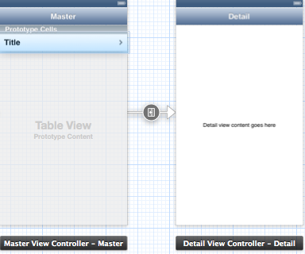

图 38:从主场景到细节场景的推送过程

同样，我们的模板为我们创建了这个片段，但是能够从头开始创建一个非常重要。因此，选择分段图标，然后按下删除按钮，将其从故事板中删除。若要重新创建它，请从表格单元格按住 control 键并拖动到详细场景。


图 39:控制-从主表单元格拖动到细节场景

这将打开一个菜单，提示您输入**选择段/附件动作**类型。我们希望我们的分段发生在用户选择表格单元格时，因此选择**选择分段**组下的**推送**。

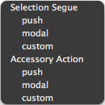

图 40:选择要创建的片段类型

父级`UINavigationController`通过**导航堆栈**管理其场景，其`pushViewController:animated:`和`popViewControllerAnimated:`方法允许您在堆栈中添加或移除视图控制器实例。例如，将一个细节视图控制器对象推送到导航堆栈上是您深入到细节场景的方式，单击细节场景导航栏中的**主**按钮会将其从导航堆栈中弹出。从图 40 的菜单中选择**推**告诉 segue 调用`pushViewController:animated:`方法从主场景过渡到细节场景。

除了类型之外，每个片段还必须有一个唯一的**标识符**，以便可以从您的源代码中访问它。您可以通过选择分段图标并打开**属性检查器**面板来编辑分段的标识。我们的 segue 应该有一个 **showDetail** 的标识符，并且您还应该在 **Style** 字段中看到 **Push** segue 类型:


图 41:主-细节部分的属性检查器

另一个**样式**选项是**模式**，它在现有场景之上呈现另一个场景*，完全独立于父导航控制器。你应该把这一段的**风格**保留为**推动**(我们将在本章末尾创建一个模态段)。*

### 表格

我们的主场景和上一章的`ViewController`的一个主要区别就是继承了`UITableViewController`而不是`UIViewController`。表格视图控制器管理`UITableView`实例。表视图由一列行组成，可能分组为多个部分。这使得它们非常适合呈现数据列表。

由于表格视图是图形容器，因此很难在场景编辑器中选择它们。最简单的选择方法是从场景编辑器左侧的**文档轮廓**中选择。文档大纲是一个包含界面构建器管理的所有元素的树，在**主视图控制器**下应该会找到一个**表视图**项，如下图所示:

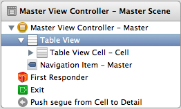

图 42:从文档大纲中选择 UITableView 实例

选择表格视图时，主场景中导航栏下的所有内容都应在场景生成器中高亮显示。这使您有机会在**属性检查器**中编辑表格视图属性。最重要的选项是**内容**字段，它决定了您将如何通过代码与表格进行交互:


图 43:主场景表格视图的属性检查器

如果将**内容**字段设置为**动态原型**，则可以通过复制界面构建器中设计的原型单元格来创建新单元格。*静态单元格*则不可复制，产生静态表格。这意味着当您想要动态插入或删除行时，应该使用**动态原型**，当您的表格总是显示相同数量的信息时，应该使用**静态单元格**。保持主场景的桌子动态。我们将为细节场景使用静态表。

当您使用原型单元时，您需要给每个原型一个唯一的标识符，以便可以从您的源代码中访问它(就像 segue ID 一样)。要编辑原型单元的标识，请在场景编辑器或界面构建器中选择该单元，并打开**属性检查器**。该特定原型的标识符可以在**标识符**字段中设置，如下图所示。因为我们在这个应用程序中只有一个原型单元，所以您可以保留默认的**单元**值，但是对于实际的应用程序，您应该给每个原型一个描述性的标识符。


图 44:原型表格单元的属性检查器

还值得看一下`UITableView`的**连接检查器**(不是原型单元)。你应该看到一个`dataSource`和一个`delegate`出口，两者都应该指定目的地的`MasterViewController`等级。

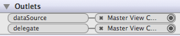

图 45:主场景的桌面视图的插座连接

表视图的数据源是一种特殊的委托，它为表中的每一行提供信息。除了原始数据，还需要一个表视图委托来定义表的行为和每行的外观。与应用程序和文本字段委托一样，它们分别通过名为 [UITableViewDataSource](http://developer.apple.com/library/ios/#documentation/uikit/reference/UITableViewDataSource_Protocol/Reference/Reference.html) 和 [UITableViewDelegate](http://developer.apple.com/library/ios/#documentation/uikit/reference/UITableViewDelegate_Protocol/Reference/Reference.html) 的协议来实现。

在这种情况下，`MasterViewController`类既充当数据源又充当委托，这就是为什么主-细节模板在**主视图控制器. m** 中包含像`tableView:cellForRowAtIndexPath:`和`tableView:canEditRowAtIndexPath:`这样的方法。在下一节中，我们将改变这些方法来改变朋友列表的外观。

### 对主视图控制器进行编码

现在我们对故事板中正在发生的事情有了更好的处理，我们准备开始定制我们的`MasterViewController`类。现在，主场景正在显示一个`NSDate`对象列表，但是我们想将这些对象更改为`Person`对象。当然，这意味着我们需要访问`Person`类，所以在**中导入标题:**

```objc
    #import "Person.h"

```

请记住，`viewDidLoad:`方法告诉主场景的**添加**按钮，每当用户点击它时，就调用`insertNewObject:`方法。我们需要`insertNewObject:`添加一个`Person`对象，而不是在`_objects`数组中添加一个日期对象。将其更改为以下内容:

```objc
    - (void)insertNewObject:(id)sender {
        if (!_objects) {
            _objects = [[NSMutableArray alloc] init];
        }
        Person *friend = [[Person alloc] init];
        friend.firstName = @"<First Name>";
        friend.lastName = @"<Last Name>";
        friend.organization = @"<Organization>";
        friend.phoneNumber = @"<Phone Number>";
        [_objects insertObject:friend atIndex:0];
        NSIndexPath *indexPath = [NSIndexPath indexPathForRow:0 inSection:0];
        [self.tableView insertRowsAtIndexPaths:@[indexPath]
                        withRowAnimation:UITableViewRowAnimationAutomatic];
    }

```

这将实例化一个新的`Person`对象，并用一些伪值填充它，然后用`insertObject:atIndex:`将其添加到`_objects`数组的前面。`NSIndexPath`实例是表示特定单元格索引的简单数据对象，`insertRowsAtIndexPaths:withRowAnimation:`在指定位置添加一个新单元格。

请注意，最后一个方法实际上并没有创建新的单元格——它只是向`_objects`数组添加了一个项目，并告诉表中应该还有一行。这将提示表格创建一个新的单元格，该单元格由`tableView:cellForRowAtIndexPath:`数据源委托方法准备。它应该如下所示:

```objc
    - (UITableViewCell *)tableView:(UITableView *)tableView
             cellForRowAtIndexPath:(NSIndexPath *)indexPath {
        UITableViewCell *cell = [tableView
                                 dequeueReusableCellWithIdentifier:@"Cell"
                                 forIndexPath:indexPath];
        Person *friend = _objects[indexPath.row];
        cell.textLabel.text = [NSString stringWithFormat:@"%@ %@",
                               friend.firstName, friend.lastName];
        return cell;
    }

```

每当表格需要渲染一个给定的单元格时，就调用这个方法，它应该返回一个表示相应行的`UITableViewCell`对象。首先，我们使用故事板中定义的标识符获取一个原型单元，然后使用`NSIndexPath`实例找到相关的`Person`对象。最后，我们通过单元格的`textLabel`属性显示人名。

现在，您应该能够在主场景中添加、查看和删除`Person`对象:

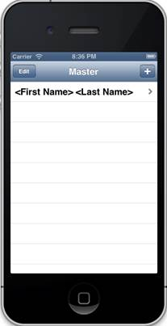

图 46:向主场景添加一个 Person 对象

这涵盖了主场景的基本列表功能，但在进入细节场景之前，我们还有一个任务。当用户选择主列表中的一个项目时，我们需要将该对象传递给细节场景。

请记住，`UINavigationController`和推送片段为我们处理转换，但是它在切换到详细视图之前，通过调用`prepareForSegue:sender:`方法，为我们提供了将数据从源视图控制器发送到目标视图控制器的机会。将**主视图控制器. m** 中的`prepareForSegue:sender:`更改为以下内容(唯一真正的更改是使用`Person`对象而不是`NSDate`实例):

```objc
    - (void)prepareForSegue:(UIStoryboardSegue *)segue sender:(id)sender {
        if ([[segue identifier] isEqualToString:@"showDetail"]) {
            NSIndexPath *indexPath = [self.tableView indexPathForSelectedRow];
            Person *friend = _objects[indexPath.row];
            [[segue destinationViewController] setDetailItem:friend];
        }
    }

```

这种方法是我们在主场景和细节场景之间传递数据的方式。它是为与特定控制器相关联的每个片段调用的，所以我们的第一步是检查片段标识，它是在接口生成器中定义的。然后，我们使用`indexPathForSelectedRow`方法获取所选行的索引(Objective-C 命名约定不是很棒吗)，并使用该索引从`_objects`数组中找到相应的数据项。最后，我们通过设置它的`detailItem`属性将这个对象传递给细节场景。


图 47:从主场景中选择一个人物对象

现在，当您从主列表中选择一个项目时，您应该会看到一个`Person`对象，而不是一个`NSDate`实例。默认的细节场景使用`description`方法将对象转换为字符串，这就是为什么我们在图 47 中看到一个内存地址，而不是任何有意义的信息。我们将在下一节对此进行更改。

总结一下我们的主场景:我们有一个关系连接，将它嵌入到一个`UINavigationController`实例中，一个定义到细节场景的转换的片段，一个我们用作新表格行模板的原型单元格，**添加**按钮，将虚拟实例添加到数据项的主列表中，以及一个`prepareForSegue:sender:`方法，将所选项目传递到细节场景。

## 细节场景

接下来，我们需要配置细节场景来显示选择的朋友。单个`Person`对象总是具有相同数量的信息(姓名、组织和电话号码)，因此我们将使用三个静态单元格来格式化输出，而不是动态原型。就像主场景一样，我们将首先配置界面构建器，然后在布局好用户界面组件后对功能进行编码。

### 切换到表格视图控制器

主-细节模板使用一个普通的`ViewController`作为细节场景，所以我们的第一个任务是用`UITableViewController`替换它。在界面构建器中，选择详细场景，然后按删除将其从故事板中删除。然后，将一个**表格视图控制器**对象从**对象库**拖到场景编辑器中。


图 48:对象库中的表视图控制器

segue 与旧的细节场景一起被删除，因此新的表格视图还不是导航控制器层次结构的一部分。通过从主场景的原型单元拖动到新的细节场景来重新创建分段，然后选择**推送**来创建推送分段。之后，一定要把 segue 的 ID 改回 *showDetail* 。


图 49:重新创建从主场景到细节场景的推送片段

这将**表格视图控制器**与导航层次结构集成在一起，界面构建器通过在细节场景的顶部添加导航栏来反映这一点。但是，导航栏现在是空白的。让我们通过双击空白导航栏的中心并输入*详细信息*作为场景的标题来解决这个问题，如下所示:


图 50:定义细节场景的标题

我们还需要将新场景连接到我们的`DetailViewController`类。在界面构建器中改变类之前，我们需要使`DetailViewController`继承自`UITableViewController`。将 **DetailViewController.h** 中的接口声明更改为以下内容:

```objc
    @interface DetailViewController : UITableViewController

```

然后，再次打开故事板，选择**表格视图控制器**的 dock 中的黄色图标，打开**组件检查器**，将**类**更改为**详细视图控制器**。

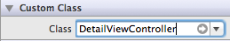

图 51:设置新的表视图控制器的类

现在我们回到了起点，但是我们有一个`Table View Controller`而不是一个正常的`View Controller`。请记住，我们将使用静态表格来显示所选`Person`对象的信息。因此，从文档大纲中选择详细场景的详细视图。


图 52:选择细节场景的表格视图

然后，在**属性检查器**中将**内容**字段更改为**静态单元格**。也可以将**分隔符**改为**无**，**选择**改为**无选择**。这将删除单元格之间的线条，并阻止用户选择它们。


图 53:将表格视图的内容从动态原型更改为静态单元格

现在，您应该会在细节场景中看到三个空白单元格。按住 Shift 键并点按它们来选择它们，然后在**属性检查器**中将它们的**样式**更改为**左细节**。这将为每个单元格添加一个**标题**和一个**详细信息**标签。将标题标签更改为*名称*、*电话*、*组织*，这样您的细节场景看起来如下:

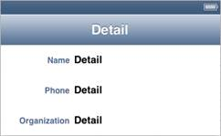

图 54:配置静态单元格的标题标签

在我们给`DetailViewController`类添加了一些属性之后，我们将把剩下的细节标签变成出口，并使用它们来显示所选`Person`的信息。

### 对详细视图控制器进行编码

这就是我们目前在界面构建器中所能做的。让我们给`DetailViewController`添加一些属性，这样我们就可以访问刚刚添加的细节标签。将**详细视图控制器. h** 更改为以下内容:

```objc
    #import <UIKit/UIKit.h>

    @interface DetailViewController : UITableViewController

    @property (strong, nonatomic) id detailItem;
    @property (weak, nonatomic) IBOutlet UILabel *nameLabel;
    @property (weak, nonatomic) IBOutlet UILabel *organizationLabel;
    @property (weak, nonatomic) IBOutlet UILabel *phoneNumberLabel;

    @end

```

回想一下前一章，是`IBOutlet`修改器使这些属性对界面构建器可用。接下来，在 **DetailViewController.m** 中合成这些属性:

```objc
    #import "DetailViewController.h"
    #import "Person.h"

    @implementation DetailViewController

    @synthesize detailItem = _detailItem;
    @synthesize nameLabel = _nameLabel;
    @synthesize organizationLabel = _organizationLabel;
    @synthesize phoneNumberLabel = _phoneNumberLabel;

```

然后，根据从主场景传入的`Person`对象，更改`configureView`方法来设置细节标签的值:

```objc
    - (void)configureView {
        if (self.detailItem &&
            [self.detailItem isKindOfClass:[Person class]]) {
            NSString *name = [NSString stringWithFormat:@"%@ %@",
                              [self.detailItem firstName],
                              [self.detailItem lastName]];
            self.nameLabel.text = name;
            self.organizationLabel.text = [self.detailItem organization];
            self.phoneNumberLabel.text = [self.detailItem phoneNumber];
        }
    }

```

还要注意，我们使用`isKindOfClass:`方法来确保细节项实际上是一个`Person`对象。当使用像`detailItem`这样的动态类型变量时，这是一个最佳实践步骤。

### 出口连接

细节场景的最后一步是将`nameLabel`、`organizationLabel`和`phoneNumberLabel`字段连接到故事板中相应的`UILabel`组件。这可以通过选择细节场景停靠点中的黄色图标并从**连接检查器**中的圆圈拖动到场景编辑器中的标签组件来完成。请务必将每个插座拖到相应的标签上。

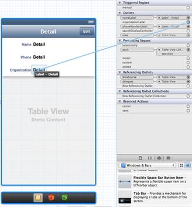

图 55:将标签组件连接到详图控制器

当您编译应用程序时，您应该能够从主列表中选择项目，并在详细场景中查看它们的详细信息。注意我们只能*显示*细节；我们还不能编辑它们。


图 56:完整的细节场景

总结一下对细节场景的修改:我们用`Table View Controller`组件替换了默认控制器，将`DetailViewController`改为从`UITableViewController`继承，重新创建了从主场景到细节场景的 segue，并声明了几个属性作为从`DetailViewController`到`UILabel`实例的出口。所有这些的目标是显示在主场景中选择的`Person`实例的属性。

## 编辑视图控制器

本章的最后一项工作是添加另一个场景，让我们编辑所选项目。我们将使用**模态分段**来实现这个新场景，而不是推送分段。模态片段在现有场景的“顶部”呈现目的地场景，很像桌面计算机中的弹出窗口。这不会影响导航层次结构，因此父级`UINavigationController`不再负责场景之间的导航，而是在必要时以模态方式呈现的场景会自行消失。

例如，我们将在现有的细节场景和新的编辑场景之间添加一个模态分段，然后我们将使用**展开分段**回到原始场景。这给了我们一个新的工具来控制我们的应用程序的流程，它也提供了一个机会，让我们对导航条更加熟悉。

### 创建编辑场景

在我们可以创建一个模态 segue 之前，我们需要一个编辑场景来处理。这个场景的工作方式几乎与细节场景完全一样，只是它将具有`UITextField`组件而不是`UILabel` s，以便用户可以编辑每个属性。首先，创建一个名为`EditViewController`的新类，并使用`UITableViewController`作为超类:


图 57:为编辑视图控制器创建类

接下来，打开界面构建器，将另一个*表格视图控制器*从*对象库*拖动到场景编辑器中。将其放置在细节场景上方，如下所示:


图 58:向故事板添加表格视图控制器

这个新的控制器需要连接到我们刚刚创建的`EditViewController`类，所以在界面编辑器中选择它，打开**身份检查器**，将**类**字段更改为**编辑视图控制器**。


图 59:定义新表视图控制器的类

### 导航到编辑场景

我们的编辑场景将使用导航栏来显示取消和保存按钮。我们可以将其嵌入到根`UINavigationController`中，但是请记住，我们希望以模式化的方式呈现它——而不是通过将它推到现有的视图控制器堆栈上。要给它自己的*导航条，我们需要做的就是把它嵌入自己的导航控制器。在界面构建器中选择**编辑视图控制器**，从 Xcode 菜单中选择**编辑器** *>* **嵌入** *>* **导航控制器**。*

 *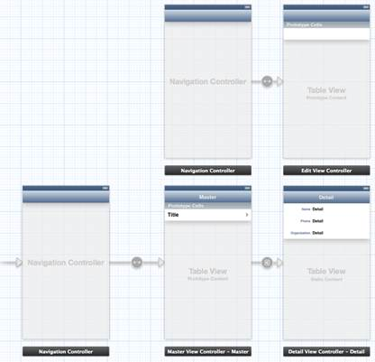

图 60:在新的导航控制器中嵌入编辑场景

而 push segues 让包含导航控制器为您添加导航按钮，我们需要为 modal segue 添加我们自己的按钮。UIKit 框架使用一类特殊的控件用于导航栏。我们正在寻找一个**条按钮项目**，您可以在**对象库**的**窗口&条**部分找到它。

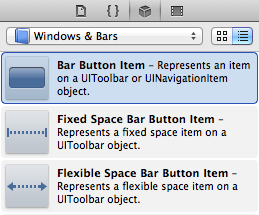

图 61:对象库中的条形按钮项目

将**对象库**中的**栏按钮项目**拖到细节场景导航栏的右侧。应该卡入到位，默认值为*项*，如下图所示:


图 62:向细节场景的导航栏添加编辑按钮

这个按钮会启动编辑场景，所以我们大概应该把文字改成**编辑**。您可以通过在场景编辑器中手动更改文本来完成此操作，但首选方法是从**属性检查器**中选择一种预定义的按钮类型。选择**栏按钮项**，将其**标识符**字段从**自定义**更改为**编辑**。

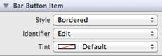

图 63:将栏按钮更改为编辑按钮

这些预定义的类型允许您访问默认的系统图标，这些图标提供了跨应用程序的一致用户体验。对于**添加** *、* **编辑** *、* **完成** *、*和其他基于文本的按钮来说，这并不是什么大不了的事情，但对于像**撰写** *这样的图标类型来说，这可能会有很大的不同:*


图 64:合成栏按钮项目类型

接下来，我们需要将新的编辑按钮过渡到编辑场景。这与从主表单元到细节场景的推送过程相同。控制-从编辑按钮拖动到*新的*导航控制器，选择**模式**进行**动作切换**。您应该会看到一个带有模式图标的新 segue 连接:

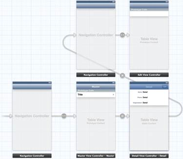

图 65:创建模式片段

与所有 segue 一样，我们的新 modal segue 需要一个唯一的标识符。选择模态段的图标，并在**属性检查器**的**标识符**字段中输入*编辑详细信息*。

现在，您应该能够编译项目(带有一些警告)，并通过点击细节场景中的**编辑**按钮启动一个空的编辑场景。我们的下一个任务将是向编辑场景添加一些用户界面组件，以及一个取消和保存按钮。

### 设计编辑场景

接下来，我们将设计编辑场景。它看起来很像细节场景，除了它将有文本字段而不是标签。我们的第一个任务是给导航栏添加一个标题。双击编辑场景导航栏的中心，并输入*编辑*。之后的场景应该如下所示:


图 66:向编辑场景添加标题

接下来，我们需要将**表格视图**从动态表格更改为静态表格。从**文档轮廓**中选择编辑场景的**表格视图**对象，如下图所示:

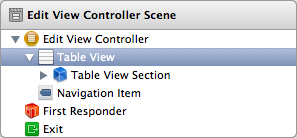

图 67:选择表格视图对象

然后，将**属性检查器**的**内容**字段更改为**静态单元格**。删除场景编辑器中出现的所有静态单元格，只有一个除外。将**选择**字段更改为**无选择**也是一个好主意，因为我们只是将表格用于布局目的。

现在，我们不能对单元格使用任何默认的**样式**值，因为它们都不使用文本字段。相反，我们将从头开始创建单元格。首先，将一个**标签**和一个**文本字段**对象拖到剩余的单元格上，并使用指南确保它们垂直居中。您还应该调整标签和文本字段的大小，使它们看起来如下所示:


图 68:向编辑场景添加标签和文本字段

对于细节场景，我们为单元**样式**指定了**左细节**。这自动定义了组件的样式、字体和对齐方式，但是因为我们正在创建一个自定义单元格，所以我们需要自己来做。所有这些设置都可以在**属性检查器**中为`UILabel`和`UITextField`对象定义。对于标签，将文本更改为*名字*，然后将颜色设置为与细节场景中的标题标签相同。一种方法是打开编辑场景标签的**颜色**面板，选择放大镜(实际上更像滴管)，并从细节场景的标题标签中选择颜色。所选颜色应该是下图中的颜色:

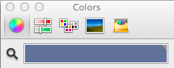

图 69:颜色面板中的“滴管”工具

最后，将字体更改为**系统粗体**，大小为 **12** ，将对齐方式更改为**右侧**。最终设置如下图所示:

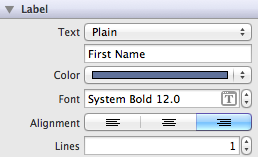

图 70:标签的最终属性

对于文本字段，您只需将**大写**更改为**单词**。要为其他字段创建单元格，请复制并粘贴现有单元格三次，并将它们的标签更改为*姓氏*、*电话*和*组织*。这将为您提供下表:

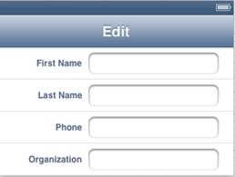

图 71:带有适当标签的编辑场景表格单元

您还应该将**电话**文本字段的**键盘**字段更改为**数字键盘**，以显示数字键盘，而不是 QWERTY 键盘。这涵盖了编辑场景的表格，但是如果您现在尝试编译项目，您会注意到所有这些单元格都消失了。这是因为类模板提供的 **EditViewController.m** 定义了几个数据源方法，将表当作一个原型单元格。我们将在下一节中删除这些内容。

但是在此之前，让我们在导航栏上添加两个按钮，以便用户可以选择是要取消还是保存编辑。将两个条形按钮项目从**对象库**拖到导航栏的两侧。将左侧按钮的**标识符**字段更改为*取消*，将右侧按钮更改为*保存。*

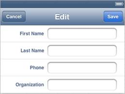

图 72:编辑场景的完整布局

请注意**保存**按钮是亮蓝色的，符合 iOS UX 的惯例。同样，这些默认的**标识符**有助于确保跨应用程序的一致用户界面。

### 对编辑视图控制器进行编码

在本节中，我们将对刚刚添加到故事板中的用户界面组件背后的功能进行编码。两个主要任务是为文本字段准备出口，以便我们可以从`EditViewController`类访问它们，并实现一个文本字段委托，以便用户可以关闭文本字段。这应该都是前一章的回顾。首先，让我们给头文件添加几个属性:

```objc
    // EditViewController.h
    #import <UIKit/UIKit.h>

    @interface EditViewController : UITableViewController

    @property (strong, nonatomic) id detailItem;

    @property (weak, nonatomic) IBOutlet UITextField *firstNameField;
    @property (weak, nonatomic) IBOutlet UITextField *lastNameField;
    @property (weak, nonatomic) IBOutlet UITextField *phoneNumberField;
    @property (weak, nonatomic) IBOutlet UITextField *organizationField;

    @end

```

这个实现看起来很像。它所做的只是确保当`detailItem`属性改变时，文本字段被更新:

```objc
    // EditViewController.m
    #import "EditViewController.h"
    #import "Person.h"

    @implementation EditViewController

    @synthesize detailItem = _detailItem;
    @synthesize firstNameField = _firstNameField;
    @synthesize lastNameField = _lastNameField;
    @synthesize phoneNumberField = _phoneNumberField;
    @synthesize organizationField = _organizationField;

    - (void)setDetailItem:(id)detailItem {
        if (_detailItem != detailItem) {
            _detailItem = detailItem;
            [self configureView];
        }
    }

    - (void)configureView {
        if (self.detailItem && [self.detailItem isKindOfClass:[Person class]]) {
            self.firstNameField.text = [self.detailItem firstName];
            self.lastNameField.text = [self.detailItem lastName];
            self.phoneNumberField.text = [self.detailItem phoneNumber];
            self.organizationField.text = [self.detailItem organization];
        }
    }

    - (void)viewDidLoad {
        [super viewDidLoad];
        [self configureView];
    }

    - (void)didReceiveMemoryWarning {
        [super didReceiveMemoryWarning];
    }

    @end

```

接下来，我们需要准备文本字段委托。在 **EditViewController.h** 中，用下面一行告诉全班同学采用`UITextFieldDelegate`协议:

```objc
    @interface EditViewController : UITableViewController <UITextFieldDelegate>

```

和前一章一样，我们可以通过实现`textFieldShouldReturn:`方法来消除键盘。在中增加以下内容:

```objc
    - (BOOL)textFieldShouldReturn:(UITextField *)textField {
        if ((textField == self.firstNameField) ||
            (textField == self.lastNameField) ||
            (textField == self.phoneNumberField) ||
            (textField == self.organizationField)) {
            [textField resignFirstResponder];
        }
        return YES;
    }

```

回想一下，就在 iOS 切换到目标场景之前，在源场景上调用了`prepareForSegue:sender:`方法。就像我们在主场景中所做的那样，我们将使用它来将所选项目发送到编辑场景。在 **DetailViewController.m** 中，增加以下方法:

```objc
    - (void)prepareForSegue:(UIStoryboardSegue *)segue sender:(id)sender {
        if ([[segue identifier] isEqualToString:@"editDetail"]) {
            NSArray *navigationControllers = [[segue destinationViewController] viewControllers];
            EditViewController *editViewController = [navigationControllers objectAtIndex:0];
            [editViewController setDetailItem:self.detailItem];
        }
    }

```

请记住，编辑场景嵌入在导航控制器中，因此模态 segue 指向*导航控制器*，而不是编辑场景本身。这个介入的导航控制器增加了一个额外的步骤，在主场景的`prepareForSegue:sender:`方法中我们不需要担心。要获得编辑场景，我们需要查询导航控制器的`viewControllers`属性，它是一个包含其导航栈的数组。由于编辑场景是唯一的子视图控制器，我们可以通过`objectAtIndex:0`调用访问它。一旦有了`EditViewController`实例，我们只需将所选项目从细节场景转发到编辑场景。

### 出口和代理连接

回到故事板，让我们连接刚刚暴露的出口和代表。对于网点，在编辑场景的 dock 中选择黄色图标，打开**连接检查器**，从**名字字段**、**姓氏字段**、**组织字段**、**电话号码字段**中拖动到场景中对应的文本字段。


图 73:创建插座连接

要将`EditViewController`设置为文本字段的代表，选择每个文本字段，打开**连接检查器**，从**代表**圆圈拖动到 dock 中的黄色图标，如下图所示。对每个文本字段执行此操作。


图 74:创建委托连接

当您编译项目时，您应该能够启动编辑场景，并看到用所选`Person`对象的属性填充的文本字段。希望到目前为止，你已经比较习惯自己建立这种出口和代理连接。

您可以编辑这些值，但是由于我们还没有实现**取消**或**保存**按钮，您将无法更改底层`Person`对象，甚至无法导航离开编辑场景。

### 展开分段

还记得在细节场景的导航栏中自动出现的**主**按钮吗？主/细节场景的导航控制器为我们设置了这个“后退”按钮，但是由于我们使用的是模态分段，我们需要手动关闭模态呈现的编辑场景。我们将使用所谓的**展开片段**返回到细节场景。

展开分段和其他分段之间的主要区别在于前者使用一个*现有的*场景作为目的地，而模态和推送分段创建一个*新的*实例作为它们的目的地场景。如果你正在做大量的来回转换，记住这一点很重要。

展开一个场景的过程也和启动一个推送片段有点不同。它使用目标动作设计模式，我们在上一章中讨论过。除了在源场景中调用`prepareForSegue:sender:`方法外，解绕段还在*目的地*场景(`DetailViewController`)中调用任意方法。让我们在**详细视图控制器中声明取消和保存操作。**

```objc
    - (IBAction)save:(UIStoryboardSegue *)sender;
    - (IBAction)cancel:(UIStoryboardSegue *)sender;

```

稍后，我们将把这些方法附加到编辑场景中的**取消**和**保存**按钮。但首先，我们需要实施它们。在**细节视图控制器**中增加以下方法:

```objc
    - (IBAction)save:(UIStoryboardSegue *)segue {
        if ([[segue identifier] isEqualToString:@"saveInput"]) {
            EditViewController *editController = [segue sourceViewController];
            [self.detailItem setFirstName:editController.firstNameField.text];
            [self.detailItem setLastName:editController.lastNameField.text];
            [self.detailItem setPhoneNumber:editController.phoneNumberField.text];
            [self.detailItem setOrganization:editController.organizationField.text];
            [self configureView];
        }
    }

    - (IBAction)cancel:(UIStoryboardSegue *)segue {
        if ([[segue identifier] isEqualToString:@"cancelInput"]) {
            // Custom cancel handling can go here.
        }
    }

```

这些都很简单。`save:`方法根据编辑场景中的文本字段值更新`detailItem`的属性，然后通过调用`configureView`更新其标签。`cancel:`方法只是忽略编辑场景中发生的任何事情。

现在，我们可以创建一个展开段来消除编辑场景，并调用适当的方法。配置展开分段类似于创建推送分段:您可以从启动分段的用户界面组件控制拖动到 dock 中的绿色**退出**图标。该图标专门用于创建展开段。


图 75:坞站中的退出图标(最右侧)

因此，从编辑场景中的**保存**按钮控制拖动到 dock 中的**退出**图标，如下图所示:


图 76:为保存按钮创建展开段

将弹出一个菜单，要求您将某个动作与该片段相关联:

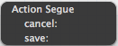

图 77:选择展开段的动作

当然，你会想选择`save:`。这就是创建展开段所需要做的。重复**取消**按钮的过程后，您应该会在文档大纲中看到两个展开段:


图 78:文档大纲中的展开部分

与推送和模态分段不同，展开分段在界面构建器中没有可视化表示，因此文档大纲是您选择它们的唯一方式。我们的最后一步是通过**属性检查器**为这两个片段添加唯一的标识符。将`cancelInput`用于**取消**按钮，将`saveInput`用于**保存**按钮(注意，这是我们分别在`cancel:`和`save:`方法中检查的标识符)。同样，因为我们的示例应用程序非常简单，所以添加 segue 标识符更像是一个最佳实践步骤，而不是必须的。


图 79:定义展开段标识符

你可以把一个展开片段想象成一个过渡和一个按钮的组合。segue 负责消除场景(即转换到父场景)，但是由于它是由一个按钮启动的，所以您也可以使用目标动作模式为它附加一个方法。

我们的编辑场景现在已经完成，您应该能够编译项目，在编辑场景的文本字段中输入值，并选择取消或保存您的更改。由于`save:`方法在保存新值后调用`configureView`，细节场景将更新以反映编辑。但是我们从来没有告诉主场景更新本身，所以你的改动会*而不是*体现在主列表中。

### 更新主列表

本章的最后一个任务是更新主场景的表，以反映底层数据的任何变化。有许多方法可以做到这一点，但最简单的(虽然不一定是最有效的)是每次显示主场景时重新加载表。

`UIViewController`定义一个名为`viewWillAppear:`的方法，并在相关场景显示之前调用它。这与`viewDidLoad:`不同，后者首先得到视图显示的*时间。由于每次用户导航到主场景时，父导航控制器都会显示主场景的相同*实例，因此我们需要使用`viewWillAppear:`方法来代替`viewDidAppear:`。在**主视图控制器. m** 中，增加以下方法:**

```objc
    - (void)viewWillAppear:(BOOL)animated {
        [super viewWillAppear:animated];
        UITableView *view = (UITableView *)self.view;
        [view reloadData];
    }

```

首先，我们将方法传递给`super`，然后通过`view`属性获取控制器的根`UIView`实例。我们可以假设这是一个`UITableView`，因为`MasterViewController`继承自`UITableViewController`，但是我们还是需要对其进行强制转换，防止编译器抱怨。`UITableView`的`reloadData`方法基于基础数据集(即`_objects`数组)重新生成表格单元格，主列表现在应该反映您从编辑场景中保存的任何更改。


图 80:完整的主场景

## 总结

在本章中，我们学习了如何在一个应用程序中管理多个场景。我们实验了`UITableViewControllers`、`UINavigationControllers`，以及各种片段。本章最重要的概念之一是我们如何在每个场景之间传输数据:通过`prepareForSegue:sender:`方法和`save:`和`cancel:`方法进行展开。大多数应用程序实际上只是复杂数据结构的用户友好的编辑器，所以理解这些数据是如何传递的对有效组织 iOS 项目有很大帮助。

前两章涵盖了创建简单用户界面所需的所有知识。在本书的剩余部分，我们将探索用于访问媒体素材、本地化资源和播放 UI 音效的其他 iOS 框架。***