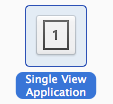
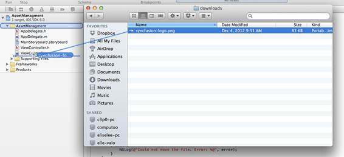
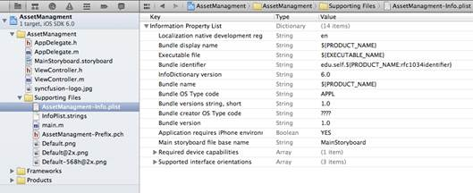
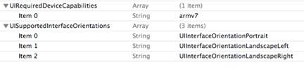
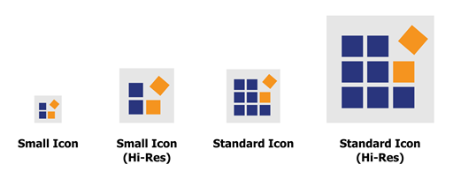
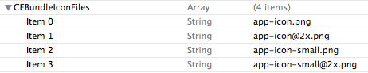
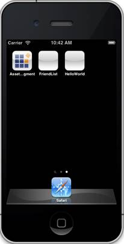
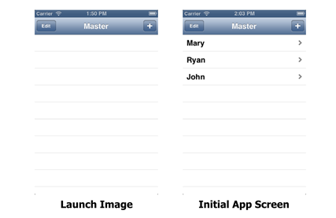

# 三、素材管理

现在我们已经对 iOS 场景管理有了基本的了解，接下来要解决的一个大问题是如何管理应用程序中的多媒体素材。iOS 应用程序使用与任何其他现代操作系统相同的分层文件系统来存储其素材。文本、图像、音频和视频文件被组织到文件夹中，并使用类似**Documents/some picture . png**的熟悉文件路径进行访问。

在本章中，我们将了解应用程序的标准文件结构；如何向项目添加资源；以及如何定位、加载和保存文件。我们还将讨论所有 iOS 应用程序所需的素材。

在本章中，我们将讨论文件和文件夹，但请记住，文件系统应该对 iOS 用户完全隐藏。iOS 鼓励开发人员将文件系统呈现为面向用户的文档，而不是向用户显示应用程序背后的文件和文件夹。例如，在草图应用程序中，图纸应列出语义显示名称，并组织成草图簿或类似的抽象组织结构。永远不要像**sketchbook-1/your-drawing . SVG**那样显示用户文件路径。

## 概念概述

### 应用沙箱

iOS 文件系统的设计考虑到了安全性。iOS 没有允许应用程序访问设备的整个文件系统，而是为每个应用程序提供了自己独立的文件系统(沙盒)。这意味着您的应用程序无法访问其他应用程序生成的文件。当您需要访问不属于您的应用程序的信息(例如用户的联系人列表)时，您可以向中介(例如[地址簿框架](http://developer.apple.com/library/ios/#documentation/AddressBook/Reference/AddressBook_iPhoneOS_Framework/_index.html%23//apple_ref/doc/uid/TP40007212))请求，而不是直接访问文件。

沙盒就像一个迷你文件系统，专门用于你的应用程序的操作。所有应用程序都使用由四个顶级目录组成的规范文件结构，每个目录存储特定类型的文件:

*   **app name . app**—应用捆绑包，包含您的应用的可执行文件及其所有必需的媒体素材。你可以从这个文件夹中读取，但不应该写入。下一节将更详细地讨论捆绑包。
*   **Documents/**—用户生成的内容和其他关键数据文件的文件夹，您的应用程序无法重新创建这些文件。该目录的内容可通过 iCloud 获得。
*   **Library/**—一个文件夹，用于存放用户未使用但在两次启动之间仍需保留的应用程序文件。
*   **tmp/**—应用程序运行时使用的临时文件文件夹。该文件夹中的文件不一定在应用程序启动之间保持不变。iOS 将在应用程序不运行时，在必要时自动删除临时文件，但作为最佳实践，您应该在完成后立即手动删除临时文件。

当用户安装应用程序时，会创建一个包含所有这些文件夹的新沙箱。之后，您的应用程序可以在这些顶级文件夹中动态创建任意子目录。还有一些预定义的子目录，如下列表所述:

*   **库/应用程序支持/**—支持文件的文件夹，必要时可以重新创建。这包括下载和生成的内容。您应该使用`com.apple.MobileBackup`扩展属性来防止该文件夹被备份。
*   **库/缓存/**—缓存文件的文件夹。这些文件可以在不通知的情况下删除，因此您的应用程序应该能够优雅地重新创建它们。该文件夹也是存储下载内容的合适位置。

重要的是将文件放在适当的文件夹中，以确保它们得到正确备份，而不会占用用户设备上不必要的空间。iTunes 会自动备份 **Documents/** 和 **Library/** 文件夹中的文件(除了 **Library/Cache/** )。应用捆绑包和 **tmp/** 文件夹都不需要备份。

### 捆

iOS 应用程序不仅仅是一个可执行文件，它还包含不同地区的媒体、数据文件以及可能的本地化文本。为了简化部署，Xcode 将可执行文件及其所有必需的文件打包到一个名为**应用捆绑包**的特殊文件夹中。尽管是一个文件夹，应用程序捆绑包使用**。app** 扩展。您可以将应用程序捆绑包想象成一个 ZIP 文件，当您打开它时，它会运行一个应用程序。

由于您的应用程序包包含所有媒体素材，因此您需要在程序运行时与它进行交互。`NSBundle`类使得在应用程序包中搜索特定文件变得容易，然后其他类可以加载这些文件。例如，您可以使用`NSBundle`定位特定的图像文件，然后使用`UIImage`类将其添加到视图中。我们将在另一部分“T3 应用捆绑包”中进行讨论

## 创建示例应用程序

本章使用一个简单的应用程序来探索 iOS 中访问文件的一些基本方法。首先打开 Xcode，新建一个项目，模板选择**单视图应用**。



图 81:创建新的单视图应用程序

对**产品名称**使用*素材管理*，对**公司标识符***使用*教育自己*，并确保选择了**使用故事板**和**使用自动参考计数**。*

 *

图 82:配置新项目

你可以在任何你喜欢的地方保存这个项目。

## 文件系统

在我们进入应用程序的多媒体素材之前，我们将了解访问文件系统的基本工具。接下来的几节将讨论如何生成文件路径、创建纯文本文件以及将它们加载回应用程序。

### 定位标准目录

最常见的文件系统任务之一是生成特定资源的路径。但是，在您可以访问任何给定的文件之前，您需要找到应用程序沙箱或前面讨论过的顶级文件夹的路径。最简单的方法是通过全局`NSHomeDirectory()`函数，该函数返回应用程序沙箱的绝对路径。例如，尝试将**视图控制器. m** 的`viewDidLoad`方法更改为以下内容:

```objc
    - (void)viewDidLoad {
        [super viewDidLoad];
        NSString *sandboxPath = NSHomeDirectory();
        NSLog(@"The app sandbox resides at: %@", sandboxPath);
    }

```

当应用程序加载到 iOS 模拟器中时，您应该会在 Xcode 的输出面板中看到如下内容。

```objc
    /Users/ryan/Library/Application Support/iPhone Simulator/6.0/Applications/9E38D1C4-8B11-4599-88BE-CD9E36C21A41

```

该路径代表应用程序的根。如果您在终端中导航到该目录，您会发现以下四个目录:

```objc
    AssetManagement.app
    Documents/
    Library/
    tmp/

```

毫不奇怪，这是前面讨论的规范文件结构。当然，当您的应用程序在 iOS 设备上运行时，`NSHomeDirectory()`将返回不同的路径。使用`NSHomeDirectory()`而不是手动生成应用程序的路径背后的想法是确保您总是有正确的根路径，无论您的应用程序驻留在哪里。

相关的`NSTemporaryDirectory()`函数返回 **tmp/** 目录的路径。对于其他标准应用程序文件夹，您需要使用`NSFileManager`类。

```objc
    - (void)viewDidLoad {
        [super viewDidLoad];
        NSFileManager *sharedFM = [NSFileManager defaultManager];
        NSArray *paths = [sharedFM URLsForDirectory:NSLibraryDirectory
                                          inDomains:NSUserDomainMask];
        if ([paths count] > 0) {
            NSLog(@"The Library subfolder: %@", paths[0]);
        }
    }

```

如您所见，`NSFileManager`是作为单例实现的，共享实例应该通过`defaultManager`类方法访问。`NSSearchPathDirectory`枚举定义了几个常数，代表 OS X 和 iOS 应用程序使用的标准位置。其中一些位置(例如`NSDesktopDirectory`)在 iOS 应用程序中不适用，但是`URLsForDirectory:inDomains:`方法仍然会返回应用程序沙箱中相应的子文件夹。我们讨论过的目录的常量如下所示。

```objc
    NSDocumentDirectory                /*  Documents/                    */
    NSLibraryDirectory                 /*  Library/                      */
    NSCachesDirectory                  /*  Library/Caches                */
    NSApplicationSupportDirectory      /*  Library/Application Support/  */

```

`URLsForDirectory:inDomains:`方法返回包含 [NSURL](http://developer.apple.com/library/mac/#documentation/Cocoa/Reference/Foundation/Classes/NSURL_Class/Reference/Reference.html%23//apple_ref/doc/uid/TP40003752) 对象的`NSArray`，这是文件路径的面向对象表示。

### 生成文件路径

一旦您有了其中一个标准目录的位置，您就可以使用`NSURL`实例方法手动组装到特定文件的路径(注意`NSString`也提供了相关的实用程序，但是`NSURL`是表示文件路径的首选方式)。

例如，`URLByAppendingPathComponent:`方法提供了一种直接生成特定文件路径的方法。以下代码片段在应用程序的**库/** 目录中创建了一个名为 **someData.txt** 的文件路径:

```objc
    - (void)viewDidLoad {
        [super viewDidLoad];
        NSFileManager *sharedFM = [NSFileManager defaultManager];
        NSArray *paths = [sharedFM URLsForDirectory:NSLibraryDirectory
                                          inDomains:NSUserDomainMask];
        if ([paths count] > 0) {
            NSURL *libraryPath = paths[0];
            NSURL *appDataPath = [libraryPath
                                  URLByAppendingPathComponent:@"someData.txt"];
            NSLog(@"%@", appDataPath);
        }
    }

```

下面的列表描述了一些其他有用的`NSURL`实例方法。它们共同提供了导航文件层次结构和手动确定文件名和类型的基本功能。

*   `URLByDeletingLastPathComponent`—返回一个新的`NSURL`，代表接收路径的父文件夹。
*   `lastPathComponent`-以字符串形式返回路径中的最终组件。这可能是文件夹名或文件名，具体取决于路径。
*   `pathExtension`—以字符串形式返回路径的文件扩展名。如果路径不包含句点，它将返回一个空字符串，否则它将返回句点之后的最后一组字符。
*   `pathComponents`-将路径分解为其组成部分，并将它们作为`NSArray`返回。

### 保存和加载文件

重要的是要理解`NSURL`只描述了资源的*位置*，它并不代表实际的文件或文件夹本身。要获取文件数据，您需要某种方式来解释它。 [NSData](https://developer.apple.com/library/mac/#documentation/Cocoa/Reference/Foundation/Classes/NSData_Class/Reference/Reference.html) 类提供了读取原始字节的低级应用编程接口，但大多数情况下，您会希望使用更高级别的接口来解释文件的内容。

iOS 框架包括许多用于保存和加载不同类型文件的类。例如， [NSString](http://developer.apple.com/library/mac/#documentation/Cocoa/Reference/Foundation/Classes/NSString_Class/Reference/NSString.html%23//apple_ref/occ/cl/NSString) 可以读写文本文件， [UIImage](http://developer.apple.com/library/ios/#documentation/uikit/reference/UIImage_Class/Reference/Reference.html) 可以显示视图内部的图像， [AVAudioPlayer](https://developer.apple.com/library/mac/#documentation/AVFoundation/Reference/AVAudioPlayerClassReference/Reference/Reference.html) 可以播放从文件加载的音乐。一旦我们到达应用程序捆绑包，我们将会看到`UIImage`，但是现在，让我们继续基本的文本文件操作。

用`NSString`保存文件，使用`writeToURL:automatically:encoding:error:`方法。第一个参数是代表文件路径的`NSURL`，第二个参数确定是否首先将其保存到辅助文件，第三个参数是由`[NSStringEncoding](https://developer.apple.com/library/mac/#documentation/Cocoa/Reference/Foundation/Classes/NSString_Class/Reference/NSString.html)`枚举定义的常量之一，`error`参数是对`NSError`实例的引用，如果方法失败，该实例将记录错误详细信息。下面的代码片段通过在**库/** 文件夹中创建一个名为 **someData.txt** 的纯文本文件来演示`writeToURL:automatically:encoding:error:`。

```objc
    - (void)viewDidLoad {
        [super viewDidLoad];
        NSFileManager *sharedFM = [NSFileManager defaultManager];
        NSArray *paths = [sharedFM URLsForDirectory:NSLibraryDirectory
                                          inDomains:NSUserDomainMask];
        if ([paths count] > 0) {
            NSURL *libraryPath = paths[0];
            NSURL *appDataPath = [libraryPath 
                                  URLByAppendingPathComponent:@"someData.txt"];

            NSString *someAppData = @"Hello, World! This is a file I created dynamically";
            NSError *error = nil;
            BOOL success = [someAppData writeToURL:appDataPath
                                         atomically:YES
                                           encoding:NSUnicodeStringEncoding
                                              error:&error];
            if (success) {
                NSLog(@"Wrote some data to %@", appDataPath);
            } else {
                NSLog(@"Could not write data to file. Error: %@", error);
            }
        }
    }

```

保存或加载文本文件时，必须指定文件编码，否则在写入或读取文件时，您的文本数据可能会被意外更改。这里包括一些常见的编码常数:

*   `NSASCIIStringEncoding` —带有 8 位字符的 7 位 ASCII 编码(ASCII 值 0-127)。
*   `NSISOLatin1StringEncoding` —8 位 ISO 拉丁 1 编码。
*   `NSUnicodeStringEncoding` —Unicode 编码。

当有疑问时，您可能希望使用`NSUnicodeStringEncoding`来确保多字节字符被正确解释。

要加载文本文件，可以使用相关的`stringWithContentsOfURL:encoding:error:`。这与`writeToURL:automatically:encoding:error:`的工作原理非常相似，但是它是作为类方法而不是实例方法来实现的。以下示例将前一个代码片段创建的文本文件加载回应用程序。

```objc
    - (void)viewDidLoad {
        [super viewDidLoad];
        NSFileManager *sharedFM = [NSFileManager defaultManager];
        NSArray *paths = [sharedFM URLsForDirectory:NSLibraryDirectory
                                          inDomains:NSUserDomainMask];
        if ([paths count] > 0) {
            NSURL *libraryPath = paths[0];
            NSURL *appDataPath = [libraryPath
                                  URLByAppendingPathComponent:@"someData.txt"];

            NSError *error = nil;
            NSString *loadedText = [NSString
                                    stringWithContentsOfURL:appDataPath
                                    encoding:NSUnicodeStringEncoding
                                    error:&error];
            if (loadedText != nil) {
                NSLog(@"Successfully loaded text: %@", loadedText);
            } else {
                NSLog(@"Could not load data from file. Error: %@", error);
            }
        }
    }

```

在现实世界中，您可能会保存和加载动态生成的数据，而不是硬编码为文字字符串的数据。例如，您可以在文本文件中存储在应用程序启动之间需要保持的模板首选项或用户信息。从纯文本中手动加载和解释这些数据是完全可能的，但是请记住，有几个内置工具用于处理和存储结构化数据，甚至整个 Objective-C 对象。例如，`NSDictionary`定义了一个名为`dictionaryWithContentsOfURL:`的方法，该方法加载一个包含键值对的 XML 文件。

### 操作目录

前面描述的`NSString`方法将文件的创建和内容的写入结合到一个步骤中，但是要创建目录，我们需要返回到`NSFileManager`类。它定义了几个方法，让你改变目录的内容。

#### 创建目录

`createDirectoryAtURL:withIntermediateDirectories:attributes:error:`实例方法在指定路径创建一个新目录。第二个参数是一个布尔值，确定是否应该自动创建中间目录，`attributes`允许您为新目录定义文件属性，最后一个参数是对`NSError`实例的引用，该实例将包含方法失败时的错误详细信息。

例如，如果您的应用程序使用从服务器下载的自定义模板，您可以将它们保存在**库/模板/** 中。要创建此文件夹，您可以使用类似以下的内容:

```objc
    - (void)viewDidLoad {
        [super viewDidLoad];
        NSFileManager *sharedFM = [NSFileManager defaultManager];
        NSArray *paths = [sharedFM URLsForDirectory:NSLibraryDirectory
                                          inDomains:NSUserDomainMask];
        if ([paths count] > 0) {
            NSURL *libraryPath = paths[0];
            NSURL *templatesPath = [libraryPath
                                    URLByAppendingPathComponent:@"Templates"];

            NSError *error = nil;
            BOOL success = [sharedFM createDirectoryAtURL:templatesPath
                              withIntermediateDirectories:YES
                                               attributes:nil
                                                    error:&error];
            if (success) {
                NSLog(@"Successfully created a directory at %@",
                      templatesPath);
            } else {
                NSLog(@"Could not create the directory. Error: %@", error);
            }
        }
    }

```

将`attributes`参数保留为`nil`告诉方法使用当前进程的默认组、所有者和权限。

#### 移动文件/目录

`NSFileManager`类也可以通过其`moveItemAtURL:toURL:error:`实例方法来移动或重命名文件和文件夹。它的工作原理如下:

```objc
    - (void)viewDidLoad {
        [super viewDidLoad];
        NSFileManager *sharedFM = [NSFileManager defaultManager];
        NSArray *paths = [sharedFM URLsForDirectory:NSLibraryDirectory
                                          inDomains:NSUserDomainMask];
        if ([paths count] > 0) {
            NSURL *libraryPath = paths[0];
            NSURL *sourcePath = [libraryPath
                                 URLByAppendingPathComponent:@"someData.txt"];
            NSURL *destinationPath = [libraryPath
                            URLByAppendingPathComponent:@"someOtherData.txt"];

            NSError *error = nil;
            BOOL success = [sharedFM moveItemAtURL:sourcePath
                                             toURL:destinationPath
                                             error:&error];
            if (success) {
                NSLog(@"Successfully moved %@ to %@",
                      sourcePath,
                      destinationPath);
            } else {
                NSLog(@"Could not move the file. Error: %@", error);
            }
        }
    }

```

这将我们之前创建的 **someData.txt** 文件重命名为**somedata . txt**。如果需要复制文件，可以使用`copyItemAtURL:toURL:error:`，工作原理相同，但源文件保持不变。

#### 删除文件/目录

最后，`NSFileManager`的`removeItemAtURL:error:`方法可以让你删除文件或文件夹。只需传递包含要移除的路径的`NSURL`实例，如下所示:

```objc
    [sharedFM removeItemAtURL:targetURL error:&error];

```

如果`targetURL`是一个目录，它的内容将被递归删除。

#### 列出目录的内容

也可以使用`NSFileManager`的`enumeratorAtPath:`方法列出文件夹中的文件和子目录。这会返回一个 [NSDirectoryEnumerator](http://developer.apple.com/library/mac/#documentation/Cocoa/Reference/Foundation/Classes/NSDirectoryEnumerator_Class/Reference/Reference.html%23//apple_ref/occ/cl/NSDirectoryEnumerator) 对象，您可以使用它来遍历每个文件或文件夹。例如，您可以将顶级**文档/** 目录的内容列表如下:

```objc
    - (void)viewDidLoad {
        [super viewDidLoad];
        NSFileManager *sharedFM = [NSFileManager defaultManager];
        NSArray *paths = [sharedFM URLsForDirectory:NSDocumentDirectory
                                          inDomains:NSUserDomainMask];
        if ([paths count] > 0) {
            NSString *documentsPath = [paths[0] path];
            NSLog(@"%@", documentsPath);
            NSDirectoryEnumerator *enumerator = [sharedFM enumeratorAtPath:documentsPath];
            id object;
            while(object = [enumerator nextObject]) {
                NSLog(@"%@", object);
            }
        }
    }

```

注意这个枚举器将遍历*所有*子目录。您可以通过在`NSDirectoryEnumerator`实例上调用`skipDescendents`方法，或者使用更复杂的`NSFileManager`的`enumeratorAtURL:includingPropertiesForKeys:options:errorHandler:`方法来改变这种行为。

## 应用捆绑包

前面讨论的文件访问方法通常仅用于与运行时动态创建的文件进行交互。标准的**库/** 、**文档/** 和 **tmp/** 文件夹是安装应用程序的设备本地的，它们最初是空的。对于作为应用程序本身重要部分的素材(而不是由应用程序创建的*，我们需要另一个工具——应用程序捆绑包。*

应用程序包代表您的整个项目，它由 iOS 可执行文件以及该可执行文件所需的所有图像、声音、视频和配置文件组成。应用程序捆绑包是用户下载应用程序时实际安装的东西，因此，与沙盒目录的内容不同，您可以假设所有支持资源都将存在，而不管您的应用程序驻留在什么设备上。

从概念上来说，一个包只是一堆文件，但是与它进行交互与使用上一节中的文件系统方法有一点不同。您可以使用`NSBundle`类作为应用程序媒体素材的高级接口，而不是手动生成文件路径并使用`writeToURL:automatically:encoding:error:`等方法保存或加载数据。这将媒体素材背后的一些细节委托给了底层系统。

除了自定义媒体素材，应用捆绑包还包含几个必需的资源，如出现在用户主屏幕上的应用图标和重要的配置文件。我们将在“[所需资源](#sigil_toc_id_64)”部分讨论这些。

### 向捆绑包添加素材

请记住，应用程序捆绑包中的素材是静态的，因此它们总是在编译时被包含在内。要将媒体素材添加到项目中，只需将文件从 **Finder** 拖到 Xcode 中的**项目导航器**面板中。我们将添加一个名为**syncfusion-logo.jpg**的文件，你可以在这本书的资源包中找到，但是你可以使用任何你喜欢的图片。在下一节中，我们将学习如何访问捆绑包以在视图中显示该图像。



图 83:向应用程序包添加图像

松开鼠标后，Xcode 会向您显示一个对话框，询问配置选项。应选中**将项目复制到目标组的文件夹中**复选框。这告诉 Xcode 将素材复制到项目文件夹中，这通常是理想的行为。**为任何添加的文件夹创建组**选项使用 Xcode 分组机制。**增加目标**是最重要的配置选项。它定义了编译素材的构建目标。如果**素材管理**没有被选中，那就像我们从未将其添加到项目中一样。


图 84:为新媒体素材选择配置选项

单击**完成**后，您应该会在 Xcode 项目导航器中看到您的文件:


图 85:项目导航器中的媒体素材

现在您的应用程序包中有了一个自定义资源，您可以通过`NSBundle`访问它。

### 访问捆绑资源

您应该始终使用 [NSBundle](https://developer.apple.com/library/mac/#documentation/Cocoa/Reference/Foundation/Classes/NSBundle_Class/Reference/Reference.html) 类作为应用程序捆绑包的编程接口，而不是使用`NSURL`手动创建文件路径。它提供了优化的搜索功能和内置的国际化功能，我们将在下一章中讨论。

`mainBundle`类方法返回代表应用程序包的`NSBundle`实例。一旦你有了这个，你可以使用`pathForResource:ofType:`实例方法来定位资源。iOS 使用特殊的文件命名约定，使得`NSBundle`可以根据资源的使用方式返回不同的文件。将文件名和扩展名分开可以让`pathForResource:ofType:`自动找出要使用的文件，也可以让`NSBundle`自动选择本地化的文件。

例如，以下代码在应用程序包中定位一个名为`syncfusion-logo`的 JPEG 文件:

```objc
    - (void)viewDidLoad {
        [super viewDidLoad];

        // Find the resource.
        NSString *imagePath = [[NSBundle mainBundle]
                               pathForResource:@"syncfusion-logo"
                               ofType:@"jpg"];
        NSLog(@"Image path: %@", imagePath);

        // Load the resource.
        UIImage *imageData = [[UIImage alloc]
                              initWithContentsOfFile:imagePath];
        if (imageData != nil) {
            NSLog(@"Image size: %.0fx%.0f",
                  imageData.size.width, imageData.size.height);
        } else {
            NSLog(@"Could not load the file");
        }
    }

```

像文本文件一样，定位图像和加载图像是独立的操作。第一个`NSLog()`调用应该在 Xcode 输出面板中显示类似`/path/to/sandbox/AssetManagement.app/your-image.jpg`的内容。

`UIImage`类表示图像文件的内容，它几乎可以处理任何类型的图像格式(JPEG、PNG、GIF、TIFF、BMP 和其他一些格式)。一旦你用`NSBundle`获得了图像位置，你就可以把它传给`UIImage`的`initWithContentsOfFile:`方法。如果文件加载成功，您将能够通过`size`属性访问图像的尺寸，这是一个包含`width`和`height`浮点字段的`CGSize`结构。

虽然`UIImage`确实定义了一些将关联图像绘制到屏幕上的方法(即`drawAtPoint:`和`drawInRect:`，但是使用`UIImageView`类显示它通常更容易。由于它是`UIView`的一个子类，因此可以使用所有视图实例通用的`addSubview:`方法将其添加到现有的视图层次结构中。`UIImageView`还提供了控制动画播放的便捷界面。要在根视图对象中显示`UIImage`，请将**视图控制器. m** 的`viewDidLoad`方法更改如下:

```objc
    - (void)viewDidLoad {
        [super viewDidLoad];

        // Find the image.
        NSString *imagePath = [[NSBundle mainBundle]
                               pathForResource:@"syncfusion-logo"
                               ofType:@"jpg"];

        // Load the image.
        UIImage *imageData = [[UIImage alloc]
                              initWithContentsOfFile:imagePath];
        if (imageData != nil) {
            // Display the image.
            UIImageView *imageView = [[UIImageView alloc]
                                      initWithImage:imageData];
            [[self view] addSubview:imageView];
        } else {
            NSLog(@"Could not load the file");
        }
    }

```

当您编译项目时，您应该会在屏幕的左上角看到您的图像。默认情况下，不会缩放图像。因此，如果您的图像比屏幕大，它将被相应地裁剪:


图 86:裁剪后的 UIImageView 对象

要更改您的`UIImageView`如何缩放其内容，您应该使用`UIView`的`contentMode`属性。它采用类型为`UIViewContentMode`的值，这是定义以下行为的枚举:

*   `UIViewContentModeScaleToFill`-缩放以填充视图的尺寸，必要时更改图像的纵横比。
*   `UIViewContentModeScaleAspectFit`-缩放以适合视图的尺寸，保持图像的纵横比。
*   `UIViewContentModeScaleAspectFill`-缩放以填充视图的尺寸，保持图像的纵横比。这可能会导致部分图像被剪切。
*   `UIViewContentModeCenter`—使用原始图像的大小，但水平和垂直居中。
*   `UIViewContentModeTop`—使用原始图像的大小，但将其水平居中，并与视图顶部对齐。
*   `UIViewContentModeBottom`—使用原始图像的大小，但将其水平居中，并与视图底部对齐。
*   `UIViewContentModeLeft`—使用原始图像的大小，但将其垂直居中，并与视图左侧对齐。
*   `UIViewContentModeRight`—使用原始图像的大小，但将其垂直居中，并与视图右侧对齐。
*   `UIViewContentModeTopLeft`—使用原始图像的大小，但将其与视图的左上角对齐。
*   `UIViewContentModeTopRight`—使用原始图像的大小，但将其与视图的右上角对齐。
*   `UIViewContentModeBottomLeft`—使用原始图像的大小，但将其与视图的左下角对齐。
*   `UIViewContentModeBottomRight`—使用原始图像的大小，但将其与视图的右下角对齐。

例如，如果您希望图像缩小以适应屏幕宽度，同时保持其纵横比，您可以将`UIViewContentModeScaleAspectFit`用于`contentMode`，然后更改图像视图尺寸的宽度以匹配屏幕宽度(可通过`[UIScreen mainScreen]`对象获得)。在`[[self view] addSubview:imageView];`行后面的`viewDidLoad`方法中添加以下内容:

```objc
    CGRect screenBounds = [[UIScreen mainScreen] bounds];
    imageView.contentMode = UIViewContentModeScaleAspectFit;
    CGRect frame = imageView.frame;
    frame.size.width = screenBounds.size.width;
    imageView.frame = frame;

```

所有`UIView`实例的`frame`属性定义了视图的位置和可见区域(即其尺寸)。).更改`frame`的宽度后，`UIViewContentModeScaleAspectFit`行为会自动计算框架的高度，结果如下图:


图 87:缩小图像以适应屏幕宽度

虽然这一部分从包中提取了一个*图像*，但请记住，访问其他类型的媒体也同样容易。上一节我们看到了如何用`NSString`加载文本文件；捆绑包也是如此。视频的工作方式类似于图像，因为 iOS 提供了一个专用类([mpmovieplaycontroller](http://developer.apple.com/library/ios/#documentation/MediaPlayer/Reference/MPMoviePlayerController_Class/Reference/Reference.html%23//apple_ref/occ/cl/MPMoviePlayerController)，用于将其合并到现有的视图层次结构中。音频文件略有不同，因为回放不一定链接到专用视图。我们将在本书后面讨论 iOS 的音频功能。现在，让我们回到应用程序捆绑包。

### 所需资源

除了您的应用程序可能需要的任何自定义媒体素材之外，您的应用程序包中还需要三个文件*。这些描述如下:*

 **   **信息属性列表**—定义关键选项的配置文件，如所需的设备能力、支持的方向等。
*   **应用图标**—出现在用户主屏幕上的图标。这是用户点击以启动您的应用程序。
*   **启动图像**—用户启动应用程序后，这是加载时短暂出现的图像。

#### 信息属性列表

属性列表(也称为“plist”)是存储结构化数据的方便格式。它可以很容易地将数组、字典、日期、字符串和数字保存到一个持久文件中，并在运行时将其加载回应用程序。如果你曾经处理过 JSON 数据，也是同样的想法。

**信息属性列表**是一种特殊的属性列表，存储在应用程序包中名为`Info.plist`的文件中。你可以把它想象成一个基于文件的`NSDictionary`，它的键值对定义了你的应用程序的配置选项。我们的示例应用程序的`Info.plist`是从名为`AssetManagement-Info.plist`的文件中生成的，您可以通过从项目导航器中的**支持文件**文件夹中选择它来直接在 Xcode 中编辑它。当您打开它时，您应该会看到如下内容:



图 88:在 Xcode 中打开 Info.plist 文件

这些都是模板提供的配置选项。最左边一列包含选项名称，最右边一列包含其值。请注意，值可以是布尔值、数字、字符串、数组，甚至是整个字典。

默认情况下，密钥以人类可读的标题显示，但这有助于查看官方文档引用的原始密钥，尤其是在第一次学习 iOS 时。要显示原始键，Ctrl+单击`Info.plist`编辑器中的任意位置，并选择**显示原始键/值**。这些是当您想要以编程方式访问配置选项时要使用的字符串(如下一节所述)。


图 89:显示原始密钥

最左边的一列现在应该显示像`CFBundleDevelopmentRegion`、`CFBundleDisplayName`等键。所有`Info.plist`文件都需要以下密钥:

*   `UIRequiredDeviceCapabilities`—包含应用程序设备要求的数组。这是苹果确定哪些用户可以在应用商店中查看您的应用的一种方式。可能的值列在 [iOS 密钥参考](http://developer.apple.com/library/ios/#documentation/general/Reference/InfoPlistKeyReference/Articles/iPhoneOSKeys.html)的*必需的虚拟能力*部分。
*   `UISupportedInterfaceOrientations`—定义应用程序支持的方向的数组。可接受的值有:

*   `CFBundleIconFile`—包含所有应用图标文件名的数组。稍后我们将详细讨论应用程序图标。

该模板为设备要求和支持的方向提供默认值，如图 90 所示。



图 90:设备要求和支持方向的默认值

##### 访问配置选项

`Info.plist`中定义的大多数配置选项都是 iOS 内部使用的，但是您可能偶尔需要手动访问它们。您可以通过`NSBundle`的`infoDictionary`方法获得`Info.plist`的`NSDictionary`表示。例如，如果您想要基于`Info.plist`中的一个键执行自定义启动行为，您可以在 **AppDelegate.m** 的`application:didFinishLaunchingWithOptions:`方法中进行快速检查，如下所示:

```objc
    - (BOOL)application:(UIApplication *)application didFinishLaunchingWithOptions:(NSDictionary *)launchOptions {
        NSDictionary* infoDict = [[NSBundle mainBundle] infoDictionary];
        NSArray *supportedOrientations = [infoDict objectForKey:@"UISupportedInterfaceOrientations"];
        if ([supportedOrientations containsObject:@"UIInterfaceOrientationPortraitUpsideDown"]) {
            NSLog(@"Do something special to enable an upside-down app");
        } else {
            NSLog(@"Can assume the app won't display upside-down");
        }
        return YES;
    }

```

#### 应用图标

您的应用程序包必须至少包含一个图标才能显示在主屏幕上，但也可以为不同的情况指定多个图标。例如，您可能希望对搜索结果中出现的较小图标使用不同的设计，或者对带有视网膜显示器的设备使用高分辨率图像。Xcode 为您处理所有这些。

`Info.plist`中的`CFBundleIconFiles`键应该是一个包含所有应用图标文件名的数组。除了应用商店图标，您可以为文件使用任何您喜欢的名称。请注意，您不需要指定每个文件的预期用途*，iOS 会根据尺寸自动选择合适的图标。*



图 91:视网膜显示器高分辨率版本的定制 iPhone 应用图标

如果你的应用程序支持带有视网膜显示器的设备，你还应该包括每个图标的高分辨率版本，并给它一个相同的文件名，附加`@2x`。例如，如果你的主图标文件被称为`app-icon.png`，视网膜显示版本应该被称为`app-icon@2x.png`。

下表列出了标准的 iOS 应用图标，但请务必访问 [iOS 人机界面指南](https://developer.apple.com/library/ios/#documentation/UserExperience/Conceptual/MobileHIG/IconsImages/IconsImages.html%23//apple_ref/doc/uid/TP40006556-CH14-SW1)了解更详细的讨论。本文档还提供了创建图标图形的大量指南。所有图标都应该使用巴布亚新几内亚格式。

| 图标类型 | 平台 | 需要 | 标准尺寸 | 视网膜大小 | 描述 |
| 应用商店图标 | iPhone 和 iPad | 是 | 512 × 512 | 1024 × 1024 | 在 iTunes 中呈现给客户的图像。这个文件*必须叫`iTunesArtwork`或者`iTunesArtwork@2x`(没有扩展名)。* |
| 主图标 | 苹果手机 | 是 | 57 × 57 | 114 × 114 | 出现在 iPhone 主屏幕上的图标。 |
| 主图标 | 苹果平板电脑 | 是 | 72 × 72 | 144 × 144 | 出现在 iPad 主屏幕上的图标。 |
| 小图标 | 苹果手机 | 不 | 29 × 29 | 58 × 58 | 该图标显示在搜索结果旁边和 iPhone 的“设置”应用程序中。 |
| 小图标 | 苹果平板电脑 | 不 | 50 × 50 | 100 × 100 | 图标显示在搜索结果旁边和 iPad 的设置应用程序中。 |

接下来，您将向示例应用程序添加一个图标。在这本书的资源包中，你会发现四个样本图标，分别叫做`app-icon.png`、`app-icon@2x.png`、`app-icon-small.png`和`app-icon-small@2x.png`。将所有这些内容拖到项目导航器中，将其添加到您的应用程序包中，然后打开`AssetManagement-Info.plist`并确保您看到的是原始键或值。新增一行，键输入*cfbundleconfigiles*(不要和`CFBundleIcons`或`CFBundleIconFile`混淆)。这将自动向数组中添加一个空项目，您可以通过单击`CFBundleIconFiles`项目旁边的三角形来查看该项目。将所有四个图标文件添加到阵列中，因此看起来如下所示(顺序无关紧要):



图 92:向信息列表添加图标文件

现在，当您运行项目时，您应该会在主屏幕中看到一个自定义应用程序图标。您可能需要重新启动 iOS 模拟器才能运行。



图 93:主屏幕中的自定义应用图标

尝试向右拖动主屏幕几次，直到到达搜索屏幕。如果您开始键入“assetmanagement”，您应该会在搜索结果中看到小版本的图标，如图 94 所示:


图 94:搜索结果中使用的小应用图标

这就是为你的 iPhone 应用定制图标的全部内容。

#### 启动映像

任何 iOS 应用程序最终需要的媒体素材是启动映像。当用户打开您的应用程序时，会立即显示启动图像。这个想法是为了给用户一种印象，你的应用程序会立即启动，即使加载可能需要几秒钟。苹果公司不鼓励开发者将发布图像用作关于页面或闪屏。相反，它应该是应用程序初始屏幕的骨架。

例如，考虑我们在前一章中构建的主-细节应用程序。理想的启动映像应该是一个空的主列表:



图 95:适用于主-细节应用程序的启动映像

正如你所看到的，发布图像本质上是你的应用程序初始屏幕的截图，减去任何动态数据。这避免了用户界面中的任何突然变化。同样，这个想法是通过尽可能无缝地从应用选择、启动图像到初始屏幕过渡来淡化应用启动。iOS 模拟器有一个方便的屏幕截图工具来创建启动图像。一旦你的应用程序完成，在模拟器中运行它并导航到**编辑** > **复制屏幕**。

像应用程序图标一样，根据设备或屏幕分辨率，可以有多个启动图像。启动图像对高分辨率图像使用相同的`@2x`词缀，但也可以通过在基本名称后立即添加**用法修饰符**来定位特定设备。例如，iPhone 5 的屏幕尺寸与前几代不同，因此需要自己的发布图像。要告诉 iOS 为 iPhone 5 设备使用一个特定的文件，你可以将`-568h`附加到它的基本名称上，给你一个类似`launch-image-568h@2x.png`的东西(注意 iPhone 5 有一个 Retina 显示屏，所以相关的启动图像的文件名中总是有`@2x`)。

下表列出了 iOS 启动映像的尺寸要求。

| 平台 | 标准尺寸 | 视网膜大小 |
| iPhone(最多 4 代 | 320 × 480 | 640 × 960 |
| iPhone(第五代 | 640 × 1136 | 640 × 1136 |
| 苹果平板电脑 | 768 × 1004 | 1536 × 2008 |

一旦有了启动映像，将其添加到应用程序中就非常类似于配置应用程序图标。首先，将文件添加到应用程序包的顶层，然后将基本名称添加到您的`Info.plist`的`UILaunchImageFile`键。例如，如果您的发射图像被称为`launch-image.png`、`launch-image@2x.png`和`launch-image-568h@2x.png`，您可以使用`launch-image`作为`UILaunchImageFile`的值。

如果没有指定`UILaunchImageFile`，iOS 将使用文件`Default.png`、`Default@2x.png`和`Default-568h@2x.png`。这些默认启动映像由 Xcode 模板提供。

## 总结

本章介绍了 iOS 中的许多内置素材管理工具。我们讨论了一个应用程序的沙盒文件系统，以及如何从各种预定义的目录中读写动态文件。我们还查看了应用程序捆绑包，其中包含将随应用程序分发的所有资源。除了任何自定义媒体素材之外，应用捆绑包还必须包括信息属性列表、应用图标和启动图像。

捆绑包是分发应用程序的一种便捷方式，但它们也提供了内置的国际化功能。在下一章中，我们将学习如何根据不同用户的语言设置向他们显示不同的文件。而且，由于`NSBundle`，这将需要非常少的额外代码。**