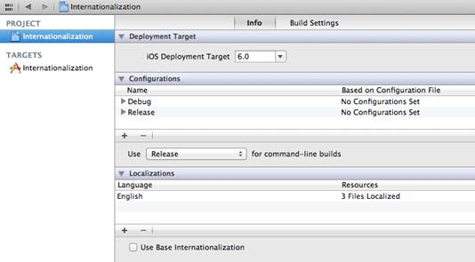
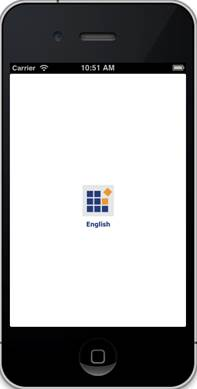
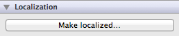
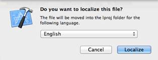
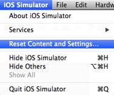
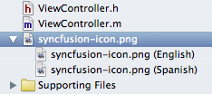
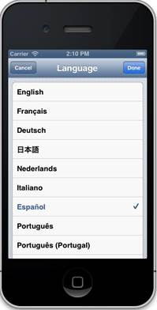

# 四、本地化

到目前为止，我们所有的示例项目都假设我们的应用程序是为说英语的人准备的，但是许多应用程序可以从对非英语受众开放中受益。应用商店负责向合适的受众展示我们的应用，但作为开发人员，我们的工作是对其进行配置，以便向不同地区的用户显示适当的资源。这个过程叫做**本地化**。

幸运的是，iOS 让使用捆绑包本地化资源变得异常容易。`NSBundle`类通过考虑用户的首选语言自动选择合适的素材。例如，如果您为说英语的人和说西班牙语的人提供了相同图像的不同版本，上一章中讨论的`pathForResource:ofType:`方法会根据用户的设置返回不同的文件路径。这是您不应该使用硬编码路径直接访问捆绑包资源的主要原因之一。

通常需要本地化的应用程序的三个方面是包含特定语言的图像、音频或视频、硬编码字符串和故事板。在本章中，我们将简要介绍使用`NSBundle`的内置国际化功能本地化媒体资源和硬编码字符串。故事板文件可以使用相同的过程进行本地化。

## 创建示例应用程序

本章的示例是一个简单的应用程序，它根据用户的首选语言显示不同的图像或字符串。创建一个新的单一视图应用程序，并将其称为“国际化”一如既往，应选择**使用故事板**、**使用自动参考计数**。

## 启用本地化

使应用程序多语言的第一步是将支持的语言添加到项目中。在项目导航器中，选择项目图标:


图 96:在项目导航器中选择项目

然后在左栏选择**国际化**项目(不要和国际化目标混淆)。确保选择了**信息**标签；您应该会看到以下窗口:



图 97:项目信息窗口

要添加对另一种语言的支持，请选择**本地化**部分下的加号。你可以选择任何你喜欢的语言，但这本书将使用西班牙语。选择一种语言会打开一个对话框，询问哪些文件应该本地化。清除**主版故事板**的选择，但保留**主版故事板**的选择。


图 98:添加西班牙语本地化

现在可以将每个资源的西班牙语版本添加到应用程序捆绑包中。

## 定位图像

接下来，我们将研究媒体素材的本地化。在本书的资源包中，你会发现一个名为`syncfusion-icon-en.png`的文件。将此文件拖到项目导航器中，将其添加到应用程序捆绑包中，并将其重命名为`syncfusion-icon.png`。然后，通过将**视图控制器. m** 中的`viewDidLoad`方法更改为以下内容，将其显示在视图中:

```objc
    - (void)viewDidLoad {
        [super viewDidLoad];

        // Find the image.
        NSString *imagePath = [[NSBundle mainBundle]
                               pathForResource:@"syncfusion-icon"
                               ofType:@"png"];
        NSLog(@"%@", imagePath);

        // Load the image.
        UIImage *imageData = [[UIImage alloc]
                              initWithContentsOfFile:imagePath];
        if (imageData != nil) {
            // Display the image.
            UIImageView *imageView = [[UIImageView alloc]
                                      initWithImage:imageData];
            CGRect screenBounds = [[UIScreen mainScreen] bounds];
            imageView.contentMode = UIViewContentModeCenter;
            CGRect frame = imageView.frame;
            frame.size.width = screenBounds.size.width;
            frame.size.height = screenBounds.size.height;
            imageView.frame = frame;
            [[self view] addSubview:imageView];
        } else {
            NSLog(@"Could not load the file");
        }
    }

```

编译项目时，您应该会在屏幕中间看到一个小图标:



图 99:以编程方式向视图添加图像

您还应该在输出面板中看到路径`Internationalization.app/syncfusion-icon.png`。这里没有什么新东西，只是应用程序包顶层的一个图像——但是，一旦我们本地化了图像文件，这种情况就会改变。

为此，在项目导航器中选择图像，打开**实用程序**面板，点击**本地化**部分下的**本地化**。



图 100:创建本地化文件

下一个对话框提示您选择语言。选择**英语**，点击**本地化**。



图 101:配置本地化

这告诉 iOS 这个版本的**syncfusion-icon.png**是为说英语的人准备的。稍后我们将添加西班牙语版本，但首先让我们看看幕后发生了什么。要看到你的本地化在行动，你必须重置 iOS 模拟器，做一个干净的构建。要重置模拟器，导航至菜单栏中的 **iOS 模拟器** > **重置内容和设置**，并在生成的对话框中选择**重置**。



图 102:重置 iOS 模拟器

退出模拟器，返回 Xcode 中的国际化项目。要做一个干净的构建，导航到菜单栏中的**产品**>**并像平常一样再次编译项目。您应该会在输出面板中看到不同的文件路径:**

 **`Internationalization.app/en.lproj/syncfusion-icon.png`。

新的`en.lproj/`子目录是 iOS 中组织特定语言文件的内部方式。所有本地化为英语的资源将出现在该子目录中，所有西班牙语版本将出现在**es.lproj/**子目录中。但是，我们实际上不必知道文件驻留在哪里；`NSBundle`的`pathForResource:ofType:`方法自动计算出来。

于是，我们的英文版形象就建立起来了。接下来，我们需要配置西班牙语版本。在项目导航器中选择文件的英文版本，并在**实用程序**面板的**本地化**部分选择**西班牙语**旁边的复选框。


图 103:添加文件的西班牙语版本

这将把现有的英文版**syncfusion-icon.png**复制到**es.lproj/**子目录中。回到项目导航器中，您应该能够通过展开**syncfusion-icon.png**文件看到这一点。



图 104:项目导航器中图像文件的两个版本

当然，我们需要用完全不同的文件替换西班牙版本。最简单的方法是选择**syncfusion-icon.png**(西班牙语)文件，然后单击**实用程序**面板中**完整路径**字符串旁边的箭头图标:


图 105:西班牙图像文件的实用程序面板

这会在 Finder 中显示**es.lproj/**文件夹的内容，这为我们提供了手动替换文件的机会。删除现有的**syncfusion-icon.png**文件，将资源包中的**syncfusion-icon-es.png**文件复制到**es.lproj/**中。务必将其更名为**syncfusion-icon.png**。同一文件的本地化版本具有相同的文件名非常重要，这样`NSBundle`就可以找到它们。替换文件后，当您在 Xcode 中选择两个本地化时，您应该会看到不同的图像。

这应该是为了本地化我们的图像文件。要测试它，您可以像在真实设备中一样更改设备语言——通过“设置”应用程序。在模拟器中点击设备的主页按钮，点击并向右拖动屏幕，启动*设置*应用程序。在**通用** > **国际** > **语言**下，可以选择设备语言。



图 106:在 iOS 模拟器中更改设备语言

选择**西班牙语**，重新打开您的应用程序。您应该会看到西班牙语版本的**syncfusion-icon.png**(您可能需要关闭模拟器并再次编译程序)。还要注意的是`NSLog()`输出的文件路径现在是:`Internationalization.app/es.lproj/syncfusion-icon.png`。

图 107:显示图像文件的本地化版本

如您所见，使用`NSBundle`的内置功能本地化文件非常容易。想法是使用`NSBundle`作为应用程序代码和它们所依赖的素材之间的抽象。这将本地化过程与开发过程隔离开来，使得外包翻译变得非常容易。

本地化视频和音频文件使用与刚才讨论的完全相同的过程。然而，为国际读者准备文本需要更多的工作。

## 本地化文本

当您处理多语言应用程序时，硬编码字符串必须抽象成捆绑素材，以便`NSBundle`可以在运行时加载正确的语言。iOS 使用所谓的**字符串文件**来存储应用程序中所有字符串的翻译。创建这个字符串文件后，可以使用上一节中讨论的相同方法对其进行本地化。

让我们改变我们的`viewDidLoad`方法，当用户点击按钮时，显示一个按钮并输出一条消息:

```objc
    - (void)viewDidLoad {
        [super viewDidLoad];

        UIButton *aButton = [UIButton buttonWithType:UIButtonTypeRoundedRect];
        [aButton setTitle:@"Say Hello" forState:UIControlStateNormal];
        aButton.frame = CGRectMake(100.0, 200.0, 120.0, 40.0);
        [[self view] addSubview:aButton];

        [aButton addTarget:self
                    action:@selector(sayHello:)
          forControlEvents:UIControlEventTouchUpInside];
    }

    - (void)sayHello:(id)sender {
        NSLog(@"Hello, World!");
    }

```

这些方法有两个字符串文字，我们必须将它们移入一个字符串文件:`@"Say Hello"`和`@"Hello, World!"`。

要创建字符串文件，创建一个新文件并选择**资源** > **字符串文件**。文件名使用`Localizable.strings`，这是 iOS 查找的默认字符串文件。


图 108:创建字符串文件

字符串文件的内容是一个简单的键或值对列表，格式如下:

```objc
    "Button Title" = "Say Hello";
    "Greeting" = "Hello, World!";

```

左侧是您将用来引用应用程序代码中已翻译字符串的键。这些键是任意的字符串，但是开发人员通常使用描述如何使用该字符串的语义名称，或者使用其母语中的目标短语。在字符串文件中，我们选择了前者。每个键的值都跟在等号后面。请务必在每一行的末尾包含一个分号，否则当您试图运行应用程序时会发生可怕的事情。

与媒体素材一样，您可以通过`NSBundle`访问**可本地化字符串**的内容。`localizedStringForKey:value:table:`方法从特定的字符串文件中返回键值。`value`参数允许您在找不到键的情况下指定默认返回值，而`table`参数确定要使用哪个字符串文件。当您为`table`指定`nil`时，将使用默认的`Localizable.strings`文件。

由于访问翻译后的字符串是如此常见的任务，Foundation Framework 还提供了一个方便的`NSLocalizedString()`宏，您可以将其用作`localizedStringForKey:value:table:`的简单快捷方式。它传递一个空字符串给`value`参数和`nil`给`table`参数。对于大多数应用程序来说，`NSLocalizedString()`是您访问本地化文本真正需要的。

因此，让我们将按钮的标题配置更改为使用`NSLocalizedString()`:

```objc
    [aButton setTitle:NSLocalizedString(@"Button Title", nil)
             forState:UIControlStateNormal];

```

如果你编译了这个项目，按钮仍然应该是“说你好”——但是现在它是从`Localizable.strings`加载的。让我们对`sayHello`方法进行同样的操作:

```objc
    - (void)sayHello:(id)sender {
        NSLog(@"%@", NSLocalizedString(@"Greeting", nil));
    }

```

现在我们的字符串是动态加载的，而不是硬编码的，本地化它们很简单。我们将使用与图像完全相同的过程。在项目导航器中，选择`Localizable.strings`文件，然后在**工具**面板中点击**本地化**。在出现的对话框中选择**英语**为说英语的用户使用该版本的文件。

要添加西班牙语版本，再次选择**可本地化字符串**，并在**本地化**部分选择**西班牙语**旁边的复选框。


图 109:添加西班牙语版本的可本地化字符串

就像`syncfusion-icon.png`一样，您应该能够在项目导航器中展开**可本地化字符串**文件。


图 110:展开字符串文件以查看其本地化

最后，在文件的西班牙语版本中添加一些翻译:

```objc
    "Button Title" = "Dice Hola";
    "Greeting" = "Hola, Mundo!";

```

你可以像我们测试图像一样测试它。导航到模拟器中的**重置内容和设置**，关闭模拟器，并从 Xcode 进行干净的构建。将语言更改为**西班牙语**后，您的按钮应显示为**骰子霍拉**而不是**说你好**，点击它应输出“霍拉，蒙多！”


图 111:将设备语言更改为西班牙语

这就是在 iOS 应用程序中本地化字符串的全部内容。同样，将所有的翻译文本放在一个文件中——完全从应用程序代码中抽象出来——可以很容易地外包本地化工作。这是一件非常好的事情，因为大多数开发人员不会流利地说他们希望将其应用程序翻译成的所有语言。

## 本地化信息列表

还有一个重要的细节尚未解决——应用程序名称的本地化。如果你看看 iOS 模拟器的主屏幕，你会发现你的应用图标下的标题还没有被翻译成西班牙语。如果你已经经历了在你的应用程序中本地化字符串*的麻烦，你还不如花点时间翻译一点元数据。*

 *应用的显示名称在`CFBundleDisplayName`键下的`Info.plist`中定义。iOS 没有强制你翻译主`Internationalization-Info.plist`文件中的值，而是给你一个专用的字符串文件，用本地化的值覆盖某些配置选项。在项目导航器的**支持文件**组中，打开 **InfoPlist.strings** 文件。这就像我们在前一节中创建的 Localizable.strings 文件一样，只是它应该只为`Info.plist`键提供值。将以下内容添加到您的 **InfoPlist.strings** 文件:

```objc
    "CFBundleDisplayName" = "Hola, Mundo!";

```

现在，如果您重置模拟器并进行干净的构建，您应该会在应用程序图标下看到一个西班牙语标题。


图 112:本地化应用显示名称

## 总结

在本章中，我们学习了如何使用`NSBundle`本地化媒体素材、文本和元数据。通过将需要本地化的资源抽象成独立的文件，并通过`pathForResource:ofType:`这样的方法间接引用它们，就有可能将您的应用程序翻译成另一种语言，而不需要接触任何一行应用程序代码。这是 iOS 非常强大的功能，尤其是考虑到 iPhone 和 iPad 设备的国际流行。

*iOS 的最后一章简洁地*简单介绍了 iOS 应用的内置音频支持。正如我们在前几章中提到的，音频文件使用与图像和字符串文件相同的包结构。然而，我们将讨论控制音频播放的高级工具，而不是关注如何访问这些资源。***