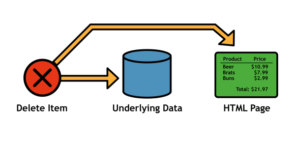
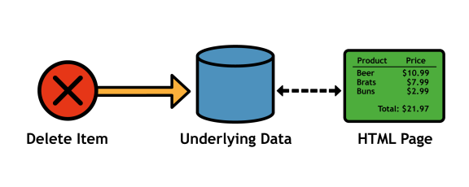
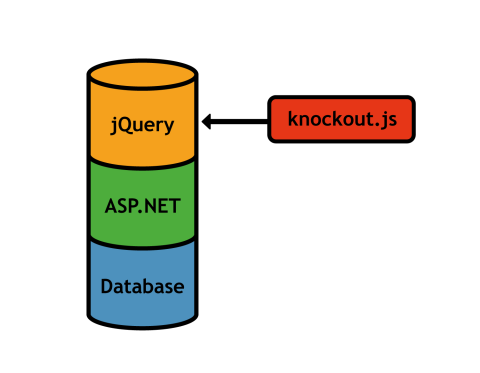

# 介绍

创建数据驱动的用户界面是 web 开发人员最复杂的工作之一。它需要对接口及其底层数据进行仔细的管理。例如，考虑一个电子商务网站的简单购物车界面。当用户从购物车中删除一个项目时，您必须从基础数据集中删除该项目，从购物车的 HTML 页面中删除关联的元素，并更新总价。除了最琐碎的应用程序之外，找出哪些 HTML 元素依赖于特定的数据是一项容易出错的工作。

图 1:手动跟踪 HTML 元素及其底层数据之间的依赖关系

[淘汰赛. js](http://knockoutjs.com/) JavaScript 库提供了一种更干净的方式来管理这些复杂的数据驱动接口。不是手动跟踪 HTML 页面的哪些部分依赖于受影响的数据，而是让您在底层数据及其表示之间创建直接连接。将一个 HTML 元素与一个特定的数据对象链接后，对该对象的任何更改都将自动*反映在 DOM 中。*

 *

图 2:使用淘汰赛自动跟踪依赖关系

这允许您关注应用程序背后的数据。设置完 HTML 模板后，您可以专门使用 JavaScript 数据对象。使用淘汰赛. js，从购物车中移除一个项目所要做的就是从代表用户购物车项目的 JavaScript 数组中移除它。相应的 HTML 元素将自动从页面中移除，总价将重新计算。

换句话说，淘汰赛. js 允许你为你的 JavaScript 对象设计一个自我更新的显示。

## 其他功能

但是，这并不是淘汰赛所能做到的。除了自动依赖跟踪，它还拥有几个支持快速开发响应用户界面的特性…

### 纯 JavaScript

淘汰赛. js 是一个完全用 JavaScript 编写的*客户端*库。这使得它几乎可以兼容任何服务器端软件，从 ASP.NET 到 PHP、Django、Ruby on Rails，甚至定制的网络框架。

说到前端，淘汰赛. js 通过添加一个单一的 HTML 属性将底层数据模型连接到 HTML 元素。这意味着它可以集成到一个现有的项目中，只需对您的 HTML、CSS 和其他 JavaScript 库进行最小的更改。

### 可扩张的

虽然淘汰赛. js 附带了将近 24 个定义数据显示方式的绑定，但您可能仍然需要特定于应用程序的行为(例如，用户提交的电影评论的星级小部件)。幸运的是，淘汰赛. js 使您可以轻松添加自己的绑定，让您完全控制如何将数据转换为 HTML。而且，由于这些自定义绑定被集成到核心模板语言中，所以在应用程序的其他部分重用小部件并不重要。

图 3:在几个用户界面组件中重用自定义绑定

### 实用功能

淘汰赛. js 附带了几个实用函数，包括数组过滤器、JSON 解析，甚至还有一种将数据从服务器映射到 HTML 视图的通用方法。这些实用程序使得只需几行代码就可以将大量数据转化为动态用户界面。

## 什么是淘汰赛*而不是*

淘汰赛. js 是*而不是*是为了替代 jQuery、Prototype 或 MooTools。它并不试图提供动画、通用事件处理或 AJAX 功能(然而，Denking . js 可以*解析*从 AJAX 调用接收的数据)。knowledge . js 只专注于设计可扩展的数据驱动的用户界面，如何获取底层数据完全取决于您。

图 4:淘汰赛. js 补充了一个完整的 web 应用程序堆栈

这种高水平的专门化使得 knowledge . js 与任何其他客户端和服务器端技术兼容，但这也意味着 knowledge . js 通常需要功能更全面的 JavaScript 框架的配合。从这个意义上来说，淘汰赛. js 更多的是对传统 web 应用程序堆栈的*补充*，而不是其不可分割的一部分。*