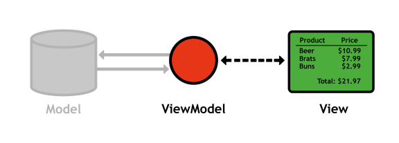
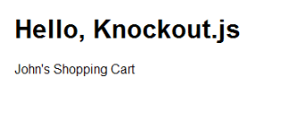

# 二、你好，knockout

这一章旨在对knockout. js 的主要组成部分进行高层次的调查。通过实现一个具体的示例应用，我们将看到knockout的视图模型、视图、观察点和绑定如何交互来创建一个动态用户界面。

首先，我们将创建一个简单的 HTML 页面来保存我们所有的代码，然后我们将定义一个 ViewModel 对象，公开一些属性，甚至添加一个交互式绑定，这样我们就可以对用户的点击做出反应。

## 下载knockout. js

在我们开始编写任何代码之前，请从 GitHub.com 的[下载页面](https://github.com/SteveSanderson/knockout/downloads)下载最新版本的knockout. js。截至本文撰写之时，最新版本为 2.1.0。之后，我们准备将库添加到一个 HTML 页面。

## 样品

这本书的样品可以在[https://bitbucket.org/syncfusion/knockoutjs_succinctly](https://bitbucket.org/syncfusion/knockoutjs_succinctly)买到。

## 网页

让我们从一个标准的 HTML 页面开始。在与您的knockout. js 库相同的文件夹中，创建一个名为`index.html`的新文件，并添加以下内容。确保将`knockout-2.1.0.js`更改为您下载的knockout. js 库的文件名。

样本代码:item1.htm

```js
    <html lang='en'> <head>   <title>Hello, Knockout.js</title>   <meta charset='utf-8' />   <link rel='stylesheet' href='style.css' /> </head> <body>
      <h1>Hello, Knockout.js</h1>
      <p>Bill's Shopping Cart</p>

      <script type='text/javascript' src='knockout-2.1.0.js'></script> </body> </html>

```

这是一个基本的 HTML 5 网页，在`<body>`的底部包含了敲除. js 库；虽然，像任何外部脚本一样，您可以将它包含在任何您想要的地方(在`<head>`内部是另一个常见的选项)。`style.css`样式表实际上对于本书中的任何例子都不是必需的，但是它会让它们看起来更容易。可以在[附录 A](10.html#heading_id_78) 找到，也可以从[https://bitbucket.org/syncfusion/knockoutjs_succinctly](https://bitbucket.org/syncfusion/knockoutjs_succinctly)下载。如果在 web 浏览器中打开页面，您应该会看到以下内容:


图 8:基本网页

## 定义视图模型

因为我们还没有处理任何持久的数据，所以我们没有一个模型可以使用。相反，我们将直接跳到视图模型。直到[第 7 章](07.html#_Chapter_7_)，我们实际上只是在使用视图-视图模型模式。



图 9:暂时关注视图和视图模型

请记住，视图模型是模型数据的纯 JavaScript 表示。首先，我们将使用一个本地的 JavaScript 对象作为我们的视图模型。在包含knockout. js 的`<script>`标签下，添加以下内容:

样本代码:item2.htm

```js
      <script type='text/javascript'>     var personViewModel = {       firstName: "John",       lastName: "Smith"     };     ko.applyBindings(personViewModel);   </script> </body>

```

这创建了一个名为约翰·史密斯的“人”，并且`ko.applyBindings()`方法告诉knockout. js 使用该对象作为页面的视图模型。

当然，如果你重新加载页面，它仍然会显示“比尔的购物车。”为了基于视图模型更新视图，我们需要将一个 HTML 元素绑定到`personViewModel`对象。

## 绑定一个 HTML 元素

knockout. js 使用一个特殊的`data-bind`属性将 HTML 元素绑定到视图模型。用空的`<span>`元素替换`<p>`标签中的`Bill`，如下所示:

样本代码:item2.htm

```js
      <p><span data-bind='text: firstName'></span>'s Shopping Cart</p>

```

`data-bind`属性的值告诉 Lenking . js 在元素中显示什么。在这种情况下，`text`绑定告诉knockout. js 显示视图模型的`firstName`属性。现在，当你重新加载页面时，knockout. js 会用`personViewModel.firstName`替换`<span>`的内容。因此，您应该会在浏览器中看到“约翰的购物车”:



图 10:我们第一个绑定视图组件的截图

同样，如果将`data-bind`属性更改为`text: lastName`，将显示“史密斯购物车”如您所见，绑定一个元素实际上只是为您的视图模型定义一个 HTML 模板。

## 可观测的属性

因此，我们有一个可以在 HTML 元素中显示的视图模型，但是请注意当我们尝试更改属性时会发生什么。调用`ko.applyBindings()`后，给`personViewModel.firstName`赋值:

```js
        ko.applyBindings(personViewModel);     personViewModel.firstName = "Ryan";

```

knockout. js *不会*自动更新视图，页面依然会显示“约翰的购物车”这是因为我们没有将`firstName`属性暴露给knockout. js，你想要knockout. js 跟踪的任何属性都必须是**可观测的**。我们可以通过将`personViewModel`更改为以下内容来观察视图模型的属性:

样本代码:item3.htm

```js
        var personViewModel = {       firstName: ko.observable("John"),       lastName: ko.observable("Smith")     };

```

我们没有直接给`firstName`和`lastName`赋值，而是使用`ko.observable()`将属性添加到敲除. js 的自动依赖跟踪器中。当我们更改`firstName`属性时，knockout. js 应该更新 HTML 元素以匹配:

```js
        ko.applyBindings(personViewModel);     personViewModel.firstName("Ryan");

```

### 访问观察点

你可能已经注意到，可观测值实际上是函数，而不是变量。要获取一个可观测值的值，您可以在没有任何参数的情况下调用它，要设置该值，您可以将该值作为参数传递。这种行为总结如下:

*   **获取:**用`obj.firstName()`代替`obj.firstName`
*   **设置:**用`obj.firstName("Mary")`代替`obj.firstName = "Mary"`

适应这些新的访问器对于knockout的初学者来说有点违反直觉。非常小心不要用`=`运算符意外地给可观测的属性赋值。这将覆盖可观测到的内容，导致 Quicken . js 停止自动更新视图。

## 使用自定义对象

对于这个简单的例子，我们的通用`personViewModel`对象及其可观测的属性工作得很好，但是请记住，视图模型也可以定义与它们的数据交互的方法。因此，视图模型通常被定义为自定义类，而不是通用的 JavaScript 对象。让我们继续，用用户定义的对象替换`personViewModel`:

样本代码:item4.htm

```js
        function PersonViewModel() {       this.firstName = ko.observable("John");       this.lastName = ko.observable("Smith");     };     ko.applyBindings(new PersonViewModel());

```

这是定义视图模型和激活敲除的规范方式。现在，我们可以添加一个自定义方法，如下所示:

```js
        function PersonViewModel() {       this.firstName = ko.observable("John");       this.lastName = ko.observable("Smith");       this.checkout = function() {         alert("Trying to check out!");       };     };

```

将数据和方法结合在一个对象中是 MVVM 模式的定义特征之一。它提供了一种与数据交互的直观方式。例如，当您准备好结帐时，只需调用视图模型上的`checkout()`方法。gentle . js 甚至提供了直接从视图中进行这种操作的绑定。

## 交互式绑定

本章的最后一步是添加一个结账按钮来调用我们刚刚定义的`checkout()`方法。这是对knockout. js 的交互式绑定的非常简短的介绍，但是它提供了一些有用的功能，我们将在下一章中需要这些功能。在`<p>`标签下方，添加以下按钮:

```js
      <button data-bind='click: checkout'>Checkout</button>

```

当用户单击元素时，`click`绑定调用一个方法，而不是显示属性值的`text`绑定。在我们的例子中，它调用我们的视图模型的`checkout()`方法，您应该会看到一条警告消息弹出。


图 11:单击“结帐”按钮后创建的警报消息

knockout. js 的全套交互式绑定将在[第 6 章](06.html#_Chapter_6_Interactive)中介绍。

## 摘要

本章详细介绍了knockout. js 的核心方面。正如我们所看到的，设置基于knockout. js 的 web 应用有三个步骤:

1.  创建一个 ViewModel 对象，并将其注册到 Kellow . js。
2.  将 HTML 元素绑定到视图模型的属性之一。
3.  使用可观测的对象将属性公开给knockout

您可以将视图元素绑定到可观测的属性看作是为一个 JavaScript 对象构建一个 HTML 模板。模板设置好之后，您可以完全忘记 HTML，只关注应用背后的视图模型数据。这就是knockout的全部意义

在下一章中，我们将通过创建依赖于其他属性的可观测值，以及保存数据列表的可观测数组，来探索 well as 自动依赖跟踪器背后的真正力量。