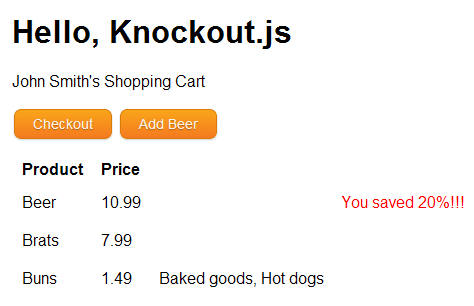

# 第 4 章控制流绑定

正如我们在前面几章中看到的，为视图模型设计视图就像为 JavaScript 对象创建一个 HTML 模板。任何模板系统不可或缺的一部分是控制模板执行流程的能力。循环遍历数据列表并根据特定条件包含或排除可视元素的能力使标记最小化成为可能，并使您能够完全控制数据的显示方式。

我们已经看到了`foreach`绑定是如何在一个可观察的数组中循环的，但是淘汰赛. js 还包括两个逻辑绑定:`if`和`ifnot`。此外，其`with`绑定允许您手动更改模板块的范围。

本章通过扩展上一章中的购物车示例，介绍了 Quicken . js 的控制流绑定。我们还将探究上一章中所掩盖的`foreach`的一些细微差别。

## foreach 绑定

让我们先来仔细看看我们现有的`foreach`循环:

样本代码:item010.htm

```js
        <tbody data-bind='foreach: shoppingCart'>
          <tr>
            <td data-bind='text: name'></td>
            <td data-bind='text: price'></td>
            <td><button data-bind='click: $root.removeProduct'>Remove</button></td>
          </tr>
        </tbody>

```

当淘汰赛. js 在`data-bind`属性中遇到`foreach`时，它遍历`shoppingCart`数组，并使用它为包含的标记的**绑定上下文**找到的每个项目。这种绑定上下文就是 Leakout . js 管理循环范围的方式。在这种情况下，这就是为什么我们可以使用`name`和`price`属性而不用参考`Product`的实例。

## 使用绑定上下文

使用数组中的每一项作为新的绑定上下文是创建循环的一种方便方式，但是这种行为也使得在迭代中引用当前项之外的对象变得不可能。因此，淘汰赛. js 在每个绑定上下文中都提供了几个特殊的属性。请注意，所有这些属性仅在*视图*中可用，而不是在视图模型中。

### $根属性

`$root`上下文总是指顶级视图模型，而不管循环或范围的其他变化。正如我们在上一章中看到的，这使得访问顶级方法来操作视图模型成为可能。

### $数据属性

绑定上下文中的`$data`属性引用当前上下文的视图模型对象。这很像 JavaScript 对象中的`this`关键字。例如，在我们的`foreach: shoppingCart`循环中，`$data`指的是当前列表项。因此，下面的代码与不使用`$data`时完全一样:

```js
            <td data-bind='text: $data.name'></td>
            <td data-bind='text: $data.price'></td>

```

这可能看起来是一个微不足道的属性，但是当您遍历包含像字符串或数字这样的原子值的数组时，它是必不可少的。例如，我们可以存储代表每个产品标签的字符串列表:

样本代码:item011.htm

```js
        function Product(name, price, tags) {       this.name = ko.observable(name);       this.price = ko.observable(price);       tags = typeof(tags) !== 'undefined' ? tags : [];       this.tags = ko.observableArray(tags);     }

```

然后，为`shoppingCart`数组中的一个产品定义一些标签:

```js
            new Product("Buns", 1.49, ['Baked goods', 'Hot dogs']);

```

现在，我们可以看到`$data`语境在起作用。在包含购物车项目的`<table>`中，添加一个包含`<ul>`列表的`<td>`元素，该列表遍历`tags`数组:

```js
        <tbody data-bind='foreach: shoppingCart'>
          <tr>
            <td data-bind='text: name'></td>
            <td data-bind='text: price'></td>
            <td> <!-- Add a list of tags. -->
              <ul data-bind='foreach: tags'>
                <li data-bind='text: $data'></li>
              </ul>
            </td>
            <td><button data-bind='click: $root.removeProduct'>Remove</button></td>
          </tr>
        </tbody>
      </table>

```

在`foreach: tags`循环内部，淘汰赛. js 使用原生字符串“烘焙食品”和“热狗”作为绑定上下文。但是，因为我们想要访问实际的字符串而不是它们的*属性*，所以我们需要`$data`对象。

### $索引属性

在`foreach`循环中，`$index`属性包含数组中当前项目的索引。像淘汰赛中的大多数事情一样，`$index`的值将在您从关联的可观察数组中添加或删除项目时自动更新。如果需要显示每个项目的索引，这是一个有用的属性，如下所示:

样本代码:item012.htm

```js
            <td data-bind='text: $index'></td>

```

### $父属性

`$parent`属性引用父视图模型对象。通常，只有在使用嵌套循环并且需要访问外部循环中的属性时，才需要这样做。例如，如果需要从`foreach: tags`循环内部访问`Product`实例，可以使用`$parent`属性:

样本代码:item013.htm

```js
                           <ul data-bind="foreach: tags">
                    <li>
                        <span data-bind="text: $parent.name"></span> - <span data-bind="text: $data"></span>
                    </li>

                </ul>

```

在可观察的数组、`foreach`绑定和前面讨论的绑定上下文属性之间，您应该拥有在您的淘汰赛. js web 应用程序中利用数组所需的所有工具。

## 打折产品

在我们进入条件绑定之前，我们将向我们的`Product`类添加一个`discount`属性:

样本代码:item014.htm

```js
        function Product(name, price, tags, discount) {       ...       discount = typeof(discount) !== 'undefined' ? discount : 0;       this.discount = ko.observable(discount);       this.formattedDiscount = ko.computed(function() {         return (this.discount() * 100) + "%";       }, this);     }

```

这给了我们一个条件，我们可以用 Lenking . js 的逻辑绑定来检查。首先，我们将`discount`参数设为可选，给它一个默认值`0`。然后，我们为折扣创建一个可观察到的值，以便 Denking . js 可以跟踪它的变化。最后，我们定义了一个计算的可观察值，它返回了一个用户友好的折扣百分比版本。

让我们继续为`PersonViewModel.shoppingCart`中的第一个项目增加 20%的折扣:

```js
          this.shoppingCart = ko.observableArray([         new Product("Beer", 10.99, null, .20),         new Product("Brats", 7.99),         new Product("Buns", 1.49, ['Baked goods', 'Hot dogs']);       ]);

```

## if 和 ifnot 绑定

`if`绑定是条件绑定。如果您传递的参数计算结果为真，将显示包含的 HTML，否则它将从 DOM 中移除。例如，尝试将以下单元格添加到包含购物车项目的`<table>`中，就在“移除”按钮之前。

```js
            <td data-bind='if: discount() > 0' style='color: red'>
              You saved <span data-bind='text: formattedDiscount'></span>!!!
            </td>

```

只有折扣大于`0`的商品才会出现`<td>`元素中的所有内容。另外，由于`discount`是一个可观察到的，每当条件改变时，淘汰赛. js 会自动重新评估。这只是淘汰赛. js 帮助您专注于驱动应用程序的数据的又一种方式。



图 15:有条件地为每种产品提供折扣

您可以使用*任何* JavaScript 表达式作为条件:淘汰赛. js 将尝试将字符串作为 JavaScript 代码进行评估，并使用结果来显示或隐藏元素。正如您可能已经猜到的那样，`ifnot`绑定只是否定了表达式。

## 具有绑定的

`with`绑定可用于手动声明特定块的范围。尝试在视图顶部的“结账”和“添加啤酒”按钮前添加以下片段:

样本代码:item015.htm

```js
      <p data-bind='with: featuredProduct'>
        Do you need <strong data-bind='text: name'></strong>? <br />
        Get one now for only <strong data-bind='text: price'></strong>.
      </p>

```

在`with`块内部，淘汰赛. js 使用`PersonViewModel.featuredProduct`作为绑定上下文。因此，`text: name`和`text: price`绑定工作正常，没有引用它们的父对象。

当然，为了让前面的 HTML 正常工作，您需要在`PersonViewModel`上定义一个`featuredProduct`属性:

```js
          var featured = new Product("Acme BBQ Sauce", 3.99);       this.featuredProduct = ko.observable(featured);

```

## 摘要

本章介绍了`foreach`、`if`、`ifnot`和`with`绑定。这些控制流绑定使您可以完全控制视图模型在视图中的显示方式。

重要的是要认识到淘汰赛. js 的绑定和可观察性之间的关系。从技术上讲，两者是完全独立的。正如我们在这本书的开头所看到的，您可以使用一个带有本地 JavaScript 属性的普通对象(即*而不是*可观察对象)作为您的视图模型，淘汰赛. js 将正确呈现视图的绑定。然而，淘汰赛. js 只会第一次处理模板——没有可观察的，当底层数据改变时，它不能自动更新视图。既然这是淘汰赛. js 的全部内容，您通常会看到绑定引用*可观察的*属性，就像前面例子中的`foreach: shoppingCart`绑定一样。

既然我们可以控制视图模板背后的逻辑，我们就可以继续控制单个 HTML 元素的外观了。下一章将深入探讨 Denuke . js 有趣的部分:外观绑定。