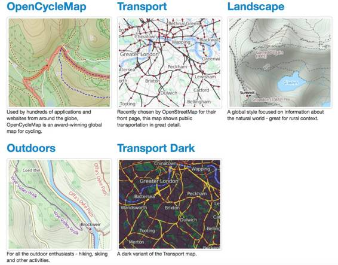

# 二、处理基本图层

Leaflet. js 区分了两种基本类型的地图图层:*基础图层*和*叠加图层*。我们在上一章中添加到地图中的切片图层是一个基础图层的示例。

基础图层是地图，通常来源于外部提供者，如 OpenStreetMap 或 MapBox，通常包含丰富而复杂的制图，用于为您添加到地图中的其他数据设置地理上下文。“其他数据”通常是一个叠加。任何时候都只有一个基础地图图层可见，但是您可以在基础图层上“覆盖”多个叠层。

为了理解这两种图层的区别，你需要考虑计算机处理图形的方式。用于在计算机上存储和处理图形数据的两种基本数据结构是*栅格*和*矢量*。到目前为止，我们已经看到了如何创建一个地图控件并添加一个单幅图块图层作为基础地图图层。切片图层是栅格图层的一个示例。栅格由单个像素组成，通常称为“图像”

覆盖图通常是矢量。矢量由描述点和线的信息组成，这些点和线在几何和数学上相互关联。直到有东西把它们画出来，它们才真正变成图像。

我们将在第三章讨论覆盖时讨论向量。现在，让我们看看一些不同类型的基础层，从上一章中看到的 L.TileLayer 开始。

这些图层由应用程序在用户关注地图的特定范围时请求的图像切片组成。在大比例下(用户放大到一个小的地理区域)，有大量的瓦片，因为每平方英里有更多的细节要显示。在较小的比例下(用户缩小到一个广阔的地理区域)，瓦片较少，因为每平方英里显示的细节较少。Leaflet.js 和切片图层提供程序根据您在 tile layer 构造函数中指定的 URL 计算特定范围需要显示哪些切片，该构造函数包含{x}、{y}和{z}占位符。这些占位符对应于切片服务用来定位特定切片的切片坐标和缩放级别。某些提供程序还接受{s}占位符，该占位符可用于在子域之间切换，因此可以并行下载切片以获得更好的性能。

接下来是一些更受欢迎的图块提供者的综述，以及您必须在 TileLayer 构造函数中使用的 URL。一些提供商将有限制带宽的使用策略。几乎所有这些都需要某种属性，您可以使用属性属性进行设置。这个属性几乎接受任何有效的 HTML，因此如果您愿意，您可以超链接回切片提供者的网站。有关具体的归属细节，请查看提供商的个人网站。

OpenStreetMap 是一个惊人的资源，包括世界大部分表面的众包地图。

OSM 地图是查看开放街道地图数据的标准方式，我们在第 1 章中使用了它。

**URL 模板:**http://{ s } . tile . openstreetmap . org/{ z }/{ x }/{ y } . png

**示例:**

代码清单 8:OSM·马普尼克瓷砖层

```js
          ...
         // OSM Mapnik
         var osmLink = "<ahref='http://www.openstreetmap.org'>OpenStreetMap</a>";           
         L.tileLayer(
             'http://{s}.tile.openstreetmap.org/{z}/{x}/{y}.png', {
             attribution: '&copy; ' + osmLink,
             maxZoom: 18,
         }).addTo(map);
          ...

```

这是 OSM Mapnik 的黑白/灰度版本，如果你想在地图上叠加你自己的数据点并使它们容易被看到，那就太好了。

URL 模板:http://{ s } . www . toolserver . org/tiles/bw-mapnik/{ z }/{ x }/{ y }。巴布亚新几内亚


图 6: OSM 黑白

代码清单 9: OSM 黑白

```js
          ...
         // OSM Black & White
         var osmLink = "<a href='http://www.openstreetmap.org'>Open StreetMap</a>";
         L.tileLayer(
             'http://{s}.www.toolserver.org/tiles/bw-mapnik/{z}/{x}/{y}.png', {
             attribution: '&copy; ' + osmLink,
            maxZoom: 18
         }).addTo(map);
          ...

```

雷森林归安迪·艾伦所有，安迪·艾伦是一位以 OpenCycleMap 闻名的数字制图师。雷森林现在提供了一系列不同的瓷砖层，像 OpenCycleMap，都是基于 OpenStreetMap 的。在这里查看文档页面[。](http://www.thunderforest.com/)



图 7:www.thunderforest.com 提供的瓷砖层

URL 模板:http://{ s } . tile . thunderforest . com/<tilelayer>/{ z }/{ x }/{ y } . png</tilelayer>

在可能的情况下，<tilelayer>的条目为:</tilelayer>

*   循环
*   运输
*   风景
*   户外
*   运输-黑暗

雄蕊提供了许多华丽的瓷砖层。其中一些是非常有用的，例如它们的美丽阴影地形(仅美国)和高对比度碳粉层。其他的，比如他们卓越的水彩地图，也许没有那么直接有用，但是玩起来很有趣。

网址模板:http://{ s } . tile . stame . com/<tilelayer>/{ z }/{ x }/{ y }。</tilelayer>

在本章的后面，我们将看一下 Stamen 的一些瓷砖层。

还有其他几个瓷砖供应商，我们没有空间来公平对待。但是，希望您现在已经看到，使用切片层的过程非常相似，无论提供者是谁。

首先，请查看这些提供者，并查看他们的文档，了解将他们的切片图层添加到您的 Leaflet.js 地图的正确方法:

Esri **:** 全球最大的地理信息系统公司。他们有一个非常高质量的瓷砖层的选择，在这里[可用](http://www.esri.com/software/arcgis/arcgisonline)。

**地图任务**:地图任务提供了几个非常有用的平铺层。MapQuest 开放航拍图块由覆盖全球不同细节层次的航拍影像组成。MapQuest OSM 图块是 OpenStreetMap 数据的变体，具有不同的样式。MapQuest 通过一个[活页插件](https://developer.mapquest.com/documentation/leaflet-plugins/maps)使这些图块层易于使用。

[**【cloud made】**](http://www.cloudmade.com/)[**MapBox**](http://www.mapbox.com/):这两家公司都提供瓷砖层。leaf 的创建者 Vladimir Agafonkin 现在为 MapBox 工作，leaf . js 框架是 MapBox 服务的核心部分。

在为应用程序寻找底图时，您可以考虑的另一个选项是 WMS(网络地图服务)图层。WMS 是一个公认的网络地图服务标准，由开放地理空间联盟定义。与我们目前看到的切片图层不同，WMS 影像是由地图服务器动态生成的，例如 ArcGIS Server、map server 或 GeoServer。地图服务器查询包含动态生成地图所需的所有数据的空间数据库，创建所需的图像，然后将它们发送到浏览器进行显示。以这种方式动态生成影像的好处(与使用预先创建的地图切片相反)包括不受创建切片时缩放级别的限制，能够选择在地图服务中显示哪些数据(图层)，以及您可以请求透明图像。使用透明度可让您堆叠图层，而最上面的图层不会遮挡其下的图层。

作为一个行业标准，WMS 有很多服务，但不可否认的是，有些服务很难找到。这种方法令人兴奋的一点是，有了一点诀窍和免费可用的软件，如 QGIS(用于地图创建)、PostGIS(用于空间数据库)和 GeoServer(用作 WMS 服务器)，您就可以创建自己的底图服务。所以，如果你曾经想在*权力的游戏*系列中创建维斯特洛的网络地图，那就尽情发挥吧！

我在网上找到的定位 WMS 服务的最好的地方之一是 [Spatineo 目录](http://directory.spatineo.com/)。您可以按关键字、地理区域和图层类型(WMS)进行搜索。请注意，这里有明确的美国偏见。美国似乎比我居住的欧洲更热衷于分享地理信息。

下面是使用 WMS 图层的代码。WMS)在传单上:

代码清单 10: WMS 瓷砖层

```js
          ...
         // Esri World Imagery Service
         L.tileLayer(
             'http://server.arcgisonline.com/ArcGIS/rest/services/\
             World_Imagery/MapServer/tile/{z}/{y}/{x}', {
             attribution: '&copy; ' + mapLink + ', ' + sourcesLink,
             maxZoom: 18,
         }).addTo(map);
         // US States WMS Layer
         L.tileLayer.wms("http://demo.opengeo.org/geoserver/wms", {
             layers: 'topp:states',
             format: 'image/png',
             transparent: true,
             attribution: "<a href='http://www.boundlessgeo.com'>OpenGeo</a>"
         }).addTo(map);
          ...

```

TileLayer 之间的主要区别。WMS 和蒂莱尔是:

*   该网址不像标准平铺层网址那样使用占位符。每一个网址都是不同的，取决于谁提供的，如何提供，所以在使用之前，你需要对 WMS 图层做一些研究。(这通常涉及在服务上发出一个 GetCapabilities 请求，并解密它返回的 XML。详见[本教程](http://www.ogcnetwork.net/node/1525)。)
*   您需要找出哪些层在 WMS 平铺层的中可用*，并在“层”属性中列出您想要的层，用逗号分隔。(同样，这些信息可以通过 GetCapabilities 请求获得。)*
*   您可以将透明属性设置为 true，以便可以在没有 WMS 图层数据的区域中看到其他地图图层。为此，图像格式属性必须设置为 image/png。

在*图 6* 中，我正在使用一个示例地理服务器 WMS 图层，该图层来自于无量主持的显示美国各州多边形的实例，并将其叠加在 Esri 世界影像切片图层上。


图 8:显示美国各州的 WMS 图层

像谷歌地图那样，允许你的用户从一系列基础地图中进行选择不是很好吗？嗯，传单. js 让它变得简单。我们可以使用框架的内置控件之一:layers 控件。就这么办吧。

如果您想继续，请在您的 web 服务器文档根目录下创建一个名为 basemaps.html 的新文件。从 mymap.html 复制代码并粘贴到 basemaps.html。删除包含 init()函数声明的脚本块，并用清单 10 中的代码替换它。

代码清单 11:底图切换

```js
          ...
                 function init() {
                     map = L.map('map').setView([37.42, -122.05], 12);
                     attrLink = 'Map tiles by <a href="http://stamen.com">Stamen Design</a>, under <a href="http://creativecommons.org/licenses/by/3.0">CC BY 3.0</a>. Data by <a href="http://openstreetmap.org">OpenStreetMap</a>, under <a href="http://creativecommons.org/licenses/by-sa/3.0">CC BY SA</a>.'
                     attrLinkToner = 'Map tiles by <a href="http://stamen.com">Stamen Design</a>, under <a href="http://creativecommons.org/licenses/by/3.0">CC BY 3.0</a>. Data by <a href="http://openstreetmap.org">OpenStreetMap</a>, under <a href="http://www.openstreetmap.org/copyright">ODbL</a>.';
                     var terrainMap = L.tileLayer(
                         'http://{s}.tile.stamen.com/terrain/{z}/{x}/{y}.jpg', {
                             attribution: attrLink,
                             maxZoom: 18,
                         }).addTo(map);
                     var tonerMap = L.tileLayer(
                         'http://{s}.tile.stamen.com/toner/{z}/{x}/{y}.png', {
                             attribution: attrLinkToner,
                             maxZoom: 18,
                         }).addTo(map);
                     var watercolorMap = L.tileLayer(
                         'http://{s}.tile.stamen.com/watercolor/{z}/{x}/{y}.jpg', {
                             attribution: attrLink,
                             maxZoom: 18,
                         }).addTo(map);

                     var baseLayers = {
                         "Stamen Terrain": terrainMap,
                         "Stamen Toner": tonerMap,
                         "Stamen Watercolor": watercolorMap
                     };
                     L.control.layers(baseLayers).addTo(map);
                 }
          ...

```

这里需要注意的事项如下:

1.  我们从[花蕊设计](http://maps.stamen.com/)增加了三个平铺层。
2.  我们已经为每个切片层构造函数分配了一个变量，这样我们就可以在以后的代码中引用它。
3.  我们创建了一个简单的 JavaScript 对象文字，称为基线图层，它由三个键/值对组成:我们希望它出现在图层控件中的图层名称，后跟图层的变量名。
4.  然后我们创建了一个图层控件，传入基线图层对象来告诉它使用哪些图层，然后立即调用。addTo()将图层控件添加到我们的地图中。

在浏览器中查看页面。你会注意到一个小控件出现在地图的右上角。单击控件，将出现图层选择列表，该列表按照您在“基线图层”对象中指定的方式进行配置。现在，您可以选择要显示的底图图层。


图 9:图层控件在运行，显示了雄蕊水彩平铺地图服务