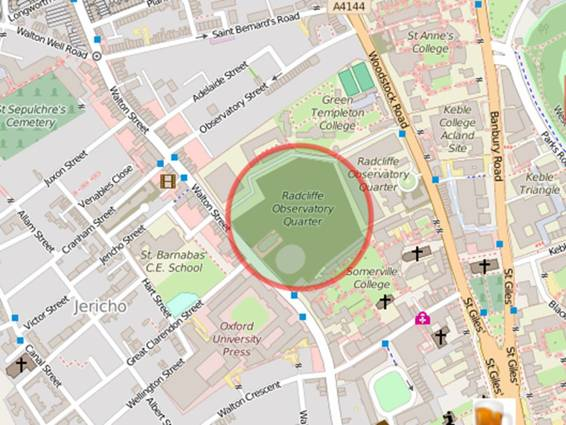
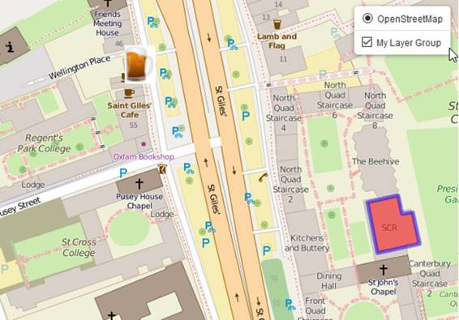
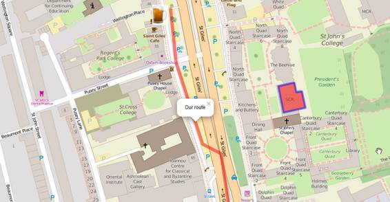
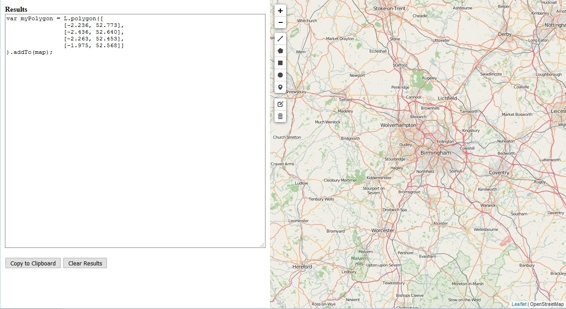
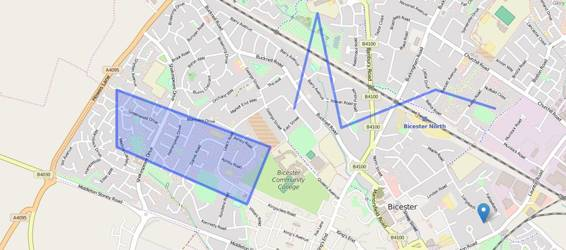
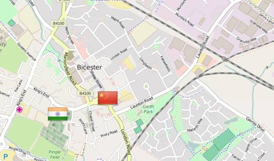

在最后一章中，我们对基础地图和叠加地图进行了区分。基础地图为构成应用程序基础的数据提供了一个“背景”，通常是以覆盖的形式。

这些数据可以来自任何地方。您可以自己提供(例如，如果您经营一家自行车连锁店，并希望您的用户能够找到最近的一家)，或者使用来自其他来源的数据(例如来自政府的人口统计数据或通过网络应用编程接口从远程服务器获得的数据，例如雅虎天气)。您甚至可能希望您的用户自己创建数据(例如，如果您正在构建一个应用程序，允许用户报告他们当地社区的涂鸦)。

无论如何，您的应用程序数据很可能是点、线或多边形的形式。这些数据会在运行时动态呈现在地图上。Leaflet.js 提供了许多不同的类来帮助您实现这一点，在本章中，我们将深入探讨并开始使用一些更常见的类。

在地理信息系统术语中，点是最简单的空间类型，完全由其 x 和 y 坐标定义。Leaflet.js 有一个 Point 类，但它实际上只用于在屏幕中定义地图上的位置，而不是地图坐标。实例化点(x，y)的实例是指屏幕上的一个点:

var pt = L 点(300，400)；

要在地图上显示一个点，你需要用“标记”而不是“点”来思考。标记是传单. js 所称的用户界面层的一个例子。标记类接受一个 LatLng 对象，它定义了标记应该显示的纬度和经度，以及(可选)一个 options 对象，它允许您设置标记的各种属性来指定其外观和行为。下面的示例演示如何创建标记并设置其 title 属性，以便当用户将鼠标指针悬停在标记上时显示工具提示。alt 属性为屏幕阅读器提供了替代文本:

代码清单 12:创建带有工具提示的标记

```js
          ...
                var pubLatLng = L.latLng(51.757230,-1.260269);          
                var pubMarker = L.marker(pubLatLng,
                {
                    title: "The Eagle and Child: JRR Tolkien and CS Lewis supped beer here",
                    alt: "The Eagle and Child public house"
                }).addTo(map);  
          ...

```


图 10:带有工具提示的标记

为了避免创建任何不必要的变量，我们可以通过将纬度和经度坐标作为数组传递来动态创建 LatLng 对象:

代码清单 13:将标记对象传递给标记构造函数

```js
          ...
                var pubMarker = L.marker([51.757230,-1.260269],
                {
                    title: "The Eagle and Child: JRR Tolkien and CS Lewis supped beer here",
                    alt: "The Eagle and Child public house"
                }).addTo(map);  
          ...

```

标记类有一大堆不同的属性，您可以通过在选项对象中指定它们来进行设置。有关完整的列表，请参考小叶. js 文档，但是一些更有趣的包括图标、可拖动和不透明。

默认情况下，小叶. js 在地图上用一个简单的蓝色图钉表示一个标记。您可以使用 L.icon 类定义自己的自定义标记图标。L.icon 类有几个属性可以让您微调图标的外观，包括视网膜显示的属性、图标大小以及工具提示和阴影的位置，但最起码您必须设置图标图形所在的 iconUrl 属性:

代码清单 14:使用图标类定义自定义图标

```js
          ...
                var pubIcon = L.icon({
                    iconUrl: img/beer.png",
                    iconSize: [40,50]
                });
                var pubMarker = L.marker([51.757230,-1.260269],
                {
                    icon: pubIcon,
                    title: "The Eagle and Child: JRR Tolkien and CS Lewis supped beer here",
                    alt: "The Eagle and Child public house"
                }).addTo(map);  
          ...

```


图 11:带有自定义图标的标记

默认情况下，地图标记的可点击属性为真，这意味着它可以响应鼠标事件，包括(但不限于)点击。

通过将可拖动属性设置为 true，您可以允许用户在地图上移动标记。这在某些用例中可能很方便，例如资产跟踪应用程序。但是为了真正有用，你需要弄清楚一个标记什么时候被移动了，移动到了哪里。

在第 4 章中，我们看一下地图和地图对象的事件，如标记。

您可以通过调整标记选项对象中不透明度属性的值来使标记或多或少地透明。默认值为 1.0(完全不透明)，值为 0.0 则完全透明。

在地理空间术语中，线只是点的集合。要在地图上绘制一个，我们需要创建一个折线类的对象。折线是矢量图层的一种类型，它将描述折线的线渲染为矢量图形。所有的小叶. js 矢量图形都是从一个名为 Path 的抽象类中派生出来的，这个抽象类你永远不会直接实例化，但是它的属性、方法和事件在子类中是可用的。

多段线是从一组线对中创建的，因此要定义一条多段线，我们必须至少提供两个这样的线对:一条线的起点和终点。如果我们需要我们的线蜿蜒，我们可以添加任意多的其他线对。如果直线由许多线段组成，可以考虑使用折线类 smoothFactor 属性，该属性简化了直线，使 Labble . js 绘制速度更快。您需要进行实验，以在准确性和性能之间取得适当的平衡。

您可以使用父路径类的属性来更改折线的外观。这些包括颜色(线条的颜色)和粗细(以像素为单位的线条宽度)。以下示例创建了一条线，表示假想的行走(或交错？)来自老鹰和孩子酒馆由五个点组成。注意数组的嵌套。线上的每个点都表示为数组中的纬度/经度对，这些点数组被传递给单个“父”数组中的折线构造函数。线条的颜色属性是红色，权重是八个像素。

代码清单 15:定义折线

```js
          ...
                var walkLine = L.polyline([
                    [51.757276, -1.260129],
                    [51.756831, -1.260054],
                    [51.756154, -1.259700],
                    [51.756074, -1.259453],
                    [51.755636, -1.259346]
                ], {
                    color: "red",
                    weight: 8
                }).addTo(map);
          ...

```


图 12:地图上显示的折线

多边形只是一条起点和终点相同的线。您可以创建一个 L.polygon 类的对象，并以与对 l . polygon 相同的方式传入坐标对。您不需要指定终点——leaf . js 将为您“关闭”多边形。因为多边形是 L.path 的子类，所以您可以使用相同的属性颜色和权重来设置用于折线的多边形轮廓的颜色和厚度。但是因为你也有多边形包围的区域可以使用，你可以使用填充颜色和填充不透明度属性来决定如何渲染内部区域。

例如，以下代码定义了一个具有六个顶点、蓝色轮廓和 50%透明度的红色填充的多边形:

代码清单 16:定义多边形

```js
          ...
                var buildingPoly = L.polygon([
                    [51.756633, -1.258688],
                    [51.756416, -1.258618],
                    [51.756454, -1.258323],
                    [51.756592, -1.258371],
                    [51.756584, -1.258443],
                    [51.756663, -1.258473]
                ], {
                    color: "blue",
                    weight: 5,
                    fillColor: "red",
                    fillOpacity: 0.5
                }).addTo(map);
          ...

```

``

图 13:地图上显示的多边形

某些多边形，如圆形和矩形，在网络地图应用程序中非常常见，通常表示地理边界，因此，小叶. js 提供了一些用于创建这些形状的实用程序类。不出所料，这就是 L.circle 类和 L.rectangle 类。

L.rectangle 类是 L.polygon 的子类，因此您可以使用 L.polygon 的所有属性、方法和事件，以及*及其*父类 L.path 的属性、方法和事件

要创建一个矩形，实例化一个 L.rectangle 类的对象，提供左上角和右下角的经纬度坐标作为参数。设置轮廓和填充方式与任何其他多边形完全相同。

代码清单 17:定义一个矩形

```js
          ...
                var parkRectangle = L.rectangle([
                    [51.761539, -1.258820],
                    [51.760995,-1.256974]
                ], {
                    color: "red",
                    weight: 5,
                    fillColor:"blue"
                }).addTo(map);
          ...

```

``

图 14:地图上显示的矩形

像矩形一样，圆形是多边形的子类。要创建圆形，请提供中心的纬度和经度以及以米为单位的半径。

代码清单 18:定义一个圆

```js
          ...
             var areaCircle = L.circle(
                 [51.759806, -1.264173],
                 100,
                 {
                     color: "red",
                     weight: 5,
                     fillColor:"green"
                 }
             ).addTo(map);
          ...

```



图 15:地图上显示的圆圈

通常，当您构建一个数据层时，您会希望让用户能够通过一个操作打开或关闭该层中的所有功能。要做到这一点，您需要一种方法来对这些特性进行分组。

如果要以这种方式分组的要素都是同一类型，并且该类型是折线或多边形，则可以使用多折线和多多边形类。实际上，创建这些对象的方式与创建单个多段线和多边形的方式相同。唯一的区别是您指定了纬度和经度的“集合”——每个折线或多边形一个。下面的例子使用了 L.multiPolygon，但是你对 L.multiPolyline 使用了完全相同的方法。它还使用了一个图层控件(我们在第 2 章中讨论过)，你可以用它来整体打开或关闭覆盖。

代码清单 19:定义一个多多边形

```js
          ...
             function init() {
                 var map = L.map('map').setView([51.76, -1.26],16);;

                 // OSM Mapnik
                 var osmLink = "<a href='http://www.openstreetmap.org'>Open StreetMap</a>";  
                 var osm = L.tileLayer(
                     'http://{s}.tile.openstreetmap.org/{z}/{x}/{y}.png', {
                     attribution: '&copy; ' + osmLink,
                     maxZoom: 18,
                 }).addTo(map);

                 var multipolygon = L.multiPolygon([
                     [
                         [51.756633, -1.258688],
                         [51.756416, -1.258618],
                         [51.756454, -1.258323],
                         [51.756592, -1.258371],
                         [51.756584, -1.258443],
                         [51.756663, -1.258473]
                     ],
                     [
                         [51.756578, -1.259225],
                         [51.756601, -1.259026],
                         [51.756342, -1.258940],
                         [51.756313, -1.259144]
                     ]
                 ], {
                     color: "blue",
                     weight: 5,
                     fillColor: "red",
                     fillOpacity: 0.5
                 }).addTo(map);

                 var baseLayers = {
                     "OpenStreetMap": osm
                 };

                 var overlays = {
                     "University Buildings": multipolygon,
                 };

                 L.control.layers(baseLayers, overlays).addTo(map);

             }            
          ...

```

多折线或多多边形内的所有多段线和多边形共享相同的符号系统，因此您只需使用它们来对彼此相关的要素进行分组，例如城镇边界或水要素。


图 16:在图层控制中显示为离散图层的多边形

如果要对不同类型的要素进行分组，例如带有一组标记的多边形，甚至只是一组标记(这并不等同于 L.multiPolyline 或 L.multiPolygon 类)，则需要创建一个*图层组*。

首先定义单个要素，但不要将其添加到地图中。然后创建一个图层组对象，传入您分配给将组成该组的要素的变量名。然后调用图层组的。方法将组本身而不是各个图层添加到地图中。

以下示例使用图层控件来演示图层组中的要素被视为单个叠加。这使您能够集体处理图层组中的每个要素(例如，允许用户一次性隐藏或显示所有要素，而不是单独显示)。

代码清单 20:对几个不同的特性进行分组

```js
          ...
             function init() {
                 var map = L.map('map').setView([51.76, -1.26],16);;

                 // OSM Mapnik
                 var osmLink = "<a href='http://www.openstreetmap.org'>Open StreetMap</a>";  
                 var osm = L.tileLayer(
                     'http://{s}.tile.openstreetmap.org/{z}/{x}/{y}.png', {
                     attribution: '&copy; ' + osmLink,
                     maxZoom: 18,
                 }).addTo(map);

                 var pubIcon = L.icon({
                     iconUrl: img/beer.png",
                     iconSize: [40,50]
                 });
                 var pubMarker = L.marker([51.757230,-1.260269],
                 {
                     icon: pubIcon
                 }); 

                 var walkLine = L.polyline([
                     [51.757276, -1.260129],
                     [51.756831, -1.260054],
                     [51.756154, -1.259700],
                     [51.756074, -1.259453],
                     [51.755636, -1.259346]
                 ], {
                     color: "red",
                     weight: 8
                 });      

                 var buildingPoly = L.polygon([
                     [51.756633, -1.258688],
                     [51.756416, -1.258618],
                     [51.756454, -1.258323],
                     [51.756592, -1.258371],
                     [51.756584, -1.258443],
                     [51.756663, -1.258473]
                 ], {
                     color: "blue",
                     weight: 5,
                     fillColor: "red",
                     fillOpacity: 0.5
                 });

                 var myLayerGroup = L.layerGroup(
                     [
                         pubMarker,
                         walkLine,
                         buildingPoly
                     ]
                 ).addTo(map);

                 var baseLayers = {
                     "OpenStreetMap": osm
                 };

                 var overlays = {
                     "My Layer Group": myLayerGroup,
                 };

                 L.control.layers(baseLayers, overlays).addTo(map);
             }            
          ...

```

如果要以编程方式在组中添加或删除功能，请使用组的。addLayer()和。removeLayer()方法，分别是:

代码清单 21:从图层组中编程添加和移除图层

```js
          ...
             var myLayerGroup = L.layerGroup(
                 [
                     walkLine,
                     buildingPoly
                 ]
             ).addTo(map);

             var baseLayers = {
                 "OpenStreetMap": osm
             };
             var overlays = {
                 "My Layer Group": myLayerGroup,
             };
             L.control.layers(baseLayers, overlays).addTo(map);

             myLayerGroup.addLayer(pubMarker);
             myLayerGroup.removeLayer(walkLine);

          ...

```



图 17:移除行走路线并添加酒吧的图层组

关于 L.layerGroup 类需要注意的一点是，它不支持弹出窗口(下面将介绍)或鼠标事件。如果这个功能对你很重要，那么就用一个功能组来代替。要素组对象的构造与图层组相同，但提供了额外的方法和事件。

现在您的地图上有了所有这些漂亮的图形，您可能正在为您的用户寻找一种与他们交互的方式来找出它们代表什么。一个非常简单的方法是使用另一个叫做**弹出**的 UI 层元素。您可以在本章中看到的任何层上使用弹出窗口，并且弹出窗口可以包括任何有效的 HTML。这使得弹出窗口非常适合显示关于地理要素的格式化信息，以及显示链接、图像和视频。

要在用户单击标记、折线或多边形时显示弹出窗口，请使用该对象的。方法，传入一个 HTML 字符串，并可选地传入一个选项对象。弹出窗口的有效选项属性包括:

*   。maxWidth，。minWidth，。最大高度:控制弹出窗口的大小
*   。keepInView:设置为 true，以便当用户将屏幕从有问题的功能移开时，弹出窗口保持可见
*   。关闭按钮:如果不希望弹出窗口中出现关闭按钮，则设置为 false
*   。关闭点击:如果你不想让用户通过点击地图来关闭弹出窗口，设置为假
*   。缩放动画:当用户放大时弹出窗口是否应该是动画的(默认为真)

代码清单 22:将弹出窗口绑定到折线

```js
          ...
             var walkLine = L.polyline([
                 [51.757276, -1.260129],
                 [51.756831, -1.260054],
                 [51.756154, -1.259700],
                 [51.756074, -1.259453],
                 [51.755636, -1.259346]
             ], {
                 color: "red",
                 weight: 8
             }).bindPopup("Our route");      
          ...

```



图 18:单击路线折线会显示一个弹出窗口

要使要素组中的所有要素在单击时显示弹出窗口，请创建一个要素组对象并调用其。bindPopup()方法。下面的示例演示了向弹出内容添加 HTML 内容。功能组中的每个功能都显示完全相同的详细信息，包括指向牛津维基百科条目的链接:

代码清单 23:将弹出窗口绑定到功能组

```js
          ...
             var popupContent = "<h2>Walking Tour of Oxford</h2>" +
                 "<p>Lots of <b>cool things</b> to see in " +
                 "<a href='https://en.wikipedia.org/wiki/Oxford'>Oxford</a>";
             var myFeatureGroup = L.featureGroup(
                 [
                     pubMarker,
                     walkLine,
                     buildingPoly
                 ]
             ).bindPopup(popupContent).addTo(map);

          ...

```


图 19:带有 HTML 格式内容的功能组弹出窗口

您可以通过完全相同的方式启用多线和多线功能上的弹出窗口:

代码清单 24:将弹出窗口绑定到一个多边形

```js
          ...
             var multipolygon = L.multiPolygon([
                 [
                     [51.756633, -1.258688],
                     [51.756416, -1.258618],
                     [51.756454, -1.258323],
                     [51.756592, -1.258371],
                     [51.756584, -1.258443],
                     [51.756663, -1.258473]
                 ],
                 [
                     [51.756578, -1.259225],
                     [51.756601, -1.259026],
                     [51.756342, -1.258940],
                     [51.756313, -1.259144]
                 ]
             ], {
                 color: "blue",
                 weight: 5,
                 fillColor: "red",
                 fillOpacity: 0.5
             }).bindPopup("This is a multipolygon").addTo(map);
          ...

```

``

图 20:多多边形中的每个多边形显示相同的弹出窗口

因为试图在您的小叶. js 应用程序中发现您想要表示的位置和几何图形的坐标可能是一件痛苦的事情，所以我编写了一个简单的工具，您可以在这里访问。

要使用该工具，请放大到要创建要素的位置，然后使用地图左侧的绘制工具栏，并按照说明创建所需的几何图形。创建该几何图形的小叶. js 代码将出现在左侧窗格中。点击**复制到剪贴板**，代码就可以粘贴到您选择的编辑器或 IDE 中了。



图 21:地图绘制实用程序

如果你知道你的 JavaScript，那么你肯定听说过 JSON。JSON 代表 JavaScript 对象符号，它是您用来在 JavaScript 中指定对象文字的语法。近年来，JSON 已经超越了 JavaScript，现在被用作人类可读的轻量级数据交换格式，通常优先于相比之下被视为重量级的 XML，并且更难被人类读者解释。

例如，下面的 JSON 示例定义了一个“外卖”对象，该对象由三个对象组成，代表各个外卖餐馆及其提供的菜肴类型:

代码清单 25:“标准”JSON 描述外卖餐馆

```js
         {"takeaways":[
             {"name":"Aziz", "cuisine":"Indian"},
             {"name":"Dak Bo", "cuisine":"Chinese"},
             {"name":"Luigi's", "cuisine":"Italian"}
         ]}

```

GeoJSON 是标准 JSON 的扩展，允许您描述几何图形。您可以使用 GeoJSON 指定点、线和多边形，并且可以将这些几何图形分组为多点、多线和多多边形。

|  | 注意:您可以在这里查看完整的 GeoJSON 规范[。](http://geojson.org/geojson-spec.html) |

对于像我们这样的网络地图开发者来说，GeoJSON 是一个真正的福音，因为它提供了一种以高度可移植的方式描述地理空间特征——它们的几何和属性——的便捷方式。

将 GeoJSON 添加到您的 Labble . js 映射中的最简单的方法是将其硬编码为一个 JavaScript 变量，然后使用 L.geoJson 类的一个实例添加它。如果我们使用初始的 JSON，我们可以通过向每个外卖对象添加类型、几何和属性对象来将其转换为 GeoJSON:

代码清单 26:以 GeoJSON 格式表示的外卖

```js
         var geoJSON = [{
             "type": "Feature",
             "geometry": {
                 "type": "Point",
                 "coordinates": [-1.155, 51.896]
             },
             "properties": {
                 "name": "Aziz",
                 "cuisine": "Indian"
             }
         }, {
             "type": "Feature",
             "geometry": {
                 "type": "Point",
                 "coordinates": [-1.150, 51.897]
             },
             "properties": {
                 "name": "Dak Bo",
                 "cuisine": "Chinese"
             }
         }, {
             "type": "Feature",
             "geometry": {
                 "type": "Point",
                 "coordinates": [-1.153, 51.897]
             },
             "properties": {
                 "name": "Luigi's",
                 "cuisine": "Italian"
             }
         }];

```

|  | 注意:GeoJSON 要求点是按照[经度，纬度]的顺序指定的，而不是 Leaflet.js 期望的[纬度，经度]。 |

然后，我们可以使用 L.geoJson 图层类型将这个 geoJson 添加到我们的地图中，就像任何其他图层一样:

代码清单 27:向地图添加 GeoJSON

```js
                     var geoJSON = [{
                         "type": "Feature",
                         "geometry": {…},
                         "properties": {…}
                     }, {
                         "type": "Feature",
                         "geometry": {…},
                         "properties": {…}
                     }, {
                         "type": "Feature",
                         "geometry": {…},
                         "properties": {…}
                     }];

                     var geoJSONLayer = L.geoJson(geoJSON).addTo(map);

```


图 22:地图上显示的 GeoJSON 数据

我们也可以在 GeoJSON 中混合点、线和多边形。考虑以下 GeoJSON:

代码清单 28:在 GeoJSON 中混合不同的几何图形

```js
                     var geoJSON = [{
                         "type": "Feature",
                         "geometry": {
                             "type": "Point",
                             "coordinates": [-1.145, 51.898]
                         },
                         "properties": {
                             "name": "My Point",
                             "title": "This is a point"
                         }
                     }, {
                         "type": "Feature",
                         "geometry": {
                             "type": "LineString",
                             "coordinates": [
                                 [-1.161, 51.904],
                                 [-1.159, 51.909],
                                 [-1.157, 51.903],
                                 [-1.149, 51.905],
                                 [-1.144, 51.904]
                             ]
                         },
                         "properties": {
                             "name": "My LineString",
                             "title": "This is a polyline"
                         }
                     }, {
                         "type": "Feature",
                         "geometry": {
                             "type": "Polygon",
                             "coordinates": [
                                 [
                                     [-1.176, 51.905],
                                     [-1.176, 51.902],
                                     [-1.165, 51.899],
                                     [-1.163, 51.902]
                                 ]
                             ]
                         },
                         "properties": {
                             "name": "My Polygon",
                             "title": "This is a polygon"
                         }
                     }];

                     var geoJSONLayer = L.geoJson(geoJSON).addTo(map);

```



图 23:地图上显示的混合几何图形

|  | 注意:GeoJSON 多边形坐标的编码比我们在前面的例子中看到的嵌套数组多了一层。这是为了允许创建“环”——多边形内的多边形。使用圆环，你可以创建带有“洞”的多边形(想象一个圆环的形状)。多边形类也允许你以这种方式指定多边形几何。 |

您将从前面的两个示例中注意到，Labber . js 为我们的 GeoJSON 提供了默认符号系统。通常你会想要自己指定这个。

您可以通过在传递给 L.geoJson 构造函数的选项对象中指定样式属性作为其第二个参数，或者通过调用图层的 setStyle()方法来控制 geoJSON 多段线或多边形的符号系统。一般来说，您可以使用第一种方法(在构造函数中设置样式)来指定图层首次显示时的初始样式，使用第二种方法(调用 setStyle())来在稍后以编程方式更改符号系统，这可能是对用户操作的响应，例如用鼠标悬停在要素上。我们将在下一章讨论对事件的响应。

让我们看看第一种方法:在 options 对象中添加一个 style 属性。style 属性值是加载要素时调用的函数，可以根据该要素的属性之一进行符号化。在本例中，我们基于 name 属性的值进行符号化:

代码清单 29:基于特征属性的 GeoJSON 符号化

```js
         ...   
         var geoJSONLayer = L.geoJson(geoJSON, {
                 style: function(feature) {
                     switch(feature.properties.name) {
                         case 'My LineString':
                             return {
                                 color: "#F115CA",
                                 weight: 8
                             }
                             break;
                         case 'My Polygon':
                             return {
                                 color: "red",
                                 fillColor: "#488D52",
                                 fillOpacity: 0.5
                             }
                             break;
                     }
                 }
             }).addTo(map);
         ...

```


图 24:用名称符号化的 GeoJSON 折线和多边形

如果我们希望以完全相同的方式对多条多段线或多边形进行样式设置，而不考虑它们之间的任何差异，我们只需定义我们的符号系统，并将其直接传递给选项对象中的 style 属性。以下示例演示了为两个不同的多边形设置相同的符号系统:

代码清单 30:用同样的方式绘制两个不同的多边形:

```js
         ...   
             var schoolSymbol = {
                 "color": "#CE4A93",
                 "weight": 5,
                 "fillColor": "#FF002B",
                 "fillOpacity": 0.65
             };

             var schoolsGeoJSON = [{
                 "type": "Feature",
                 "geometry": {
                     "type": "Polygon",
                     "coordinates": [
                         [
                             [-1.173, 51.907],
                             [-1.174, 51.906],
                             [-1.173, 51.905],
                             [-1.173, 51.905],
                             [-1.172, 51.905],
                             [-1.172, 51.905],
                             [-1.173, 51.905],
                             [-1.172, 51.906]
                         ]
                     ]

                 }
             }, {
                 "type": "Feature",
                 "geometry": {
                     "type": "Polygon",
                     "coordinates": [
                         [
                             [-1.163, 51.902],
                             [-1.164, 51.901],
                             [-1.164, 51.901],
                             [-1.165, 51.900],
                             [-1.159, 51.899],
                             [-1.158, 51.899],
                             [-1.158, 51.899],
                             [-1.158, 51.900],
                             [-1.158, 51.900],
                             [-1.158, 51.900],
                             [-1.162, 51.902]
                         ]
                     ]

                 }
             }];

             var geoJSONLayer = L.geoJson(schoolsGeoJSON, {
                 style: schoolSymbol
             }).addTo(map);
         ...

```


图 25:两个不同的多边形共享相同的符号系统

如果希望在加载每个功能之前对其执行其他操作，请在名为 on each feature()的构造函数中向 options 对象添加一个属性。该属性存在于点、线和多边形上。它的值是接收要素及其来源图层的函数。例如，如果您希望根据弹出窗口的属性将弹出窗口绑定到每个功能，这将非常有用:

代码清单 31:使用 onEachFeature()显示所有功能的弹出窗口

```js
         ...   
             var geoJSONLayer = L.geoJson(geoJSON, {
                 style: function(feature) {
                     switch(feature.properties.name) {
                         case 'My LineString':
                             return {
                                 color: "#F115CA",
                                 weight: 8
                             }
                             break;
                         case 'My Polygon':
                             return {
                                 color: "red",
                                 fillColor: "#488D52",
                                 fillOpacity: 0.5
                             }
                             break;
                     }
                 },
                 onEachFeature: function(feature, layer) {
                     layer.bindPopup(feature.properties.name);
                 }

             }).addTo(map);
         ...

```

因为直线多段线和直线多段线都是从直线路径继承的，所以它们可以用相同的方式设置样式。表示 GeoJSON 点要素的标记需要区别对待。我们使用 pointToLayer 属性，而不是使用 options 对象的 style 属性。回到我们的外卖餐馆，我们可以在下面的例子中演示这一点，其中我们根据每个餐馆提供的菜肴类型来标记。我们还利用这个机会将弹出窗口绑定到每个标记上，这样我们就可以显示它所代表的餐厅的名称:

代码清单 32:通过 GeoJSON 属性来符号化标记

```js
         ...   
             var indianIcon = L.icon({
                 iconUrl: 'images/India.png',
                 iconSize: [48, 48],
             });
             var chineseIcon = L.icon({
                 iconUrl: 'images/China.png',
                 iconSize: [48, 48],
             });
             var italianIcon = L.icon({
                 iconUrl: 'images/Italy.png',
                 iconSize: [48, 48],
             });           

             var indian, chinese, italian;
             var geoJSONLayer = L.geoJson(geoJSON, {
                 pointToLayer: function(feature, latlng) {
                     switch(feature.properties.cuisine) {
                         case 'Indian':
                             indian = L.marker(latlng, {
                                 icon: indianIcon
                             }).bindPopup(feature.properties.name);
                             return indian;
                             break;
                         case 'Chinese':
                             chinese = L.marker(latlng, {
                                 icon: chineseIcon
                             }).bindPopup(feature.properties.name);
                             return chinese;
                             break; 
                         case 'Italian':
                             italian = L.marker(latlng, {
                                 icon: italianIcon
                             }).bindPopup(feature.properties.name);
                             return italian;
                             break;                            
                     }
                 }
             }).addTo(map);
         ...

```


图 26:以美食为象征的外卖

有时在 GeoJSON 中过滤数据会很有用。也许 GeoJSON 来自外部来源，我们只对特定的特性感兴趣。我们甚至可能将这种能力扩展到我们的用户，并构建一个允许他们选择显示哪些功能的应用程序。

只需在 options 对象中使用 filter 属性，并给它一个函数，测试传递给它的值是否符合您的标准。返回 true 以显示要素，返回 false 以隐藏要素。在这个例子中，我们已经决定今晚不吃意大利菜(昨晚我们吃了很多披萨):

代码清单 33:基于特征属性过滤地理信息

```js
         ...   
             var indian, chinese, italian;
             var geoJSONLayer = L.geoJson(geoJSON, {
                 pointToLayer: function(feature, latlng) {
                     switch(feature.properties.cuisine) {
                         case 'Indian':
                             indian = L.marker(latlng, {
                                 icon: indianIcon
                             }).bindPopup(feature.properties.name);
                             return indian;
                             break;
                         case 'Chinese':
                             chinese = L.marker(latlng, {
                                 icon: chineseIcon
                             }).bindPopup(feature.properties.name);
                             return chinese;
                             break; 
                         case 'Italian':
                             italian = L.marker(latlng, {
                                 icon: italianIcon
                             }).bindPopup(feature.properties.name);
                             return italian;
                             break;                            
                     }
                 },
                 filter: function(feature, latlng) {
                     switch(feature.properties.cuisine) {
                         case 'Indian':
                             return true;
                             break;
                         case 'Chinese':
                             return true;
                             break; 
                         case 'Italian':
                             return false;
                             break;  
                     }
                 }
             }).addTo(map);
         ...

```



图 27:我们今晚不喜欢意大利菜