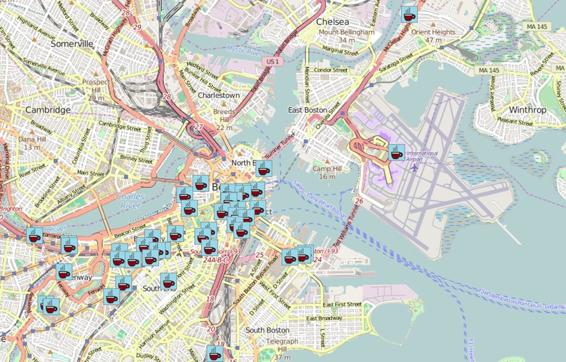
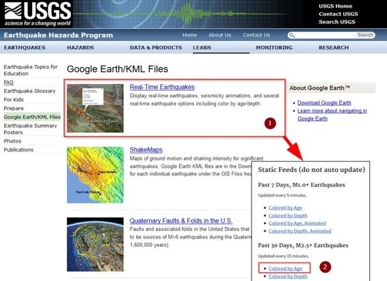
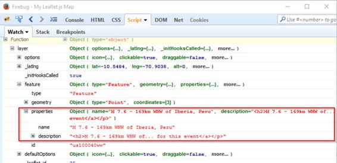

到目前为止，我们已经看到了如何通过将数据硬编码到我们的映射应用程序中来添加数据。如果你正在构建一些不完全琐碎的东西，那么这种方法是不会削减它的。没有人想为 10，000 个不同的位置创建标记代码！我们甚至没有讨论过用户可能想要通过您的应用程序更改数据的可能性。

值得庆幸的是，有许多不同的方法可以将数据输入到您的小叶. js 应用程序中。在这一章中，我们将讨论一些您可以使用的最流行的技术。

数据库是存储任何描述的数据的平台，所以让我们考虑如何使用空间组件来存储和检索数据，以便在网络地图中使用。

我们一直在创建运行在浏览器上的客户端应用程序。基于浏览器的应用程序通常不会直接访问数据库数据。它们要么涉及一些服务器端代码，要么涉及某种中间件——通常是某种描述的 web 服务——它访问数据库并使其对页面可用。

构建数据库驱动的 web 应用程序最常见的方法之一是使用 PHP 作为服务器端脚本，使用 MySQL 作为后端数据库。两者都已经存在很长时间了，并且是免费提供的，所以即使有更新、更好的平台，我们还是会坚持用 PHP 和 MySQL 作为第一个例子。

你可以直接从甲骨文网站下载 MySQL，或者像我一样，用一个“更友好”的包来为你安装和配置。这些程序与某种管理图形用户界面捆绑在一起，管理图形用户界面捆绑了 LAMP 堆栈的安装(Linux、Apache、MySQL 和 PHP)。虽然 Linux 是托管网络服务器的流行选择，但出于开发目的，您通常希望安装一个 Windows 或 Mac 专用的 LAMP 堆栈。正如我在第一章中提到的，我用 XAMPP 做这个。您需要确保 MySQL 服务正在运行。

在我的环境中，我让 MySQL 在默认端口(3306)上运行并侦听请求:


图 39:显示 MySQL 服务运行的 XAMPP 控制面板

现在我已经有了一个正在运行的数据库服务器，我需要创建一个数据库，并用一些数据填充它，然后我可以在我的小叶. js 应用程序中使用这些数据。XAMPP 将一个名为 myPhpAdmin 的图形用户界面捆绑到 MySQL 中，但是我喜欢在命令行上工作，所以我将在这里演示这一点。

首先，我需要登录 MySQL 服务器。我可以通过 XAMPP 控制面板中的 Shell 按钮来实现这一点，或者我可以将 MySQL 二进制文件添加到我的 PATH 中，并从标准终端访问它。XAMPP 为 MySQL 配置了一个根帐户，但是没有密码，所以让我们给根用户一个**传单**的密码。

# mysqladmin.exe–u 盘密码手册

对于这个例子，我将使用美国各地不同咖啡店的位置。我创建了一个名为 CoffeeShops.sql 的“转储”文件，它包含在本书源代码的 ch05 _ consumingdata 文件夹中(有关从哪里下载该文件的详细信息，请参见第 1 章)。如果您在终端提示符下执行以下命令，它将从 coffee.csv 文件(也提供)创建并填充 leafletDB 数据库:

# MySQL–uroot–plea flet < " C:\ Coffee shop . SQL "；

|  | 注意:' # '字符代表命令提示符。不要将其作为语句的一部分输入。 |

完成此过程后，通过在终端提示符下执行以下命令，验证“咖啡店”表是否包含记录:

代码清单 40:验证咖啡店数据是否在数据库中

```js
         # mysql -uroot -pleaflet
         Warning: Using a password on the command line interface can be insecure.
         Welcome to the MySQL monitor.  Commands end with ; or \g.
         Your MySQL connection id is 151
         Server version: 5.6.26 MySQL Community Server (GPL)

         Copyright (c) 2000, 2015, Oracle and/or its affiliates. All rights reserved.

         Oracle is a registered trademark of Oracle Corporation and/or its
         affiliates. Other names may be trademarks of their respective
         owners.

         Type 'help;' or '\h' for help. Type '\c' to clear the current input statement.

         mysql> USE leafletDB;
         Database changed
         mysql> SHOW TABLES;
         +---------------------+
         | Tables_in_leafletdb |
         +---------------------+
         | coffeeshops         |
         +---------------------+
         1 row in set (0.00 sec)

         mysql> SELECT COUNT(*) FROM coffeeshops;
         +----------+
         | COUNT(*) |
         +----------+
         |     7664 |
         +----------+
         1 row in set (0.00 sec)

         mysql>

```

那是事物的数据库端；现在，我们需要一些服务器端代码来访问数据库，并以适合客户端应用程序阅读的格式返回结果。我将用 PHP 编写代码，使用 PHP 数据对象(PDO)来处理与数据库的交互。这个代码要么非常简单，要么非常迟钝，这取决于你是否了解 PHP。

下面是我保存在一个名为 coffee.php 的文件中的代码，这个文件位于我用来创建显示地图的 HTML 页面的目录中。

代码清单 41:读取数据库的服务器端 PHP 代码

```js
         # mysql -uroot -pleaflet
         <?php
             $db = new PDO("mysql:host=localhost;dbname=leafletDB", "root", "leaflet");
             $sql = "SELECT * FROM CoffeeShops WHERE City='Boston'";
             $rs = $db->query($sql);
             if (!$rs) {
                 echo "An SQL error occured.\n";
                 exit;
             }
             $rows = array();
             while($r = $rs->fetch(PDO::FETCH_ASSOC)) {
                 $rows[] = $r;
             }
             print json_encode($rows);
             $db = NULL;
         ?>

```

下面是这段代码的工作原理:

`    $db` `=`新增`PDO` `(` `"mysql:host=localhost;dbname=leafletDB"` `,` `"root"` `,` `"leaflet"` `);`

这条线提供了到数据库的连接。

 `$sql` `=` `"SELECT * FROM CoffeeShops WHERE City='Boston'"` `;`

 `$rs` `=` `$db->query` `(` `$sql` `);`

如果`(`T2`) {`

回声`"An SQL error occured.\n"` `;`

退出`;`

`    }`

这段代码发出一个查询，查找波士顿地区的所有咖啡店(我们的数据库中有很多咖啡店，所以让我们关注一个特定的地区)，并检查是否有任何记录被返回。如果没有，它会报告错误并退出。

 `$rows` `=`阵`();`

而`(``$r``=``$rs->fetch``(``PDO``::``FETCH_ASSOC``)) {`

 `$rows` `[]` `=` `$r` `;`

`    }`

这段代码将结果集中的每一行提取到一个关联数组中。

打印 json_encode `(` `$rows` `);`

这一行代码打印了 JSON 中的整个记录集。JSON 是一种轻量级的数据交换格式，非常适合我们的客户端应用程序处理。如果您在浏览器中启动 coffee.php 文件，您将看到如下内容:


图 40:JSON 格式的数据库数据

对你来说，这可能看起来像一堆乱七八糟的废话。尽管 JSON 本身是一种公认的数据交换格式，但它的根在 JavaScript 中，它是用于创建 JavaScript 对象文字的语法。是的，这个东西只是一个很大的 JavaScript 对象，这使得引入我们的客户端应用程序变得微不足道。

执行从数据库中获取结果集并将其转换为可以流式传输到我们的网页中的 JSON 的神奇的 PHP 代码行是这样的:

打印 json_encode `(` `$rows` `);`

这种能力并不是 PHP 独有的。随着 JSON 迅速取代 XML 成为在 web 环境中传递数据的首选方式，其他服务器端脚本语言，如 Ruby、VBScript、Perl 和 C#也具有同等的功能。

我们的网页需要一种方法来访问 coffee.php 返回的 JSON 数据。最好的方法是异步进行，这样我们就不必通过刷新页面来阻止用户。

为了实现这一点，我们需要我们的网页向 coffee.php 脚本发出 AJAX 请求。AJAX 代表异步 JavaScript 和 XML。等一下……XML？

当 AJAX 技术首次出现时，XML 是首选的数据交换格式。但是现在首选 JSON，所以从技术上来说，AJAX 现在真的应该叫 AJAJ。但是 AJAX 作为首字母缩略词无处不在，尽管事实上，JSON 通常是首选格式。另外，说起来容易。

现在，有一些方法可以在普通的 JavaScript 中使用 XMLHttpRequest 实现这一点，但是它们非常丑陋。使用 AJAX 的一种更好、更干净的方式是使用 JQuery。JQuery 是一个 JavaScript 框架，它建立在基本的 JavaScript 之上，使开发人员更容易完成某些任务。AJAX 就是其中之一。如果你想了解更多关于 JQuery 的知识(你真的应该了解)，请查看科迪·林德利简洁的 JQuery 。

为了访问 JQuery，您必须在页面中的

这是我们客户端应用程序的起始代码。我已经突出显示了引用 JQuery CDN 的

代码清单 42:客户端应用程序，通过 CDN 引用 JQuery 框架

```js
         <!DOCTYPE html>
         <html>

         <head>
             <title>My Leaflet.js Map</title>
             <link rel="stylesheet" href="http://cdnjs.cloudflare.com/ajax/libs/leaflet/0.7.3/leaflet.css" />
             <script src="http://ajax.aspnetcdn.com/ajax/jQuery/jquery-1.11.3.min.js"></script>
             <script src="http://cdnjs.cloudflare.com/ajax/libs/leaflet/0.7.3/leaflet.js">
             </script>
             <style>
                 html,
                 body,
                 #map {
                     height: 100%;
                 }
             </style>

             <script type="text/javascript">
                 function init() {
                     var map = L.map('map').setView([42.362, -71.085], 13);

                     // OSM Mapnik
                     var osmLink = "<a href='http://www.openstreetmap.org'>Open StreetMap</a>";
                     L.tileLayer(
                         'http://{s}.tile.openstreetmap.org/{z}/{x}/{y}.png', {
                             attribution: '&copy; ' + osmLink,
                             maxZoom: 18
                         }).addTo(map);

                     showCoffeeShops(map);
                 }

                 function showCoffeeShops(map) {

                     // Retrieve and display coffee shop data

                 }
             </script>
         </head>

         <body onload="init()">
             <div id="map"></div>
         </body>

         </html>

```

从*代码清单 43* 中的代码可以看出，我们已经用 OSM Mapnik 基础层构建了一个非常简单的映射应用程序。init()函数创建地图，添加图层，然后调用 showCoffeeShops()函数，这就是我们接下来要关注的地方。

代码清单 43:完整的 showCoffeeShops()函数

```js
         ...
             function showCoffeeShops(map) {

                 var mugIcon = L.icon({
                     iconUrl: img/mug.png",
                     iconSize: [25,25]
                 });
                 $.getJSON("coffee.php", function(data) {
                     for (var i = 0; i < data.length; i++) {
                         var location = new L.LatLng(data[i].Latitude, data[i].Longitude);
                         var name = data[i].Name;
                         var addr1 = data[i].Address1;
                         if(data[i].Address2.length > 1) {
                             addr2 = data[i].Address2 + "</br>";
                         } else {
                             addr2 = "";
                         }
                         var cityzip = data[i].City + ", " + data[i].Zip;
                         var visits = data[i].Visits;

                         var marker = new L.Marker(location, {
                             icon: mugIcon,
                             title: name
                         });
                         var content = "<h2>" + name + "</h2>"
                             + "<p>" + addr1 + "</br>" + addr2
                             + cityzip + "</p>"
                             + "<p>Visits: <b>" + visits + "</b></p>";

                         marker.bindPopup(content, {
                             maxWidth: '200'
                         });
                         marker.addTo(map);
                     }
                 });
             }
         ...

```

让我们看看重要的部分。

首先，让我们看看对 JQuery 函数 getJson()的调用。getJson()函数是 JQuery 的 ajax()函数的包装器，数据类型选项设置为 Json。这异步访问我们的 CoffeeShops 脚本，并将其输出(MySQL 中我们的 CoffeeShops 表的 JSON 表示)作为参数数据传递给回调函数。然后，我们遍历这些数据来访问各个结果:

 `$` `.` `getJSON` `(` `"coffee.php"` `,`功能`(` `data` `) {`

表示`(`var`i``=``0``;``i``data``.``;``i++``) {`

…

`            }`

`        });`

接下来的几行只是从结果集中的每一行中拉出列值。我们对这些值所做的唯一一件事就是格式化它们，以便以后在弹出窗口中显示。因此，例如，如果 Address2 字段为空，我们将它保留下来，以便在弹出内容中不会有很大的空白。我们还将“城市”和“邮政编码”列的值连接起来，以便它们显示在同一行:

 var `location` `=`【新】`L``.``(``(``[``i``Latitude``,``data``[`

var`name``=``data``[``i``].``Name``;`

var`addr1``=``data``[``i``].``Address1``;`

如果`(``data``[``i``].``Address2``.``length``>``1``) {`

`addr2``=``data``[``i``].``Address2``+``"</br>"``;`

`        }`否则`{`

 `addr2` `=` `""` `;`

`        }`

var`cityzip``=``data``[``].``].``+``", "``data``[``i``].``].`

var`visits``=``data``[``i``].``Visits``;`

最后，我们根据纬度和经度列值为每条记录创建一个标记，并绑定一个弹出窗口来显示我们收集的其他数据:

有`=`有`L`有`.`有`Marker`有`(` `location`有`, {`

 `icon` `:` `mugIcon` `,`

 `title` `:` `name`

`  });`

有`=` `"<h2>"` `+` `name` `+` `"</h2>"`

`+``"<p>"``+``addr1``+``"</br>"``+``addr2`

 `+` `cityzip` `+` `"</p>"`

 `+` `"<p>Visits: <b>"` `+` `visits` `+` `"</b></p>"` `;`

 `marker` `.` `bindPopup` `(` `content` `, {`

 `maxWidth` `:` `'200'`

`  });`

 `marker` `.` `addTo` `(` `map` `);`

请注意，我们还创建了一个名为 mugIcon 的自定义图标，在地图上将每个位置显示为咖啡杯:



图 41:完成的应用程序

我们获取数据的另一种方法是使用第三方应用编程接口。这种技术被酷孩子称为创建“混搭”

您可以免费或通过付费订阅访问的 API 数量惊人:只需查看[这个网站](http://www.programmableweb.com/)获取灵感。其中许多提供了位置数据，而对于那些没有提供位置数据的人(比如推特应用编程接口)，用地名对任何内容进行地理编码都非常容易。我们将在第 6 章中了解地理编码。

现在，让我们使用一个可以存储位置数据的应用编程接口，其中一个应用编程接口是 Flickr 照片搜索。本练习的任务是创建一个以英国伦敦市为中心的应用程序，并显示任何被地理标记为在那里拍摄的 Flickr 照片。

为了访问 Flickr 照片搜索应用编程接口，我们首先需要指定我们希望应用编程接口返回给我们什么样的信息。一旦我们做到了这一点，我们就获得了一个由各种查询参数组成的网址，这些参数指定了我们的应用程序将向 Flickr 服务发出的请求。

首先，访问 [Flickr API 应用程序花园](https://www.flickr.com/services/api/)页面，了解一下仅从这个供应商那里就可以获得的大量 API。然后，点击[T3T5 链接。](https://www.flickr.com/services/api/explore/flickr.photos.search)

这将带您进入一个带有表单的页面，您需要在其中指定您希望 Flick Photo Search API 返回给您的信息。在表格中输入以下内容:

*   将文本字段设置为**伦敦**。我们正在寻找描述中有“伦敦”的所有照片。
*   将 has_geo 字段设置为 1。这将只返回带有空间坐标的照片。
*   将附加字段设置为地理，url_s。这两个选项返回空间数据和每个图像的小缩略图。我们将使用第一个来绘制地图上的标记位置，第二个显示在标记的弹出窗口中。
*   最后，将页面底部的输出选项设置为 JSON。我们喜欢 JSON。
*   不要管其他的选择。

输入所有信息后，点击**调用方法……**按钮。如果一切正常，您应该会看到一个示例输出，在它下面，有一个看起来很吓人的自定义网址，您需要将其粘贴到我们即将构建的应用程序中。

 

这就是我们的出发点。我们有一个以伦敦为中心的地图，以 OSM·马普尼克为基础图层，我们正在调用一个名为 showPhotos()的函数，我们将在这里施展我们的 Flickr 魔法。

代码清单 44:我们的 Flickr API 应用程序的起点

```js
         <!DOCTYPE html>
         <html>
         <head>
             <title>My Leaflet.js Map</title>
             <link rel="stylesheet" href="http://cdnjs.cloudflare.com/ajax/libs/leaflet/0.7.3/leaflet.css" />
             <script src="http://cdnjs.cloudflare.com/ajax/libs/leaflet/0.7.3/leaflet.js"></script>
             <script src="js/leaflet-layerjson.min.js"></script>
             </script>
             <style>
                 html,
                 body,
                 #map {
                     height: 100%;
                 }
             </style>

             <script type="text/javascript">
                 function init() {
                     var map = L.map('map').setView([51.505, -0.106],14);

                     // OSM Mapnik
                     var osmLink = "<a href='http://www.openstreetmap.org'>Open StreetMap</a>";
                     L.tileLayer(
                         'http://{s}.tile.openstreetmap.org/{z}/{x}/{y}.png', {
                             attribution: '&copy; ' + osmLink,
                             maxZoom: 18
                         }).addTo(map);      
                     showPhotos(map);
                 }

                 function showPhotos(map) {

                     // Display Flickr photos
                 }
             </script>
         </head>

         <body onload="init()">
             <div id="map"></div>
         </body>
         </html>

```

然而，在我们的 MySQL 示例中，一切都与之前不太一样。在那个例子中，我们使用 JQuery 对一个 PHP 脚本进行 AJAX 调用，该脚本从数据库中的一个表的内容中返回 JSON 数据。在这个例子中，我们将使用一个 Labble . js 插件来发出 AJAX 请求并处理响应。

插件是 Labber . js 真正酷的一部分。小叶. js 框架本身很小，非常健壮，它一直保持这种状态，因为维护者只在框架中包含核心功能。然而，有一个丰富的社区开发插件的基础，以许多令人兴奋的方式扩展传单。我们将在接下来的两章中查看其他插件，但是在这个例子中，我们将使用一个名为**传单-layerJSON** 的插件，由 Stefano Cudini 创建。更多信息参见项目的 [GitHub 页面](https://github.com/stefanocudini/leaflet-layerjson)。

这个插件的伟大之处在于，它将读取来自 Flickr 照片搜索应用编程接口的 JSON 数据，并根据返回的数据自动创建标记及其相关弹出窗口。这有多酷？

首先从活页-图层-JSON 项目页面上的**版本**选项卡下载最新版本:


图 43:GitHub 上的传单层 JSON 项目页面

这将为您提供一个 zip 文件，其中包含传单层 JSON 的所有源代码和构建文件。里面有很多东西，但是我们只需要缩小的 JavaScript 文件，你可以在 zip 文件的 **dist** 文件夹中找到。在与你的 HTML 页面相同的目录中创建一个名为 js 的文件夹，并在其中放入 leaf-layer JSON . min . js 文件。然后，确保在<脚本>标签中包含对该文件的引用，如*代码清单 45* 所示。

这是我电脑上的视窗浏览器的外观:


图 44:传单层 JSON 插件的位置

现在我们可以为 showPhotos()函数编写代码了，如*代码清单 45* 所示。请注意，我已经为 Flickr 应用编程接口和签名值使用了占位符。这些是特定于之前为您生成的照片搜索应用编程接口网址 Flickr。

代码清单 45:完成 showPhotos()函数

```js
         ...
         function showPhotos(map) {

             var url1 = "https://api.flickr.com/services/rest/?method=flickr.photos.search";
             var url2 = "&api_key=[your value]";
             var url3 = "&text=London&has_geo=1&extras=geo%2C+url_s"
             var url4 = "&per_page=100&format=json&nojsoncallback=1"
             var url5 = "&api_sig=[your value]"

             var popupContent = function(data,markers) {
                         return "<strong>"
                             + data.title
                             + "</strong><br>"|| null;
             };

             jsonLayer = new L.LayerJSON({
                 url: url1 + url2 + url3 + url4 + url5,
                 propertyItems: 'photos.photo',
                 propertyLoc: ['latitude','longitude'],
                 buildPopup: popupContent
             });

             map.addLayer(jsonLayer);
         } ...

```

我已经将 Flickr 照片搜索应用编程接口提供的长网址分成了几个不同的字符串，以便您可以看到它由什么组成。

有`url1`有`=` `"https://api.flickr.com/services/rest/?method=flickr.photos.search"`有`;`

有`url2`有`=` `"&api_key=[api key value]"`有`;`

有`url3`有`=`有`"&text=London&has_geo=1&extras=geo%2C+url_s"`

有`url4`有`=`有`"&per_page=100&format=json&nojsoncallback=1"`

有`url5`有`=`有`"&api_sig=[api sig value]"`

接下来，我创建了一个包含函数的 popupContent 变量。这个函数将创建 L.LayerJSON 对象(由 leaf-layer JSON 提供)将为我们呈现的弹出窗口的内容。请注意，当我们在 flickr.photos.search 页面中创建 API URL 时，我是如何包含标题和 url_s 属性的。这些分别对应于 API 返回的任何照片的标题和一个小缩略图。

 var `popupContent` `=`功能`(` `data` `,` `markers` `) {`

返回`"<strong>"`

 `+` `data` `.` `title`

 `+` `"</strong><br>"``||``null``;`

`    };`

接下来是我们对 Flickr 照片搜索应用编程接口的调用，由传单-图层 JSON 插件中的图层 JSON 对象巧妙地处理。属性项属性是 JSON 中存储我们感兴趣的数据的元素。propertyLoc 属性返回 JSON 中包含坐标数据的字段，buildPopup 属性使用我们存储在 popupContent 变量中的函数来创建弹出内容:

 `jsonLayer` `=`新增`L` `.` `LayerJSON` `({`

`url``:``url1``+``url2``+``url3``+``url4``+``url5``,`

 `propertyItems` `:` `'photos.photo'` `,`

 `propertyLoc` `: [` `'latitude'` `,` `'longitude'` `],`

 `buildPopup` `:` `popupContent`

`    });`

一旦我们实例化了 L.LayerJSON 对象，我们就可以使用 map.addLayer(jsonLayer)以正常方式将它添加到我们的地图中。

让我们运行应用程序并点击几个标记。请注意，这是一个实时提要，因此您的结果可能与我的结果有很大不同:


*图**45**:Flickr API 应用，带有看起来不可靠的弹出窗口*

嗯，这一切似乎都在工作，但我们的弹出窗口不够大，无法包含 Flickr 返回的图像。我们可以用一点简单的 CSS 来解决这个问题。我使用浏览器的开发工具来找出小叶. js API 中的哪些类负责设计弹出窗口的样式，然后在页面顶部的

代码清单 46:用 CSS 自动调整弹出窗口的大小

```js
         ...
             <style>
                 html,
                 body,
                 #map {
                     height: 100%;
                 }
                 .leaflet-popup-content {
                     width:auto !important;
                 }
             </style>
         ...

```


图 46:最终的 Flickr 照片搜索 API 应用程序

我相信您已经开始意识到，有许多不同的方法可以将数据输入到您的小叶. js 应用程序中。但让我们再考虑一个。

KML 代表钥匙孔标记语言。全名对任何人来说都没什么意义了，但首字母缩略词确实有意义。这是一种基于 XML 的地理数据表示格式，谷歌已经在谷歌地球和谷歌地图应用程序中广泛使用，现在在其他地方也有相当多的追随者。KML 现已被公认为开放地理空间联盟的官方国际标准，该组织对我们如何存储和共享地理数据非常感兴趣。

锁眼钻头呢？这只是谷歌地球在 2004 年被谷歌收购锁眼公司之前的遗留问题。

无论如何，KML 很酷，因为你可以用它来表示二维或三维的任何地理数据。外面有一大堆，等着你去吸收你的 Leaflet.js 映射应用程序。只需在谷歌上搜索文件类型:kml，你就会发现很多——这就是我如何找到[美国地质勘探局地震谷歌地球/KML 文件页面](http://earthquake.usgs.gov/learn/kml.php)的。让我们在一个应用程序中使用他们的实时 KML 地震提要。



图 47:美国地质勘探局 KML 档案库

我将从**静态馈送**中获取过去 30 天按年龄着色的 M2.5+地震 KML 文件，如*图 47* 所示。

如果您想继续，请在您将要创建的网页所在的目录中创建一个名为 kml 的文件夹，并将 2.5_month_age.kml 文件放入其中。

我们需要的下一件事是传单. js 中承认并能够处理 KML 的东西。核心框架中没有任何东西，所以我们再次寻找一个插件。[传单. js 插件](http://leafletjs.com/plugins.html)页面列出了“官方”插件，所以这是一个开始寻找的好地方。如果我搜索“KML”，我会找到一些看起来非常合适的东西:传单-杂食者，它以各种不同的格式作为覆盖阅读，包括 KML。


图 48:传单-杂食者，在传单. js 插件页面

通过快速跳转到 GitHub，我可以下载最新版本的 zip 文件，提取传单-omnivore.min.js，并将其放入我的 js 目录中，就像我们在 MySQL 示例中所做的那样。传单-杂食者的工作方式是下载 KML 数据，并将其格式化为传单 GeoJSON 层。

在 GitHub 页面上阅读一下，我就能获得创建应用程序所需的所有信息。这是密码。

代码清单 47:用散页杂食插件加载 KML 数据

```js
         <!DOCTYPE html>
         <html>

         <head>
         <title>My Leaflet.js Map</title>
         <link rel="stylesheet" href="http://cdnjs.cloudflare.com/ajax/libs/leaflet/0.7.3/leaflet.css" />
         <script src="http://cdnjs.cloudflare.com/ajax/libs/leaflet/0.7.3/leaflet.js"></script>
         <script src='js/leaflet-omnivore.min.js'></script>
         </script>
         <style>
             html,
             body,
             #map {
                 height: 100%;
             }
         </style>

         <script type="text/javascript">
             function init() {
                 var map = L.map('map').setView([0,0], 2);

                 // OSM Mapnik
                 var osmLink = "<a href='http://www.openstreetmap.org'>Open StreetMap</a>";
                 L.tileLayer(
                     'http://{s}.tile.openstreetmap.org/{z}/{x}/{y}.png', {
                         attribution: '&copy; ' + osmLink,
                         maxZoom: 18
                     }).addTo(map);

                 var runLayer = omnivore.kml('kml/2.5_month_age.kml')
                     .on('ready', function() {
                         map.fitBounds(runLayer.getBounds());

                         runLayer.eachLayer(function(layer) {
                             layer.bindPopup(layer.feature.properties.name);
                         });
                     }).addTo(map);
             }
         </script>
         </head>

         <body onload="init()">
             <div id="map"></div>
         </body>

         </html>

```

让我们把这段代码分开，看看它是如何工作的。

首先，我们参考了下载到 js 文件夹中的传单-杂食插件代码:

src`=``'js/leaflet-omnivore.min.js'`></剧本>

然后我们以通常的方式创建地图，不要太在意初始坐标，因为当 KML 图层出现在我们的地图上时，我们会缩放到它的范围。

我们创建了一个名为 runLayer 的新图层，一个 omnivore.kml 类的对象，它引用了我们下载到 kml 文件夹中的地震数据 KML 文件。我们立即连接一个事件处理器来监听 KML 层的 ready 方法，它会告诉我们它何时被加载。

在 ready 事件的回调函数中，我们首先通过调用其 getBounds()方法来获取 KML 层的范围。我们将生成的 LatLngBounds 对象传递给地图的 fitBounds()方法，该方法将地图的范围设置为 KML 图层的范围。

然后，我们使用图层的实用程序方法 eachLayer()遍历 KML 图层中的每个要素，并将弹出窗口的内容设置为与该要素关联的名称字段。(不要被每层中“层”一词的使用所迷惑；这就是 KML 对其内容的看法，但我们可以将它们视为单个 KML 图层中的单个要素。)我们以通常的方式将结果添加到地图中。

凡【`runLayer``omnivore``.``kml``(``'kml/2.5_month_age.kml'``)`

`    .` `on` `(` `'ready'` `,`功能`() {`

`map``.``fitBounds``(``runLayer``.``getBounds``());`

 ``runLayer` `.` `eachLayer` `(`功能`(` `layer` `) {`

`layer``.``bindPopup``(``layer``.``feature``.``properties``.``name``);`

`        });`

`    }).` `addTo` `(` `map` `);`

我是如何得出弹出窗口所需数据的特性、属性、名称路径的？这不是魔法。我只是用浏览器的开发工具在那一行设置了一个断点，并检查了层变量的内容:



图 49:在 Firebug 中检查地震数据的内容，为我们的弹出窗口获取正确的信息

我们得到的结果是一堆标记，代表过去 30 天价值 2.5 级及以上的地震，弹出窗口提供了每次地震的位置和实际震级的详细信息:


图 50:美国地质勘探局 KML 地震数据在活页中可视化

在本章中，我们已经看到了如何从 SQL 数据库和第三方提供者向小叶图添加数据。我们还看到了小叶插件如何极大地扩展您可以添加到地图中的数据类型，同时保持核心小叶代码库的小。`