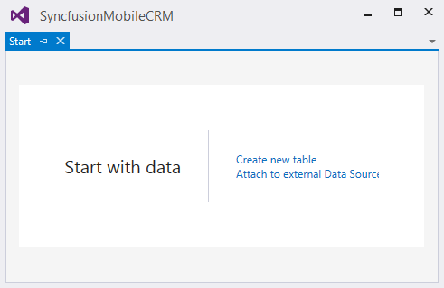
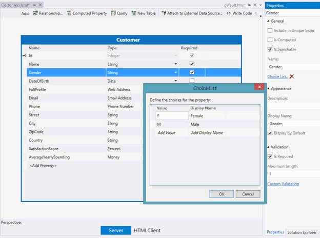
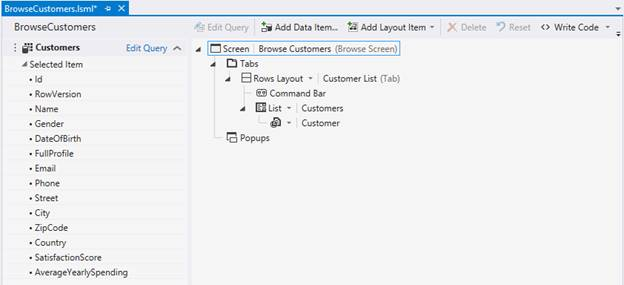
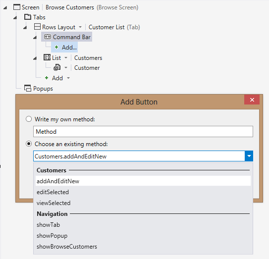
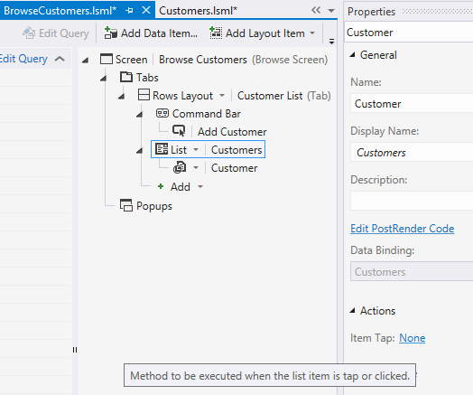
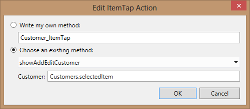
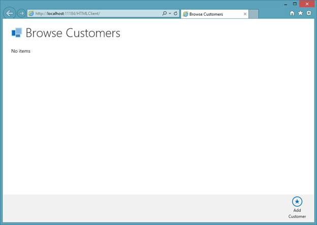
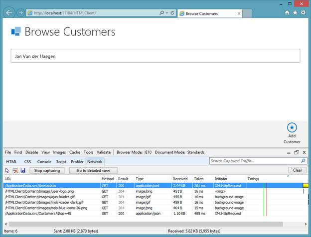

# 第 1 章创建示例应用

如果你在这一章或这本书的任何部分遇到困难，可以从[bitbucket . org/syncfusiontech/light switch-mobile-business-apps-简洁地下载一个完整的 Visual Studio 2013 示例应用。](https://bitbucket.org/syncfusiontech/lightswitch-mobile-business-apps-succinctly)

LightSwitch 移动商务应用在安装了 SP3 的 Visual Studio 2012 Professional 或更高版本中可用。

## 开始

要创建 hello world 示例应用，可以从“文件”>“新建项目”开始。

您正在寻找的项目类型是一个光开关 HTML 应用，在光开关模板文件夹下。我选择 C#版本。

图 2:新建项目向导

最初，LightSwitch 解决方案将包含三个项目:您的 LightSwitch 项目、HTML 客户端项目和服务器项目。

图 3:解决方案资源管理器中一个闪亮的新 LightSwitch 项目

这个 LightSwitch 项目的唯一责任是尽可能地保持 HTML 客户端和服务器项目的同步，这样作为开发人员的你就不必手动这样做了。因为这个任务是完全自动化的，所以 LightSwitch 项目本身看起来是空的。

图 4:灯光开关主屏幕

LightSwitch 主屏幕自动打开。如屏幕所示，应用从数据开始。对于这个示例应用，我们将创建一个客户实体。

要添加客户实体，请在主屏幕中单击**创建新表**，或者在解决方案资源管理器中右键单击服务器项目并选择**添加表**。

图 5:从上下文菜单中选择添加表格。

这将打开实体设计器，您可以在其中设计客户模型。

## 创建实体

乍一看，实体设计器看起来像一个扩展的 SQL 数据库设计器。

实体设计者不仅仅是设计一个后端数据模型。部署时将使用客户表创建一个新的 SQL 或 SQL Azure 数据库，但是实体设计器中的实体字段不仅仅是简单的数据类型。它们是真正的业务类型，如电话号码、电子邮件地址、网址和人员，每个都有内置的专门验证规则、格式、首选控件和扩展选项。

您还可以使用属性窗口中的属性来更改或添加简单的验证，如设置最小值和最大值，甚至将字段限制为严格的选择列表。

这在实际应用中是不够的，您需要自定义初始化、验证或授权，您可以从服务器或任何客户端的角度通过单击**编写代码**来添加这些内容。

图 6:设计客户实体

实体设计者付出一点努力就足以设计客户实体。编译项目时，这将创建表结构，构建公开中间层的 web 服务，并在 HTML 客户端中准备一个 JavaScript 模型。

## 创建屏幕

要完成 hello-world 应用，您需要创建几个屏幕。

右键单击客户端项目，从上下文菜单中选择**添加屏幕**。

图 7:新建屏幕向导

“添加新屏幕”向导将使用三个内置屏幕模板打开。

选择**浏览数据屏幕**模板，从下拉框中选择**客户**作为屏幕数据。您可以保留默认的屏幕名称浏览客户，然后单击**确定**，这将生成屏幕并在屏幕设计器中打开。

图 8:屏幕设计器

屏幕设计器的左侧称为屏幕视图模型(目前仅由客户集合组成)，在中间您会发现视图的抽象(一个带有单个选项卡的屏幕，其中有一个空的命令栏和客户列表)。

因为您从一个空的数据库开始，所以您需要为最终用户提供一些方法来添加新客户。

一个常见的做法是在命令栏中添加一个添加按钮。

图 9:添加按钮向导

打开的添加按钮向导为您提供了编写自定义方法或选择现有方法的选项。现有的方法组合框显示了几个导航选项和几个可以对客户集合执行的操作。随着应用的增长和屏幕变得更加复杂，该组合框中现有方法的数量将会增加。现在，您可以将新的“添加”按钮绑定到新客户，并显示一个屏幕，通过选择“客户.添加和编辑新客户”方法来编辑该客户。

图 10:现有的可用方法是高度情境化的。

执行时，addAndEditNew 方法将创建一个新的客户实体，将其添加到您的 browseCustomer 屏幕上的可视集合中，然后打开一个详细信息屏幕对其进行编辑。因为还没有编辑客户的屏幕，向导建议导航到新的详细信息屏幕。

图 11:选择现有方法

单击**确定**将打开添加新屏幕向导，帮助生成您的详细屏幕。

接受该向导后，您的应用中将有两个屏幕:所有客户概览屏幕(浏览客户)和客户详细信息屏幕(客户)。应用中的第一个概览屏幕将是主屏幕。当应用启动时，它会自动打开。

既然您有了创建客户的详细屏幕，为什么不重用该屏幕来编辑客户呢？为此，您必须绑定列表上的 tab 手势(当最终用户点击或点击列表中的某个项目时会发生这种情况)来打开详细信息屏幕。

在屏幕设计器中打开“浏览客户”屏幕，选择“客户列表”节点，并从属性窗口中选择“项目点击”操作，该操作当前设置为“无”。

图 12:响应触摸手势

在出现的添加项目点击操作对话框中，现在将有一个额外的导航方法:打开添加客户屏幕。

图 13:导航到新创建的屏幕

该详细信息屏幕要求您定义参数，以确定要显示哪个客户的详细信息。要将当前选定的项目作为客户详细信息传递，请键入 customers . selecteditem . IntelliSense 在 LightSwitch 体验中随处可见，包括向导。

图 14:将当前选择的项目作为客户参数传递

## 探索应用

按 Ctrl+F5 构建并运行应用。

您首先创建的浏览客户屏幕将自动打开。因为数据库中没有客户，所以它会相当空。

图 15:一个空的但功能齐全的应用

点击命令栏中的添加客户按钮(灰色页脚)会将新客户添加到列表中，并以模式对话框的形式打开添加编辑客户屏幕。

图 16。添加编辑客户

当您继续填写第一个客户的详细信息时，您会注意到应用是如何尊重您在实体设计器中对客户实体建模的方式的。每个属性的适当业务类型将用于推断可视化特定字段的最佳方式。

图 17:创建新客户

## 创建新客户

### 一些科技话题

恭喜你，你刚刚创建了一个只有半杯咖啡价值的全功能应用。我相信这个应用看起来不错，我很高兴地报告它也是技术杰作。

乍看之下，您可能会错过的技术细节之一是响应性设计。让浏览器变得越来越小，你会注意到应用是如何仔细选择哪些元素要调整大小，哪些要保持固定大小，以便为最重要的内容保留尽可能多的屏幕空间。如果你把浏览器做得很小，你会注意到应用是如何将列数从两列减少到一列，以避免像智能手机这样的较小外形的布局混乱。

图 18:布局被更新以适应设备的屏幕尺寸。

项目经理海因里希·温德尔发布了一篇文章，解释了团队设想的为多种外形设计适应性设计应用的策略，您可以在[http://blogs . msdn . com/b/light switch/archive/2013/03/12/design-for-multi-form-factors . aspx](http://blogs.msdn.com/b/lightswitch/archive/2013/03/12/designing-for-multiple-form-factors.aspx)上找到。

关于应用的第二个技术细节是它的内置分页机制，乍一看您可能会错过，尤其是在数据库中只有一条记录的情况下。

LightSwitch 通过实现 OData 协议的数据服务向 HTML 客户端公开服务层。OData 是一个开放标准，其中心是使用 HTTP 动词(GET、POST 等)和一个 URI 来识别资源，结合固定数量的操作符来请求过滤、排序、转换等。

HTML 客户端将使用 OData Top 运算符指示服务器只返回前 45 条记录。您可以使用首选的网络流量捕获工具(如 Internet Explorer 中的 F12)并通过捕获 HTML 客户端中的“浏览客户”屏幕和 OData 服务之间的通信来验证这一点。

OData 协议、示例和生态系统可以在[http://OData.org](http://odata.org/)找到。

图 19:应用对数据进行分页。

如果记录超过 45 条，当用户向下滚动或滑动时，将异步获取下一批 45 条记录。

为了获得最佳性能，筛选由 SQL Server 完成，可以从屏幕设计器的属性窗口中关闭或自定义(不同的页面大小)。

请随意使用该应用，但不要过于依赖您创建的客户，因为我们很快将使用 SQL 脚本用示例数据替换他们。在下一节中，您将了解 LightSwitch 开发的高级概念。