# 第 4 章定制应用外观

该应用开箱即用，功能齐全，并且有一些基本的样式。在本章中，我将向您展示一些技术来进一步优化外观。首先，您将使用屏幕设计器，最终深入一些基本的 CSS、JavaScript 和 JQuery，最后完全标记全局应用主题。

## 来自屏幕设计器:布局和控件

我们的第一个目标是将客户的平面列表变成一个更动态的概览，提供比仅仅名字更多的信息。从屏幕设计器中选择客户元素，并从列表控件旁边的下拉菜单中选择表。

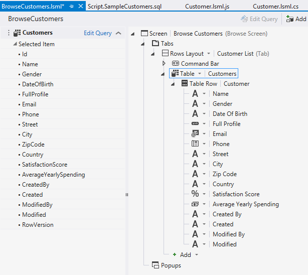

图 38:更改客户内容项的收集控制

保存并刷新浏览器以查看更改。

图 39:客户现在显示在表格中。

默认情况下，客户实体中的每个字段都将显示为一列，包括自动生成和维护的审核列(但不包括用于服务器并发检查的行版本列)。

如果您想知道为什么第一条记录在审核字段中有日期，而其他记录没有，这是因为在我的例子中，第一行是使用应用创建的。同一记录的内容后来被数据库中的 SQL 脚本直接覆盖，因为该脚本在 ID 上匹配。审计列由中间层(OData 服务)维护。这就是为什么我们的 SQL 部署后脚本创建的行没有审计信息。

让我们稍微整理一下。回到屏幕设计器中，选择“表格行”节点的任何子节点，然后按键盘上的 delete 键或单击命令栏中的 delete 按钮。重复，直到您剩下大约五列。

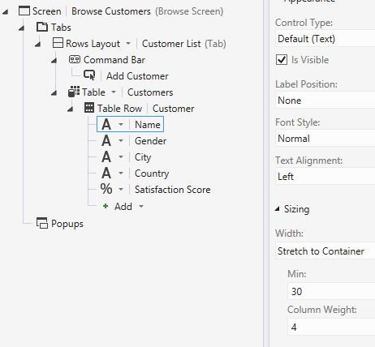

图 40:移除多余的列

并非每一列都需要相同的空间来显示内容。使用属性窗口，您可以选择一些列并给它们一个固定宽度，或者通过将它们设置为“拉伸到容器”来根据可用宽度自动调整它们的大小。在后一种情况下，柱重较大的柱将获得较大比例的可用宽度。

同样，保存和刷新会显示更新后的布局。

图 41:重新格式化的客户表

在 Table 控件中显示集合的有用之处在于，该控件有一种适应较小屏幕因素的独特方式。如果屏幕宽度小于每列的最小组合宽度(默认为 30 像素)，屏幕将改变方向，并垂直显示每列，而不是每行水平显示。

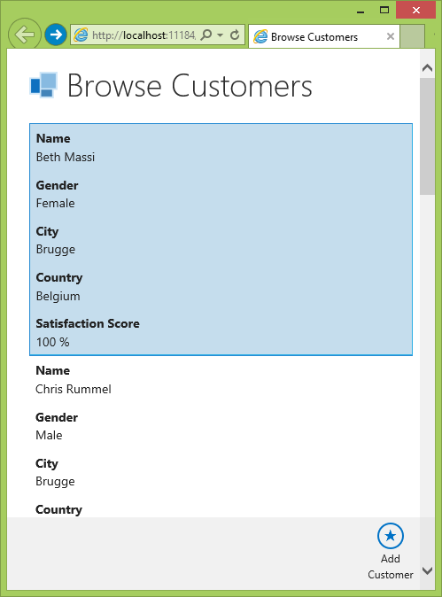

图 42:表格控件的自适应设计

令人印象深刻，但在继续之前，让我们给第三个布局控件一个机会。在屏幕设计器中选择客户节点，并从下拉菜单中选择用平铺列表替换表格。

图 43:平铺列表集合控件

为了防止在每个区块中填入太多信息，我进一步删除了除“姓名”和“满意度分数”之外的所有客户属性。如果您碰巧删除了这些列中的任何一列，只需选择绑定到客户的行布局内容项，然后单击底部的添加。

图 44:将字段添加回视图

保存和刷新显示正在运行的平铺列表。

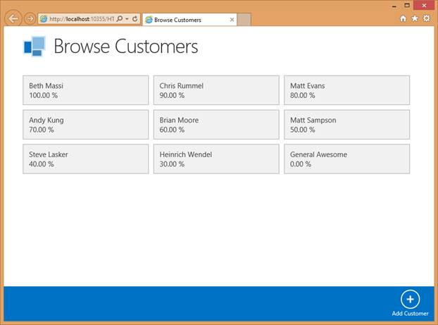

图 45:平铺列表

平铺列表控件也会像表格控件一样适应可用的屏幕宽度。平铺列表通过减少列数来实现这一点。在智能手机上，只有一列瓷砖，而平板电脑通常有足够大的屏幕来显示三四列。

## 来自屏幕设计器:弹出窗口和过滤

通过选择集合控件和布局的正确组合，您可以确保应用显示尽可能多的有用信息，并且只显示有用的信息，最终用户会对此表示感谢。让我们探索过滤数据的一些可能性。

为了过滤数据，我们需要更改用于检索数据的查询。从屏幕设计器(左侧)的视图模型中选择客户集合，并选择编辑查询链接。

图 46:您可以编辑视图模型上的每个查询。

这将在查询设计器中打开集合。

该设计器可以很容易地对数据进行排序，或者通过对文字(固定值)、其他属性(字段)、参数甚至有时是智能业务值(像“本月底”这样的全局值)的任何限制组合进行过滤。

查询设计器有两种使用方式:在服务器上或客户端上。若要在服务器上使用它，请在解决方案资源管理器中选择任何实体，然后从上下文菜单中选择“编辑查询”。这将在服务器上创建一个新的查询，它将在 OData 服务中有一个专用的 URI，并且可以在不同的屏幕之间重用。

因为我们不会重用这个查询，所以我们将在客户机上编辑这个查询。通过这样做，HTML 客户端将在从服务器检索数据时附加正确的 OData 命令。请记住，在这两种情况下，实际的过滤和排序都将在服务器上完成。

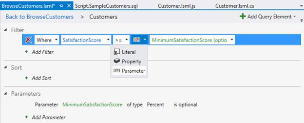

图 47:查询设计器

更改查询，使其只返回那些满意度分数高于特定值的客户。该值将作为参数传递。我把我的命名为最小满意度得分。在通过点击顶部的“浏览客户”链接的“返回”按钮来保存并导航回屏幕设计器之前，请确保在查询设计器中选择了新创建的 MinimumSatisfactionScore 参数。从属性窗口中，选择是可选框。

回到屏幕设计器中，您会注意到我们的视图模型上的客户集合现在有了新添加的名为 MinimumSatisfactionScore 的查询参数。

图 48:作为查询参数，添加了 MinimumSatisfactionScore。

从右侧的视图中，选择可视化树中的弹出窗口节点，然后单击添加添加弹出窗口。

新的行布局节点将作为弹出窗口的根节点出现。选择它，然后在属性窗口中，将名称更改为 FilterPopup 或比默认组更有意义的名称。

将新的查询参数“最小不满意分数”从视图模型拖放到视图中新创建的弹出窗口中。

这个拖放操作将有两个效果。首先，一个本地屏幕属性将被添加到视图模型(在左侧)中，名为 MinimumSatisfactionScore。此屏幕属性将数据绑定到查询参数，因此对此属性的任何更改都将更改参数，并导致客户集合自动刷新。您可以看到，由于两者之间的箭头，本地 screen 属性被数据绑定到查询参数。您可以通过重命名来消除歧义，例如，通过选择 MinimumSatisfactionScore 屏幕属性，并从属性窗口中将名称设置为 HappinessFactor。

此外，在视图的右侧添加了一个百分比编辑器，以显示本地快乐演员屏幕属性。

图 49:将查询参数拖动到弹出窗口后屏幕设计器的状态

现在弹出窗口已经就位，您需要某种代码在运行时打开弹出窗口。最简单的设置方法是选择屏幕命令栏并添加一个新按钮。这将自动打开添加按钮向导。默认情况下，将选择导航操作“显示弹出窗口”，因此只需单击“确定”即可完成按钮。

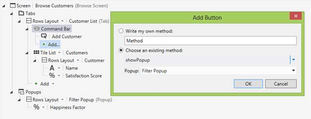

图 50:从添加按钮向导打开弹出窗口

选中新创建的按钮后，查看属性窗口并选择任何内置图标作为要使用的图标。我在这个例子中使用了过滤器 1。

图 51:为新添加的按钮选择一个图标

保存您的工作并刷新浏览器以查看实际结果。

图 52:过滤器弹出窗口正在运行

唯一困扰我的是强迫最终用户输入一个数值。相反，我更愿意向最终用户呈现一个带有视觉反馈的选择列表。

起初，屏幕设计者似乎不支持这样做。屏幕视图中的“快乐演员内容项”节点仅提供自定义控件(稍后将详细介绍)、百分比编辑器、文本框、文本区域和几个只读选项。

图 53:呈现快乐因子的可用控件

## 本地屏幕属性和数据绑定的威力

选择列表仅支持字符串和整数属性或字段，因此我们需要添加一个变通方法。

在屏幕设计器的顶部，单击“添加数据项”按钮。出现的向导允许您创建一个新的整数类型的本地属性，称为快乐级别。在视图模型中选择这个新创建的快乐等级后，单击属性窗口中的选择列表链接。将出现一个对话框，您可以在其中将 HappinessLevel 属性限制为几个预定义的值，每个值都有一个描述性的显示名称。

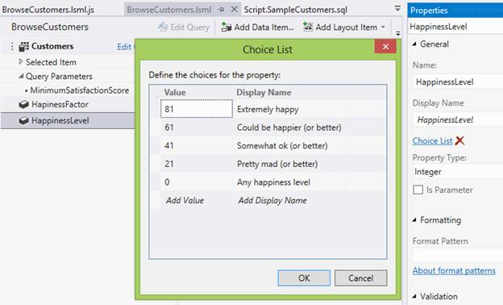

图 54:将快乐等级属性限制为几个选项

下一个要克服的问题是，在屏幕设计器中，没有办法将这个整数 HappinessLevel 绑定到类型为 Percentage 的 MinimumSatisfactionScore 查询参数。您需要编写一些自定义的 JavaScript 代码来实现这一点。

找到屏幕设计器顶部名为“编写代码”的按钮，从下拉列表中选择创建的链接。

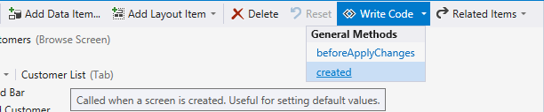

图 55:创建函数存根

单击此链接将带您进入屏幕的代码隐藏文件，并生成一个函数存根，该函数存根将在运行时创建屏幕时执行:

代码清单 2

用以下代码片段替换函数体:

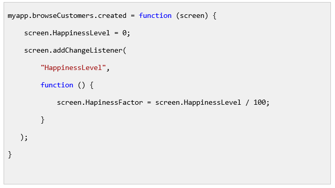

代码清单 3

第一行将 HappinessLevel 屏幕属性初始化为 0，然后向屏幕添加一个更改侦听器。每当 HappinessLevel 属性更改时，将执行一个回调函数，将 HappinessFactor 设置为所选 HappinessLevel 的等效百分比。由于 HappinessFactor 属性仍然数据绑定到查询参数，查询将自动执行，查询结果将返回给调用者。

您所需要做的就是从屏幕上移除快乐因素，并将快乐水平属性拖到它的位置。由于您用选择列表限制了快乐等级，LightSwitch 将自动使用下拉控件来可视化它。

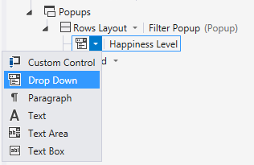

图 56:下拉控件是受限值的首选。

保存您的进度并刷新浏览器。屏幕设计器和 JavaScript 都不需要编译。

图 57:一个实现的过滤器

## 自定义控件:后期渲染

有许多不同的屏幕布局和操作不需要任何代码，但仍然允许您调整应用以满足最终用户的需求。

不过，有时稍微改变 LightSwitch 可视化特定元素的方式是有意义的。在任何时候都有可能增强甚至完全覆盖 LightSwitch 视图引擎的结果。前者是 LightSwitch 开发人员称为后期渲染的过程。

第一个例子是根据顾客的性别给背景上色。

回到屏幕设计器中，在平铺列表正下方的视图中选择行布局内容项。正如您在屏幕设计器和属性窗口中看到的那样，该 ContentItem 与特定的客户数据绑定。

图 58:可视化树中的行布局内容项数据绑定到客户。

选择该元素后，在属性窗口中会有一个显示“编辑后期渲染代码”的链接。当您单击链接时，会在我们之前已经编写了一些代码的代码隐藏文件中生成一个 JavaScript 函数存根。

代码清单 4

这个函数接收两个参数:元素和内容项。

在 HTML 世界中，真的没有像*控件*这样的概念。一个 HTML 页面只是一个文本文件，其中包含许多由浏览器呈现的嵌套元素。名为 element 的参数是对 LightSwitch 刚刚添加到 HTML 页面的 HTML 元素的引用，在本例中可能是一个 DIV 元素。为了从 JavaScript 中添加、移除或更改 HTML 页面中的元素，LightSwitch 将与一个被称为文档对象模型(DOM)的 JavaScript 对象进行交互。

第二个参数 contentItem 是一个 JavaScript 对象，表示屏幕设计器中的行布局元素节点。您可以查询不同的属性，如显示名称或图标(在按钮的情况下)，或者您可以通过访问名为 value 的属性来获取数据绑定到的值(客户实体)。

图 59:值属性上的智能感知

通常的做法是附加一个数据绑定，而不是访问客户实例直接通过这个属性的值来检索性别。这样，如果数据发生变化(由最终用户通过用户界面甚至通过代码)，视图将自动更新。

您已经通过使用 addDataListener API 将一个数据侦听器附加到了屏幕上。将数据绑定附加到特定的 contentItem 上是通过对名为 dataBind 的 contentItem 的函数调用来完成的。

就像以前一样，这个函数需要两个参数:一个字符串，表示您想要绑定到的 contentItem 上的路径(在这种情况下是 value.gender)，以及一个回调函数，每当值发生变化时(包括最初加载数据时)都会执行该回调函数。

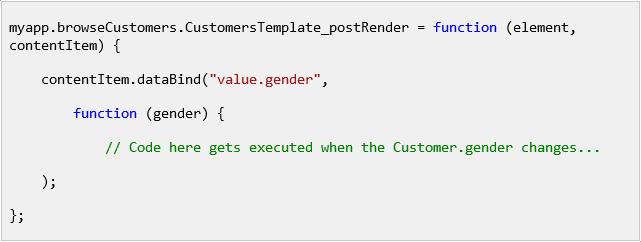

代码清单 5

让我们从一点静态标记开始着色:为了可读性，将文本颜色设置为白色，因为您将暂时为背景着色。您需要完成的是更改 LightSwitch 插入的 DIV 元素的样式。我们将使用一个名为 jQuery 的 JavaScript 库，而不是直接与 DOM 交互。

如果你对 jQuery 完全陌生，我推荐 Syncfusion 的 [*jQuery 简洁地*](http://www.syncfusion.com/resources/techportal/ebooks/) 。但是，如果您在今天唯一的喝咖啡休息时间阅读这本书，为了理解这本书其余部分中使用的代码，您需要以下简短的版本:

不同的浏览器有时会有不同的方式让你与来自 JavaScript 的 HTML 文档进行交互。jQuery 是一个开源的 JavaScript 库，旨在通过为常见任务添加助手方法，并通过将前面提到的浏览器异常抽象到一个简化、统一的 API 后面来简化客户端脚本。

jQuery 选择器就是一个例子([http://www.w3schools.com/jquery/jquery_ref_selectors.asp](http://www.w3schools.com/jquery/jquery_ref_selectors.asp))。使用 JQuery 选择器实际上意味着执行 jQuery()函数来获取对 jQuery 对象的引用，该对象将单个元素甚至多个 HTML 元素包装在一个简化的适配器中。让事情变得更加混乱的是，对于刚开始工作的 JavaScript 开发人员来说，JQuery()函数有一个别名:美元符号。当您看到:$(“DIV”)时，只需知道这等于 JQuery(“DIV”)，并且这将返回一个 JQuery 包装器，包装页面(DOM)中当前存在的所有 HTML DIV 元素。

进行 LightSwitch 定制时，您通常会使用这些带有许多不同参数的 jQuery 选择器来产生各种效果。查找特定类型或具有特定标识的所有元素是一种方法，但是您也可以使用 jQuery 选择器从头开始创建新的 HTML 元素，代码如下:

代码清单 6

您将很快创建新的元素，但是现在您只想将 jQuery 包装在 LightSwitch 插入的 DIV 元素周围，这样您就可以访问一些 jQuery 实用程序函数来改变所使用的样式。令人惊讶的是，名为 element 的参数也可以直接传递给 JQuery 函数。因此，我们的后期渲染函数变成:

代码清单 7

改变特定元素样式的最简单方法之一是通过 jQuery 对象上的 CSS 函数直接改变 CSS:

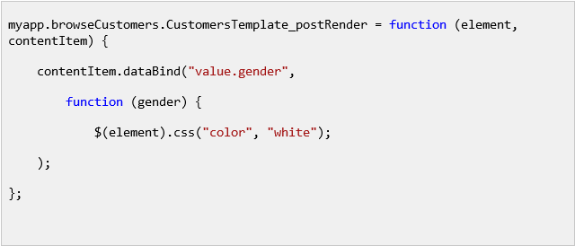

代码清单 8

同样的技巧也可以用来根据客户的性别改变背景:

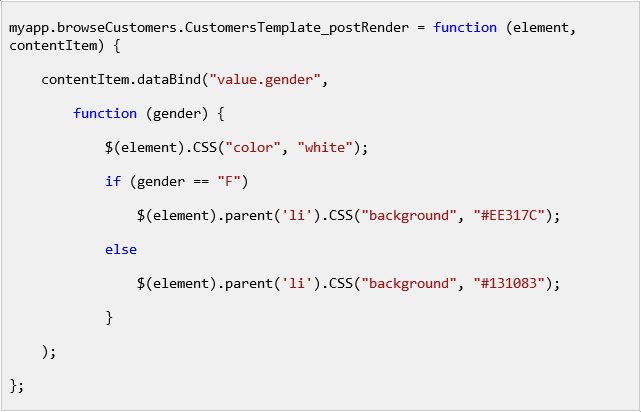

代码清单 9

要给图块的背景着色，请在 DOM 中向上导航，使用 jQuery 找到匹配的列表项(LI)元素。父功能，以避免瓷砖内的灰色边框，如 MSDN 领先的光开关列[http://msdn.microsoft.com/en-us/magazine/dn160191.aspx](http://msdn.microsoft.com/en-us/magazine/dn160191.aspx)所述。

保存您的工作并刷新浏览器以查看颜色。

图 60:按性别着色的瓷砖

虽然可以直接从代码中修改 CSS，但是像这样的编程并不能产生易于维护的应用。相反，更好的方法是在代码中应用特定的样式(在 HTML 世界中称为类)，然后从单独的 CSS 文件中调整这个类。

## 自定义控件:渲染

渲染与后期渲染完全相同，只是您没有通过向 DOM 添加元素来调整 LightSwitch 的结果，而是完全覆盖并自己控制了这一点。例如，我们将更改应用，使其不以文本形式而是以图标形式显示客户满意度得分。

说到寻找或者创造好的图标，我强烈推荐从[http://www.syncfusion.com/downloads/metrostudio](http://www.syncfusion.com/downloads/metrostudio)下载 Syncfusion 的免费 Metro Studio。

如果您在 Metro Studio 中搜索笑脸，会显示足够多的合适图标。

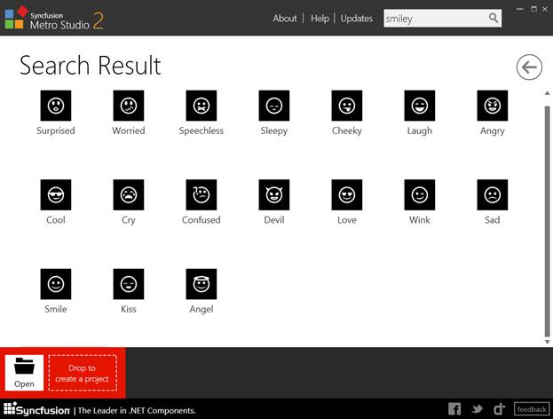

图 61:Syncfusion Metro Studio 中的笑脸

我拍摄了其中的五张，并将其导出到 images 文件夹(位于 HTML 项目中的 content 子文件夹内)，其名称从 ReallyHappy.png 到 PureEvil.png 各不相同。

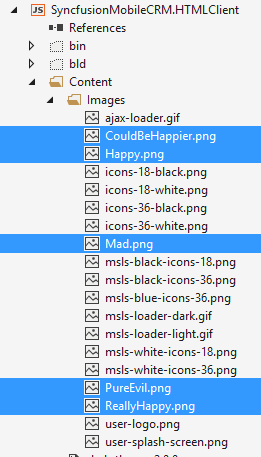

图 62:解决方案资源管理器中的内容和图像子文件夹

顺便说一下，其中一张图片，user-logo.png，是每个屏幕左上角的图标。请随意利用这个机会将其换成您的公司徽标。

除了图像，内容子文件夹是存储级联样式表(CSS)的指定位置。其中一个 CSS 文件被命名为用户定制。半铸钢ˌ钢性铸铁(Cast Semi-Steel)

该文件允许您覆盖 LightSwitch 创建的任何样式，而无需实际修改 LightSwitch 专有 CSS(因此您的定制变得更能适应版本控制)。对于较小的应用，我使用这种用户定制。CSS 文件不仅可以改变样式，还可以添加新的类。打开用户自定义文件并添加以下样式:

代码清单 10

我添加的类的名字从真正的快乐客户到纯粹的邪恶客户。所有五个都简单地设置了宽度、高度和背景图像。现在剩下要做的就是创建一个元素，并从代码中应用这些类。

在屏幕设计器中打开浏览客户屏幕。

最初，每个图块由行布局组成，使用文本元素和百分比查看器垂直呈现客户的姓名和满意度得分。

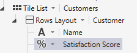

图 63:原始配置

将切片布局更改为列布局，以使用自定义控件和名称水平呈现满意度得分。

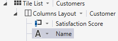

图 64:修改后的配置

选择名称“内容项”，并将文本对齐方式设置为居中，宽度设置为延伸到容器。

当您在屏幕设计器中选择“满意度得分”节点时，“属性”窗口将没有生成后期渲染函数的链接，而是一个名为“编辑渲染代码:

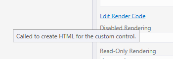

图 65:自定义控件在属性窗口中有一个编辑渲染代码链接。

单击该链接会在与 PostRender 方法相同的 JavaScript 代码隐藏中生成一个熟悉的函数存根:

代码清单 11

同样，该函数有两个名为 element 和 contentItem 的参数。元素是对作为自定义控件周围占位符的 HTML DIV 标记的引用。ContentItem 还是一个 JavaScript 对象，它引用了可视化树中的 LightSwitch 节点，该节点与客户的满意度数据绑定。

我们的 JavaScript 任务将是使用 JQuery 向 DOM 中添加一个定制的 HTML 元素，然后根据客户满意度的值设置合适的 CSS 类(从真正的 happyccustomer 到 PureEvilCustomer)。

添加一个自定义元素将再次使用 JQuery $函数完成，这一次给它传递一点 HTML，然后将它附加到作为参数传递的父元素:

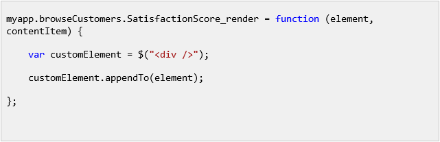

代码清单 12

接下来，再次使用 LightSwitch 数据绑定 API 将回调函数附加到 contentItem 的值(满意度分数):

代码清单 13

最后，在回调函数中，使用 JQuery 对象上的 addClass()函数应用适当的 CSS 类:

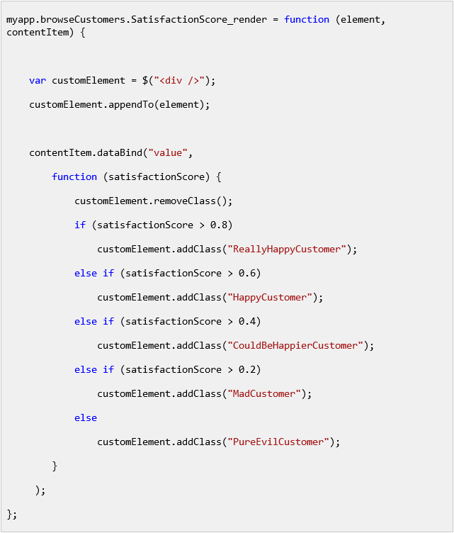

代码清单 14

你有没有注意到下面这一行，它清除了元素上的所有 CSS 类？

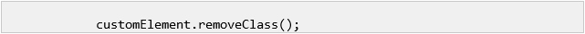

代码清单 15

我这样做是因为客户满意度分数的实际值可能会在应用执行过程中发生变化。当这种情况发生时(即使是在另一个屏幕或代码中完成)，我们的回调函数将再次执行。以这种方式清除自定义元素上的 CSS 类有助于避免重复或冲突的样式。

保存进度并刷新浏览器以测试新样式。

图 66:用图标表示的顾客满意度