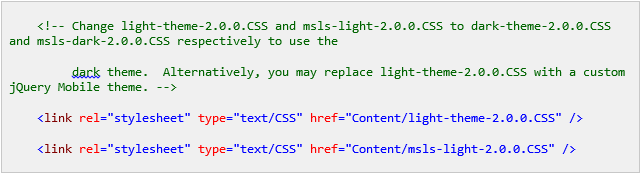
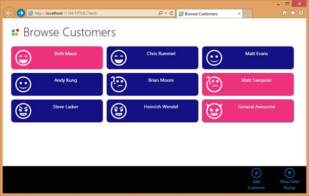
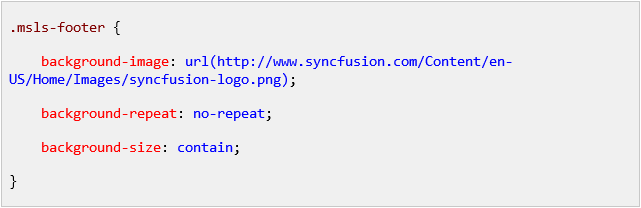
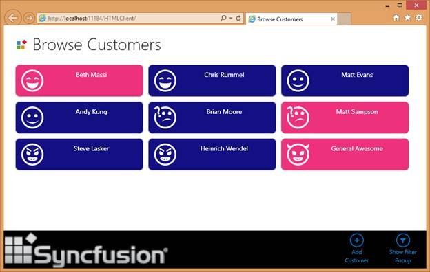

# 第 6 章全球造型和品牌

## 内置模式

LightSwitch HTML 应用程序带有两个全局颜色和样式模式:默认的 Light 主题和 Dark 主题。

主题之间的切换是通过再次打开 default.htm 页面并编辑到下面两个样式表的链接来完成的，如前面的 HTML 注释中所述。

代码清单 47

图 91:使用内置深色主题的添加编辑客户屏幕

## 自定义 jQuery 移动主题

你注意到这个 HTML 评论了吗？

代码清单 48

LightSwitch 使用了一个名为 jQuery Mobile 的开源 UI 框架。依赖开源框架意味着你可以获得免费的 bug 修复、升级和令人敬畏的工具，比如 jQuery Mobile ThemeRoller。主题滚轮是一个网站，您可以在其中创建与任何 jQuery Mobile 应用程序一起工作的自定义主题，从而允许您替换内置的 LightSwitch 主题。

要创建自己的主题，只需将 HTML 项目的 contents 子文件夹中的 light-theme-2.0.0.CSS 的内容复制到剪贴板即可。接下来，打开[http://jquerymobile.com/themeroller](http://jquerymobile.com/themeroller)，找到顶部的导入按钮。将 CSS 粘贴到出现的对话框中，LightSwitch 主题应该加载到主题滚轮中。

主题滚轮在屏幕左侧显示可用属性的概述，允许您调整每种颜色、字体、大小或舍入。在中间，你会看到一个即时预览，反映了你所做的每一个改变，因为你尽可能多地调整，直到风格符合你的企业品牌或期望的主题。

图 92:创建自定义 JQuery 移动主题

满意后，通过点按项目内容文件夹顶部的“下载”按钮，然后从 default.htm 页面而不是默认灯光主题中引用它，来反转导入过程。

代码清单 49

创建自定义的 jQuery Mobile 主题，从而创建 LightSwitch 主题，只需几分钟即可完成。然而，设计一个好主题的艺术远远超出了本书的范围(以及作者的技能集)。

图 93:带有黑色和蓝色主题的应用程序

## 添加公司标志

LightSwitch HTML 应用程序使用两个徽标，这两个徽标都可以在 HTML 客户端项目的内容文件夹的 images 子文件夹中找到:user-splash-screen.png 和 user-logo.png。前者在应用程序加载时可见；后者显示在每个浏览屏幕的左上角。

通过简单地改变资源本身，这两个图片都可以并且应该被你真实的公司标志所取代。

此外，我发现页脚(底部的命令栏)占用了太多空间，如果你只在上面放几个命令，所以我经常调整它以包含一个花哨的标志。

为此，打开用户定制。再次创建 CSS 文件，并追加以下 CSS:

代码清单 50

图 94:带有自定义 user-logo.png 和附加页脚样式的应用程序