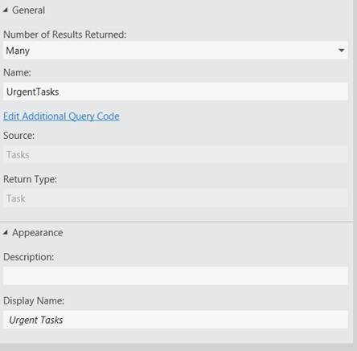
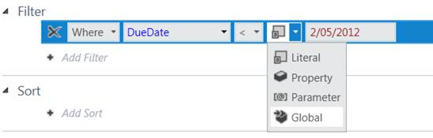
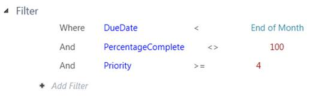
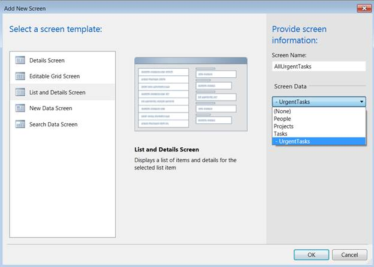
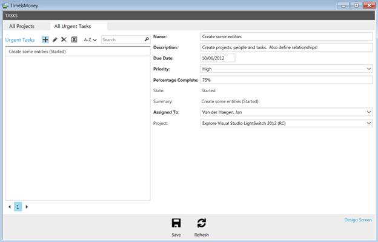
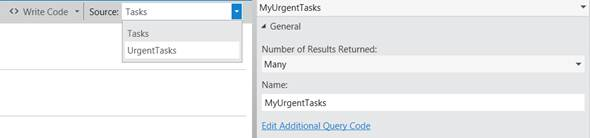
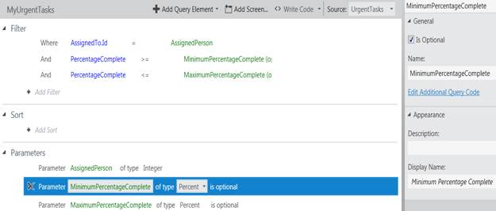

# 四、查询编辑器

## 找到重要的任务

因为我们的三个屏幕显示了所有可用的实体，很容易想象当前状态的屏幕会很快变得无用，因为它们充满了数百个旧的和已经完成的任务。大多数时候，我们不会对所有的任务感兴趣，而只会对接下来必须完成的任务感兴趣。

对于任何实体，LightSwitch 都会自动生成一个**全选**和一个**按 ID 选择**查询，但是要成功过滤掉旧的和不重要的任务，必须创建一个自定义查询。像 LightSwitch 中的大多数东西一样，一旦你习惯了**查询编辑器**，这将只需要几秒钟。

在**解决方案编辑器**中，右键单击**任务**实体，选择**添加查询**。

图 31:从解决方案资源管理器添加实体查询

您要做的第一件事是将查询重命名为更有意义的东西，例如**紧急任务**。这可以在**属性窗口**中完成。

图 32:查询也有扩展的属性

## 添加过滤标准

我们首先要做的是添加一个新的 **Single** 过滤器。

图 33:添加一个新的单一过滤器

在这个查询中，我们不想看到任何在遥远的未来的任务。第一个过滤标准应该是**到期日**小于月末。

图 34:基于到期日期的过滤

我们还希望过滤掉所有已完成的任务和优先级低于 4 的任务。您可能还记得**优先级**属性的业务类型是一个整数，尽管我们将其表示为带有“低”、“中”、“高”和“非常高”标签的选择列表。

图 35:基于到期日期、完成百分比和优先级的过滤

## 增加一些逻辑排序

当我们在**查询设计器**中时，通过基于**优先级**为我们的紧急任务添加默认排序，然后通过**到期日**来完成查询。

图 36:向查询添加默认排序

## 直接向该查询添加屏幕

为了测试您的查询，您可以创建名为**诱惑任务**的第四个**列表和详细信息**屏幕。因为查询是默认的全局查询，所以您可以选择它作为**屏幕数据**来使用。(LightSwitch 还允许在屏幕级别定义查询，称为本地查询。)

图 37:直接在全局查询中添加屏幕

根据我的测试数据，它似乎工作正常。在我的两个任务中，*洗碗*优先级低，所以不包含在**所有紧急任务**画面中。

图 38:新屏幕只显示紧急任务

## 查找每个用户的重要任务

然而，图 38 中的查询显示了所有紧急任务。这个屏幕对我来说很棒，作为我个人生活的管理者，也是目前为止这个应用的唯一用户。但是如果您要使用这个应用来同时管理几个人、任务和项目，您可能会对每个用户的紧急任务查询感兴趣，而不是图 38 中的屏幕。

在**解决方案资源管理器**中右键单击您的**任务**，并选择**添加新查询**，创建第二个查询。

将查询重命名为**我的紧急任务** *。*

## 查询继承

请注意，这个查询使用完整的**任务**列表作为源，但是我们已经有了一个查询来区分重要任务和琐碎任务。作为一个避免重复的狂热爱好者，我很高兴 LightSwitch 提供了一种基于另一种查询结果的可能性。为此，将**源**从**任务**更改为**紧急任务**，位于**查询编辑器**顶部。

图 39:从以前的查询继承查询

通过这样做，这个查询将继承 **UrgentTasks** 的过滤和排序标准，让我们不再担心只排序或过滤出重要的任务。我们唯一关心的是找到分配给特定**人**的任务。

## 向查询添加参数

为此，我们将添加一个新过滤器。

图 40:基于任务分配对象的过滤

然后从下拉菜单中选择**参数**，如图 40 所示，添加一个新的查询参数，如图 41 所示。

图 41:为分配选择来源

图 42:将源设置为新参数

将参数重命名为**指定人员**。

为了更详细地控制哪些**任务**将被包含，我添加了两个额外的过滤器和匹配参数:**最小百分比完成**和**最大百分比完成** *。*然而对于这两个，我在**属性**窗口中勾选了**是可选的**复选框。

图 43:查询概述

要查看这些数据，我们必须添加一个新屏幕。这一次我们已经用了三次的**列表和详细屏幕模板**生成的默认屏幕是不够的。是时候仔细看看**屏幕编辑器**了。