# 五、屏幕编辑器

## 为我们的查询创建搜索数据屏幕

在**添加新屏幕**向导中，选择**搜索数据屏幕**模板。命名屏幕**我的紧急任务**，选择**我的紧急任务**作为**屏幕数据。**

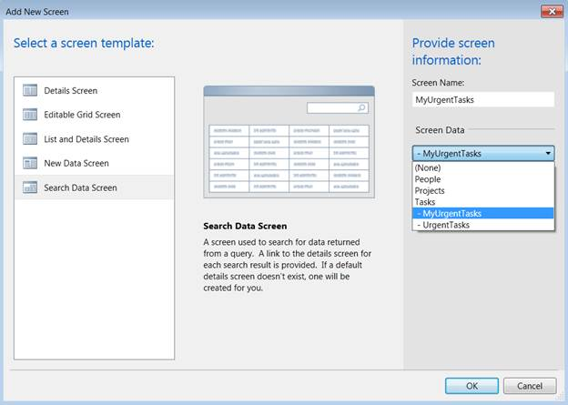

图 44:创建搜索数据屏幕

## 屏幕编辑器的模型和视图模型部分

在**屏幕编辑器**的左侧，LightSwitch 添加了两个查询参数，但是每个参数都添加了两次。左侧被认为是 LightSwitch MVVM 实现中屏幕的视图模型和模型层。第一次识别这些参数时，它们实际上代表查询参数，因此是模型的一部分，第二次列出时，它们代表作为视图模型一部分的屏幕属性。


图 45:屏幕设计器的左侧显示了视图模型和模型层

如图 45 所示，在相应的查询参数和本地屏幕属性之间显示一个箭头，表明它们是数据绑定的。这也可以在**属性**窗口中通过选择一个查询参数来观察。

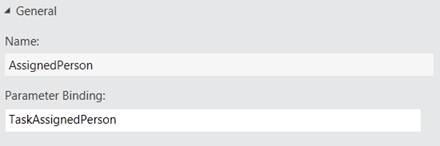

图 46:绑定属性

## 将屏幕属性转换为所需的屏幕参数

选择**任务分配人员**屏幕属性，并在**属性**窗口中，确保选中了**为参数**和**为必填项**复选框。

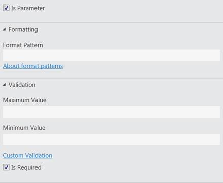

图 47:将屏幕属性转换为所需的屏幕参数

同时确认**任务最小值百分比完成**和**任务最大值百分比完成**本地屏幕属性的两个复选框都已清除。

## 屏幕属性验证

**屏幕属性**窗口也允许您设置一些验证逻辑。将**百分比小数位数**改为 **0** ，将两个百分比完成属性的**最小值**和**最大值**分别设置为 **0** 和 **100** 。


图 48:屏幕属性也可以有验证

您会注意到，这些本地屏幕属性的工作方式与**实体设计器**的工作方式有一些相似之处。在仍然选择**任务最大百分比完成**本地屏幕属性的情况下，单击**属性**窗口中的**自定义验证**链接。

我们将使用它来编写一些简单的代码，检查输入的最小值是否小于输入的最大值。

```cs
        public partial class MyUrgentTasks
        {
            partial void TaskMaximumPercentageComplete_Validate(ScreenValidationResultsBuilder results)
            {
                if (this.TaskMinimumPercentageComplete > this.TaskMaximumPercentageComplete) {
                    results.AddPropertyError("Minimum cannot exceed the maximum");          
                }
            }
        }

```

## 初始化屏幕属性

顺便说一下，当我们编写代码时，初始化本地屏幕属性可能是个好主意。为此，请找到位于**屏幕设计器**顶部的**编写代码**按钮，并单击下拉箭头。点击链接**myurgentasks _ Created**—这将把你带到代码可扩展性点，一旦屏幕被创建，代码可扩展性点将在客户端上运行。

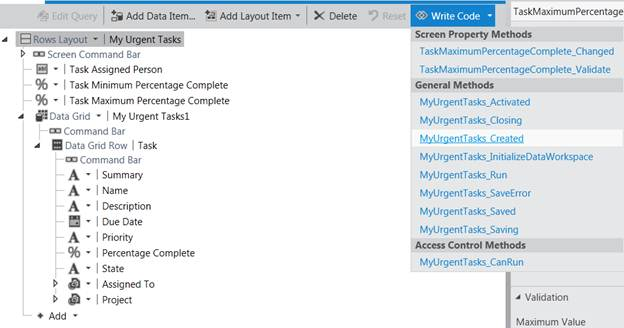

图 49:找到一级可扩展性点来初始化屏幕属性

初始化两个本地屏幕属性的代码并不令人惊讶:

```cs
            partial void MyUrgentTasks_Created()
            {
                this.TaskMinimumPercentageComplete = 0;
                this.TaskMaximumPercentageComplete = 1;
            }

```

## 屏幕去哪里了？

如果您按 F5 调试您的应用，您会注意到导航菜单不包括我们的新屏幕。

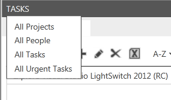

图 50:新屏幕似乎没有包含在导航菜单中

原因是我们的新屏幕有一个本地屏幕属性，**任务分配人员**，为此我们选择了**是必需的**和**是参数**扩展属性。这意味着打开此屏幕的代码必须传递一个整数参数( **TaskAssignedPerson** )，导航菜单不知道如何为其解析一个值。

我们将不得不手动添加我们的新屏幕，这将只是我们在本教程中第五次必须编码——这对我们已经在这个应用中构建了多少功能来说还不错。

## 向屏幕添加新命令

一个合适的地方来打开这个屏幕与紧急任务从一个特定的人是**所有人**屏幕。打开**屏幕编辑器**中的**所有人**屏幕，找到**屏幕命令栏**元素，该元素位于**屏幕视觉树**的顶部，即**屏幕编辑器**的中心部分。


图 51:向屏幕添加新按钮

选择**新建按钮**选项。在出现的弹出窗口中，选择**新方法**选项并将其命名为**显示紧急任务**。

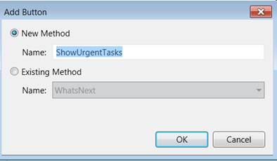

图 52:在屏幕上创建新命令

将添加一个新的命令，并且像您的 LightSwitch 应用的几乎任何元素一样，您可以使用设计器来设置几个扩展属性。我们肯定要设置的一个属性是所使用的图像。就我个人而言，我真的成为了 Syncfusion 免费定制图标工具 Metro Studio([http://www.syncfusion.com/downloads/metrostudio](http://www.syncfusion.com/downloads/metrostudio))的粉丝。我几乎只为 LightSwitch 命令使用图标，因为它们非常适合 LightSwitch 的世界性主题(参见[第 6 章](6.html#heading_id_40))。

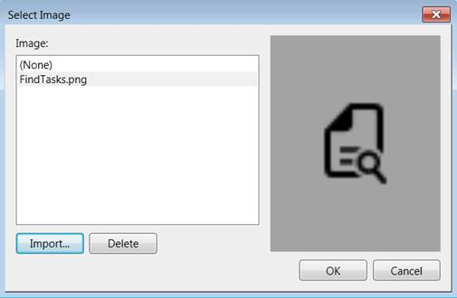

图 53:向命令添加图像

完成后，在**可视化树编辑器**中右键单击您的按钮，并从上下文菜单中选择**编辑执行代码**选项。

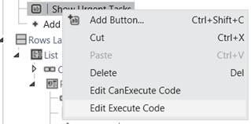

图 54:编辑命令后面的代码

## 从代码打开屏幕

LightSwitch 会生成几个类，如果您选择这样做，您可以使用这些类进行编码。例如，LightSwitch 为每个屏幕在`Application`类上生成一个名为`Show<ScreenName>`的方法。在我们的例子中，这使得打开屏幕的代码非常简单:

```cs
        public partial class AllPeople
        {
            partial void ShowUrgentTasks_Execute()
            {
                Application.ShowMyUrgentTasks(this.People.SelectedItem.Id);
            }
        }

```

这一次，按 F5 摘下我们劳动的果实。**所有人**屏幕现在有一个额外的命令，如下图所示。

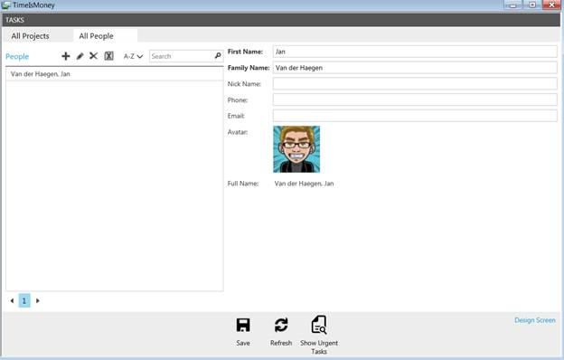

图 55:显示紧急任务命令现在在应用中可见

点击**显示紧急任务**命令，我们新的搜索屏幕**我的紧急任务**打开。


图 56:我的紧急任务屏幕

## 运行时屏幕编辑器

虽然我们的新屏幕很有用，但你可能想对它进行一些图形修改，比如隐藏**任务分配人**标签和文本框。Visual Studio LightSwitch 最令人瞠目结舌的功能之一是，如果您不想或者不熟悉 Silverlight XAML，您不必编写自定义 XAML 来修改用户界面。更好的是，如果你想改变屏幕上的布局或控件，你甚至不必停止运行你的应用并重新编译它。

如果您从 Visual Studio IDE 启动 LightSwitch 应用(即附带调试器)，该应用将有一个名为**设计屏幕**的命令，该命令使您能够在运行时进行这些修改并将其保留回您的 Visual Studio 解决方案！老实说，这可能是个人缺乏经验，但我不知道有任何其他技术允许你这样做，我喜欢它。在运行时设计应用的图形部分，而不必构建来测试每个修改，并且能够用实际的测试数据而不是“*Neque porro quisquam est qui dolorem ipsum quia dolor sit amet，consectetur，adipissi velit*”进行设计—此功能绝对节省时间！


图 57:设计屏幕命令

单击应用命令栏中的**设计屏幕**命令。这将打开运行时版本的**屏幕编辑器**。


图 58:在运行时使用屏幕设计器

## 隐藏*任务分配人员*控制

在左侧**可视化树**编辑器中，选择**任务分配人**元素，并确保**可见**复选框已清除。

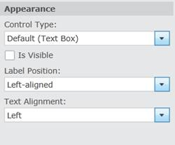

图 59:在运行时设计屏幕

单击屏幕右上角的**保存**按钮后，屏幕将会更新，您所做的更改将会保存回 Visual Studio 解决方案。

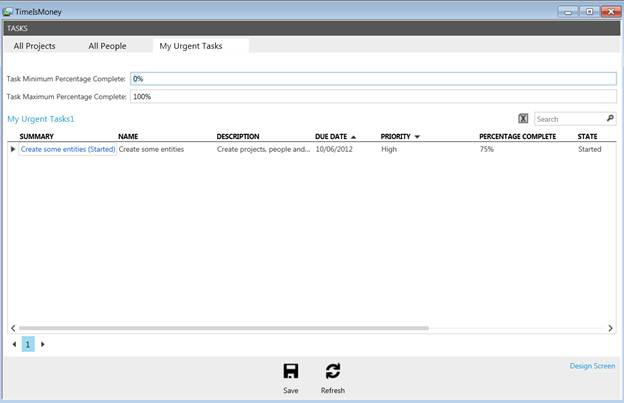

图 60:在运行时编辑搜索数据屏幕后

## 创建新的项目模板

这个运行时版本的**屏幕设计器**可以做的不仅仅是在现有的视觉元素上设置属性。它可以给你的屏幕添加新的元素，或者用一个完全不同的元素替换现有的元素。例如在**全民**画面的运行时**画面设计器**中，选择**人物**视觉元素。

当前使用的控件是**摘要查看器**，其结果如下所示。


图 61:当前所有人屏幕

通过单击向下箭头，您可以为此列表的项目数据模板选择完全不同的布局。

通过从下拉菜单中选择，将用于表示**人物的控件**更改为**图片和文本**。

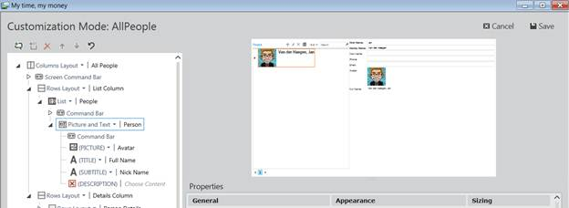

图 62:在运行时更改项目模板

在此**图文**编辑器中，使用**头像**属性作为**图片**，使用**全名**计算属性作为**标题**。

## 一次修改整组控件

运行时**屏幕编辑器**也可以更改整个组的属性。选择**细节栏**—这是**视觉树**中的第二个**行布局**视觉元素。

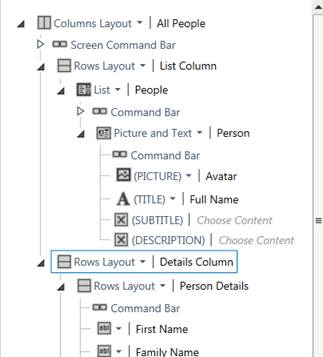

图 63:一次设计整个屏幕

在**属性窗口**中，选择如下图所示的**使用只读控件**复选框，然后点击**保存**。


图 64:在运行时设置整个控件集合的只读状态

这些更改被保存回 Visual Studio 解决方案，屏幕被刷新，现在看起来在图形上更有吸引力。


图 65:在运行时设计后的所有人屏幕

正如您可以编写自定义代码来响应应用中的许多预定义事件一样，您也可以完全控制用户界面，并为**可视化树设计器**中的任何元素编写自定义 Silverlight XAML。

然而，因为这需要重建来编译 XAML，所以它不能从运行时版本的**屏幕设计器**中完成。