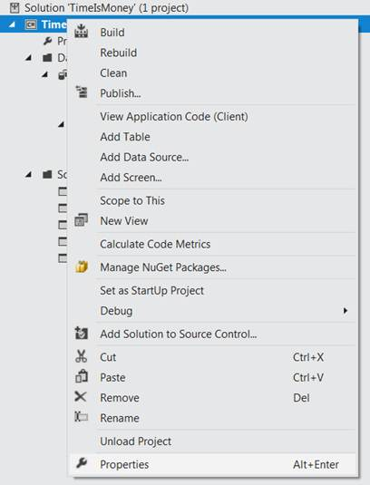
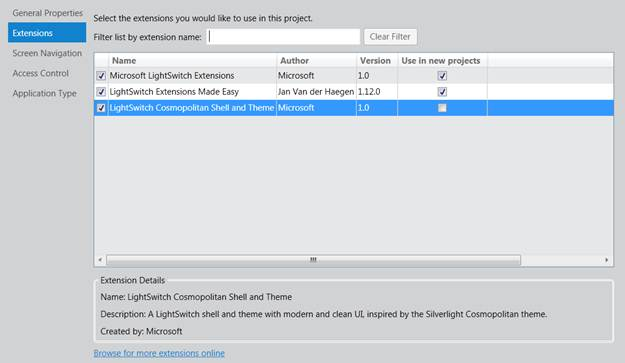
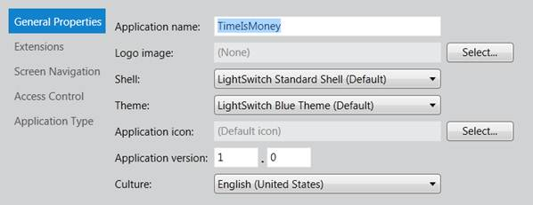
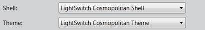
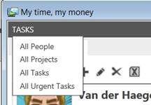
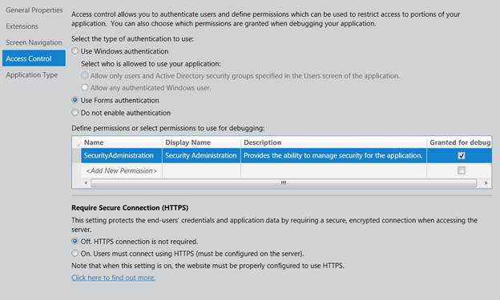
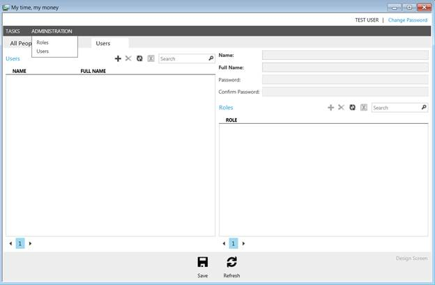
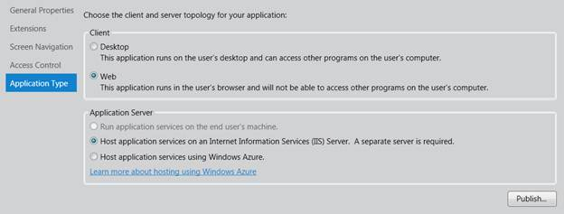
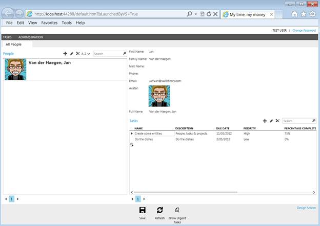

# 六、应用编辑器

## 扩展 LightSwitch 应用

编写自定义代码或自定义用户控件有时被称为**一级可扩展性**。LightSwitch 允许您将应用扩展到开箱即用之外，并且不需要您完全安装 Visual Studio。独立版本的 LightSwitch 也提供一级可扩展性。

这表明，还有更高级别的可扩展性。**二级可扩展性**为 LightSwitch 应用添加了可在不同应用中重用的功能。它们通过 Visual Studio 扩展(。vsix ),可以直接从供应商处购买，也可以从 Visual Studio Gallery([http://visualstudiogallery.msdn.microsoft.com/site/search?)下载 query=LightSwitch & f%5B0%5D。值=灯 LightSwitch& f%5B0%5D。Type=SearchText & ac=8](http://visualstudiogallery.msdn.microsoft.com/site/search?query=LightSwitch&f%5B0%5D.Value=LightSwitch&f%5B0%5D.Type=SearchText&ac=8) 。

传统上，这些扩展将为您的 Visual Studio LightSwitch IDE 或应用添加以下一项或多项功能:

*   可重复使用的 WCF 服务
*   可重用的业务类型
*   可重用控件
*   可重复使用的屏幕模板
*   可重复使用的外壳
*   可重用主题

最后两个，主题和外壳，提供了一种简单的方法，只需点击几下鼠标就可以改变应用的整体外观。

## 在 Visual Studio 中安装扩展

关闭您的 LightSwitch 应用，在 Visual Studio 的**工具**菜单中，选择**扩展管理器**。

图 66:打开扩展管理器

在**扩展管理器**中，搜索**在线扩展**以获得 LightSwitch 主题、外壳或两者。点击**安装**按钮，然后关闭**扩展管理器**。

## 激活应用中的扩展

要激活您选择的外壳或主题，请在**解决方案资源管理器**中选择 LightSwitch 项目并按 Alt+Enter，或者右键单击该项目并从上下文菜单中选择**属性**。

图 67:打开应用设计器

这开启了第四个也是最后一个特定于 LightSwitch 的设计者，即**应用设计者**。

导航至**扩展**选项卡。

图 68:激活扩展

在**应用设计器**的这个选项卡中，您可以看到机器上所有 LightSwitch 特定扩展的概述。选中您已下载的扩展旁边的复选框，以便在此应用中激活它。

在上图中，可以看到我下载了**light switch Cosmopolitan Shell 和主题**，现在作为新的默认 Shell 和主题包含在 Visual Studio LightSwitch 2012 RC 中。

## 常规属性选项卡

一旦激活，二级可扩展性功能——外壳和主题——可以在这个 LightSwitch 应用中使用。从**常规属性**选项卡中选择使用哪个外壳或主题。

图 69:应用设计器的常规属性选项卡

将选定的 **Shell** 更改为现在可用的 Shell，和/或将选定的**主题**更改为您下载的主题。

图 70:选择要在 LightSwitch 客户端应用中使用的外壳或主题

**常规属性**选项卡上的其他属性也值得快速查看:

*   **申请名称**:申请名称，我改成了*我的时间，我的钱*
*   **标志**:如果外壳支持的话要使用的标志(LightSwitch Cosmopolitan Shell 就是这么做的)
*   **图标**:应用的图标。
*   **版本:**应用的主要和次要发布版本。第三个数字，即修订号，会在您每次发布具有相同主版本和次版本的应用时附加。
*   **培养:**应用的培养。这用于整个应用的全球化和翻译。目前，LightSwitch 一次只支持一种文化。

按 **F5** 构建和调试应用，看看你的应用的整个外观和感觉是如何变化的。

## 屏幕导航

**屏幕导航**选项卡允许您控制应用的导航菜单。屏幕可以被分成不同的组，并且顺序和标签可以用这个编辑器改变。

图 71:浏览屏幕导航选项卡

您可能已经注意到有一个**管理**组，它在运行时不可见。

图 LightSwitch 应用没有像导航选项卡建议的那样的管理组

原因有两个:我们还没有激活**用户认证模式**，我们还没有访问这些屏幕的正确权限。两者都可以从**访问控制**选项卡进行更改。

## 访问控制选项卡

第四个**应用编辑器**选项卡提供了对身份验证模式的控制，允许您定义权限，并允许您强制 OData 端点的安全连接(参见[第 3 章](3.html#heading_id_16))。

支持的三种身份验证模式是:

*   **Windows 身份验证**:使用您的 Windows 凭据自动登录。建议在公司内部运行的应用。
*   **表单认证**:启动应用时出现登录屏幕，用户必须提供用户名和密码。建议用户来自不同公司的应用。
*   **无**:启动应用，不需要认证。除非您是唯一的用户并且正在本地计算机上运行应用，否则绝不建议使用此身份验证模式。

图 73:应用设计者的访问控制选项卡

对于此应用，将**认证模式**更改为**使用表单认证**。当应用从 Visual Studio 运行时，即附加了调试器，LightSwitch 将自动跳过登录屏幕，使用名为**测试用户**的用户登录。

说到授权，LightSwitch 实现了一个基于权限的系统。这些权限是在**应用设计器**的这个选项卡中定义的，以后可以通过自定义代码在任何需要的地方进行检查。这可以在屏幕级、实体级甚至操作级完成。

通过选中唯一预定义权限(称为**安全管理**)旁边的**授权调试**复选框(见图 73)，您可以将此权限添加到调试时将使用的**测试用户**中。按 F5 构建并开始调试，注意差异。

图 74:设置访问控制属性后，管理菜单可见

对于那些不喜欢“寻找 7 个不同点”游戏的人来说，请注意现在右上角的 **CurrentUserControl** 显示 LightSwitch 确实已经自动登录了一个**测试用户**，这又是一个很好的时间节省。

该**测试用户**也有**安全管理**权限，需要查看导航菜单中的**管理**组。该组包含两个屏幕，安全管理员可以在其中管理用户及其权限。请注意，当您部署应用时，您的测试数据没有部署，包括这些用户及其权限，因此在开发期间通过这些屏幕所做的更改不会反映在您的部署中。这些屏幕只有在部署应用后才会真正有用。

说到这里…

## 应用类型选项卡

最后一个令人瞠目结舌的时刻到了，抵抗之声，我们交响乐的高潮。我们在这本电子书的开头将 Visual Studio LightSwitch 称为“为桌面或云构建以数据为中心的应用的最简单方法”，然而，在整个教程中，除了在[第 3 章](3.html#heading_id_16)中提到了服务器的公共 OData 端点之外，我们并没有真正说明应用的架构或目标平台。我们造了什么？单层桌面应用、多层应用还是可以托管在云中的 web 应用？

由于 LightSwitch 的元数据驱动实现，**应用设计器**的最后一个选项卡，称为**应用类型**选项卡，允许您在开发的最新可能阶段做出这些决定。这提供了比传统开发周期更多的应用灵活性，在传统开发周期中，您必须在一开始就决定您的应用开发环境。LightSwitch 的灵活性还允许您更改应用类型，而不必重做应用的整个部分。

图 75:应用设计者的**应用类型**选项卡

想想您开发的最新大型数据中心应用。假设应用最初是作为直接访问数据库的桌面应用编写的(单层)，过了一段时间后，决定将其重构为一个名为 web 服务的 web 应用(多层)。重构应用需要多长时间？

这个故事的 LightSwitch 版本来了。

一键将**客户端**类型更改为**网页**。这将自动禁止选择在与客户端相同的层上运行**应用服务器**。按 F5 构建并开始调试。

在构建过程中，LightSwitch 将采用您在**实体设计器**中设计的元数据，以及您在**查询设计器**、**屏幕设计器**中设计的任何元数据，以及您在**应用设计器**中做出的所有选择，来生成多层 web 应用。

图 76:只需单击一下，就可以将单层桌面应用更改为多层 web 应用

## 发布时间…

如果你对结果满意，点击**应用设计器**中**应用标签**右下方的**发布**按钮，开始为你新创建的应用梦想一个利润丰厚的订阅模式。